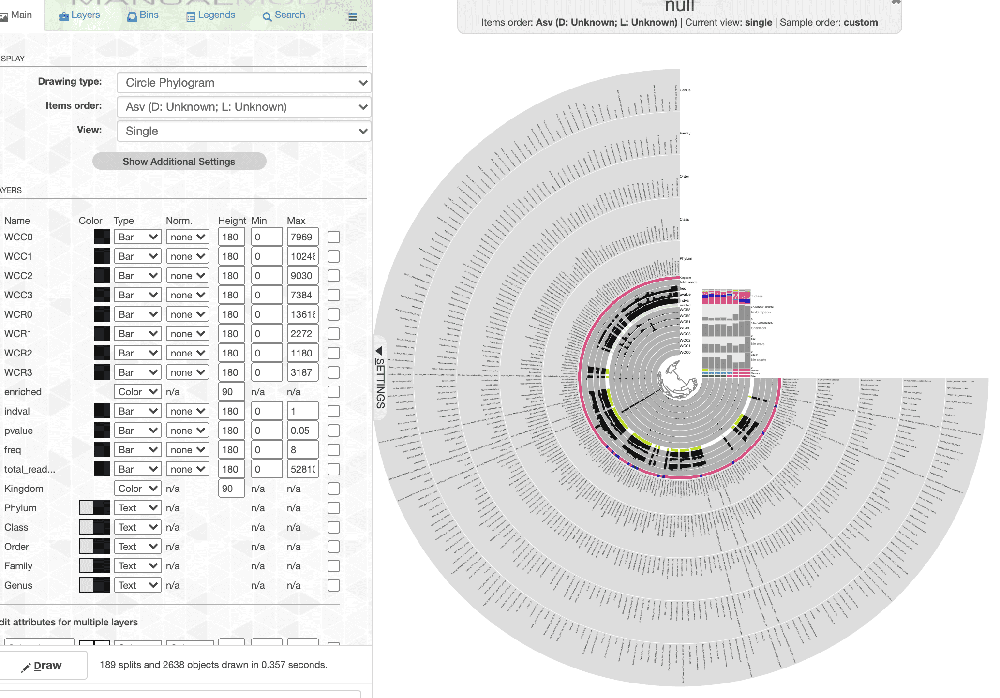
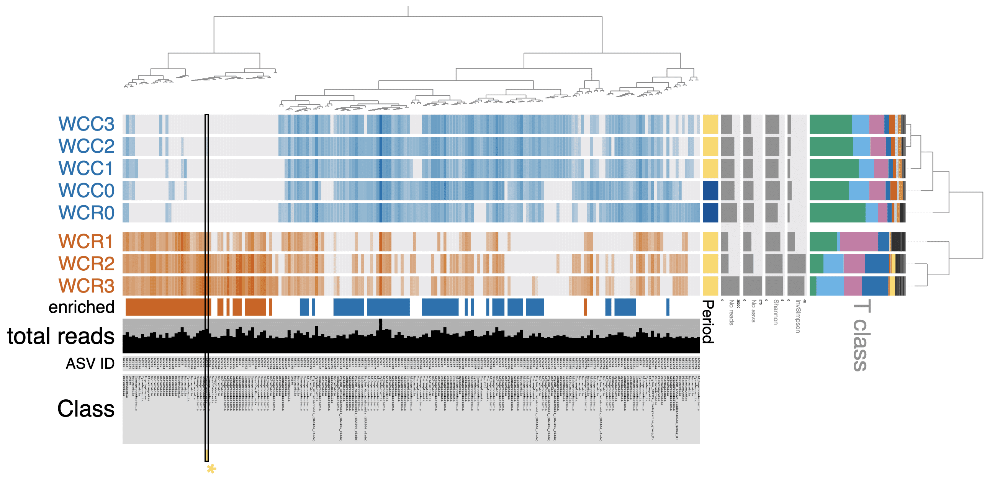
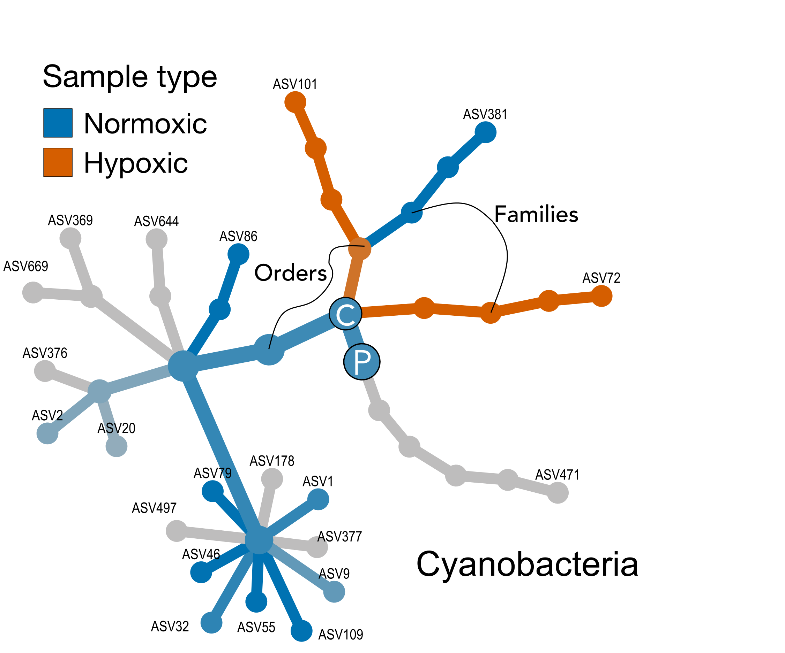
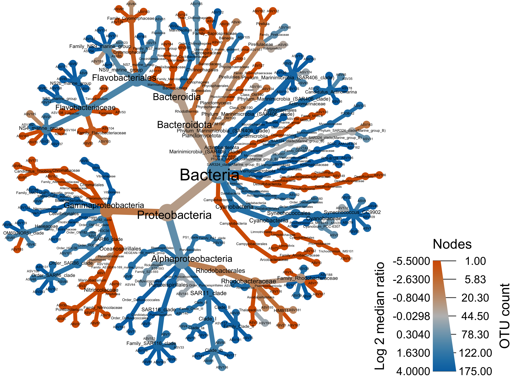
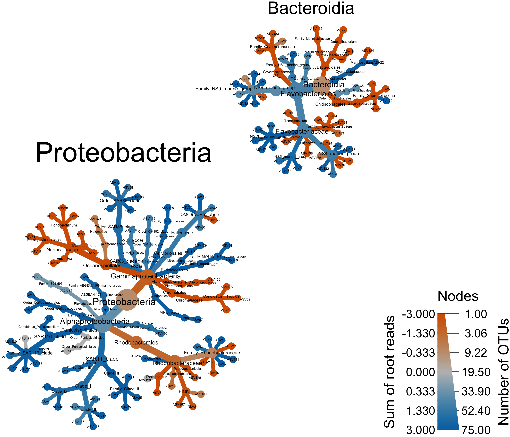
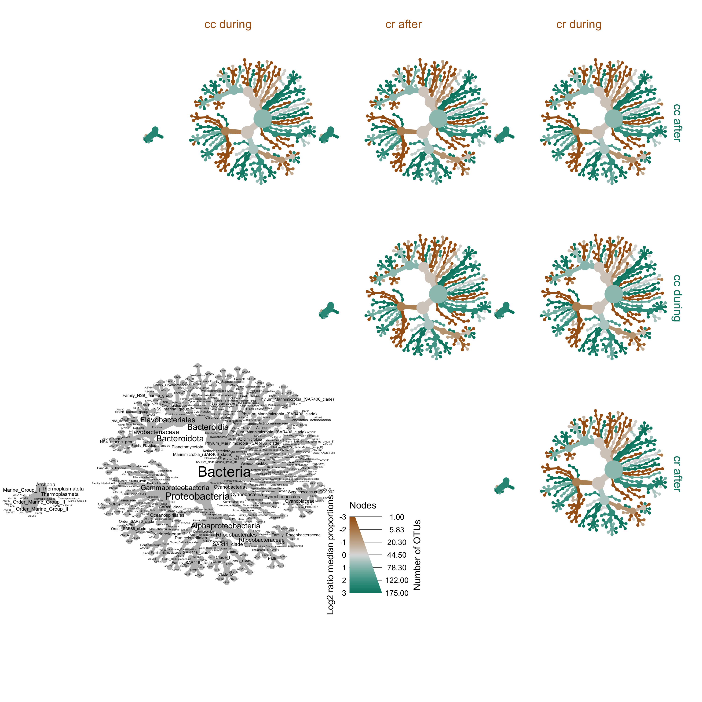

```{r setup, include=FALSE}
knitr::opts_chunk$set(echo = TRUE)
set.seed(0199)
library(phyloseq); packageVersion("phyloseq")
library(DT)
library(ggplot2)
library(Biostrings); packageVersion("Biostrings")
library(dplyr)
library(microbiome)
library(tidyverse)
library(data.table)
library(plyr)
library(stringr)
require(gdata)
library(labdsv)
library(reshape)
library(metacoder)
library(naniar)

options(scipen=999)
knitr::opts_current$get(c(
  "cache",
  "cache.path",
  "cache.rebuild",
  "dependson",
  "autodep"
))
```

```{r, echo=FALSE}
### NOTE: this should only be run AFTER the workflow is finished.
### This image is created at the END of this workflow and now read back in.
### Basically, this locks everything in place so nothing changes. Only code
### chunkc to display figures and tables are evaluated. Everything else is
### turned off. To actually run this you need to set this chunk to
### eval=FALSE and the rest to eval=TRUE
load("rdata/16s-da-asvs/da_asvs_pipeline.rdata")
```


```{r, echo=FALSE, eval=FALSE}
remove(list = ls())
ps_water <- readRDS("rdata/16s-water/ps_water.rds")
ps_water_o <- readRDS("rdata/16s-water/ps_water_o.rds")
ps_water_ox <- readRDS("rdata/16s-water/ps_water_ox.rds")
load("rdata/16s-water/16s-water.rdata")
```

# Differentially Abundant ASVs

Time to drill down a little deeper and look at differentially abundant (DA) ASVs between the two oxygen conditions. ASVs that were enriched and more frequent in hypoxic and normoxic samples were identified using the Indicator Species Analysis (ISA)[@dufrene1997species], computed with the R package labdsv[@roberts2007labdsv].

```{r idval_analysis, results='hide', eval=FALSE}
set.seed(119)
#rm(class, order, phylum, kingdom)
#ls(all.names = TRUE)
water_seq_table <- data.frame(otu_table(ps_water))
# Delete columns when sum == 0 Should not be any
water_seq_table <- water_seq_table[, which(colSums(water_seq_table) != 0)]

water_seq_table <- cbind(oxstate = c("normoxic","normoxic",
                                     "normoxic","normoxic",
                                     "normoxic","hypoxic",
                                     "hypoxic","hypoxic"),
                            water_seq_table)

iva <- indval(water_seq_table[,-1], water_seq_table[,1])
gr <- iva$maxcls[iva$pval <= 0.05]
iv <- iva$indcls[iva$pval <= 0.05]
pv <- iva$pval[iva$pval <= 0.05]
fr <- apply(water_seq_table[,-1] > 0, 2, sum)[iva$pval <= 0.05]
indvalsummary <- data.frame(group = gr, indval = iv,
                            pvalue = pv, freq = fr)
indvalsummary <- indvalsummary[order(indvalsummary$group,
                                     -indvalsummary$indval),]
water_tax_table <- data.frame(tax_table(ps_water))
indvalsummary_tax <- merge(indvalsummary, water_tax_table,
                           by = "row.names",
                           all = TRUE)
indvalsummary_tax <- indvalsummary_tax[!(is.na(indvalsummary_tax$group)),]

lapply(indvalsummary_tax, class)
class(indvalsummary_tax$group) = "character"
indvalsummary_tax$group <- ifelse(indvalsummary_tax$group == "1",
                                  as.character("hypoxic"),
                                  as.character("normoxic"))
```

Now we can save a few files and display the data.

```{r idval_tables, echo=FALSE, eval=FALSE}
water_seq_table_t <- water_seq_table
water_seq_table_t[,1] <- NULL
water_seq_table_t <- as.data.frame(t(water_seq_table_t))
water_seq_table_t$reads <- rowSums(water_seq_table_t)
water_seq_table_t$norm <- rowSums(water_seq_table_t[1:5])
water_seq_table_t$hypo <- rowSums(water_seq_table_t[6:8])
water_seq_table_t[1:8] <- NULL
water_seq_table_t <- tibble::rownames_to_column(water_seq_table_t, "ASV")

names(indvalsummary_tax)[1] <- "ASV"
full_indval_sum <- merge(water_seq_table_t, indvalsummary_tax,
                           by = "ASV",
                           all = FALSE)

indvalsummary <- tibble::rownames_to_column(indvalsummary, "ASV")
write.table(full_indval_sum, "tables/16s-da-asvs/indval_tax.txt",
            row.names = FALSE, sep = "\t", quote = FALSE)
write.table(indvalsummary, "tables/16s-da-asvs/indval_summary.txt",
            row.names = FALSE, sep = "\t", quote = FALSE)
```

<br/>

```{r scg_tax, echo=FALSE, layout="l-page"}
full_indval_sum <- read.table("tables/16s-da-asvs/indval_tax.txt", header = TRUE)
full_indval_sum_noseq <- full_indval_sum
full_indval_sum_noseq[,c(15:16)] <- NULL
datatable(colnames = c("ASV", "reads", "norm", "hypo",
                       "group", "indval", "pval", "freq",
                       "Kingdom", "Phylum", "Class", "Order",
                       "Family", "Genus"),
  full_indval_sum_noseq, rownames = FALSE, autoHideNavigation = TRUE,
  width = "100%", elementId = "twykw9v4dzmp1lymga92",
  caption = htmltools::tags$caption(
    style = "caption-side: bottom; text-align: left;",
    "Differentially Abundant ASVs assessed by
    Indicator Species Analysis (ISA)."),
  extensions = c("Buttons", "FixedColumns"),
  options = list(autoWidth = TRUE,
    columnDefs = list(list(className = "dt-left", targets = 0)),
    dom = "Blfrtip",
    buttons = list(list(
        extend = 'collection',
        buttons = c('csv', 'excel', 'copy'),
        text = 'Download')),
    pageLength = 10, lengthMenu = c(5, 10, 50, 160),
    scrollX = TRUE, scrollCollapse = FALSE, scrollY=FALSE, paging=TRUE,
    fixedColumns = list(leftColumns = 1, rightColumns = 0))) %>%
    formatRound(columns=c("indval", "pvalue"), digits = 3) %>%
  formatStyle(columns = colnames(full_indval_sum_noseq), fontSize = '80%')
```

We also save fasta files of DA ASVs. For the visualization below we will only consider ASVs that were represented by > 100 reads so we need a fasta of just those ASVs.

```{r export_da_fasta, echo=FALSE, eval=FALSE}
# Create fasta file from tax_table
table2format2 <- full_indval_sum
table2format2_t <- table2format2[table2format2$reads >= 100 ,]
#retain only the column with the sequences
table2format_trim2 <- table2format2[, 16:15]
table2format_trim2_t <- table2format2_t[, 16:15]
#format fasta
table2format_trim2$ASV_ID <- sub("ASV", ">ASV", table2format_trim2$ASV_ID)
table2format_trim2_t$ASV_ID <- sub("ASV", ">ASV", table2format_trim2_t$ASV_ID)
write.table(table2format_trim2, "tables/16s-da-asvs/idval_asv_all.fasta",
            sep = "\n", col.names = FALSE, row.names = FALSE,
            quote = FALSE, fileEncoding = "UTF-8")
write.table(table2format_trim2_t, "tables/16s-da-asvs/idval_asv_100.fasta",
            sep = "\n", col.names = FALSE, row.names = FALSE,
            quote = FALSE, fileEncoding = "UTF-8")
```

```{r, echo=FALSE, eval=FALSE}
full_tally <- table(indvalsummary_tax$group)
trim_tally <- table(table2format2$group)
```

Now. What do we get from all of this? Well, we started with `r ntaxa(ps_water)` and ran Indicator Species Analysis (ISA) to see if we could identify Differentially Abundant (DA) ASVs between the normoxic and hypoxic conditions. ISA found `r length(indvalsummary_tax[,1])` ASVs that were DA between the two, specifically `r full_tally[["normoxic"]][1]` ASVs enriched in the normoxic samples and `r full_tally[["hypoxic"]][1]` in the hypoxic. If we consider only ASVs with more than 100 total reads we get `r trim_tally[["normoxic"]][1]` normoxic ASVs and `r trim_tally[["hypoxic"]][1]` hypoxic ASVs.

# Visualizing DA ASVs in Anvi'o

Next, we will combine the results of the ISA analysis with the distribution of ASVs across each sample. We are going to do the analysis in anvi'o[@eren2015anvi] using the `anvi-interactive` command. Anvi'o likes database but it also understands that sometimes you don't have a database. So it offers a *manual mode* for all of us slackers out there. If you type this command you can have a look at the relevant pieces we need for the visualization, specifically those under the headings `MANUAL INPUTS` and `ADDITIONAL STUFF`. I will go through these out of order so try to keep up ;)

```bash
anvi-interactive -h
```

```
MANUAL INPUTS:
  Mandatory input parameters to start the interactive interface without
  anvi'o databases.

--manual-mode           We need this flag to run anvi'o in an ad hoc
                        manner, i.e., no database.
-f FASTA, --fasta-file FASTA
                        A FASTA-formatted input file. This is sort of
                        optional
-d VIEW_DATA, --view-data VIEW_DATA
                        A TAB-delimited file for view data. This is the ASV
                        by sample matrix. We need this
-t NEWICK, --tree NEWICK
                        NEWICK formatted tree structure. How the ASVs are
                        ordered in our case.
ADDITIONAL STUFF:
  Parameters to provide additional layers, views, or layer data.

-V ADDITIONAL_VIEW, --additional-view ADDITIONAL_VIEW
                        A TAB-delimited file for an additional view to be used
                        in the interface. This file should contain all split
                        names, and values for each of them in all samples.
                        Each column in this file must correspond to a sample
                        name. Content of this file will be called 'user_view',
                        which will be available as a new item in the 'views'
                        combo box in the interface
-A ADDITIONAL_LAYERS, --additional-layers ADDITIONAL_LAYERS
                        A TAB-delimited file for additional layer info. In
                        our case this is info about each ASV. The first column
                        of the file must be the ASV names, and
                        the remaining columns should be unique attributes.
```

There are also a few files we generate that cannot be loaded directly.  So, in addition to the files that can be *loaded* when running the interactive, we also have files that must be *added* to the database created by anvi'o.

## Creating Input Files

Here is a nice tutorial on [Working with anvi'o additional data tables](http://merenlab.org/2017/12/11/additional-data-tables/). A lot of what we need is covered in this tutorial. To get the most out the visualization we need to create a few files to give anvi'o when we fire up the interactive interface.

1) View data: in our case, a sample by ASV abundance matrix.
2) Additional info about each ASV.
3) Additional info about each sample.
4) Taxa abundance data for each sample at some rank.
5) Dendrograms ordering the ASVs and samples (based on view data).
6) Fasta file of all ASVs in the analysis.

### 1. View data

Let's start with the `-d` or `--view-data` file. This file needs to be an ASV by sample matrix of read counts. To simplify the visualization, we will use ***all*** ASVs represented by 100 or more total reads, including those identified as differentially abundant by the ISA.

```{r, eval=FALSE}
ps_water_100 <- prune_taxa(taxa_sums(ps_water) > 100, ps_water)
ps_water_100
```

```{r, echo=FALSE}
ps_water_100
```

Looks like this are `r ntaxa(ps_water_100)` total ASVs. We know from the ISA analysis above that `r nrow(table2format2)` ASVs were differentially abundant between the two groups so there will be `r ntaxa(ps_water_100) - nrow(table2format2)` ASVs in our graph that showed no difference.

```{r, eval=FALSE}
data_tab <- as.data.frame(t(otu_table(ps_water_100)))
data_tab <- data_tab %>% rownames_to_column("Group")
write.table(data_tab, "16s-anvio/data.txt", sep = "\t",
            quote = FALSE, row.names = FALSE)
```

<aside>
**Loaded** with  `anvi-interactive` command & `--view-data` flag.
</aside>

### 2. Additional Layers for ASVs

Next, we need some additional data **about the ASVs** to overlay on the visual. This can be anything however what I specifically want are the details of the ISA analysis, total reads, and lineage info. I warn you; this code will get ugly and I urge you to find a better way.

<aside>
**Loaded** with `anvi-interactive` command & `--additional-layers` flag.
</aside>

Start with an ASV + lineage table for the ASVs in the `ps_water_100` phyloseq object.

```{r, eval=FALSE}
data_tab2 <- as.data.frame(t(otu_table(ps_water_100)))
total_reads2 <- cbind(data_tab2, total_reads = rowSums(data_tab2))
total_reads2[1:8] <- NULL
tax_tab2 <- as.data.frame(tax_table(ps_water_100))
tax_tab2[7] <- NULL
total_reads2 <- tibble::rownames_to_column(total_reads2, "Group")
tax_tab2 <- tibble::rownames_to_column(tax_tab2, "Group")

merge_tabX <- merge(total_reads2, tax_tab2,
                           by = "Group",
                           all = TRUE)
drop_c <- c("reads", "norm", "hypo", "Kingdom",
            "Phylum", "Class", "Order", "Family", "Genus")
idval2 <- full_indval_sum_noseq[ , !(names(full_indval_sum_noseq) %in% drop_c)]
colnames(idval2)[1:2] <- c("Group", "enriched")

additional_layers <- merge(idval2, merge_tabX,
                           by = "Group",
                           all.y = TRUE)
write.table(additional_layers, "16s-anvio/additional_layers.txt",
            sep = "\t", quote = FALSE, row.names = FALSE, na = "")
```

### 3. Additional Views for Samples

Now we want some general data **about the samples** to overlay on the visual. Again, this can be anything. How about a table of alpha diversity metrics? We actually have such a table that was generated way back up the road. Just need to fix the column names.

<aside>
**Added** to  profile.db with  `anvi-import-misc-data` command &  `--target-data-table layers` flag.
</aside>

```{r, eval=FALSE}
additional_view <- merge_tab2
additional_view[2] <- NULL
colnames(additional_view) <- c("id", "site", "oxstate", "period", "no_reads",
    "no_asvs", "Shannon", "InvSimpson")
write.table(additional_view, "16s-anvio/additional_views.txt",
            sep = "\t", quote = FALSE, row.names = FALSE, na = "")
```

### 4. Taxon rank abundance by sample

Turned out this was a little tricky to figure out, but thanks to this [little nifty block of code](https://github.com/joey711/phyloseq/issues/418#issuecomment-262637034) written by [guoyanzhao](https://github.com/guoyanzhao) on the phyloseq Issues forum, it was a piece of cake. The code can be altered to take any rank. See the post for an explanation.

Anyway, the goal is to sum each taxon at sum rank and present that as a bar chart for each sample in the visualization. Anvi'o has a specific format it needs where each row is a sample and each column is a taxon. Taxa names need the prefix `t_<RANK>!`. For example, `t_class!` should be added for Class rank.

<aside>
**Added** to  profile.db with `anvi-import-misc-data` command & `--target-data-table layers` flag.
</aside>

```{r, eval=FALSE}
# Make the table
anvio_taxa <- ps_water
glom_rank <- tax_glom(anvio_taxa, taxrank = 'Class')
melt_rank <- psmelt(glom_rank)
melt_rank$Class <- as.character(melt_rank$Class)
rank_abundance <- aggregate(Abundance~Sample+Class, melt_rank, FUN = sum)
rank_abundance <- as.data.frame(cast(rank_abundance, Sample ~ Class))
#rank_abundance <- as.data.frame(rank_abundance)
rank_abundance <- tibble::remove_rownames(rank_abundance)
rank_abundance <- tibble::column_to_rownames(rank_abundance, "Sample")

# Reorder table column by summ
layers <- rank_abundance[,names(sort(colSums(rank_abundance), decreasing = TRUE))]

# Add the prefix
layers <- layers %>% dplyr::rename_all(function(x) paste0("t_class!", x))
layers <- tibble::rownames_to_column (layers, "taxon")

# save the table
write.table(layers, "16s-anvio/tax_layers.txt",
            sep = "\t", quote = FALSE, row.names = FALSE, na = "")
```

### 5. Construct Dendrograms

The last piece we need is to generate dendrograms that order the ASVs by their distribution in the samples and the samples by their ASV composition. For this task we will use anvi'o.

```bash
anvi-matrix-to-newick data.txt --distance euclidean \
                               --linkage ward \
                               -o asv.tre
anvi-matrix-to-newick data.txt --distance euclidean \
                               --linkage ward \
                               -o sample.tre \
                               --transpose
```

The first command reads the view data we generated above and uses Euclidean distance and Ward linkage for hierarchical clustering of the ASVs. The second command transposes the view data table and then does the same for the samples. There are many distance metrics and linkage methods available.  Boom.

<aside>
The file `asv.tre` is **loaded** with  `anvi-interactive` command & the `--tree` flag.
</aside>

The ASV tree is fine as is, but the sample tree needs a [special format](http://merenlab.org/2017/12/11/additional-data-tables/#layer-orders-additional-data-table). Specifically, the tree needs to be in a three column, tab delimited,  *table*. This way you can add multiple orderings to the same file and view them all in the interactive. The table needs to be in this format:

| item_name	| data_type	| data_value                                          |
|-----------|-----------|-----------------------------------------------------|
| tree_1  	| newick	  | ((WCR0:0.0793043,(WCC0:0.0431881,(WCC1:0.0301642,.. |
| tree_2  	| newick	  | (WCR1:0.142825,(WCR2:0.0466953,WCR3:0.0466953),...  |
| (…)	      | (…)	      | (…)                                                 |

This is easy to do by hand, but I *really* need the practice so I will do it in R. Anvi'o is very particular about formatting. For example, if this file ends with a blank line, which it will because when anvi'o made the initial dendrogram it add a new line. We need to get rid of that or we get an error when trying to import the table.

<aside>
The file `sample.tre` is **added** to the profile.db with  `anvi-import-misc-data` command &   `--target-data-table layer_orders` flag.
</aside>

```{r, eval=FALSE}
sam_tree <- read_file("16s-anvio/sample.tre")
sam_tree <- gsub("[\r\n]", "", sam_tree)
item_name <- c("euc_ward")
data_type <- c("newick")
data_value <- c(sam_tree)
sam_tre_tab <- data.frame(item_name, data_type, data_value)
library(janitor)
sam_tre_tab %>% remove_empty("rows")
write.table(sam_tre_tab, "16s-anvio/sample_tree_tab.txt",
            sep = "\t", quote = FALSE, row.names = FALSE, na = "")
```

### 6. Make a fasta file

We don't need to add a fasta file, but it is a nice way to keep everything in one place. Plus, you can do BLAST searches directly in the interface by right clicking on the ASV of interest, so it is nice to have the sequences.

<aside>
**Loaded** with `anvi-interactive` command &  `--fasta-file` flag.
</aside>

```{r export_fasta_anvio, eval=FALSE}
# Create fasta file from tax_table
anvio_tab <- tax_table(ps_water_100)
#retain only the column with the sequences
anvio_tab_trim <- anvio_tab[, 7]
anvio_tab_trim_df <- data.frame(row.names(anvio_tab_trim),
                                   anvio_tab_trim)
colnames(anvio_tab_trim_df) <- c("ASV_ID", "ASV_SEQ")
#format fasta
anvio_tab_trim_df$ASV_ID <- sub("ASV", ">ASV", anvio_tab_trim_df$ASV_ID)

write.table(anvio_tab_trim_df, "16s-anvio/anvio.fasta",
            sep = "\r", col.names = FALSE, row.names = FALSE,
            quote = FALSE, fileEncoding = "UTF-8")
```

## Building the Profile Database

Time to put all of these pieces together. This gets a little tricky since we do not have a database to start with because some of these files can be loaded directly in the interface but some need to be added to a database. When we fire up the interactive in `--manual` mode, we ***must*** give anvi'o the name of a database and it will *create* that database for us. Then we can shut down the interactive, add the necessary data files, and start back up.

```bash
anvi-interactive --view-data data.txt \
                 --tree asv.tre \
                 --additional-layers additional_layers.txt \
                 --profile-db profile.db \
                 --manual
```

Now we have a new profile database that we can add the sample metadata (`additional_layers.txt`) and the sample dendrogram (sample.tre) using the command `anvi-import-misc-data`. These commands add the table to the new `profile.db`. First, kill the interactive.

```bash
anvi-import-misc-data additional_views.txt \
                      --pan-or-profile-db profile.db \
                      --target-data-table layers
anvi-import-misc-data sample_tree_tab.txt \
                      --pan-or-profile-db profile.db \
                      --target-data-table layer_orders
```

One last this is to get the table with the taxonomy total by sample (`tax_layers.txt`) into the profile database. We will run the same command we just used.

```bash
anvi-import-misc-data tax_layers.txt \
                      --pan-or-profile-db profile.db \
                      --target-data-table layers
```

In fact, we could just as easily append the taxonomy total data onto the `additional_layers.txt` and import in one command. But we didn't.

## Interactive Interface

With a populated database in hand, we can now begin modifying the visual by running the interactive command again.

```bash
anvi-interactive --view-data data.txt \
                 --tree asv.tre \
                 --additional-layers additional_layers.txt \
                 --profile-db profile.db
                 --fasta-file anvio.fasta \
                 --manual
```

```{r, echo=FALSE, warning=FALSE, fig.height=2}

```

Remember, we added a lot of data, so the tree looks crazy when you first open the interactive. This is the interactive part of the process where we select the data we want to display and how we want to display it.

Now have a look after some changing the way everything looks. It is not possible to go through all the steps here, but it didn't take very long.

```{r, echo=FALSE, layout="l-page", warning=FALSE, fig.height=3}

```

*Hopefully* you agree that this is a near publication quality figure. Obviously some tweaking still left to do but most of it can be done in anvi'o.

All files generated for this analysis can be found in the Data Availabilty appendix below. You should only need to run the command above and the final figure should pop up in your browser.

Alternatively, an interactive version of this figure can be found on the anvi-server using either [this link](https://anvi-server.org/jscott/hypocolypse_16s_rrna_indicator_species_analysis ) or [that link](https://bit.ly/2BY5bNs). Works best on Chrome.

One final thing I like to do is save a *state* file. After you set everything the way you want it you can hit the **Save State** button, which will store your settings in the database. That way you have a backup text file should something bad happen to the profile database.

```bash
anvi-export-state --pan-or-profile-db profile.db
                  --state default
                  --output-file states.json
```

# Heat Tree

Time for something a little different. We have been using some pretty standard graphical constructs to display diversity data from these samples. Especially when looking at taxonomic diversity, we are pigeonholing the data by selecting and isolating specific ranks to look at---Class, Family, ASV, etc. But we are not really considering these pieces *together*. For example, when we asked what the differences between normoxic and hypoxic samples were, we looked at which ASVs were differentially abundant. Nice. But what about higher taxonomic ranks? Two treatments may differ at the ASV level but not say the Family level. This is important becuase it can tell us where, on a *lineage map*, sample type start to diverge from one another. And this of course has important ecological consequences.
In fact, we can perform this analysis and actually visualize the lineage map and significant results as a *heat tree* using the R package [metacoder](https://grunwaldlab.github.io/metacoder_documentation/)[@foster2017metacoder]. Let's take a look at a simple example using the Phylum Cyanobacteria.

## Example

The map is like a network, composed of nodes (circles) connected by edges (lines). Each node is a taxonomic level, and along with the edges, forms part of a taxonomic lineage. Start at the big **P**---this is the phylum Cyanobacteria. Then the single Class in this example (big **C**), then 4 orders, 5 familes, 9 genera, and finally 21 terminal nodes, which are the individual ASVs.

```{r, echo=FALSE, warning=FALSE, fig.height=2}

```

Color indicates a node (or entire lineage) that is enriched in normoxic or hypoxic samples, while the intensity of the color is dervived from the strength of that difference. Grey shades indicate no difference. Testing is happening at each taxonomic level. For example, the nodes for phylum and class are both blue, indicating at thos levels, normoxic samples are enriched. However, moving down ranks, we can see that 2 orders are actually enriched in the hypoxic samples, 1 in the normoxic, and 1 where there is no difference, and so on.

## Setup for Analysis

Ok, right off the bat I will say that I found some of the metacoder code a little esoteric. I chalk this up to my own ignorance but mention it because my explanations may be confusing. So, grain of salt as they say because I am still learning. I highly recommend going through the tutorials on the [metacoder](https://grunwaldlab.github.io/metacoder_documentation/) site before using this tool. We can start by copying the original phyloseq object.

```{r, eval=FALSE}
ps_water_mc <- ps_water
```


```{r add_var_cats, echo=FALSE, eval=FALSE}
## USE This code if you want to start with NA taxa before rename
## First, we need to start with the original phyloseq object (`ps_water_o`) before we modified it in any way. We will copy it then add in metadata (oxstate and period) as before. This way we can have a phyloseq object specifically for metacoder.
ps_water_mc <- ps_water_o
sample_data(ps_water_mc)$oxstate <-
  c("normoxic", "normoxic", "normoxic", "normoxic",
    "normoxic", "hypoxic", "hypoxic", "hypoxic")
sample_data(ps_water_mc)$period <-
  c("cc_after", "cc_during", "cc_during", "cc_during",
    "cr_after", "cr_during", "cr_during", "cr_during")
```

Now we need to decide if we want to remove rare ASVs and/or taxa before proceeding. Honestly, I am not sure. Certainly with a large dataset  it will take a long time to run the analysis and ASVs that only have a few reads are uninformative. How about we use the same ASVs we used in the anvi'o visualization of the ISA, in other words all ASVs represented by more than 100 reads.

```{r, eval=FALSE}
ps_water_mc_100 <- prune_taxa(taxa_sums(ps_water_mc) > 100, ps_water_mc)
ps_water_mc_10 <- prune_taxa(taxa_sums(ps_water_mc) > 10, ps_water_mc)
total_reads_ps_water <- sum(readcount(ps_water_mc))
total_reads_ps_water_100 <- sum(readcount(ps_water_mc_100))
total_reads_ps_water_10 <- sum(readcount(ps_water_mc_10))
ps_obj <- ps_water_mc_100
```

Next, we need a properly formatted data frame for metacoder, specifically one where each row is an ASV and the coulmns are sample abundances and taxonomic lineage. I am sure there is a way to directly export this from a phyloseq object but I could not figure out how. So I made the data frame myself from the tax_table and sample_data table.

```{r, eval=FALSE}
#summarize_phyloseq(ps_water_o)
#summarize_phyloseq(ps_water_mc)
tax_tab1 <- as.data.frame(tax_table(ps_obj))
tax_tab1 <- tibble::rownames_to_column(tax_tab1, "otu_id")
asv_tab1 <- as.data.frame(t(otu_table(ps_obj)))
asv_tab1 <- tibble::rownames_to_column(asv_tab1, "otu_id")
sam_tab1 <- data.frame(sample_data(ps_obj))
sam_tab1[1] <- NULL
da_samp <- tibble::rownames_to_column(sam_tab1, "sample_id")
water_mc <- merge(asv_tab1, tax_tab1, by="otu_id")
water_mc$ASV_SEQ <- NULL
```

```{r, echo=FALSE, eval=FALSE}
#This code replaces all Genus names with `NA`. Comment out to keep names.
# but it messes things up
#gen_names <- water_mc$Genus
#water_mc <- water_mc %>% replace_with_na_at(.vars = "Genus",
#                                            condition = ~.x %in% gen_names)
```

Metacoder uses [tibbles](https://tibble.tidyverse.org/). Tibbles basically replace the traditional data frame in R. R for Data Science has a nice [section on tibbles](https://r4ds.had.co.nz/tibbles.html) if you want to learn more.

```{r, eval=FALSE}
obj <- parse_tax_data(water_mc, class_cols = c("Kingdom", "Phylum",
                                             "Class", "Order",
                                             "Family", "Genus", "ASV_ID" ))
obj$data$tax_abund <- calc_taxon_abund(obj, "tax_data",
                                       cols = da_samp$sample_id)
obj$data$tax_occ <- calc_n_samples(obj, "tax_abund",
                                   groups = da_samp$oxstate,
                                   cols = da_samp$sample_id)
```

Now we calculate the differences between the two conditions and add the results as a new table.

```{r, eval=FALSE}
obj$data$diff_table <- compare_groups(obj,
                                      data = "tax_abund",
                                      cols = da_samp$sample_id,
                                      groups = da_samp$oxstate)
```

## Building Heat Maps

Now we can build the heat map(s). There are a lot of parameters to set and you need to play around with your data set to see what is most appropriate. Our data set has a few Archaea but we just want to focus on Bacteria. So we select only the Bacteria and also remove any taxa with fewer than 100 reads.

```{r echo=FALSE, eval=FALSE}
### THIS is optional if you want to remove low abund taxa AFTER running the comparative stats
obj_t <- obj
obj_t$data$tax_data <- zero_low_counts(obj_t, data = "tax_data", min_count = 100, use_total = TRUE)
no_reads <- rowSums(obj_t$data$tax_data[, da_samp$sample_id]) == 0
sum(no_reads)
obj_t <- filter_obs(obj_t, data = "tax_data", ! no_reads, drop_taxa = TRUE)
```

```{r echo=FALSE, eval=FALSE}
### THIS is optional if you want to run fdr
obj$data$diff_table$wilcox_p_value <- p.adjust(obj$data$diff_table$wilcox_p_value,
                                               method = "fdr")
range(obj$data$diff_table$wilcox_p_value, finite = TRUE)
range(obj$data$diff_table$log2_median_ratio[is.finite(obj$data$diff_table$log2_median_ratio)])
```

```{r, eval=FALSE}
#set.seed(1999)
obj %>%
  filter_taxa(taxon_names %in% c("Bacteria"), subtaxa = TRUE) %>%
#  filter_taxa(taxon_ranks == "o", supertaxa = TRUE) %>% # subset to the order rank
#  filter_taxa(taxon_names %in% c("Proteobacteria", "Bacteroidia", "Archaea"), subtaxa = TRUE, invert = TRUE) # to remove taxa
  heat_tree(
          node_label = taxon_names,
          node_size = n_obs,
         # node_size_range = c(0.01, 0.05),
          node_label_size_range = c(0.008, 0.04),
          node_color = log2_median_ratio,
          node_color_interval = c(-5.5, 4),
          edge_color_interval = c(-5.5, 4),
          node_color_trans = "area",
          node_color_range = c("#D55E00", "gray", "#0072B2"),
          node_size_axis_label = "OTU count",
          node_color_axis_label = "Log 2 median ratio",
          layout = "da",
          initial_layout = "re",
          overlap_avoidance = 2,
          output_file = "figures/16s-da-asvs/differential_heat_tree.png")
```

```{r, echo=FALSE, warning=FALSE, fig.height=2, layout='l-body-outset'}

```

```{r eval=FALSE}
## This is for the example above
#set.seed(10)
obj %>%
  filter_taxa(taxon_names %in% c("Cyanobacteria"),
              subtaxa = TRUE) %>%
  heat_tree(node_label = taxon_names,
            node_size = n_obs,
            node_size_range = c(0.02, 0.03),
            node_label_size_range = c(0.02, 0.04),
            node_color = log2_median_ratio,
            node_color_interval = c(-5, 5),
            edge_color_interval = c(-5, 5),
            node_color_range = c("#D55E00", "gray", "#0072B2"),
            tree_label = taxon_names,
            initial_layout = "re", layout = "da",
            node_color_axis_label = "Sum of root reads",
            node_size_axis_label = "Number of OTUs",
            output_file = "figures/16s-da-asvs/cyano_example.svg")

```

We can also look only the two major classes---Proteobacteria and Bacteroidia.

```{r, eval=FALSE}
#set.seed(10)
obj %>%
  filter_taxa(taxon_names %in% c("Proteobacteria", "Bacteroidia"),
              subtaxa = TRUE) %>%
  heat_tree(node_label = taxon_names,
            node_size = n_obs,
            node_color = log2_median_ratio,
            node_color_range = c("#D55E00", "gray", "#0072B2"),
            node_color_interval = c(-3, 3),
            tree_label = taxon_names,
            initial_layout = "re", layout = "da",
            node_color_axis_label = "Sum of root reads",
            node_size_axis_label = "Number of OTUs",
            output_file = "figures/16s-da-asvs/by_major_taxa.png")

```

```{r, echo=FALSE, warning=FALSE, fig.height=2, layout='l-body-outset'}

```

Or compare by site and time.

```{r, eval=FALSE}
set.seed(1)
obj$data$diff_table2 <- compare_groups(obj,
                                      data = "tax_abund",
                                      cols = da_samp$sample_id, # What columns of sample data to use
                                      groups = da_samp$period) # What category each sample is assigned to
heat_tree_matrix(obj,
                 data = "diff_table2",
                 node_size = n_obs, # n_obs is a function that calculates, in this case, the number of OTUs per taxon
                 node_label = taxon_names,
                 node_color = log2_median_ratio, # A column from `obj$data$diff_table`
                 node_color_range = diverging_palette(), # The built-in palette for diverging data
                 node_color_trans = "linear", # The default is scaled by circle area
                 node_color_interval = c(-3, 3), # The range of `log2_median_ratio` to display
                 edge_color_interval = c(-3, 3), # The range of `log2_median_ratio` to display
                 node_size_axis_label = "Number of OTUs",
                 node_color_axis_label = "Log2 ratio median proportions",
                 layout = "davidson-harel", # The primary layout algorithm
                 initial_layout = "reingold-tilford", # The layout algorithm that initializes node locations
                 output_file = "figures/16s-da-asvs/differential_heat_tree2.png") # Saves the plot as a png file
```

```{r, echo=FALSE, warning=FALSE, fig.height=2, layout='l-body-outset'}

```

```{r, echo=FALSE, eval=FALSE}
save.image("rdata/16s-da-asvs/da_asvs_pipeline.rdata")
```


```{r calc_avg2, warning=FALSE, echo=FALSE, eval=FALSE}
### Script for DESeq NOT FINISHED
library(DESeq2)
ds2 <- phyloseq_to_deseq2(ps_water, ~ oxstate)
dds <- DESeq(ds2)
res <- results(dds)
deseq.results <- as.data.frame(res)
df <- deseq.results
df$taxon <- rownames(df)
df <- df %>% arrange(log2FoldChange, padj)
write.table(res, "res.txt")

###########################
ps_water_avg <- transform_sample_counts(ps_water, function(x) x/sum(x))
t(otu_table(ps_water_avg))
pseq.compositional <- microbiome::transform(ps_water, "compositional")
t(otu_table(pseq.compositional))

mergedGP <- merge_samples(ps_water_avg, "oxstate")
SD  <-  merge_samples(sample_data(ps_water_avg), "oxstate")


OTUnames10 = names(sort(taxa_sums(ps_water), TRUE)[1:100])
GP10  = prune_taxa(OTUnames10,  ps_water)
t(otu_table(GP10))
mGP10 = prune_taxa(OTUnames10, mergedGP)
ocean_samples = sample_names(subset(sample_data(GP), SampleType=="Ocean"))

print(ocean_samples)


otu_table(mergedGP)[, hypoxic]

sample_names(mergedGP)

identical(SD, sample_data(mergedGP))
otu.relative <- abundances(ps_water, "compositional")


ps_water_ox <- merge_samples(ps_water_AVG, "oxstate")

SD_BAR_w <- merge_samples(sample_data(ps_water_AVG), "oxstate")
head(otu_table(ps_water_ox))

ox_otu <- as.data.frame(t(otu_table(ps_water_ox)))
ox_tax <- as.data.frame(tax_table(ps_water_ox))
ox_asv_tab <- merge(ox_otu, ox_tax,by = 0, all = TRUE)

ox_asv_tab <- ox_asv_tab[,-1]
ox_asv_tab <- ox_asv_tab[,c(9,1,2,3,4,5,6,7,8)]

transform_sample_counts(ps_water_ox, function(x) x/sum(x))
```


<br>

<div class="post-nav">
<div class="post-nav-item">
<div class="meta-nav">Previous</div>
<a href="16s-water.html" rel="next">N<sup><u>o</u></sup> 3. Diversity</a>
</div>
</div>

<div class="post-nav">
<div class="post-nav-item">
<div class="meta-nav">Next</div>PROCEED to METAGENOMIC WORKFLOW<br/>
<a href="mg-setup.html" rel="prev">N<sup><u>o</u></sup> 1. Setup Working Environment</a>
</div>
</div>

## Source Code {.appendix}


The source code for this page can be accessed on GitHub by [clicking this link](https://github.com/hypocolypse/web/blob/master/16s-da-asvs.Rmd).
