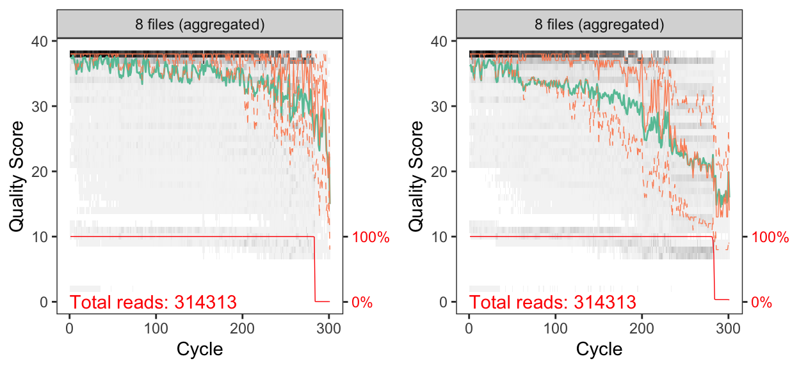
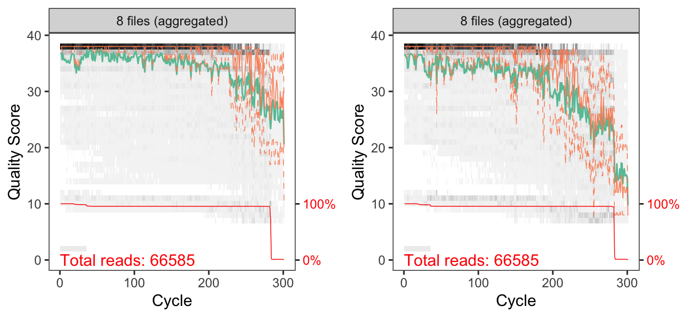
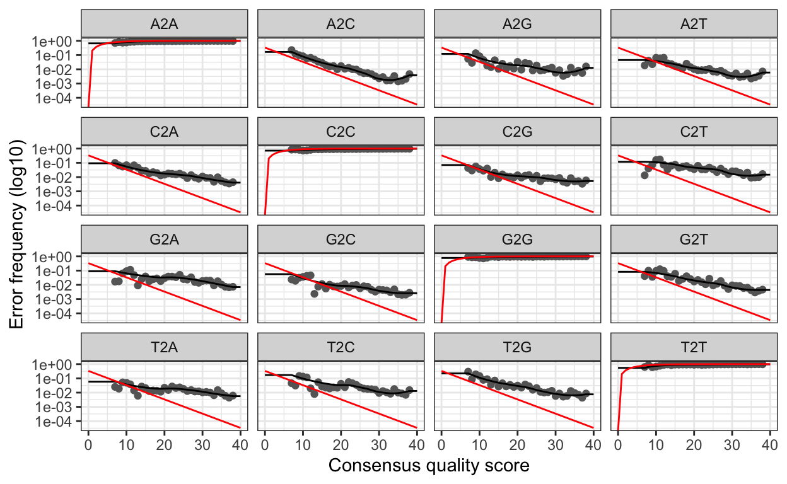
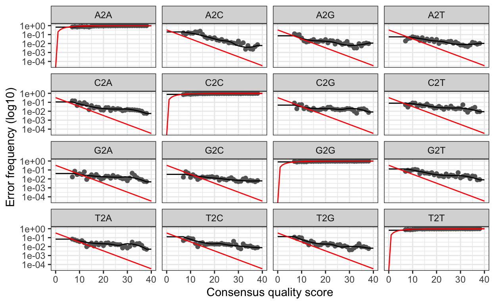
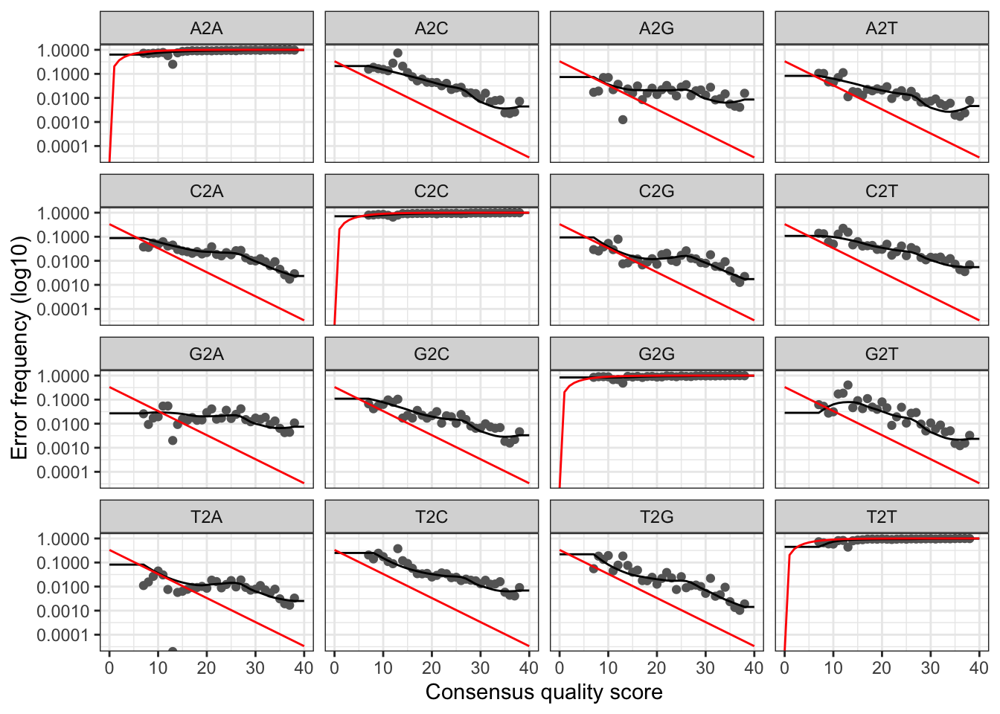
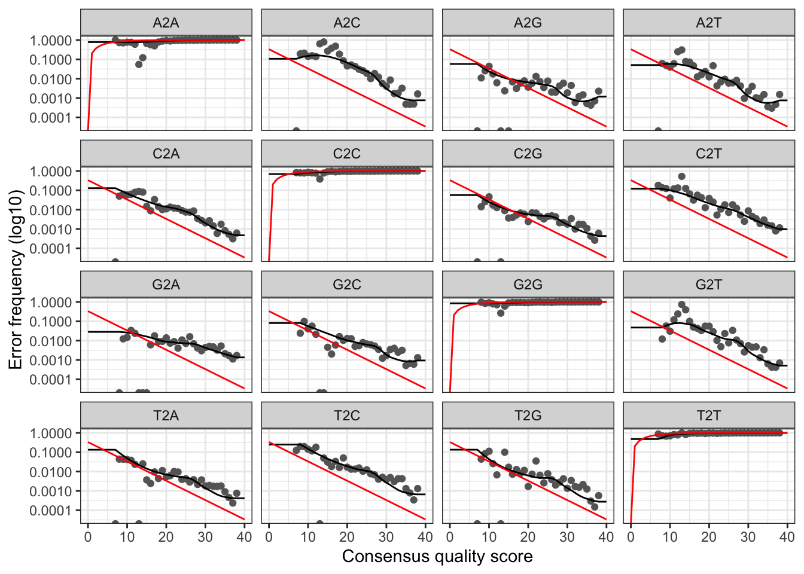

```{r setup, include=FALSE}
knitr::opts_chunk$set(echo = TRUE)
set.seed(911)
library(dada2); packageVersion("dada2")
library(ShortRead); packageVersion("ShortRead")
library(ggplot2); packageVersion("ggplot2")
library(rmarkdown)
library(DT)
library(gridExtra)
library(grid)
knitr::opts_current$get(c(
  "cache",
  "cache.path",
  "cache.rebuild",
  "dependson",
  "autodep"
))
```

## Workflow Overview

In the paper itself, we only focuses on the water samples, however we include data and analysis from all samples collected. This script will process the data from different runs separately and then combine the results and finish the workflow. Please note that to decrease rendering time of this website, we set code chunks to `eval=FALSE` after the initial processing. Remove this flag to rerun these code chunks.

> In order to run this workflow, you either need the *raw* data, available on the figshare project site, or the *trimmed* data, available from the ENA under project accession number ... See the [Data Availability](data-availability.html) page for complete details.

This pipeline below is exactly how we processed our 16S rRNA data using [DADA2](https://benjjneb.github.io/dada2/)[@callahan2016dada2]. This is not meant to be a tutorial and we only provide minimal annotation. There are many great tutorials and explanations out there on amplicon processing that you can dive into.

Depending on the DADA2 version you have installed, you may get [slightly different results](https://github.com/benjjneb/dada2/issues/532) due to fundamental changes in the code-base. This is unavoidable at times and the developers do the best they can to maintain fidelity across versions. To see the package versions of tools used in this workflow, please see the [Session Info](#r-session-information) at the end of this page. We set random number seeds to ensure full reproducibility.

This is a workflow for processing the raw 16S rRNA Illumina data for the study. The workflow consists of the following steps:

| Step | Command                | What we’re doing                                           |
|------|------------------------|------------------------------------------------------------|
| 1    | `cutadapt`             | remove primers                                             |
| 2    | multiple               | prepare input file names & paths                           |
| 3    | `filterAndTrim()`      | assess quality & filter reads                              |
| 4    | `learnErrors()`        | generate an error model for the data                       |
| 5    | `derepFastq`           | dereplicate sequences                                      |
| 6    | `dada()`               | infer ASVs on both forward & reverse reads independently   |
| 7    | `mergePairs()`         | merge forward & reverse reads to further refine ASVs       |
| 8    | `makeSequenceTable()`  | generate a count table                                     |
| 9    | `mergeSequenceTables()`| merge sequence tables from the two runs                    |
| 10   | `removeBimeraDenovo()` | screen for & remove chimeras                               |
| 11   | `assignTaxonomy()`     | assign taxonomy & finish pipeline                          |
| 12   | `save.image()`         | save an image of seqtab & taxtab for next part of workflow |
| 13   |  Bonus                 | track read changes through pipeline for samples in each run|

## Sequence Files & Samples

```{r sample_seq_table, echo=FALSE, layout="l-body-outset", eval=FALSE}
seq_table <- read.table("tables/16s-dada2/sample-seq-info-2019-16s.txt",
                        header = TRUE, sep = "\t")
datatable(seq_table, width = "100%",
          extensions = 'Buttons', options = list(
            scrollX = TRUE,
            dom = 'lfrtipB',
            buttons = c('copy', 'csv', 'excel'),
            pageLength = 5,
            lengthMenu = c(5, 10, 20, 45)
            )
          )
```

## 1.  Remove Primers

Before we start the DADA2 pipeline we need to run [catadapt](https://github.com/marcelm/cutadapt)[@martin2011cutadapt] on all `fastq.gz` files to trim the primers. We will set the  error rate (`-e`) to 0.12 (= 12%).

```{bash cutadapt, eval=FALSE, echo=TRUE}
cutadapt -g {F-ADAPTER} -G {R-ADAPTER} /
                        -o ${R1}.trimmed.fastq /
                        -p {R2}.trimmed.fastq /
                        ${R1} ${R2} /
                        --discard-untrimmed -e 0.12
```

Where:

* `-g` is GTGYCAGCMGCCGCGGTA (the 505F primer)
* `-G` is CCGYCAATTYMTTTRAGT (the XXX primer)
* and `R1` and `R2` are the forward and reverse reads, respectively.

This will yield a ~373 bp amplicon. The input files for cutadapt are in the `00_RAW_FILES/RUN01` and `00_RAW_FILES/RUN02` directories and the output files from cutadapt are in `01_TRIMMED/RUN01` and `01_TRIMMED/RUN02` directories. The output files are input for the DADA2 portion of the workflow.

For programmatic reasons, we drop the `Run` prefix from the output files and instead delineate run id with `_1_`. This is probably a little confusing so change as you see fit.

The trimmed file are the input for the DADA2 workflow. To simplify things a little in the code below, R variables for RUN01 have the suffix `X1` and RUN02 is `Y2`.

## 2. Set Working Environment

Next, we need to set the working directory for the input files. When we ran `cutadapt` we saved the trimmed files to a directory called `01_TRIMMED/`. We also create a variable to hold the file path.

#### Run 01

```{r list_fastq_filesX, eval=FALSE}
path_X1 <- "01_TRIMMED/RUN01/"
head(list.files(path_X1))
```

```{r dummy_1X, echo=FALSE}
c("CCC1_1_R1.trimmed.fastq", "CCC1_1_R2.trimmed.fastq",
  "CCC2_1_R1.trimmed.fastq", "CCC2_1_R2.trimmed.fastq",
  "CCC3_1_R1.trimmed.fastq", "CCC3_1_R2.trimmed.fastq")
```

#### Run 02

```{r list_fastq_filesY, eval=FALSE}
path_Y2 <- "01_TRIMMED/RUN02/"
head(list.files(path_Y2))
```

```{r dummy_1Y, echo=FALSE}
c("CCC3_2_R1.trimmed.fastq", "CCC3_2_R2.trimmed.fastq",
  "CCC4_2_R1.trimmed.fastq", "CCC4_2_R2.trimmed.fastq",
  "CCC5_2_R1.trimmed.fastq", "CCC5_2_R2.trimmed.fastq")
```

Here we see a partial list of files in the directory. All looks good. Now, we create variables to hold the names of the forward (R1) and reverse (R2) fastq files.

```{r sort_files, eval=FALSE}
fnFs_X1 <- sort(list.files(path_X1, pattern = "_R1.trimmed.fastq"))
fnRs_X1 <- sort(list.files(path_X1, pattern = "_R2.trimmed.fastq"))

fnFs_Y2 <- sort(list.files(path_Y2, pattern = "_R1.trimmed.fastq"))
fnRs_Y2 <- sort(list.files(path_Y2, pattern = "_R2.trimmed.fastq"))
```

And finally we can extract the sample names from the from the fastq files and have a look at the sample names from the two runs.

```{r split_nameX, eval=FALSE}
sample.names_X1 <- sapply(strsplit(fnFs_X1, "_"), `[`, 1)
fnFs_X1 <-file.path(path_X1, fnFs_X1)
fnRs_X1 <-file.path(path_X1, fnRs_X1)
sample.names_X1
```

```
 [1] "CCC1" "CCC2" "CCC3" "CCC4" "CCC5" "CCC6" "CCR1" "CCR2" "CCR3" "CCR4"
 [11] "CCR5" "CCR6" "MCR1" "MCR2" "MCR3" "MCR5" "SCC1" "SCC2" "SCC3" "SCR1"
 [21] "SCR2" "SCR3" "WCC0" "WCC1" "WCC2" "WCC3" "WCR0" "WCR1" "WCR2" "WCR3"
```

```{r split_nameY, eval=FALSE}
sample.names_Y2 <- sapply(strsplit(fnFs_Y2, "_"), `[`, 1)
fnFs_Y2 <-file.path(path_Y2, fnFs_Y2)
fnRs_Y2 <-file.path(path_Y2, fnRs_Y2)
sample.names_Y2
```

```
[1] "CCC3" "CCC4" "CCC5" "CCC6" "CCR2" "CCR3" "CCR4" "CCR5"
```

As you can see, the Run02 samples are duplicates of some Run01 samples.

## 3. Quality Assessment & Filtering

First let's look at the quality of our reads. The numbers in brackets specify which samples to view. Here we are looking at an aggregate plot of all data (except the negative control)

### Quality plots

#### Run 01

```{r plot_qscoresX, layout="l-body-outset", warning=FALSE, fig.height=3, eval=FALSE}
p1 <- plotQualityProfile(fnFs_X1[23:30], aggregate = TRUE)
p2 <- plotQualityProfile(fnRs_X1[23:30], aggregate = TRUE)

grid.arrange(p1, p2, nrow = 1)
```


```{r dummy_2X, echo=FALSE, layout="l-body-outset", warning=FALSE, fig.height=2}

```
<small><em>Aggregated quality score plots for forward (left) & reverse (right) reads from Run 01.</em></small>

#### Run 02

```{r plot_qscoresY, layout="l-body-outset", warning=FALSE, fig.height=3, eval=FALSE}
p1 <- plotQualityProfile(fnFs_Y2[1:8], aggregate = TRUE)
p2 <- plotQualityProfile(fnRs_Y2[1:8], aggregate = TRUE)

grid.arrange(p1, p2, nrow = 1)
```


```{r dummy_2Y, echo=FALSE, layout="l-body-outset", warning=FALSE, fig.height=2}

```
<small><em>Aggregated quality score plots for forward (left) & reverse (right) reads from Run 02.</em></small>


Both the forward and reverse reads look ok. There are definitely some quality issues. We can use the plots to help guide the filtering step. We don’t want read quality to drop below ~30 but we also need to make sure that our reads have sufficient overlap. DADA2 requires at least 12bp overlap, but the more the better. The V4 region of the 16S rRNA gene amplified with these primers is about 370bp. For both the forward and reverse reads, we see the quality drop at around 200bp. This is good because we have some room to play around.

### Filtering

First, we again make some path variables and setup a new directory of filtered reads.

```{r move_files, eval=FALSE}
#Place filtered files in filtered/ subdirectory
filt_path_X1 <- file.path(path_X1, "filtered")
filtFs_X1 <- file.path(filt_path_X1, paste0(sample.names_X1, "_F_filt.fastq.gz"))
filtRs_X1 <- file.path(filt_path_X1, paste0(sample.names_X1, "_R_filt.fastq.gz"))

filt_path_Y2 <- file.path(path_Y2, "filtered")
filtFs_Y2 <- file.path(filt_path_Y2, paste0(sample.names_Y2, "_F_filt.fastq.gz"))
filtRs_Y2 <- file.path(filt_path_Y2, paste0(sample.names_Y2, "_R_filt.fastq.gz"))
```

And then we trim the reads.

#### Run 01

```{r filterX, eval=FALSE}
out_X1 <- filterAndTrim(fnFs_X1, filtFs_X1, fnRs_X1, filtRs_X1,
                        truncLen=c(260,160), maxN=0, maxEE=c(3,5),
                        truncQ=2, rm.phix=TRUE, compress=TRUE,
                        multithread=TRUE)
head(out_X1)
```

```{r dummy_3X, echo=FALSE}
##                         reads.in reads.out
## CCC1_1_R1.trimmed.fastq    34693     27522
## CCC2_1_R1.trimmed.fastq     6990      5410
## CCC3_1_R1.trimmed.fastq     1939      1503
## CCC4_1_R1.trimmed.fastq      948       725
## CCC5_1_R1.trimmed.fastq    10800      9519
## CCC6_1_R1.trimmed.fastq     1252       929
```

#### Run 02

```{r filterY, eval=FALSE}
out_Y2 <- filterAndTrim(fnFs_Y2, filtFs_Y2, fnRs_Y2, filtRs_Y2,
                        truncLen=c(260,160), maxN=0, maxEE=c(5,5),
                        truncQ=2, rm.phix=TRUE, compress=TRUE,
                        multithread=TRUE)
head(out_Y2)
```

```{r dummy_3Y, echo=FALSE}
##                         reads.in reads.out
## CCC3_2_R1.trimmed.fastq    14927     13561
## CCC4_2_R1.trimmed.fastq     1228       839
## CCC5_2_R1.trimmed.fastq    18560     17391
## CCC6_2_R1.trimmed.fastq     1125       568
## CCR2_2_R1.trimmed.fastq    13934     12668
## CCR3_2_R1.trimmed.fastq    13617     12467
```

And here are the tables showing how the filtering step affected the number of reads in each sample. As you can see, some of the samples in Run01 started with a low read count to begin with. These were the samples re-sequenced in Run02.

<aside>
These parameters should be set based on the anticipated length of the amplicon and the read quality.
</aside>

<br/>

#### Run01

```{r filter_table, echo=FALSE, eval=FALSE}
datatable(out_X1, width = "80%",
          extensions = 'Buttons', options = list(
            scrollX = TRUE,
            dom = 'lfrtipB',
            buttons = c('copy', 'csv', 'excel'),
            pageLength = 5,
            lengthMenu = c(5, 15, 30, 45)
            )
          )
```

```{r dummy_4X, echo=FALSE}
out_X1_T <- read.table("tables/16s-dada2/out_X1_T.txt",
                       header = TRUE)
datatable(out_X1_T, width = "80%",
          extensions = 'Buttons', options = list(
            scrollX = TRUE,
            dom = 'lfrtipB',
            buttons = c('copy', 'csv', 'excel'),
            pageLength = 5,
            lengthMenu = c(5, 15, 30)
            )
          )
```

<br/>

#### Run02

```{r dummy_4Y, echo=FALSE}
out_Y2_T <- read.table("tables/16s-dada2/out_Y2_T.txt",
                       header = TRUE)
datatable(out_Y2_T, width = "80%",
          extensions = 'Buttons', options = list(
            scrollX = TRUE,
            dom = 'lfrtipB',
            buttons = c('copy', 'csv', 'excel'),
            pageLength = 5,
            lengthMenu = c(5, 10)
            )
          )
```

## 4. Learn Error Rates

Now it is time to assess the error rate of the data. The DADA2 algorithm uses a parametric error model. Every amplicon data set has a different set of error rates and the `learnErrors` method learns this error model *from the data*. It does this by alternating estimation of the error rates and inference of sample composition until they converge on a jointly consistent solution. The algorithm begins with an initial guess, for which the maximum possible error rates in the data are used.

#### Forward Reads---Run01

```{r learn_errors_forwardX, eval=FALSE}
errF_X1 <- learnErrors(filtFs_X1, multithread = TRUE)
```

```
102085360 total bases in 392636 reads from 24 samples will be used for learning the error rates.
```

#### Forward Reads---Run02

```{r learn_errors_forwardY, eval=FALSE}
errF_Y2 <- learnErrors(filtFs_Y2, multithread = TRUE)
```

```
15229500 total bases in 58575 reads from 8 samples will be used for learning the error rates.
```

#### Reverse Reads---Run01

```{r learn_errors_reverseX, eval=FALSE}
errR_X1 <- learnErrors(filtRs_X1, multithread = TRUE)
```

```
93984320 total bases in 587402 reads from 30 samples will be used for learning the error rates.
```

#### Reverse Reads---Run02

```{r learn_errors_reverseY, eval=FALSE}
errR_Y2 <- learnErrors(filtRs_Y2, multithread = TRUE)
```

```
9372000 total bases in 58575 reads from 8 samples will be used for learning the error rates.
```

### Plot error

Finally, we can plot the errors. The error rates for each possible transition (A to C, A to G, etc.) are shown. Points are the observed error rates for each consensus quality score. The black line shows the estimated error rates after convergence of the machine-learning algorithm. The red line shows the error rates expected under the nominal definition of the Q-score. Here the estimated error rates (black line) are a good fit to the observed rates (points), and the error rates drop with increased quality as expected.

#### Forward---Run01

```{r plot_errorFX, warning=FALSE, layout="l-body-outset", eval=FALSE}
plotErrors(errF_X1, nominalQ = TRUE)
```

```{r dummy_6X, echo=FALSE, layout="l-body-outset"}

```

#### Forward---Run02

```{r plot_errorFY, warning=FALSE, layout="l-body-outset", eval=FALSE}
plotErrors(errF_Y2, nominalQ = TRUE)
```

```{r dummy_6Y, echo=FALSE, layout="l-body-outset"}

```


#### Reverse---Run01

```{r plot_errorRX, warning=FALSE, layout="l-body-outset", eval=FALSE}
plotErrors(errR_X1, nominalQ=TRUE)
```

```{r dummy_7RX, echo=FALSE, layout="l-body-outset"}

```

#### Reverse---Run02

```{r plot_errorRY, warning=FALSE, layout="l-body-outset", eval=FALSE}
plotErrors(errR_Y2, nominalQ=TRUE)
```

```{r dummy_7RY, echo=FALSE, layout="l-body-outset"}

```

## 5. Dereplicate Reads

Now we can use `derepFastq` to identify the unique sequences in the forward and reverse fastq files.

#### Forward Reads

```{r dummy_20, echo=FALSE}
## TO run and cache the derepFastq you must set
## `cache.lazy=FALSE`
## For both code blocks
```

```{r dereplicate_reads_F, eval=FALSE}
derepFs_X1 <- derepFastq(filtFs_X1)
names(derepFs_X1) <- sample.names_X1

derepFs_Y2 <- derepFastq(filtFs_Y2)
names(derepFs_Y2) <- sample.names_Y2
```

#### Reverse Reads

```{r dereplicate_reads_R, eval=FALSE}
derepRs_X1 <- derepFastq(filtRs_X1)
names(derepRs_X1) <- sample.names_X1

derepRs_Y2 <- derepFastq(filtRs_Y2)
names(derepRs_Y2) <- sample.names_Y2
```

## 6. Run DADA2 & Infer Sequence Variants

At this point we are ready to apply the core sample inference algorithm (dada) to the filtered and trimmed sequence data. We run the `dada` command first on the forward reads from Run01 and Run02, then the reverse reads.

#### Forward Reads

```{r run_dada2_forwardX1, eval=FALSE}
dadaFs_X1 <- dada(derepFs_X1, err = errF_X1, multithread = TRUE)
```

```
Sample 1 - 27522 reads in 8258 unique sequences.
Sample 2 - 5410 reads in 1898 unique sequences.
Sample 3 - 1503 reads in 699 unique sequences.
Sample 4 - 725 reads in 368 unique sequences.
Sample 5 - 9519 reads in 2861 unique sequences.
Sample 6 - 929 reads in 422 unique sequences.
Sample 7 - 2535 reads in 1085 unique sequences.
Sample 8 - 2007 reads in 898 unique sequences.
Sample 9 - 4180 reads in 1621 unique sequences.
Sample 10 - 1235 reads in 580 unique sequences.
Sample 11 - 1356 reads in 610 unique sequences.
Sample 12 - 8439 reads in 2719 unique sequences.
Sample 13 - 39245 reads in 20793 unique sequences.
Sample 14 - 24640 reads in 13612 unique sequences.
Sample 15 - 18948 reads in 11774 unique sequences.
Sample 16 - 21145 reads in 11407 unique sequences.
Sample 17 - 23636 reads in 16076 unique sequences.
Sample 18 - 28622 reads in 16160 unique sequences.
Sample 19 - 23189 reads in 14848 unique sequences.
Sample 20 - 23803 reads in 15772 unique sequences.
Sample 21 - 24920 reads in 18558 unique sequences.
Sample 22 - 24503 reads in 17181 unique sequences.
Sample 23 - 40755 reads in 16835 unique sequences.
Sample 24 - 33870 reads in 12668 unique sequences.
Sample 25 - 31001 reads in 10984 unique sequences.
Sample 26 - 25769 reads in 9825 unique sequences.
Sample 27 - 42175 reads in 16208 unique sequences.
Sample 28 - 19276 reads in 8567 unique sequences.
Sample 29 - 22175 reads in 10611 unique sequences.
Sample 30 - 54370 reads in 23160 unique sequences.
```

```{r run_dada2_forwardY2, eval=FALSE}
dadaFs_Y2 <- dada(derepFs_Y2, err = errF_Y2, multithread = TRUE)
```

```
Sample 1 - 13561 reads in 3674 unique sequences.
Sample 2 - 839 reads in 416 unique sequences.
Sample 3 - 17391 reads in 4361 unique sequences.
Sample 4 - 568 reads in 256 unique sequences.
Sample 5 - 12668 reads in 3593 unique sequences.
Sample 6 - 12467 reads in 3788 unique sequences.
Sample 7 - 308 reads in 127 unique sequences.
Sample 8 - 773 reads in 356 unique sequences.
```

#### Reverse Reads

```{r run_dada2_reverseX1, eval=FALSE}
dadaRs_X1 <- dada(derepRs_X1, err = errR_X1, multithread = TRUE)
```

```
Sample 1 - 27522 reads in 7614 unique sequences.
Sample 2 - 5410 reads in 1713 unique sequences.
Sample 3 - 1503 reads in 581 unique sequences.
Sample 4 - 725 reads in 341 unique sequences.
Sample 5 - 9519 reads in 2976 unique sequences.
Sample 6 - 929 reads in 358 unique sequences.
Sample 7 - 2535 reads in 949 unique sequences.
Sample 8 - 2007 reads in 717 unique sequences.
Sample 9 - 4180 reads in 1362 unique sequences.
Sample 10 - 1235 reads in 500 unique sequences.
Sample 11 - 1356 reads in 484 unique sequences.
Sample 12 - 8439 reads in 2448 unique sequences.
Sample 13 - 39245 reads in 20129 unique sequences.
Sample 14 - 24640 reads in 13082 unique sequences.
Sample 15 - 18948 reads in 11021 unique sequences.
Sample 16 - 21145 reads in 10564 unique sequences.
Sample 17 - 23636 reads in 14162 unique sequences.
Sample 18 - 28622 reads in 13552 unique sequences.
Sample 19 - 23189 reads in 13341 unique sequences.
Sample 20 - 23803 reads in 13651 unique sequences.
Sample 21 - 24920 reads in 16576 unique sequences.
Sample 22 - 24503 reads in 14757 unique sequences.
Sample 23 - 40755 reads in 15298 unique sequences.
Sample 24 - 33870 reads in 12044 unique sequences.
Sample 25 - 31001 reads in 10379 unique sequences.
Sample 26 - 25769 reads in 8715 unique sequences.
Sample 27 - 42175 reads in 14757 unique sequences.
Sample 28 - 19276 reads in 8013 unique sequences.
Sample 29 - 22175 reads in 9771 unique sequences.
Sample 30 - 54370 reads in 21001 unique sequences.
```

```{r run_dada2_reverseY2, eval=FALSE}
dadaRs_Y2 <- dada(derepRs_Y2, err = errR_Y2, multithread = TRUE)
```

```
Sample 1 - 13561 reads in 3676 unique sequences.
Sample 2 - 839 reads in 312 unique sequences.
Sample 3 - 17391 reads in 3961 unique sequences.
Sample 4 - 568 reads in 220 unique sequences.
Sample 5 - 12668 reads in 3200 unique sequences.
Sample 6 - 12467 reads in 3310 unique sequences.
Sample 7 - 308 reads in 113 unique sequences.
Sample 8 - 773 reads in 278 unique sequences.
```

We can also inspect the returned `dada-class` objects for the forward and reverse reads. Let's have a peek at sample #1 from Run01 as an example.

```{r inspect_f, eval=FALSE}
dadaFs_X1[[1]]
```

```
dada-class: object describing DADA2 denoising results
257 sequence variants were inferred from 8258
input unique sequences.
Key parameters: OMEGA_A = 1e-40, OMEGA_C = 1e-40, BAND_SIZE = 16
```

```{r inspect_r, eval=FALSE}
dadaRs_X1[[1]]
```

```
dada-class: object describing DADA2 denoising results
188 sequence variants were inferred from 7614
input unique sequences.
Key parameters: OMEGA_A = 1e-40, OMEGA_C = 1e-40, BAND_SIZE = 16
```

This output tells us how many true sequence variants the DADA2 algorithm inferred from the unique sequences. In this case, 257 sequence variants were inferred from 8258 unique forward sequences and 188 sequence variants were inferred from 7614 unique reverse sequences.

## 7. Merge Paired Reads

We now merge the forward and reverse reads together to obtain the full denoised sequences. Merging is performed by aligning the denoised forward reads with the reverse-complement of the corresponding denoised reverse reads, and then constructing the merged “contig” sequences. By default, merged sequences are only output if the forward and reverse reads overlap by at least 12 bases, and are identical to each other in the overlap region (but these conditions can be changed via function arguments).

```{r  merge_paired_reads, eval=FALSE}
mergers_X1 <- mergePairs(dadaFs_X1, derepFs_X1, dadaRs_X1, derepRs_X1)
mergers_Y2 <- mergePairs(dadaFs_Y2, derepFs_Y2, dadaRs_Y2, derepRs_Y2)
```

``` {r head_file, eval = FALSE, echo = FALSE}
head(mergers_X1[[1]])
```

The `mergers_` objects are lists of `data.frames` from each sample. Each `data.frame` contains the merged `sequence`, its `abundance`, and the indices of the `forward` and `reverse` sequence variants that were merged. Paired reads that did not exactly overlap were removed by `mergePairs`, further reducing spurious output.

## 8. Construct Sequence Table

Now we construct amplicon sequence variant (ASV) tables for each run.

#### Run01

```{r seq_tableX, eval=FALSE}
seqtab_X1 <- makeSequenceTable(mergers_X1)
dim(seqtab_X1)
```

```{r dummy_12X, echo=FALSE}
seqtab_X1 <- c(30, 11305)
seqtab_X1
```

```{r seq_table2X, eval=FALSE}
table(nchar(getSequences(seqtab_X1)))
```

```
  260  318  365  366  367  368  369  370  371  372  373  374  375
    4    1   18   19   14   17  161   35  109  294 1185  359 1376
  376  377  378  379  380  381  382  383  384  385  386  387  388
 2138 4223  382  214  360  141   25   14    5    5    3    4    3
  391  392  393  394  395  396  397  398  399  400  403  404  406
    4   12   30   67   54    7    2    2    2    4    9    1    2
```

#### Run02

```{r seq_tableY, eval=FALSE}
seqtab_Y2 <- makeSequenceTable(mergers_Y2)
dim(seqtab_Y2)
```

```{r dummy_12Y, echo=FALSE}
seqtab_Y2 <- c(8, 168)
seqtab_Y2
```

```{r seq_table2Y, eval=FALSE}
table(nchar(getSequences(seqtab_Y2)))
```

```
 260 282 315 344 353 368 369 370 371 372 373 374 375 376 377 379
   1   1   1   1   1   3   4   2   2  13  26   3  46  20  37   1
 380 382 383 385 388 400
   1   1   1   1   1   1
```

The sequence table is a matrix with rows corresponding to (and named by) the samples, and columns corresponding to (and named by) the sequence variants. We have  11305 sequence variants in Run01 and 168 in Run02. But there is also a range of sequence lengths. We just need to select a range that corresponds to the expected amplicon length and eliminate the spurious reads.

### Trimming Sequence Tables

#### Run01

```{r trim_lengthX, eval=FALSE}
seqtab_X1.2 <- seqtab_X1[,nchar(colnames(seqtab_X1)) %in% seq(368,383)]
dim(seqtab_X1.2)
```

<aside>
The values selected should be based on the sequence table generated above.
</aside>

```{r dummy_14X, echo=FALSE}
c(30, 11033)
```

```{r trim_length2X,  eval=FALSE}
table(nchar(getSequences(seqtab_X1.2)))
```

```
  368  369  370  371  372  373  374  375  376  377  378  379  380
   17  161   35  109  294 1185  359 1376 2138 4223  382  214  360
  381  382  383
  141   25   14
```

#### Run02

```{r trim_lengthY, eval=FALSE}
seqtab_Y2.2 <- seqtab_Y2[,nchar(colnames(seqtab_Y2)) %in% seq(368,383)]
dim(seqtab_Y2.2)
```

<aside>
The values selected should be based on the sequence table generated above.
</aside>

```{r dummy_14Y, echo=FALSE}
c(8, 160)
```

```{r trim_length2Y,  eval=FALSE}
table(nchar(getSequences(seqtab_Y2.2)))
```

```
 368 369 370 371 372 373 374 375 376 377 379 380 382 383
   3   4   2   2  13  26   3  46  20  37   1   1   1   1
```

```{r saveRDS, eval=FALSE}
saveRDS(seqtab_X1.2, "rdata/16s-dada2/seqtab_X1.2.rds")
saveRDS(seqtab_Y2.2, "rdata/16s-dada2/seqtab_Y2.2.rds")
```

## 9. Merge Runs

At this point we have sequence tables for two runs, however the samples in Run02 are duplicates of some samples in Run01. Before we continue we need to merge the two runs. This is because we want to call chimeras (the next step) on the *merged data*. For simplicity, we will just read in the two `rds` files generated in the previous step and then merge them using the DADA2 command `mergeSequenceTables`. There will be a small complaint about duplicate sample names but we can ignore that.

```{r clear_data, eval=FALSE, echo=TRUE}
remove(list = ls())
```

```{r read_RDS_files_combo, eval=FALSE}
seqtab.1 <- readRDS("rdata/16s-dada2/seqtab_X1.2.rds")
seqtab.2 <- readRDS("rdata/16s-dada2/seqtab_Y2.2.rds")

st.sum <- mergeSequenceTables(table1 = seqtab.1, table2 = seqtab.2, tables = NULL,
  repeats = "sum", orderBy = "abundance")
```

```
## Duplicated sample names detected in the rownames.
```

We then save the merged sequence table as a new `rds` file...

```{r save_combo, eval=FALSE}
saveRDS(st.sum, "rdata/16s-dada2/combo_run1_run2.rds")
```

We will read in the `RDS` file containing the sequence table saved above. We also need to run `remove(list = ls())` command, otherwise the final image we save will be huge. This way, the image only contains the sample data, seqtab, and taxtab *before & after* running `removeBimeraDenovo`.


```{r read_combo, eval=FALSE}
remove(list = ls())
st.all <- readRDS("rdata/16s-dada2/combo_run1_run2.rds")
```

This may seem redundant (and it probably is) but it lets me work with only the data in the `rds` file instead of everything generated in the pipeline thus far. This becomes important when we save the final `rdata` file from the workflow. If we were to save the whole workflow the final file would be large and clunky. This way it contains only the data we need going forward. The variable `st.all` is the combined sequence tables of Run01 and Run02.

## 10. Remove Chimeras

Even though the `dada` method corrects substitution and indel errors,  chimeric sequences remain. According to the DADA2 documentation, the accuracy of sequence variants after denoising makes identifying chimeric ASVs simpler than when dealing with fuzzy OTUs. Chimeric sequences are identified if they can be *exactly reconstructed* by combining a left-segment and a right-segment from two more abundant *parent* sequences.

```{r chimera_on_ind_runs, eval=FALSE}
seqtab <- removeBimeraDenovo(st.all,
                             method="consensus",
                             multithread=TRUE)
dim(seqtab)
```

```{r dummy_16, echo=FALSE}
c(30, 6160)
```


```{r chimera_on_ind_runs2, eval=FALSE}
sum(seqtab)/sum(st.all)
```


```{r dummy_17, echo=FALSE}
0.9129203
```

When we account for the abundances of each variant, we see chimeras account for  about 9% of the merged sequence reads. Not bad. The variable `seqtab` is the combined sequence tables of Run01 and Run02, screened for chimeras. This is the final sequence table.

## 11. Assign Taxonomy

The `assignTaxonomy` command implements the naive Bayesian classifier, so for reproducible results you need to set a random number seed (see issue [#538](https://github.com/benjjneb/dada2/issues/538)). We did this at the beginning of the workflow. For taxonomic assignment, we are using the Silva version 132[@quast2012silva]. The developers of DADA2 maintain a [formatted version of the database](https://zenodo.org/record/3731176).

And then native Baysian classifier against the Silva database.

```{r assign_tax_silva, eval = FALSE}
tax_silva <- assignTaxonomy(
  seqtab, "../taxonomy_databases/silva_nr_v132_train_set.fa.gz",
  multithread = TRUE)
```

## 12. Save Image

And finally, we save an image for use in the analytic part of the workflow. This R data file will be needed as the input for the phyloseq portion of the workflow. See the [Data Availability](data-availability.html) page for complete details on where to get this file.

```{r save_image, eval=FALSE}
save.image("rdata/16s-dada2/combo_pipeline.rdata")
```

The DADA2 analysis is now complete. Next we use phyloseq and the `combo_pipeline.rdata` file for the subsequent analysis.

## 13. Track Read Changes (Bonus)

One more task we can do is look at the number of reads that made it through each step of the pipeline for every sample. To gauge the overall performance of the runs and how read totals changed through the pipeline, we need to rerun chimera removal on the *pre-merged* data and then generate a summary table tracking reads by sample. These step could  be useful to compare data across runs, but we will not do that here.


```{r dummy_read, eval=FALSE, echo=FALSE}
load("rdata/16s-dada2/pre_combo_pipeline.rdata")
seqtab_X1.2 <- readRDS("rdata/16s-dada2/seqtab_X1.2.rds")
seqtab_Y2.2 <- readRDS("rdata/16s-dada2/seqtab_Y2.2.rds")
seqtab_X1.2.nochim <- readRDS("rdata/16s-dada2/seqtab_X1.2.nochim.rds")
seqtab_Y2.2.nochim <- readRDS("rdata/16s-dada2/seqtab_Y2.2.nochim.rds")
```

### Remove Chimeras for Each Run

First we must identify and remove chimeras from each run.

#### Run01

```{r chimera_on_ind_runsX, eval=FALSE}
#Run01
seqtab_X1.2.nochim <- removeBimeraDenovo(seqtab_X1.2,
                                         method="consensus",
                                         multithread=TRUE)

dim(seqtab_X1.2.nochim)
```

```{r dummy_24X, echo=FALSE}
c(30, 6105)
```


```{r chimera_on_ind_runsX2, eval=FALSE}
sum(seqtab_X1.2.nochim)/sum(seqtab_X1.2)
```

```{r dummy_24X2, echo=FALSE}
0.912076
```

#### Run02

```{r chimera_on_ind_runsY, eval=FALSE}
#Run01
seqtab_Y2.2.nochim <- removeBimeraDenovo(seqtab_Y2.2,
                                         method="consensus",
                                         multithread=TRUE)

dim(seqtab_Y2.2.nochim)
```

```{r dummy_24Y, echo=FALSE}
c(8, 143)
```

```{r chimera_on_ind_runsY2, eval=FALSE}
sum(seqtab_Y2.2.nochim)/sum(seqtab_Y2.2)
```

```{r dummy_24Y2, echo=FALSE}
0.9971973
```

### Build Change Table

Next, we build a table for each run that contains read counts for each sample from each step of the pipeline.

```{r build_table_to_track_reads, eval=FALSE}
#Run01
getN_X1 <- function(x) sum(getUniques(x))
track_X1 <-    cbind(out_X1, sapply(dadaFs_X1, getN_X1),
                     sapply(dadaRs_X1, getN_X1), sapply(mergers_X1, getN_X1),
                     rowSums(seqtab_X1.2.nochim))
colnames(track_X1) <- c("input", "filtered", "denoisedF",
                        "denoisedR", "merged", "nonchim")
rownames(track_X1) <- sample.names_X1

#Run02
getN_Y2 <- function(x) sum(getUniques(x))
track_Y2 <-    cbind(out_Y2, sapply(dadaFs_Y2, getN_Y2),
                     sapply(dadaRs_Y2, getN_Y2), sapply(mergers_Y2, getN_Y2),
                     rowSums(seqtab_Y2.2.nochim))
colnames(track_Y2) <- c("input", "filtered", "denoisedF",
                        "denoisedR", "merged", "nonchim")
rownames(track_Y2) <- sample.names_Y2

```

#### Run01 Read Changes through Pipeline

```{r dummy_44X, echo=FALSE, layout="l-body-outset"}
sum_run1 <- read.table("tables/16s-dada2/RUN01_read_changes.txt",
                       header = TRUE)
datatable(sum_run1, width = "80%",
          extensions = 'Buttons', options = list(
            scrollX = TRUE,
            dom = 'lfrtipB',
            buttons = c('copy', 'csv', 'excel'),
            pageLength = 5,
            lengthMenu = c(5, 15, 30)
            )
          )
```

<br/>

#### Run02 Read Changes through Pipeline

```{r dummy_44Y, echo=FALSE, layout="l-body-outset"}
sum_run2 <- read.table("tables/16s-dada2/RUN02_read_changes.txt",
                       header = TRUE)
datatable(sum_run2, width = "80%",
          extensions = 'Buttons', options = list(
            scrollX = TRUE,
            dom = 'lfrtipB',
            buttons = c('copy', 'csv', 'excel'),
            pageLength = 5,
            lengthMenu = c(5, 10)
            )
          )
```


And then save the tables so we can use them later if we want.

```{r track_changes, eval=FALSE}
#Run01
write.table(track_X1, "tables/16s-dada2/RUN01_read_changes.txt",
            sep = "\t", quote = FALSE, col.names=NA)

#Run02
write.table(track_Y2, "tables/16s-dada2/RUN02_read_changes.txt",
            sep = "\t", quote = FALSE, col.names=NA)
```

That's it for this part. Next, we do some data prep ahead of the community analysis portion of the workflow.

</br>

<div class="post-nav">
<div class="post-nav-item">
<div class="meta-nav">Previous</div>
<a href="pc.html" rel="next">Field Analyses</a>
</div>
</div>

<div class="post-nav">
<div class="post-nav-item">
<div class="meta-nav">Next</div>
<a href="16s-data-prep.html" rel="prev">N<sup><u>o</u></sup> 2. Data Preparation</a>
</div>
</div>

## Source Code {.appendix}

The source code for this page can be accessed on GitHub by [clicking this link](https://github.com/hypocolypse/web/blob/master/16s-dada2.Rmd). Please note, that in order to process the data *and*  build the website, we needed to run the pipeline and get the results. Then hard code the results and turn off the individual commands. So the raw file for this page is a bit messy---you have been warned. 
