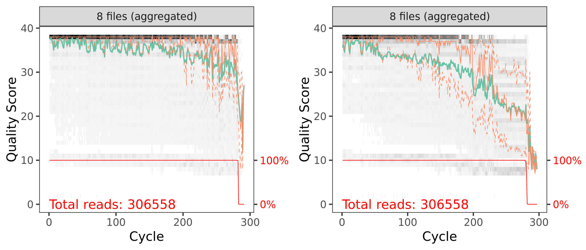
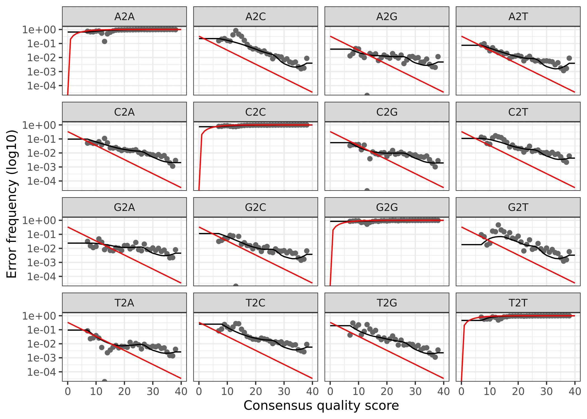

```{r setup, include=FALSE}
knitr::opts_chunk$set(echo = TRUE)
set.seed(911)
library(dada2); packageVersion("dada2")
library(ShortRead); packageVersion("ShortRead")
library(ggplot2); packageVersion("ggplot2")
library(rmarkdown)
library(DT)
library(gridExtra)
library(grid)
knitr::opts_current$get(c(
  "cache",
  "cache.path",
  "cache.rebuild",
  "dependson",
  "autodep"
))
```

# Workflow Overview

This script will process the raw data from the water samples. Please note that to decrease rendering time of this website, we set code chunks to `eval=FALSE` after the initial processing. Remove this flag to rerun these code chunks.

> In order to run this workflow, you either need the *raw* data---available on the figshare project site---or the *trimmed* data, available from the ENA under project accession number ... See the [Data Availability](data-availability.html) page for complete details.

This pipeline below is exactly how we processed our 16S rRNA data using [DADA2](https://benjjneb.github.io/dada2/)[@callahan2016dada2]. This is not meant to be a tutorial and we only provide minimal annotation. There are many great tutorials and explanations out there on amplicon processing that you can dive into.

Depending on the DADA2 version you have installed, you may get [slightly different results](https://github.com/benjjneb/dada2/issues/532) due to fundamental changes in the code base. This is unavoidable at times and the developers do the best they can to maintain fidelity across versions. To see the package versions of tools used in this workflow, please see the [Session Info](#r-session-information) at the end of this page. We set random number seeds to ensure full reproducibility.

This is a workflow for processing the raw 16S rRNA Illumina data for the study. The workflow consists of the following steps:

| Step | Command                | What we’re doing                                           |
|------|------------------------|------------------------------------------------------------|
| 1    | `cutadapt`             | remove primers                                             |
| 2    | multiple               | prepare input file names & paths                           |
| 3    | `filterAndTrim()`      | assess quality & filter reads                              |
| 4    | `learnErrors()`        | generate an error model for the data                       |
| 5    | `derepFastq`           | dereplicate sequences                                      |
| 6    | `dada()`               | infer ASVs on both forward & reverse reads independently   |
| 7    | `mergePairs()`         | merge forward & reverse reads to further refine ASVs       |
| 8    | `makeSequenceTable()`  | generate a count table                                     |
| 9    | `removeBimeraDenovo()` | screen for & remove chimeras                               |
| 10   |  build table           | track read changes through pipeline for samples            |
| 11   | `assignTaxonomy()`     | assign taxonomy & finish pipeline                          |
| 12   | `save.image()`         | save an image of seqtab & taxtab for next part of workflow |

# Sequence Files & Samples

```{r sample_seq_table, echo=FALSE, layout="l-body-outset", eval=FALSE}
seq_table <- read.table("tables/16s-dada2/sample-seq-info-2019-16s.txt",
                        header = TRUE, sep = "\t")
datatable(seq_table, width = "100%",
          extensions = 'Buttons', options = list(
            scrollX = TRUE,
            dom = 'lfrtipB',
            buttons = c('copy', 'csv', 'excel'),
            pageLength = 8
            )
          )
```

# 1.  Remove Primers

Before we start the DADA2 pipeline we need to run [catadapt](https://github.com/marcelm/cutadapt)[@martin2011cutadapt] on all `fastq.gz` files to trim the primers. We will set the  error rate (`-e`) to 0.12 (= 12%).

```{bash cutadapt, eval=FALSE, echo=TRUE}
cutadapt -g {F-ADAPTER} -G {R-ADAPTER} /
                        -o ${R1}.trimmed.fastq /
                        -p {R2}.trimmed.fastq /
                        ${R1} ${R2} /
                        --discard-untrimmed -e 0.12
```

Where `-g` is GTGYCAGCMGCCGCGGTAA (the 515F primer) `-G` is CCGYCAATTYMTTTRAGTTT (the 926R primer)[@parada2016every] and `R1` and `R2` are the forward and reverse reads, respectively. More information can be found on the [16S Illumina Amplicon Protocol](https://earthmicrobiome.org/protocols-and-standards/16s/) page of the Earth Microbiome Project. 

This will yield a ~370 bp amplicon. The input files for cutadapt are in the `RAW/` directory and the output files from cutadapt are in the `INPUT_FILES` directory. The output files are input for the DADA2 portion of the workflow.

# 2. Set Working Environment

Next, we need to set the working directory for the input files. When we ran `cutadapt` we saved the trimmed files to a directory called `01_TRIMMED/`. We also create a variable to hold the file path.

```{r list_fastq_filesX, eval=FALSE}
path <- "INPUT_FILES/"
head(list.files(path))
```

```{r dummy_1X, echo=FALSE}
c("WCC0_R1.trimmed.fastq", "WCC0_R2.trimmed.fastq", "WCC1_R1.trimmed.fastq", 
   "WCC1_R2.trimmed.fastq", "WCC2_R1.trimmed.fastq", "WCC2_R2.trimmed.fastq")
```

Here we see a partial list of files in the directory. All looks good. Now, we create variables to hold the names of the forward (R1) and reverse (R2) fastq files.

```{r sort_files, eval=FALSE}
fnFs <- sort(list.files(path, pattern = "_R1.trimmed.fastq"))
fnRs <- sort(list.files(path, pattern = "_R2.trimmed.fastq"))
```

And finally, we can extract the sample names from the from the fastq files and have a look at the sample names.

```{r split_nameX, eval=FALSE}
sample.names <- sapply(strsplit(fnFs, "_"), `[`, 1)
fnFs <-file.path(path, fnFs)
fnRs <-file.path(path, fnRs)

```

```
[1] "WCC0-1871" "WCC1-1893" "WCC2-1895" "WCC3-1898" "WCR0-1861" "WCR1-1894"
[7] "WCR2-1897" "WCR3-1896"
```

# 3. Quality Assessment & Filtering

First let's look at the quality of our reads. The numbers in brackets specify which samples to view. Here we are looking at an aggregate plot of all data (except the negative control)

## Quality plots

```{r plot_qscoresX, layout="l-body-outset", warning=FALSE, fig.height=3, eval=FALSE}
p1 <- plotQualityProfile(fnFs[1:8], aggregate = TRUE)
p2 <- plotQualityProfile(fnRs[1:8], aggregate = TRUE)

p3 <- grid.arrange(p1, p2, nrow = 1)
ggsave("plot_qscores_compare.png", p3, width = 7, height = 3)
```

```{r dummy_2X, echo=FALSE, layout="l-body-outset", warning=FALSE, fig.height=2}

```
<small><em>Aggregated quality score plots for forward (left) & reverse (right) reads.</em></small>

Both the forward and reverse reads look ok. There are definitely some quality issues. We can use the plots to help guide the filtering step. We don’t want read quality to drop below ~30 but we also need to make sure that our reads have sufficient overlap. DADA2 requires at least 12bp overlap, but the more the better. The V4 region of the 16S rRNA gene amplified with these primers is about 370bp. For both the forward and reverse reads, we see the quality drops around 260bp for the forward reads and 200 for the reverse reads. This is good because we have some room to play around.

## Filtering

First, we again make some path variables and setup a new sub-directory of filtered reads.

```{r move_files, eval=FALSE}
filt_path <- file.path(path, "filtered")
filtFs <- file.path(filt_path, paste0(sample.names, "_F_filt.fastq.gz"))
filtRs <- file.path(filt_path, paste0(sample.names, "_R_filt.fastq.gz"))
```

And then we trim the reads. The `truncLen` values we use should give a roughly 35bp overlap. 

<aside>
These parameters should be set based on the anticipated length of the amplicon and the read quality.
</aside>


```{r filterX, eval=FALSE}
out <- filterAndTrim(fnFs, filtFs, fnRs, filtRs, 
                     truncLen=c(260,150), maxN=0, 
                     maxEE=c(3,3), truncQ=2, 
                     rm.phix=TRUE, compress=TRUE, 
                     multithread = 20)
```

And here are the tables showing how the filtering step affected the number of reads in each sample. As you can see, some of the samples in Run01 started with a low read count to begin with. These were the samples re-sequenced in Run02.


<br/>

```{r filter_table, echo=FALSE, eval=FALSE}
datatable(out, width = "80%",
          extensions = 'Buttons', options = list(
            scrollX = TRUE,
            dom = 'Brti',
            buttons = c('copy', 'csv', 'excel'),
            pageLength = 8
            )
          )
```

```{r dummy_4X, echo=FALSE}
out_T <- read.table("tables/16s-dada2/out_T.txt",
                       header = TRUE)
datatable(out_T, width = "80%",
          extensions = 'Buttons', options = list(
            scrollX = TRUE,
            dom = 'Brti',
            buttons = c('copy', 'csv', 'excel'),
            pageLength = 8
            )
          )
```

# 4. Learn Error Rates

Now it is time to assess the error rate of the data. The DADA2 algorithm uses a parametric error model. Every amplicon data set has a different set of error rates and the `learnErrors` method learns this error model *from the data*. It does this by alternating estimation of the error rates and inference of sample composition until they converge on a jointly consistent solution. The algorithm begins with an initial guess, for which the maximum possible error rates in the data are used.

### Forward Reads

```{r learn_errors_forwardX, eval=FALSE}
errF <- learnErrors(filtFs, multithread = 20)
```

```
66757340 total bases in 256759 reads from 8 samples will be used for learning the error rates.
```

#### Reverse Reads

```{r learn_errors_reverseX, eval=FALSE}
errR <- learnErrors(filtRs, multithread = 20)
```

```
38513850 total bases in 256759 reads from 8 samples will be used for learning the error rates.
```

## Plot errors

Finally, we can plot the errors. The error rates for each possible transition (A to C, A to G, etc.) are shown. Points are the observed error rates for each consensus quality score. The black line shows the estimated error rates after convergence of the machine-learning algorithm. The red line shows the error rates expected under the nominal definition of the Q-score. Here the estimated error rates (black line) are a good fit to the observed rates (points), and the error rates drop with increased quality as expected.

#### Forward

```{r plot_errorFX, warning=FALSE, layout="l-body-outset", eval=FALSE}
plotErrors(errF, nominalQ = TRUE)
```

```{r, echo=FALSE, eval=FALSE}
p4 <- plotErrors(errF, nominalQ = TRUE)
ggsave("plot_errorF_1.png", p4, width = 7, height = 5)
ggsave("plot_errorF_2.png", p4)
```

```{r dummy_6X, echo=FALSE, layout="l-body-outset"}
knitr::include_graphics("figures/16s-dada2/plot_errorF_1.png")
```

#### Reverse

```{r plot_errorRX, warning=FALSE, layout="l-body-outset", eval=FALSE}
plotErrors(errR, nominalQ=TRUE)
```

```{r, echo=FALSE, eval=FALSE}
p5 <- plotErrors(errR, nominalQ = TRUE)
ggsave("plot_errorR_1.png", p5, width = 7, height = 5)
ggsave("plot_errorR_2.png", p5)
```

```{r dummy_7RX, echo=FALSE, layout="l-body-outset"}

```

# 5. Dereplicate Reads

Now we can use `derepFastq` to identify the unique sequences in the forward and reverse fastq files.

#### Forward Reads

```{r, echo=FALSE}
## TO run and cache the derepFastq you must set
## `cache.lazy=FALSE`
## For both code blocks
```

```{r dereplicate_reads_F, eval=FALSE}
derepFs <- derepFastq(filtFs)
names(derepFs) <- sample.names
```

#### Reverse Reads

```{r dereplicate_reads_R, eval=FALSE}
derepRs <- derepFastq(filtRs)
names(derepRs) <- sample.names
```

# 6. Run DADA2 & Infer Sequence Variants

At this point we are ready to apply the core sample inference algorithm (dada) to the filtered and trimmed sequence data. We run the `dada` command first on the forward reads from Run01 and Run02, then the reverse reads.

#### Forward Reads

```{r run_dada2_forwardX1, eval=FALSE}
dadaFs <- dada(derepFs, err = errF, multithread = 20)
```

```
Sample 1 - 38961 reads in 15286 unique sequences.
Sample 2 - 32223 reads in 11307 unique sequences.
Sample 3 - 29579 reads in 9753 unique sequences.
Sample 4 - 24677 reads in 8848 unique sequences.
Sample 5 - 40399 reads in 14719 unique sequences.
Sample 6 - 18230 reads in 7659 unique sequences.
Sample 7 - 21209 reads in 9735 unique sequences.
Sample 8 - 51481 reads in 20673 unique sequences.
```

#### Reverse Reads

```{r run_dada2_reverseX1, eval=FALSE}
dadaRs <- dada(derepRs, err = errR, multithread = TRUE)
```

```
Sample 1 - 38961 reads in 12707 unique sequences.
Sample 2 - 32223 reads in 9822 unique sequences.
Sample 3 - 29579 reads in 8469 unique sequences.
Sample 4 - 24677 reads in 7228 unique sequences.
Sample 5 - 40399 reads in 12125 unique sequences.
Sample 6 - 18230 reads in 6515 unique sequences.
Sample 7 - 21209 reads in 8326 unique sequences.
Sample 8 - 51481 reads in 16971 unique sequences.
```

We can also inspect the returned `dada-class` objects for the forward and reverse reads. Let's have a peek at sample #1  as an example.

```{r inspect_f, eval=FALSE}
dadaFs[[1]]
```

```
dada-class: object describing DADA2 denoising results
466 sequence variants were inferred from 15286 input unique sequences.
Key parameters: OMEGA_A = 1e-40, OMEGA_C = 1e-40, BAND_SIZE = 16
```

```{r inspect_r, eval=FALSE}
dadaRs[[1]]
```

```
dada-class: object describing DADA2 denoising results
302 sequence variants were inferred from 12707 input unique sequences.
Key parameters: OMEGA_A = 1e-40, OMEGA_C = 1e-40, BAND_SIZE = 16
```

This output tells us how many true sequence variants the DADA2 algorithm inferred from the unique sequences. In this case, 466 sequence variants were inferred from 15286 unique forward sequences and 302 sequence variants were inferred from 12707 unique reverse sequences.

# 7. Merge Paired Reads

We now merge the forward and reverse reads together to obtain the full denoised sequences. Merging is performed by aligning the denoised forward reads with the reverse-complement of the corresponding denoised reverse reads, and then constructing the merged “contig” sequences. By default, merged sequences are only output if the forward and reverse reads overlap by at least 12 bases, and are identical to each other in the overlap region (but these conditions can be changed via function arguments).

```{r  merge_paired_reads, eval=FALSE}
mergers <- mergePairs(dadaFs, derepFs, dadaRs, derepRs)
```

``` {r head_file, eval = FALSE, echo = FALSE}
head(mergers[[1]])
```

The `mergers_` objects are lists of `data.frames` from each sample. Each `data.frame` contains the merged `sequence`, its `abundance`, and the indices of the `forward` and `reverse` sequence variants that were merged. Paired reads that did not exactly overlap were removed by `mergePairs`, further reducing spurious output.

# 8. Construct Sequence Table

Now we construct amplicon sequence variant (ASV) table. The sequence table is a matrix with rows corresponding to (and named by) the samples, and columns corresponding to (and named by) the sequence variants. 

```{r seq_tableX, eval=FALSE}
seqtab <- makeSequenceTable(mergers)
dim(seqtab)
```

```{r echo=FALSE}
c(8, 4132)
```

We have 4132 sequence variants. 

```{r seq_table2X, eval=FALSE}
table(nchar(getSequences(seqtab)))
```

```
362 363 364 365 366 367 368 369 370 371 372 373 374 375 376 377 378 379 380 381 
  2   1   4   7 134   8  84 161 499 198 589 960 953 109 169 230   8   1   2   2 
382 383 384 385 388 393 
  2   1   2   1   1   4 
```

But there is also a range of sequence lengths. 

## Trim Sequence Tables

We need to select a range that corresponds to the expected amplicon length and eliminate the spurious reads.

```{r trim_lengthX, eval=FALSE}
seqtab.2 <- seqtab[,nchar(colnames(seqtab)) %in% seq(360,380)]
dim(seqtab.2)
```

<aside>
The values selected should be based on the sequence table generated above.
</aside>

```{r dummy_14X, echo=FALSE}
c(8, 4119)
```

Trimming the table eliminated 13 ASVs. 

```{r trim_length2X,  eval=FALSE}
table(nchar(getSequences(seqtab.2)))
```

```
362 363 364 365 366 367 368 369 370 371 372 373 374 375 376 377 378 379 380 
  2   1   4   7 134   8  84 161 499 198 589 960 953 109 169 230   8   1   2
```

# 9. Remove Chimeras

Even though the `dada` method corrects substitution and indel errors,  chimeric sequences remain. According to the DADA2 documentation, the accuracy of sequence variants after denoising makes identifying chimeric ASVs simpler than when dealing with fuzzy OTUs. Chimeric sequences are identified if they can be *exactly reconstructed* by combining a left-segment and a right-segment from two more abundant *parent* sequences.

```{r chimera_on_ind_runs, eval=FALSE}
seqtab.2.nochim <- removeBimeraDenovo(seqtab.2, 
                                      method="consensus", 
                                      multithread = 20)
dim(seqtab.2.nochim)
```

```{r dummy_16, echo=FALSE}
c(8, 1424)
```

Chimera checking removed about 65% of the ASVs. Seems like a lot?

```{r chimera_on_ind_runs2, eval=FALSE}
sum(seqtab.2.nochim)/sum(seqtab.2)
```

```{r dummy_17, echo=FALSE}
0.874367
```

But when we account for the abundances of each variant, we see chimeras account for  only about 12.5% of the merged sequence reads. Not great, not terrible either. 

# 10. Track Read Changes

One more task we can do is look at the number of reads that made it through each step of the pipeline for every sample to gauge the overall performance of the run and how read totals changed through the pipeline, 

```{r build_table_to_track_reads, eval=FALSE}
getN <- function(x) sum(getUniques(x))
track <- cbind(out, 
               sapply(dadaFs, getN), 
               sapply(dadaRs, getN), 
               sapply(mergers, getN), 
               rowSums(seqtab.2.nochim))
colnames(track) <- c("input", "filtered", "denoisedF", 
                     "denoisedR", "merged", "nonchim")
rownames(track) <- sample.names
```

<br/>

```{r dummy_44X, echo=FALSE, layout="l-body-outset"}
sum_run <- read.table("tables/16s-dada2/read_changes.txt",
                       header = TRUE)
datatable(sum_run, width = "80%",
          extensions = 'Buttons', options = list(
            scrollX = TRUE,
            dom = 'Brti',
            buttons = c('copy', 'csv', 'excel'),
            pageLength = 8
            )
          )
```


```{r track_changes, eval=FALSE, echo=FALSE}
write.table(track, "tables/16s-dada2/read_changes.txt", 
            sep = "\t", quote = FALSE, col.names=NA)
```

We will save and then read in an `RDS` file containing the new sequence table. We also need to run `remove(list = ls())` command, otherwise the final image we save will be bigger than it needs to be. This way, the image only contains the sample data, seqtab, and taxtab *before & after* running `removeBimeraDenovo`.

```{r saveRDS, eval=FALSE}
saveRDS(seqtab.2.nochim, "seqtab.2.nochim.rds")
```

```{r read_combo, eval=FALSE}
remove(list = ls())
seqtab <- readRDS("seqtab.2.nochim.rds")
```

This may seem redundant (and it probably is) but it lets us work with only the data in the `rds` file instead of everything generated in the pipeline thus far. This becomes important when we save the final `rdata` file from the workflow. If we were to save the whole workflow the final file would be large and clunky. This way it contains only the data we need going forward. The variable `st.all` is the combined sequence tables of Run01 and Run02.

# 11. Assign Taxonomy

The `assignTaxonomy` command implements the naive Bayesian classifier[@wang2007naive], so for reproducible results you need to set a random number seed (see issue [#538](https://github.com/benjjneb/dada2/issues/538)). We did this at the beginning of the workflow. For taxonomic assignment, we are using the Silva version 132[@quast2012silva]. The developers of DADA2 maintain a [formatted version of the database](https://zenodo.org/record/3731176). As of the time of this writing, version 138 was just released. 

And then native Baysian classifier against the Silva database.

```{r assign_tax_silva, eval = FALSE}
tax_silva <- assignTaxonomy(
  seqtab, "../taxonomy_databases/silva_nr_v138_train_set.fa.gz",
  multithread = TRUE)
```

# 12. Save Image

And finally, we save an image for use in the analytic part of the workflow. This R data file will be needed as the input for the phyloseq portion of the workflow. See the [Data Availability](data-availability.html) page for complete details on where to get this file.

```{r save_image, eval=FALSE}
save.image("rdata/16s-dada2/water_pipeline.rdata")
```

The DADA2 analysis is now complete. Next we use phyloseq and the `combo_pipeline.rdata` file for the subsequent analysis.

# R Session Information & Code

This workflow was run on the [Smithsonian High-Performance Cluster (SI/HPC)](https://doi.org/10.25572/SIHPC), Smithsonian Institution. Below are the specific packages and versions used in this workflow using both `sessionInfo()` and `devtools::session_info()`. Click the arrow to see the details.

<details markdown="1"><summary>Show/hide  R Session Info</summary>
```
sessionInfo()
R version 4.0.0 (2020-04-24)
Platform: x86_64-conda_cos6-linux-gnu (64-bit)
Running under: CentOS Linux 7 (Core)

Matrix products: default
BLAS/LAPACK: /home/scottjj/miniconda3/envs/R-4/lib/libopenblasp-r0.3.9.so

locale:
 [1] LC_CTYPE=en_US.UTF-8       LC_NUMERIC=C
 [3] LC_TIME=en_US.UTF-8        LC_COLLATE=en_US.UTF-8
 [5] LC_MONETARY=en_US.UTF-8    LC_MESSAGES=en_US.UTF-8
 [7] LC_PAPER=en_US.UTF-8       LC_NAME=C
 [9] LC_ADDRESS=C               LC_TELEPHONE=C
[11] LC_MEASUREMENT=en_US.UTF-8 LC_IDENTIFICATION=C

attached base packages:
 [1] grid      stats4    parallel  stats     graphics  grDevices utils
 [8] datasets  methods   base

other attached packages:
 [1] gridExtra_2.3               ggplot2_3.3.0
 [3] ShortRead_1.46.0            GenomicAlignments_1.24.0
 [5] SummarizedExperiment_1.18.1 DelayedArray_0.14.0
 [7] matrixStats_0.56.0          Biobase_2.48.0
 [9] Rsamtools_2.4.0             GenomicRanges_1.40.0
[11] GenomeInfoDb_1.24.0         Biostrings_2.56.0
[13] XVector_0.28.0              IRanges_2.22.1
[15] S4Vectors_0.26.0            BiocParallel_1.22.0
[17] BiocGenerics_0.34.0         dada2_1.16.0
[19] Rcpp_1.0.4.6

loaded via a namespace (and not attached):
 [1] plyr_1.8.6             RColorBrewer_1.1-2     pillar_1.4.4
 [4] compiler_4.0.0         bitops_1.0-6           tools_4.0.0
 [7] zlibbioc_1.34.0        digest_0.6.25          lifecycle_0.2.0
[10] tibble_3.0.1           gtable_0.3.0           lattice_0.20-41
[13] png_0.1-7              pkgconfig_2.0.3        rlang_0.4.6
[16] Matrix_1.2-18          GenomeInfoDbData_1.2.3 withr_2.2.0
[19] stringr_1.4.0          hwriter_1.3.2          vctrs_0.3.0
[22] glue_1.4.1             R6_2.4.1               jpeg_0.1-8.1
[25] latticeExtra_0.6-29    farver_2.0.3           reshape2_1.4.4
[28] magrittr_1.5           scales_1.1.1           ellipsis_0.3.1
[31] colorspace_1.4-1       labeling_0.3           stringi_1.4.6
[34] RCurl_1.98-1.2         RcppParallel_5.0.1     munsell_0.5.0
[37] crayon_1.3.4

devtools::session_info()
─ Session info ───────────────────────────────────────────────────────────────
 setting  value
 version  R version 4.0.0 (2020-04-24)
 os       CentOS Linux 7 (Core)
 system   x86_64, linux-gnu
 ui       X11
 language (EN)
 collate  en_US.UTF-8
 ctype    en_US.UTF-8
 tz       America/New_York
 date     2020-06-14

─ Packages ───────────────────────────────────────────────────────────────────
 package              * version  date       lib source
 assertthat             0.2.1    2019-03-21 [1] CRAN (R 4.0.0)
 backports              1.1.7    2020-05-13 [1] CRAN (R 4.0.0)
 Biobase              * 2.48.0   2020-04-27 [1] Bioconductor
 BiocGenerics         * 0.34.0   2020-04-27 [1] Bioconductor
 BiocParallel         * 1.22.0   2020-04-27 [1] Bioconductor
 Biostrings           * 2.56.0   2020-04-27 [1] Bioconductor
 bitops                 1.0-6    2013-08-17 [1] CRAN (R 4.0.0)
 callr                  3.4.3    2020-03-28 [1] CRAN (R 4.0.0)
 cli                    2.0.2    2020-02-28 [1] CRAN (R 4.0.0)
 colorspace             1.4-1    2019-03-18 [1] CRAN (R 4.0.0)
 crayon                 1.3.4    2017-09-16 [1] CRAN (R 4.0.0)
 dada2                * 1.16.0   2020-04-27 [1] Bioconductor
 DelayedArray         * 0.14.0   2020-04-27 [1] Bioconductor
 desc                   1.2.0    2018-05-01 [1] CRAN (R 4.0.0)
 devtools               2.3.0    2020-04-10 [1] CRAN (R 4.0.0)
 digest                 0.6.25   2020-02-23 [1] CRAN (R 4.0.0)
 ellipsis               0.3.1    2020-05-15 [1] CRAN (R 4.0.0)
 fansi                  0.4.1    2020-01-08 [1] CRAN (R 4.0.0)
 farver                 2.0.3    2020-01-16 [1] CRAN (R 4.0.0)
 fs                     1.4.1    2020-04-04 [1] CRAN (R 4.0.0)
 GenomeInfoDb         * 1.24.0   2020-04-27 [1] Bioconductor
 GenomeInfoDbData       1.2.3    2020-05-22 [1] Bioconductor
 GenomicAlignments    * 1.24.0   2020-04-27 [1] Bioconductor
 GenomicRanges        * 1.40.0   2020-04-27 [1] Bioconductor
 ggplot2              * 3.3.0    2020-03-05 [1] CRAN (R 4.0.0)
 glue                   1.4.1    2020-05-13 [1] CRAN (R 4.0.0)
 gridExtra            * 2.3      2017-09-09 [1] CRAN (R 4.0.0)
 gtable                 0.3.0    2019-03-25 [1] CRAN (R 4.0.0)
 hwriter                1.3.2    2014-09-10 [1] CRAN (R 4.0.0)
 IRanges              * 2.22.1   2020-04-28 [1] Bioconductor
 jpeg                   0.1-8.1  2019-10-24 [1] CRAN (R 4.0.0)
 labeling               0.3      2014-08-23 [1] CRAN (R 4.0.0)
 lattice                0.20-41  2020-04-02 [1] CRAN (R 4.0.0)
 latticeExtra           0.6-29   2019-12-19 [1] CRAN (R 4.0.0)
 lifecycle              0.2.0    2020-03-06 [1] CRAN (R 4.0.0)
 magrittr               1.5      2014-11-22 [1] CRAN (R 4.0.0)
 Matrix                 1.2-18   2019-11-27 [1] CRAN (R 4.0.0)
 matrixStats          * 0.56.0   2020-03-13 [1] CRAN (R 4.0.0)
 memoise                1.1.0    2017-04-21 [1] CRAN (R 4.0.0)
 munsell                0.5.0    2018-06-12 [1] CRAN (R 4.0.0)
 pillar                 1.4.4    2020-05-05 [1] CRAN (R 4.0.0)
 pkgbuild               1.0.8    2020-05-07 [1] CRAN (R 4.0.0)
 pkgconfig              2.0.3    2019-09-22 [1] CRAN (R 4.0.0)
 pkgload                1.0.2    2018-10-29 [1] CRAN (R 4.0.0)
 plyr                   1.8.6    2020-03-03 [1] CRAN (R 4.0.0)
 png                    0.1-7    2013-12-03 [1] CRAN (R 4.0.0)
 prettyunits            1.1.1    2020-01-24 [1] CRAN (R 4.0.0)
 processx               3.4.2    2020-02-09 [1] CRAN (R 4.0.0)
 ps                     1.3.3    2020-05-08 [1] CRAN (R 4.0.0)
 R6                     2.4.1    2019-11-12 [1] CRAN (R 4.0.0)
 RColorBrewer           1.1-2    2014-12-07 [1] CRAN (R 4.0.0)
 Rcpp                 * 1.0.4.6  2020-04-09 [1] CRAN (R 4.0.0)
 RcppParallel           5.0.1    2020-05-06 [1] CRAN (R 4.0.0)
 RCurl                  1.98-1.2 2020-04-18 [1] CRAN (R 4.0.0)
 remotes                2.1.1    2020-02-15 [1] CRAN (R 4.0.0)
 reshape2               1.4.4    2020-04-09 [1] CRAN (R 4.0.0)
 rlang                  0.4.6    2020-05-02 [1] CRAN (R 4.0.0)
 rprojroot              1.3-2    2018-01-03 [1] CRAN (R 4.0.0)
 Rsamtools            * 2.4.0    2020-04-27 [1] Bioconductor
 S4Vectors            * 0.26.0   2020-04-27 [1] Bioconductor
 scales                 1.1.1    2020-05-11 [1] CRAN (R 4.0.0)
 sessioninfo            1.1.1    2018-11-05 [1] CRAN (R 4.0.0)
 ShortRead            * 1.46.0   2020-04-27 [1] Bioconductor
 stringi                1.4.6    2020-02-17 [1] CRAN (R 4.0.0)
 stringr                1.4.0    2019-02-10 [1] CRAN (R 4.0.0)
 SummarizedExperiment * 1.18.1   2020-04-30 [1] Bioconductor
 testthat               2.3.2    2020-03-02 [1] CRAN (R 4.0.0)
 tibble                 3.0.1    2020-04-20 [1] CRAN (R 4.0.0)
 usethis                1.6.1    2020-04-29 [1] CRAN (R 4.0.0)
 vctrs                  0.3.0    2020-05-11 [1] CRAN (R 4.0.0)
 withr                  2.2.0    2020-04-20 [1] CRAN (R 4.0.0)
 XVector              * 0.28.0   2020-04-27 [1] Bioconductor
 zlibbioc               1.34.0   2020-04-27 [1] Bioconductor
```
</details>

<br/>
That's it for this part. Next, we do some data prep ahead of the community analysis portion of the workflow.

</br>

<div class="post-nav">
<div class="post-nav-item">
<div class="meta-nav">Previous</div>
<a href="pc.html" rel="next">Field Analyses</a>
</div>
</div>

<div class="post-nav">
<div class="post-nav-item">
<div class="meta-nav">Next</div>
<a href="16s-data-prep.html" rel="prev">N<sup><u>o</u></sup> 2. Data Preparation</a>
</div>
</div>

## Source Code {.appendix}

The source code for this page can be accessed on GitHub by [clicking this link](https://github.com/hypocolypse/web/blob/master/16s-dada2.Rmd). Please note, that in order to process the data *and*  build the website, we needed to run the pipeline and get the results. Then hard code the results and turn off the individual commands. So the raw file for this page is a bit messy---you have been warned. 

## Data Availability {.appendix}

Raw fastq files available on figshare at [doi:10.25573/data.11819745](https://doi.org/10.25573/data.11819745). Trimmed fastq files (primers removed) available through the ENA under project accession number [PRJEB36632](https://www.ebi.ac.uk/ena/browser/view/PRJEB36632). Output files from this workflow available on figshare  at [doi:0.25573/data.12403865](https://doi.org/10.25573/data.12403865). 

## Addendum {.appendix}

In the paper itself, we only focuses on the water samples, however we did sequence additional sample types not included in this analysis. For your information, several of these other samples were re-sequenced and processed independently before being merged in the last section of the workflow, prior to analysis. We sequenced 30 samples in the first run (Run01) and then re-sequenced several samples because of low initial yield (Run02). See the [Data Availability](data-availability.html) page for complete details.
