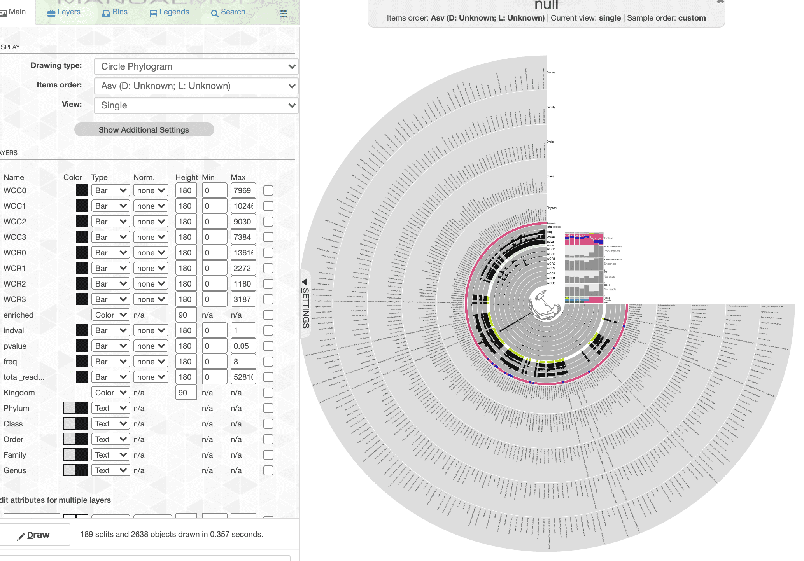
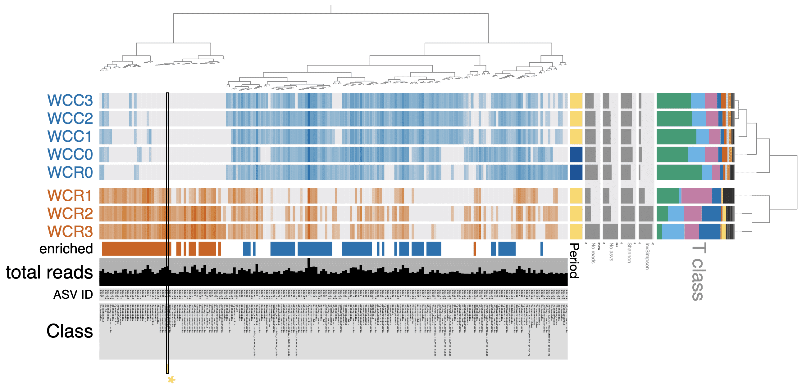

```{r setup, include=FALSE}
knitr::opts_chunk$set(echo = TRUE)
set.seed(0199)
library(phyloseq); packageVersion("phyloseq")
library(DT)
library(ggplot2)
library(Biostrings); packageVersion("Biostrings")
library(dplyr)
library(microbiome)
library(tidyverse)
library(data.table)
library(plyr)
library(stringr)
require(gdata)
library(labdsv)
library(reshape)


options(scipen=999)
knitr::opts_current$get(c(
  "cache",
  "cache.path",
  "cache.rebuild",
  "dependson",
  "autodep"
))
```

# Summary of Water Samples

Now that we have a phyloseq object containing the water samples only, we can summarize the data in the water phyloseq object. Again, we use the `summarize_phyloseq` from the [microbiome R package](https://github.com/microbiome/microbiome/)[@lahti2017microbiome] as we did before.

First, load the R objects that contain the sample data, sequence table, and taxonomy table (saved at the end of the previous section) and merge them into a single phyloseq object. Doing it this way keeps the memory footprint low.

```{r load_water}
remove(list = ls())
sample_d <- readRDS("rdata/16s-water/ps_water-sample.rds")
seqtab <- readRDS("rdata/16s-water/ps_water-seqtab.rds")
taxtab <- readRDS("rdata/16s-water/ps_water-taxtab.rds")
ps_water <- merge_phyloseq(sample_d, seqtab, taxtab)
ps_water_o <- ps_water
ps_water
```

Next, we can save copies of the sequence and taxonomy tables just in case we want a quick look at these data. 

```{r save_water_table}
write.table(tax_table(ps_water),
            "tables/16s-water/water_tax_table.txt", sep="\t",
            quote = FALSE, col.names=NA)
write.table(t(otu_table(ps_water)),
            "tables/16s-water/water_seq_table.txt", sep="\t",
            quote = FALSE, col.names=NA)
```

And generate a fasta file for all ASVs in the water samples. 

```{r export_fasta_water}
# Create fasta file from tax_table
table2format <- tax_table(ps_water)
#retain only the column with the sequences
table2format_trim <- table2format[, 7]
table2format_trim_df <- data.frame(row.names(table2format_trim),
                                   table2format_trim)
colnames(table2format_trim_df) <- c("ASV_ID", "ASV_SEQ")
#format fasta
table2format_trim_df$ASV_ID <- sub("ASV", ">ASV", table2format_trim_df$ASV_ID)

write.table(table2format_trim_df, "tables/16s-water/water_asv.fasta",
            sep = "\r", col.names = FALSE, row.names = FALSE,
            quote = FALSE, fileEncoding = "UTF-8")
```            

Let's go ahead and a sample variable called `oxstate` to the sample data frame of the water phyloseq object so we can compare the taxonomy of normoxic (Coral Caye) vs. hypoxic (Cayo Roldan) samples. Note one of the Cayo Roldan samples (WCR0) was collected after the hypoxic event when oxygen levels had returned to normal. Therefore WCR0 is considered a normoxic sample.

One last thing to do is to compare diversity across the two sites *before* and *after* the hypoxic event. For this we  add a sample variable called `period` denoting whether the sample was collected during or after the event.

```{r add_var_cats}
sample_data(ps_water)$oxstate <-
  c("normoxic", "normoxic", "normoxic", "normoxic",
    "normoxic", "hypoxic", "hypoxic", "hypoxic")
sample_data(ps_water)$period <-
  c("cc_after", "cc_during", "cc_during", "cc_during",
    "cr_after", "cr_during", "cr_during", "cr_during")
```

> The `ps_water` dataset contains `r ntaxa(ps_water)` ASVs, `r sum(otu_table(ps_water))` total reads, `r nsamples(ps_water)` samples, and `r length(sample_data(ps_water))` sample variables.

And here is a summary of just water data samples.

```{r calculate_stats_ps_water, echo=FALSE}
### Reads
min_read_ps_water <- min(readcount(ps_water))
max_read_ps_water <- max(readcount(ps_water))
total_reads_ps_water <- sum(readcount(ps_water))
mean_reads_ps_water <- round(mean(readcount(ps_water)), digits = 0)
median_reads_ps_water <- median(readcount(ps_water))

### ASVs
total_asvs_ps_water <- ntaxa(ps_water)
min_asvs_ps_water <- min(estimate_richness(
  ps_water, measures = "Observed"))
max_asvs_ps_water <- max(estimate_richness(
  ps_water, measures = "Observed"))
mean_asvs_ps_water <- formatC(mean(
  estimate_richness(ps_water,
                    measures = "Observed")$Observed),
  digits = 0, format = 'f')
median_asvs_ps_water <- median(
  estimate_richness(ps_water,
                    measures = "Observed")$Observed)
singleton_ps_water <- tryCatch(ntaxa(rare(ps_water,
                                         detection = 1,
                                         prevalence = 0)),
                              error=function(err) NA)
singleton_ps_water_perc <- tryCatch(round((100*(ntaxa(rare(ps_water,
                                                          detection = 1,
                                                          prevalence = 0)) /
                                   ntaxa(ps_water))), digits = 3),
                                   error=function(err) NA)
sparsity_ps_water <- round(length(which(abundances(ps_water) == 0))/length(abundances(ps_water)),
                     digits = 3)
```

| Metric                              | Results                                                                  |
|-------------------------------------|--------------------------------------------------------------------------|
| Min. number of reads                | `r min_read_ps_water`                                                    |
| Max. number of reads                | `r max_read_ps_water`                                                    |
| Total number of reads               | `r total_reads_ps_water`                                                 |
| Average number of reads             | `r mean_reads_ps_water`                                                  |
| Median number of reads              | `r median_reads_ps_water`                                                |
| Min. number of ASVs                 | `r min_asvs_ps_water`                                                    |
| Max. number of ASVs                 | `r max_asvs_ps_water`                                                    |
| Total number of ASVs                | `r total_asvs_ps_water`                                                  |
| Average number of ASVs              | `r mean_asvs_ps_water`                                                   |
| Median number of ASVs               | `r median_asvs_ps_water`                                                 |
| Sparsity                            | `r sparsity_ps_water`                                                    |
| Any ASVs sum to 1 or less?          | `r isTRUE(singleton_ps_water >= 1)`                                      |
| Number of singleton ASVs            | `r singleton_ps_water`                                                   |
| Percent of ASVs that are singletons | `r singleton_ps_water_perc`                                              |
| Number of sample variables are:     | `r length(sample_data(ps_water))`  (`r colnames(sample_data(ps_water))`) |

We can also generate a summary table of total reads & ASVs for each sample. You can sort the table or download a copy. Here is the code to generate the data for the table. First, we create data frames that hold total reads and ASVs for each sample. We can also do a quick calculation of alpha diversity using the Shannon and InvSimpson indices.

```{r sample_summary_table}
total_reads <- sample_sums(ps_water)
total_reads <- as.data.frame(total_reads, make.names = TRUE)
total_reads <- total_reads %>% rownames_to_column("Sample_ID")

total_asvs <- estimate_richness(ps_water,
                                measures = c(
                                  "Observed", "Shannon", "InvSimpson"))
total_asvs <- total_asvs %>% rownames_to_column("Sample_ID")
total_asvs$Sample_ID <- gsub('\\.', '-', total_asvs$Sample_ID)
```

And then we merge these two data frames with the sample data frame. We will use the `meta` command from the microbiome package to convert the `sample_data` to a data frame.

```{r sample_summary_table2}
sam_details <- meta(sample_data(ps_water))
rownames(sam_details) <- NULL

colnames(sam_details) <- c("Sample_ID", "Type", "Site", "Oxstate", "Period")

merge_tab <- merge(sam_details, total_reads, by = "Sample_ID")
merge_tab2 <- merge(merge_tab, total_asvs, by = "Sample_ID")
colnames(merge_tab2) <- c("Sample<br/>ID", "Type", "Site", "Oxstate", "Period",
    "total<br/>reads", "total<br/>ASVs", "Shannon", "InvSimpson")
```

<br/>

```{r sample_summary_table_display, layout="l-body-outset", echo=FALSE}
datatable(merge_tab2, width = "100%", escape = FALSE,
          rownames = FALSE,
          caption = htmltools::tags$caption(
            style = 'caption-side: bottom; text-align: left;',
            'Table: ', htmltools::em('Total reads & ASVs by sample.')),
          elementId = "mex738zeiysgiy3fysb8",
          extensions = 'Buttons', options = list(
            scrollX = TRUE,
            dom = 'Brti',
            buttons = c('copy', 'csv', 'excel'),
            pageLength = 8,
            lengthMenu = c(5, 10)
            )
          ) %>%
    formatRound(columns=c("Shannon", "InvSimpson"), digits=2) %>%
  formatStyle(columns = colnames(merge_tab2), fontSize = '80%')
```

# Diversity

## Taxonomic Diversity

Let's first take a look at the taxonomic diversity of the dataset. The code to generate this table is a little gross. 

#### 0. Rename *NA* taxonomic ranks

Phyloseq has an odd way of dealing with taxonomic ranks that have no value---in other words,  *NA* in the tax table. The first thing we are going to do before moving forward is to change all of the *NA* to have a value of the next highest classified rank. For example, `ASV5` is not classified at the Genus level but is at Family level (Saprospiraceae). So, we change the Genus name to *Family_Saprospiraceae*. The code for this is hidden here but comes from these two posts on the phyloseq GitHub, both by [MSMortensen](https://github.com/MSMortensen): issue [#850](https://github.com/joey711/phyloseq/issues/850#issuecomment-394771087) and issue [#990](https://github.com/joey711/phyloseq/issues/990#issuecomment-424618425). If you want to access the code chunk, check out the source code linked at the bottom of this page.

```{r tax_clean, echo=FALSE}
tax.clean <- data.frame(tax_table(ps_water))
for (i in 1:6){ tax.clean[,i] <- as.character(tax.clean[,i])}
tax.clean[is.na(tax.clean)] <- ""

for (i in 1:nrow(tax.clean)){
    if (tax.clean[i,2] == ""){
        kingdom <- paste("Kingdom_", tax.clean[i,1], sep = "")
        tax.clean[i, 2:6] <- kingdom
    } else if (tax.clean[i,3] == ""){
        phylum <- paste("Phylum_", tax.clean[i,2], sep = "")
        tax.clean[i, 3:6] <- phylum
    } else if (tax.clean[i,4] == ""){
        class <- paste("Class_", tax.clean[i,3], sep = "")
        tax.clean[i, 4:6] <- class
    } else if (tax.clean[i,5] == ""){
        order <- paste("Order_", tax.clean[i,4], sep = "")
        tax.clean[i, 5:6] <- order
    } else if (tax.clean[i,6] == ""){
        tax.clean$Genus[i] <- paste("Family",tax.clean$Family[i], sep = "_")
        }
}
tax_table(ps_water) <- as.matrix(tax.clean)
rank_names(ps_water)
rm(class, order, phylum, kingdom)
```

```{r, echo=FALSE}
write.table(tax_table(ps_water),
            "tables/16s-water/water_tax_table-no-na-names.txt", sep="\t",
            quote = FALSE, col.names=NA)
write.table(t(otu_table(ps_water)),
            "tables/16s-water/water_seq_table-no-na-names.txt", sep="\t",
            quote = FALSE, col.names=NA)
```


#### 1. Choose a rank

To make it easier to change the code later on, we can assign the taxonomic rank we are interested into a variable, in the case `TRANK`. 

```{r assign_rank}
TRANK <- "Class"
```

#### 2. Generate the ASV & reads table

```{r diversity_table_w1}
tax_asv <- table(tax_table(ps_water)[, TRANK], 
                 exclude = NULL, dnn = "Taxa")
tax_asv <- as.data.frame(tax_asv, make.names = TRUE, stringsAsFactors=FALSE)

tax_reads <- factor(tax_table(ps_water)[, TRANK])
tax_reads <- apply(otu_table(ps_water), MARGIN = 1, function(x)
{
    tapply(x, INDEX = tax_reads, FUN = sum, na.rm = TRUE, simplify = TRUE)
})
tax_reads <- as.data.frame(tax_reads, make.names = TRUE)
tax_reads <- cbind(tax_reads, reads = rowSums(tax_reads))
tax_reads <- tax_reads[9]
tax_reads <- setDT(tax_reads, keep.rownames = TRUE)[]
```

#### 3. Merge the two tables 

```{r diversity_table_w2}
taxa_read_asv_tab <- merge(tax_reads, tax_asv, by.x = "rn", by.y = "Taxa")
top_reads <- top_n(taxa_read_asv_tab, n = 8, wt = reads)
top_asvs <- top_n(taxa_read_asv_tab, n = 8, wt = Freq)

names(taxa_read_asv_tab) <- c("Taxa", "total reads", "total ASVs")
```

#### 4. Diversity table by `r TRANK` 

```{r diversity_table_w3, echo=FALSE}
datatable(
  taxa_read_asv_tab, rownames = FALSE, width = "100%",
  colnames = c("Taxa", "total reads", "total ASVs"),
  caption = htmltools::tags$caption(
    style = "caption-side: bottom; text-align: left;",
    "Total reads & ASVs by taxa" ),
  elementId = "9sgooxcmkzw565dtk7or",
  extensions = "Buttons",
  options = list(
    columnDefs = list(list(className = "dt-left", targets = 0)),
    dom = "Blfrtip",
    buttons = c("csv", "copy"),
    scrollX = TRUE, scrollCollapse = TRUE, scrollY=TRUE,
    pageLength = 5,
    scroller=TRUE, lengthMenu = c(5, 10, 25, 60)))

top_reads2 <- tibble::column_to_rownames(top_reads, var = "rn")
top_reads2 <- top_reads2[with(top_reads2, order(-reads)),]

top_asvs2 <- tibble::column_to_rownames(top_asvs, var = "rn")
top_asvs2 <- top_asvs2[with(top_asvs2, order(-Freq)),]
```

Here we can see that: 

* `r row.names(top_reads2)` contain the **most reads** and
* `r row.names(top_asvs2)` contain the **most ASVs**.

## Hypoxic vs. Normoxic 

How does the taxonomic composition of  normoxic compare to hypoxic samples? To look at this, we will combine samples by the `oxstate` variable and then calculate the *relative abundance* for each taxon for both oxygen states. Note one of the Cayo Roldan samples (WCR0) was collected after the hypoxic event when oxygen levels had returned to normal. Therefore, WCR0 is considered a normoxic sample.

There are a few steps we need to run for this analysis. 

#### 1. Choose a rank

Again, we can select a rank.

```{r assign_rank2}
TRANK <- "Class"
```

#### 2. Calculate the averages & merge samples by oxstate

```{r calc_avg2, warning=FALSE}
ps_water_AVG <- transform_sample_counts(ps_water, function(x) x/sum(x))
ps_water_ox <- merge_samples(ps_water, "oxstate")
SD_BAR_w <- merge_samples(sample_data(ps_water_AVG), "oxstate")
```

#### 3. Merge taxa by rank

We will set a variable for the taxonomic rank of choice. If you want to choose a different rank, be sure to change
the variable assignment.

```{r calc_avg3, warning=FALSE}
mdata_phy_w <- tax_glom(ps_water_ox, taxrank = TRANK, NArm = FALSE)
mdata_phyrel_w <- transform_sample_counts(mdata_phy_w, function(x) x/sum(x))
meltd_w <- psmelt(mdata_phyrel_w)
meltd_w[[TRANK]] <- as.character(meltd_w[[TRANK]])
```

#### 4. Calculate the total relative abundance for all taxa

```{r calc_avg4, warning=FALSE}
means_w <- ddply(meltd_w, ~get(TRANK), function(x) c(mean = mean(x$Abundance)))
colnames(means_w) <- c(TRANK, "mean")
means_w$mean <- round(means_w$mean, digits = 5)
taxa_means_w <- means_w[order(-means_w$mean), ]  # this orders in decending fashion
taxa_means_w <- format(taxa_means_w, scientific = FALSE)  # ditch the sci notation
```

#### 5. Relative abundance by `r TRANK` 

```{r calc_avg5, warning=FALSE}
datatable(
  taxa_means_w, rownames = FALSE, width = "100%",
  colnames = c(TRANK, "mean"),
  caption = htmltools::tags$caption(
    style = "caption-side: bottom; text-align: left;",
    "Relative abundance by taxonomic rank. "),
  elementId = "t9xg4oo3fbjqjqu1ogjm",
  extensions = "Buttons",
  options = list(columnDefs = list(list(
    className = "dt-left", targets = "_all")),
    dom = "Blfrtip", buttons = c("csv", "copy"),
    scrollX = TRUE, scrollCollapse = TRUE, scrollY=TRUE,
    pageLength = 8,
    scroller=TRUE, lengthMenu = c(10, 25, 60)))
```

#### 6. Group taxa into 'Other'

Time to group low abundance taxa into an *Other* category for the bar graph. Since we cannot possibly display all `r nrow(means_w)` different taxa in one figure, we need to collapse the low abundance groups.  

```{r calc_avg6, warning=FALSE}
TAXAN <- 8
top_perc_w <- top_n(taxa_means_w, n = TAXAN, wt = mean)
top_perc_w$mean <- round(as.numeric(top_perc_w$mean), digits = 5)
min_top_perc_w <- round(as.numeric(min(top_perc_w$mean)), digits = 5)
top_perc_w_list <- top_perc_w[,1]
```

Here we decided to look at the abundance of the top `r TAXAN`, which sets a relative abundance cutoff at `r min_top_perc_w`. Anything lower than `r min_top_perc_w` will be grouped into *Other*.

```{r make_other_n_v_h}
Other_w <- means_w[means_w$mean < min_top_perc_w, ][[TRANK]]
meltd_w[meltd_w[[TRANK]] %in% Other_w, ][[TRANK]] <- "Other"
samp_names_w <- aggregate(meltd_w$Abundance, by = list(meltd_w$Sample), FUN = sum)[, 1]
.e_w <- environment()
meltd_w[, TRANK] <- factor(meltd_w[, TRANK], sort(unique(meltd_w[, TRANK])))
meltd_w1 <- meltd_w[order(meltd_w[, TRANK]), ]

target <- c("Cyanobacteriia", "Alphaproteobacteria", 
            "Bacteroidia", "Gammaproteobacteria", 
            "Thermoplasmata", "Phylum_Marinimicrobia_(SAR406_clade)", 
            "Acidimicrobiia", "Campylobacteria", "Other")
meltd_w1[[TRANK]] <- reorder.factor(meltd_w1[[TRANK]], new.order=target)
```

#### 7. Construct a bar graph

Finally.

```{r make_fig_n_v_h, echo=FALSE}
family_pal <- c("#009E73", #1
                "#56B4E9", #2
                "#CC79A7", #3
                "#0072B2", #4
                "#D55E00", #5
                "#B6DBFF", #6
                "#E69F00", #7
                "#F0E442", #8
                "#323232", #9
                "#7F7F7F")

fig_w <- ggplot(meltd_w1, 
         aes_string(x = "Sample", y = "Abundance", 
                    fill = TRANK, show.legend = FALSE),
         ordered = TRUE, xlab = "x-axis label", ylab = "y-axis label")

fig_w <- fig_w + geom_bar(stat = "identity",
                 position = position_stack(reverse = TRUE),
                 width = 0.95) + coord_flip() +
                 theme(aspect.ratio = 1/4) + theme(legend.position = "bottom")
fig_w <- fig_w + scale_fill_manual(values = family_pal)
fig_w <- fig_w + labs(x = "Environment", 
                      y = "Relative abundance (% total reads)")

fig_w <- fig_w + theme(plot.margin = margin(0, 0.1, 0, 0.1, unit = "cm")) + 
  theme(axis.text.x = element_text(angle = 0, hjust = 0.45, vjust = 1)) + 
  theme(legend.key = element_rect(colour = "black"))

fig_w <- fig_w + guides(
  fill = guide_legend(override.aes = list(colour = NULL), 
                      reverse = FALSE, 
                      title.position = "top", nrow = 3))

fig_w <- fig_w + theme(axis.line = element_line(colour = "black"),
                 panel.grid.major = element_blank(),
                 panel.grid.minor = element_blank(),
                 panel.border = element_rect(colour = "black", 
                                             fill = NA, size = 1)) 
fig_w 
#ggsave("oxstate_by_taxa.png")
#invisible(dev.off())
```

We can also look at this in tabular format. To accomplish the task, we use the `aggregate` command to group abundance values by oxygen state *and* taxonomic group.

```{r hyp_v_norm_agg}
hyp_v_norm <- aggregate(meltd_w1$Abundance, 
                 by = list(Rank = meltd_w1[[TRANK]], 
                           Sample = meltd_w1$Sample), 
                 FUN = sum)
hyp_v_norm$x <- round(hyp_v_norm$x, digits = 4)
hyp_v_norm <- spread(hyp_v_norm, Sample, x)
```

```{r sample_summary_table_display2, echo=FALSE}
datatable(hyp_v_norm, width = "100%", escape = FALSE,
          rownames = FALSE,
          caption = htmltools::tags$caption(
            style = 'caption-side: bottom; text-align: left;',
            'Table: ', htmltools::em('Relative abundance (reads) of normoxic 
                                     vs hypoxic samples by dominant taxa.')),
          elementId = "wewuidn73q2ceico4vyw",
          extensions = 'Buttons', options = list(
            scrollX = TRUE,
            dom = 'Brti',
            buttons = c('copy', 'csv', 'excel'),
            pageLength = 9
            )
          ) #%>%
#    formatRound(columns=c("Shannon", "InvSimpson"), digits=2) %>%
#  formatStyle(columns = colnames(merge_tab2), fontSize = '80%')
```
</br>

## During vs. After the event 

What did taxonomic composition look like during and after the event at **each site**? To look at this, we will combine samples by the `period` variable and then calculate the *relative abundance* for each taxon. The code for this analysis is basically the same as the code above where we compared hypoxic to normoxic samples. Therefore, all of the code is hidden. See the link at the bottom of the page for the page source code if you are interested in the code we used here. We go through the same steps:

```{r assign_rankB, echo=FALSE}
TRANK <- "Class"
```

1) Choose a rank.
2) Merge samples by period.
3) Merge taxa by rank.
4) Calculate the total relative abundance for all taxa.
5) Relative abundance by `r TRANK`. *Values are slightly different because averaging across a different grouping*.
6) Group taxa into 'Other'.
7) Construct a bar graph.

<br/>

```{r calc_avg2B, warning=FALSE, echo=FALSE}
ps_water_tm <- merge_samples(ps_water, "period")
SD_BAR_tm <- merge_samples(sample_data(ps_water_AVG), "period")
```

```{r calc_avg3B, warning=FALSE, echo=FALSE}
mdata_phy_tm <- tax_glom(ps_water_tm, taxrank = TRANK, NArm = FALSE)
mdata_phyrel_tm <- transform_sample_counts(mdata_phy_tm, function(x) x/sum(x))
meltd_tm <- psmelt(mdata_phyrel_tm)
meltd_tm[[TRANK]] <- as.character(meltd_tm[[TRANK]])
```


```{r calc_avg4B, warning=FALSE, echo=FALSE}
means_tm <- ddply(meltd_tm, ~get(TRANK), function(x) c(mean = mean(x$Abundance)))
colnames(means_tm) <- c(TRANK, "mean")
means_tm$mean <- round(means_tm$mean, digits = 5)
taxa_means_tm <- means_tm[order(-means_tm$mean), ]  # this orders in decending fashion
taxa_means_tm <- format(taxa_means_tm, scientific = FALSE)  # ditch the sci notation
```

```{r calc_avg5B, warning=FALSE, echo=FALSE}
datatable(
  taxa_means_tm, rownames = FALSE, width = "100%",
  colnames = c(TRANK, "mean"),
  caption = htmltools::tags$caption(
    style = "caption-side: bottom; text-align: left;",
    "Relative abundance by taxonomic rank. "),
  elementId = "zswbg7x7f8eqj526xuox",
  extensions = "Buttons",
  options = list(columnDefs = list(list(
    className = "dt-left", targets = "_all")),
    dom = "Blfrtip", buttons = c("csv", "copy"),
    scrollX = TRUE, scrollCollapse = TRUE, scrollY=TRUE,
    pageLength = 9,
    scroller=TRUE, lengthMenu = c(9, 25, 60)))
```

Again, Time to group low abundance taxa into an *Other* category for the bar graph. Since we cannot possibly display all `r nrow(means_tm)` different taxa in one figure, we need to collapse the low abundance groups.  

```{r calc_avg6B, warning=FALSE, echo=FALSE}
TAXAN <- 8
top_perc_tm <- top_n(taxa_means_tm, n = TAXAN, wt = mean)
top_perc_tm$mean <- round(as.numeric(top_perc_tm$mean), digits = 5)
min_top_perc_tm <- round(as.numeric(min(top_perc_tm$mean)), digits = 5)
top_perc_tm_list <- top_perc_tm[,1]
```

```{r make_other_d_v_a, echo=FALSE}
Other_tm <- means_tm[means_tm$mean < min_top_perc_tm, ][[TRANK]]
meltd_tm[meltd_tm[[TRANK]] %in% Other_tm, ][[TRANK]] <- "Other"
samp_names_tm <- aggregate(meltd_tm$Abundance, by = list(meltd_tm$Sample), FUN = sum)[, 1]
.e_tm <- environment()
meltd_tm[, TRANK] <- factor(meltd_tm[, TRANK], sort(unique(meltd_tm[, TRANK])))
meltd_tm1 <- meltd_tm[order(meltd_tm[, TRANK]), ]

target <- c("Cyanobacteriia", "Alphaproteobacteria", 
            "Bacteroidia", "Gammaproteobacteria", 
            "Thermoplasmata", "Phylum_Marinimicrobia_(SAR406_clade)", 
            "Acidimicrobiia", "Campylobacteria", "Other")
meltd_tm1[[TRANK]] <- reorder.factor(meltd_tm1[[TRANK]], new.order=target)
```

```{r make_fig_d_v_a, echo=FALSE, layout="l-body-outset"}
family_pal <- c("#009E73", #1
                "#56B4E9", #2
                "#CC79A7", #3
                "#0072B2", #4
                "#D55E00", #5
                "#B6DBFF", #6
                "#E69F00", #7
                "#F0E442", #8
                "#323232", #9
                "#7F7F7F")

fig_tm <- ggplot(meltd_tm1, 
         aes_string(x = "Sample", y = "Abundance", 
                    fill = TRANK, show.legend = FALSE),
         ordered = TRUE, xlab = "x-axis label", ylab = "y-axis label")

fig_tm <- fig_tm + geom_bar(stat = "identity",
                 position = position_stack(reverse = TRUE),
                 width = 0.95) + coord_flip() +
                 theme(aspect.ratio = 1/4) + theme(legend.position = "bottom")
fig_tm <- fig_tm + scale_fill_manual(values = family_pal)

fig_tm <- fig_tm + labs(x = "Environment", 
                      y = "Relative abundance (% total reads)", 
                      title = "Abundance of taxa before & after event")

fig_tm <- fig_tm + theme(plot.margin = margin(0, 0.1, 0, 0.1, unit = "cm")) + 
  theme(axis.text.x = element_text(angle = 0, hjust = 0.45, vjust = 1)) + 
  theme(legend.key = element_rect(colour = "black"))

fig_tm <- fig_tm + guides(
  fill = guide_legend(override.aes = list(colour = NULL), 
                      reverse = FALSE, 
                      title.position = "top", nrow = 3))

fig_tm <- fig_tm + theme(axis.line = element_line(colour = "black"),
                 panel.grid.major = element_blank(),
                 panel.grid.minor = element_blank(),
                 panel.border = element_rect(colour = "black", 
                                             fill = NA, size = 1)) 
fig_tm 
#ggsave("period_by_taxa.png")
#invisible(dev.off())
```

```{r before_v_after1, echo=FALSE}
before_v_after <- aggregate(meltd_tm1$Abundance, 
                 by = list(Rank = meltd_tm1[[TRANK]], 
                           Sample = meltd_tm1$Sample), 
                 FUN = sum)
before_v_after$x <- round(before_v_after$x, digits = 4)
before_v_after <- spread(before_v_after, Sample, x)
```

```{r before_v_after2, echo=FALSE}
datatable(before_v_after, width = "100%", escape = FALSE,
          rownames = FALSE, colnames = c("Crawl Caye (after)", 
                                         "Crawl Caye (during)", 
                                         "Cayo Roldan (after)", 
                                         "Cayo Roldan (during)"), 
          caption = htmltools::tags$caption(
            style = 'caption-side: bottom; text-align: left;',
            'Table: ', htmltools::em('Relative abundance (reads) of normoxic 
                                     vs hypoxic samples by dominant taxa.')),
          elementId = "kqtr8k9xeqyk0sb1s4h4",
          extensions = 'Buttons', options = list(
            scrollX = TRUE,
            dom = 'Brti',
            buttons = c('copy', 'csv', 'excel'),
            pageLength = 9
            )
          ) #%>%
#    formatRound(columns=c("Shannon", "InvSimpson"), digits=2) %>%
#  formatStyle(columns = colnames(merge_tab2), fontSize = '80%')
```
</br>

# Differentially Abundant ASVs

Time to drill down a little deeper and look at differentially abundant (DA) ASVs between the two oxygen conditions. DETAILS ON METHOD. 

```{r idval_analysis, results='hide'}
set.seed(119)
#rm(class, order, phylum, kingdom)
#ls(all.names = TRUE)
water_seq_table <- data.frame(otu_table(ps_water))
# Delete columns when sum == 0 Should not be anuy
water_seq_table <- water_seq_table[, which(colSums(water_seq_table) != 0)]

water_seq_table <- cbind(oxstate = c("normoxic","normoxic",
                                     "normoxic","normoxic",
                                     "normoxic","hypoxic",
                                     "hypoxic","hypoxic"), 
                            water_seq_table)

iva <- indval(water_seq_table[,-1], water_seq_table[,1])
gr <- iva$maxcls[iva$pval <= 0.05]
iv <- iva$indcls[iva$pval <= 0.05]
pv <- iva$pval[iva$pval <= 0.05]
fr <- apply(water_seq_table[,-1] > 0, 2, sum)[iva$pval <= 0.05]
indvalsummary <- data.frame(group=gr, indval=iv, pvalue=pv, freq=fr)
indvalsummary <- indvalsummary[order(indvalsummary$group, 
                                     -indvalsummary$indval),]
water_tax_table <- data.frame(tax_table(ps_water))
indvalsummary_tax <- merge(indvalsummary, water_tax_table, 
                           by = "row.names", 
                           all = TRUE)
indvalsummary_tax <- indvalsummary_tax[!(is.na(indvalsummary_tax$group)),]

lapply(indvalsummary_tax, class)
class(indvalsummary_tax$group) = "character"
indvalsummary_tax$group <- ifelse(indvalsummary_tax$group == "1", 
                                  as.character("hypoxic"), 
                                  as.character("normoxic"))
```

Now we can save a few files and display the data. 

```{r idval_tables, echo=FALSE}
water_seq_table_t <- water_seq_table
water_seq_table_t[,1] <- NULL
water_seq_table_t <- as.data.frame(t(water_seq_table_t))
water_seq_table_t$reads <- rowSums(water_seq_table_t)
water_seq_table_t$norm <- rowSums(water_seq_table_t[1:5])
water_seq_table_t$hypo <- rowSums(water_seq_table_t[6:8])
water_seq_table_t[1:8] <- NULL
water_seq_table_t <- tibble::rownames_to_column(water_seq_table_t, "ASV") 

names(indvalsummary_tax)[1] <- "ASV"
full_indval_sum <- merge(water_seq_table_t, indvalsummary_tax, 
                           by = "ASV", 
                           all = FALSE)

indvalsummary <- tibble::rownames_to_column(indvalsummary, "ASV") 
write.table(full_indval_sum, "tables/16s-water/indval_tax.txt", 
            row.names = FALSE, sep = "\t", quote = FALSE)
write.table(indvalsummary, "tables/16s-water/indval_summary.txt", 
            row.names = FALSE, sep = "\t", quote = FALSE)
```

<br/>

```{r scg_tax, echo=FALSE, layout="l-page"}
full_indval_sum_noseq <- full_indval_sum
full_indval_sum_noseq[,c(15:16)] <- NULL
datatable(colnames = c("ASV", "reads", "norm", "hypo", 
                       "group", "indval", "pval", "freq", 
                       "Kingdom", "Phylum", "Class", "Order", 
                       "Family", "Genus"),
  full_indval_sum_noseq, rownames = FALSE, autoHideNavigation = TRUE, 
  width = "100%", elementId = "twykw9v4dzmp1lymga92",
  caption = htmltools::tags$caption(
    style = "caption-side: bottom; text-align: left;",
    "Differentially Abundant ASVs assessed by 
    Indicator Species Analysis (ISA)."),
  extensions = c("Buttons", "FixedColumns"),
  options = list(autoWidth = TRUE,
    columnDefs = list(list(className = "dt-left", targets = 0)),
    dom = "Blfrtip",
    buttons = list(list(
        extend = 'collection',
        buttons = c('csv', 'excel', 'copy'),
        text = 'Download')),
    pageLength = 10, lengthMenu = c(5, 10, 50, 160), 
    scrollX = TRUE, scrollCollapse = FALSE, scrollY=FALSE, paging=TRUE,
    fixedColumns = list(leftColumns = 1, rightColumns = 0))) %>%
    formatRound(columns=c("indval", "pvalue"), digits = 3) %>%
  formatStyle(columns = colnames(full_indval_sum_noseq), fontSize = '80%')
```

```{r export_da_fasta, echo=FALSE}
# Create fasta file from tax_table
table2format2 <- full_indval_sum
table2format2 <- table2format2[table2format2$reads >= 100 ,]
#retain only the column with the sequences
table2format_trim2 <- table2format2[, 16:15]
#format fasta
table2format_trim2$ASV_ID <- sub("ASV", ">ASV", table2format_trim2$ASV_ID)
write.table(table2format_trim2, "files/16s-water/idval_asv.fasta",
            sep = "\n", col.names = FALSE, row.names = FALSE,
            quote = FALSE, fileEncoding = "UTF-8")
```            

```{r, echo=FALSE}
full_tally <- table(indvalsummary_tax$group)
trim_tally <- table(table2format2$group)
```

Now. What do we get from all of this? Well, we started with `r ntaxa(ps_water)` and ran Indicator Species Analysis (ISA) to see if we could identify Differentially Abundant (DA) ASVs between the normoxic and hypoxic conditions. ISA found `r length(indvalsummary_tax[,1])` ASVs that were DA between the two, specifically `r full_tally[["normoxic"]][1]` ASVs enriched in the normoxic samples and `r full_tally[["hypoxic"]][1]` in the hypoxic. If we consider only ASVs with more than 100 total reads we get `r trim_tally[["normoxic"]][1]` normoxic ASVs and `r trim_tally[["hypoxic"]][1]` hypoxic ASVs. 

<br>

> You can download a fasta file of DA ASVs (> 100 total reads) determined using ISA by [clicking on this link](files/16s-water/idval_asv.fasta). 

# Visualizing DA ASVs in Anvi'o

Next, we will combine the results of the ISA analysis with the distribution of ASVs across each sample. We are going to do the analysis in anvi'o[@eren2015anvi] using the `anvi-interactive` command. Anvi'o likes database but it also understands that sometimes you don't have a database. So it offers a *manual mode* for all of us slackers out there. If you type this command you can have a look at the relevant pieces we need for the visualization, specifically those under the headings `MANUAL INPUTS` and `ADDITIONAL STUFF`. I will go through these out of order so try to keep up ;)

```bash
anvi-interactive -h
```

```
MANUAL INPUTS:
  Mandatory input parameters to start the interactive interface without
  anvi'o databases.

--manual-mode           We need this flag to run anvi'o in an ad hoc 
                        manner, i.e., no database. 
-f FASTA, --fasta-file FASTA
                        A FASTA-formatted input file. This is sort of 
                        optional
-d VIEW_DATA, --view-data VIEW_DATA
                        A TAB-delimited file for view data. This is the ASV
                        by sample matrix. We need this
-t NEWICK, --tree NEWICK
                        NEWICK formatted tree structure. How the ASVs are 
                        ordered in our case. 
ADDITIONAL STUFF:
  Parameters to provide additional layers, views, or layer data.

-V ADDITIONAL_VIEW, --additional-view ADDITIONAL_VIEW
                        A TAB-delimited file for an additional view to be used
                        in the interface. This file should contain all split
                        names, and values for each of them in all samples.
                        Each column in this file must correspond to a sample
                        name. Content of this file will be called 'user_view',
                        which will be available as a new item in the 'views'
                        combo box in the interface
-A ADDITIONAL_LAYERS, --additional-layers ADDITIONAL_LAYERS
                        A TAB-delimited file for additional layer info. In
                        our case this is info about each ASV. The first column 
                        of the file must be the ASV names, and
                        the remaining columns should be unique attributes.                       
```

There are also a few files we generate that cannot be loaded directly.  So, in addition to the files that can be *loaded* when running the interactive, we also have files that must be *added* to the database created by anvi'o.

## Creating Input Files

Here is a nice tutorial on [Working with anvi'o additional data tables](http://merenlab.org/2017/12/11/additional-data-tables/). A lot of what we need is covered in this tutorial. To get the most out the visualization we need to create a few files to give anvi'o when we fire up the interactive interface. 

1) View data: in our case, a sample by ASV abundance matrix.
2) Additional info about each ASV. 
3) Additional info about each sample.
4) Taxa abundance data for each sample at some rank.
5) Dendrograms ordering the ASVs and samples (based on view data).
6) Fasta file of all ASVs in the analysis.

### 1. View data

Let's start with the `-d` or `--view-data` file. This file needs to be an ASV by sample matrix of read counts. To simplify the visualization, we will use ASVs represented by 100 or more total reads. 

```{r}
ps_water_100 <- prune_taxa(taxa_sums(ps_water) > 100, ps_water)
ps_water_100
```

Looks like this are `r ntaxa(ps_water_100)` total ASVs. We know from the ISA analysis above that `r nrow(table2format2)` ASVs were differentially abundant between the two groups so there will be `r ntaxa(ps_water_100) - nrow(table2format2)` ASVs in our graph that showed no difference. 

```{r, eval=FALSE}
data_tab <- as.data.frame(t(otu_table(ps_water_100)))
data_tab <- data_tab %>% rownames_to_column("Group")
write.table(data_tab, "16s-anvio/data.txt", sep = "\t", 
            quote = FALSE, row.names = FALSE)
```

<aside>
**Loaded** with  `anvi-interactive` command & `--view-data` flag.
</aside>

### 2. Additional Layers for ASVs

Next, we need some additional data **about the ASVs** to overlay on the visual. This can be anything however what I specifically want are the details of the ISA analysis, total reads, and lineage info. I warn you; this code will get ugly and I urge you to find a better way. 

<aside>
**Loaded** with `anvi-interactive` command & `--additional-layers` flag.
</aside>

Start with an ASV + lineage table for the ASVs in the `ps_water_100` phyloseq object. 

```{r, eval=FALSE}
data_tab2 <- as.data.frame(t(otu_table(ps_water_100)))
total_reads2 <- cbind(data_tab2, total_reads = rowSums(data_tab2))
total_reads2[1:8] <- NULL
tax_tab2 <- as.data.frame(tax_table(ps_water_100))
tax_tab2[7] <- NULL
total_reads2 <- tibble::rownames_to_column(total_reads2, "Group") 
tax_tab2 <- tibble::rownames_to_column(tax_tab2, "Group") 

merge_tabX <- merge(total_reads2, tax_tab2, 
                           by = "Group", 
                           all = TRUE)
drop_c <- c("reads", "norm", "hypo", "Kingdom", 
            "Phylum", "Class", "Order", "Family", "Genus")
idval2 <- full_indval_sum_noseq[ , !(names(full_indval_sum_noseq) %in% drop_c)]
colnames(idval2)[1:2] <- c("Group", "enriched")

additional_layers <- merge(idval2, merge_tabX,  
                           by = "Group", 
                           all.y = TRUE)
write.table(additional_layers, "16s-anvio/additional_layers.txt", 
            sep = "\t", quote = FALSE, row.names = FALSE, na = "")
```


### 3. Additional Views for Samples

Now I want some general data **about the samples** to overlay on the visual. Again, this can be anything. How about a table of alpha diversity metrics? We actually have such a table that was generated way back up the road. Just need to fix the column names.

<aside>
**Added** to  profile.db with  `anvi-import-misc-data` command &  `--target-data-table layers` flag.
</aside>

```{r, eval=FALSE}
additional_view <- merge_tab2
additional_view[2] <- NULL
colnames(additional_view) <- c("id", "site", "oxstate", "period", "no_reads",
    "no_asvs", "Shannon", "InvSimpson")
write.table(additional_view, "16s-anvio/additional_views.txt", 
            sep = "\t", quote = FALSE, row.names = FALSE, na = "")
```

### 4. Taxon rank abundance by sample

Turned out this was a little tricky to figure out, but thanks to this [little nifty block of code](https://github.com/joey711/phyloseq/issues/418#issuecomment-262637034) written by [guoyanzhao](https://github.com/guoyanzhao) on the phyloseq Issues forum, it was a piece of cake. The code can be altered to take any rank. See the post for an explanation. 

Anyway, the goal is to sum each taxon at sum rank and present that as a bar chart for each sample in the visualization. Anvi'o has a specific format it needs where each row is a sample and each column is a taxon. Taxa names need the prefix `t_<RANK>!`. For example, `t_class!` should be added for Class rank. 

<aside>
**Added** to  profile.db with    `anvi-import-misc-data` command &   `--target-data-table layers` flag.
</aside>

```{r, eval=FALSE}
# Make the table
anvio_taxa <- ps_water
glom_rank <- tax_glom(anvio_taxa, taxrank = 'Class')
melt_rank <- psmelt(glom_rank)
melt_rank$Class <- as.character(melt_rank$Class)
rank_abundance <- aggregate(Abundance~Sample+Class, melt_rank, FUN = sum)
rank_abundance <- as.data.frame(cast(rank_abundance, Sample ~ Class))
#rank_abundance <- as.data.frame(rank_abundance)
rank_abundance <- tibble::remove_rownames(rank_abundance)
rank_abundance <- tibble::column_to_rownames(rank_abundance, "Sample")

# Reorder table column by summ
layers <- rank_abundance[,names(sort(colSums(rank_abundance), decreasing = TRUE))]

# Add the prefix
layers <- layers %>% dplyr::rename_all(function(x) paste0("t_class!", x))
layers <- tibble::rownames_to_column (layers, "taxon")

# save the table
write.table(layers, "16s-anvio/tax_layers.txt", 
            sep = "\t", quote = FALSE, row.names = FALSE, na = "")
```

### 5. Construct Dendrograms

The last piece we need is to generate dendrograms that order the ASVs by their distribution in the samples and the samples by their ASV composition. For this task we will use anvi'o.

```bash
anvi-matrix-to-newick data.txt --distance euclidean \
                               --linkage ward \
                               -o asv.tre 
anvi-matrix-to-newick data.txt --distance euclidean \
                               --linkage ward \
                               -o sample.tre \
                               --transpose
```

The first command reads the view data we generated above and uses Euclidean distance and Ward linkage for hierarchical clustering of the ASVs. The second command transposes the view data table and then does the same for the samples. There are many distance metrics and linkage methods available.  Boom.

<aside>
The file `asv.tre` is **loaded** with  `anvi-interactive` command & `--tree` flag.
</aside>

The ASV tree is fine as is, but the sample tree needs a [special format](http://merenlab.org/2017/12/11/additional-data-tables/#layer-orders-additional-data-table). Specifically, the tree needs to be in a three column, tab delimited,  *table*. This way you can add multiple orderings to the same file and view them all in the interactive. The table needs to be in this format:

| item_name	| data_type	| data_value                                          | 
|-----------|-----------|-----------------------------------------------------|
| tree_1  	| newick	  | ((WCR0:0.0793043,(WCC0:0.0431881,(WCC1:0.0301642,.. | 
| tree_2  	| newick	  | (WCR1:0.142825,(WCR2:0.0466953,WCR3:0.0466953),...  |
| (…)	      | (…)	      | (…)                                                 | 

This is easy to do by hand, but I *really* need the practice so I will do it in R. Anvi'o is very particular about formatting. For example, if this file ends with a blank line, which it will because when anvi'o made the initial dendrogram it add a new line. We need to get rid of that or we get an error when trying to import the table.

<aside>
The file `sample.tre` is **added** to the profile.db with  `anvi-import-misc-data` command &   `--target-data-table layer_orders` flag.
</aside>

```{r, eval=FALSE}
sam_tree <- read_file("16s-anvio/sample.tre")
sam_tree <- gsub("[\r\n]", "", sam_tree)
item_name <- c("euc_ward")
data_type <- c("newick")
data_value <- c(sam_tree)
sam_tre_tab <- data.frame(item_name, data_type, data_value)
library(janitor)
sam_tre_tab %>% remove_empty("rows")
write.table(sam_tre_tab, "16s-anvio/sample_tree_tab.txt", 
            sep = "\t", quote = FALSE, row.names = FALSE, na = "")
```

### 6. Make a fasta file

We don't need to add a fasta file, but it is a nice way to keep everything in one place. Plus, you can do BLAST searches directly in the interface by right clicking on the ASV of interest, so it is nice to have the sequences. 

<aside>
**Loaded** with `anvi-interactive` command &  `--fasta-file` flag.
</aside>

```{r export_fasta_anvio, eval=FALSE}
# Create fasta file from tax_table
anvio_tab <- tax_table(ps_water_100)
#retain only the column with the sequences
anvio_tab_trim <- anvio_tab[, 7]
anvio_tab_trim_df <- data.frame(row.names(anvio_tab_trim),
                                   anvio_tab_trim)
colnames(anvio_tab_trim_df) <- c("ASV_ID", "ASV_SEQ")
#format fasta
anvio_tab_trim_df$ASV_ID <- sub("ASV", ">ASV", anvio_tab_trim_df$ASV_ID)

write.table(anvio_tab_trim_df, "16s-anvio/anvio.fasta",
            sep = "\r", col.names = FALSE, row.names = FALSE,
            quote = FALSE, fileEncoding = "UTF-8")
```            

## Building the Profile Database

Time to put all of these pieces together. This gets a little tricky since we do not have a database to start with because some of these files can be loaded directly in the interface but some need to be added to a database. When we fire up the interactive in `--manual` mode, we ***must*** give anvi'o the name of a database and it will *create* that database for us. Then we can shut down the interactive, add the necessary data files, and start back up. 

```bash
anvi-interactive --view-data data.txt \
                 --tree asv.tre \
                 --additional-layers additional_layers.txt \
                 --profile-db profile.db \
                 --manual
```

Now we have a new profile database that we can add the sample metadata (`additional_layers.txt`) and the sample dendrogram (sample.tre) using the command `anvi-import-misc-data`. These commands add the table to the new `profile.db`. First, kill the interactive.

```bash
anvi-import-misc-data additional_views.txt \
                      --pan-or-profile-db profile.db \
                      --target-data-table layers
anvi-import-misc-data sample_tree_tab.txt \
                      --pan-or-profile-db profile.db \
                      --target-data-table layer_orders
```

One last this is to get the table with the taxonomy total by sample (`tax_layers.txt`) into the profile database. We will run the same command we just used. 

```bash
anvi-import-misc-data tax_layers.txt \
                      --pan-or-profile-db profile.db \
                      --target-data-table layers
```

In fact, we could just as easily append the taxonomy total data onto the `additional_layers.txt` and import in one command. But we didn't. 

## Interactive Interface

With a populated database in hand, we can now begin modifying the visual by running the interactive command again. 

```bash
anvi-interactive --view-data data.txt \
                 --tree asv.tre \
                 --additional-layers additional_layers.txt \
                 --profile-db profile.db 
                 --fasta-file anvio.fasta \
                 --manual
```

```{r, echo=FALSE, warning=FALSE, fig.height=2}

```


Remember, we added a lot of data, so the tree looks crazy when you first open the interactive. This is the interactive part of the process where we select the data we want to display and how we want to display it. 

Now have a look after some changing the way everything looks. It is not possible to go through all the steps here, but it didn't take very long.

```{r, echo=FALSE, layout="l-page", warning=FALSE, fig.height=3}

```

*Hopefully* you agree that this is a near publication quality figure. Obviously some tweaking still left to do but most of it can be done in anvi'o.

One final thing I like to do is save a *state* file. After you set everything the way you want it you can hit the **Save State** button, which will store your settings in the database. That way you have a backup text file should something bad happen to the profile database.

```bash
anvi-export-state --pan-or-profile-db profile.db 
                  --state default 
                  --output-file states.json
```

All files generated for this analysis [can be found here](16s-anvio/). You should only need to run the command above and the final figure should pop up in your browser.  

And that's it for the 16S rRNA part of the workflow. Next, we get into metagenomics. 

<br>

<div class="post-nav">
<div class="post-nav-item">
<div class="meta-nav">Previous</div>
<a href="16s-diversity.html" rel="next">N<sup><u>o</u></sup> 2. Data Preparation</a>
</div>
</div>

<div class="post-nav">
<div class="post-nav-item">
<div class="meta-nav">Next</div>PROCEED to METAGENOMIC WORKFLOW<br/>
<a href="mg-setup.html" rel="prev">N<sup><u>o</u></sup> 1. Setup Working Environment</a>
</div>
</div>

## Source Code {.appendix}


The source code for this page can be accessed on GitHub by [clicking this link](https://github.com/hypocolypse/web/blob/master/16s-water.Rmd).
