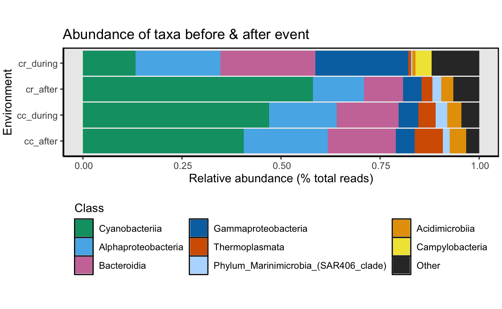

```{r setup, include=FALSE}
knitr::opts_chunk$set(echo = TRUE)
set.seed(0199)
library(phyloseq); packageVersion("phyloseq")
library(DT)
library(ggplot2)
library(Biostrings); packageVersion("Biostrings")
library(dplyr)
library(microbiome)
library(tidyverse)
library(data.table)
library(plyr)
library(stringr)
require(gdata)
library(labdsv)
library(reshape)

options(scipen=999)
knitr::opts_current$get(c(
  "cache",
  "cache.path",
  "cache.rebuild",
  "dependson",
  "autodep"
))
```

```{r load_water_2, echo=FALSE}
### NOTE: this should only be run AFTER the workflow is finished. 
### This image is created at the END of this workflow and now read back in.
### Basically, this locks everything in place so nothing changes. Only code
### chunk to display figures and tables are evaluated. Everything else is
### turned off. To actually run this you need to set this chunk to
### eval=FALSE and the rest to eval=TRUE
load("rdata/16s-water/16s-water.rdata")
```

# Summary of Water Samples

Now that we have a phyloseq object containing the water samples only, we can summarize the data in the water phyloseq object. Again, we use the `summarize_phyloseq` from the [microbiome R package](https://github.com/microbiome/microbiome/)[@lahti2017microbiome] as we did before.

First, load the R objects that contain the sample data, sequence table, and taxonomy table (saved at the end of the previous section) and merge them into a single phyloseq object. Doing it this way keeps the memory footprint low.

```{r load_water_1, eval=FALSE}
remove(list = ls())
sample_d <- readRDS("rdata/16s-data-prep/ps_water-sample.rds")
seqtab <- readRDS("rdata/16s-data-prep/ps_water-seqtab.rds")
taxtab <- readRDS("rdata/16s-data-prep/ps_water-taxtab.rds")
ps_water <- merge_phyloseq(sample_d, seqtab, taxtab)
ps_water_o <- ps_water
ps_water
```

```{r, echo=FALSE}
ps_water
```

Notice we made a copy of the `ps_water` phyloseq object called `ps_water_o`. This is because we are going to change the names of `NA` taxa below and we want a copy of the original object before making changes. Next, we can save copies of the sequence and taxonomy tables just in case we want a quick look at these data. 

```{r save_water_table, eval=FALSE}
write.table(tax_table(ps_water),
            "tables/16s-water/water_tax_table.txt", sep="\t",
            quote = FALSE, col.names=NA)
write.table(t(otu_table(ps_water)),
            "tables/16s-water/water_seq_table.txt", sep="\t",
            quote = FALSE, col.names=NA)
```

And generate a fasta file for all ASVs in the water samples. 

```{r export_fasta_water, eval=FALSE}
# Create fasta file from tax_table
table2format <- tax_table(ps_water)
#retain only the column with the sequences
table2format_trim <- table2format[, 7]
table2format_trim_df <- data.frame(row.names(table2format_trim),
                                   table2format_trim)
colnames(table2format_trim_df) <- c("ASV_ID", "ASV_SEQ")
#format fasta
table2format_trim_df$ASV_ID <- sub("ASV", ">ASV", table2format_trim_df$ASV_ID)

write.table(table2format_trim_df, "tables/16s-water/water_asv.fasta",
            sep = "\r", col.names = FALSE, row.names = FALSE,
            quote = FALSE, fileEncoding = "UTF-8")
```            

Let's go ahead and a sample variable called `oxstate` to the sample data frame of the water phyloseq object so we can compare the taxonomy of normoxic (Coral Caye) vs. hypoxic (Cayo Roldan) samples. Note one of the Cayo Roldan samples (WCR0) was collected after the hypoxic event when oxygen levels had returned to normal. Therefore WCR0 is considered a normoxic sample.

One last thing to do is to compare diversity across the two sites *before* and *after* the hypoxic event. For this we  add a sample variable called `period` denoting whether the sample was collected during or after the event.

```{r add_var_cats, eval=FALSE}
sample_data(ps_water)$oxstate <-
  c("normoxic", "normoxic", "normoxic", "normoxic",
    "normoxic", "hypoxic", "hypoxic", "hypoxic")
sample_data(ps_water)$period <-
  c("cc_after", "cc_during", "cc_during", "cc_during",
    "cr_after", "cr_during", "cr_during", "cr_during")
```

> The `ps_water` dataset contains `r ntaxa(ps_water)` ASVs, `r sum(otu_table(ps_water))` total reads, `r nsamples(ps_water)` samples, and `r length(sample_data(ps_water))` sample variables.

And here is a summary of just water data samples.

```{r calculate_stats_ps_water, echo=FALSE, eval=FALSE}
### Reads
min_read_ps_water <- min(readcount(ps_water))
max_read_ps_water <- max(readcount(ps_water))
total_reads_ps_water <- sum(readcount(ps_water))
mean_reads_ps_water <- round(mean(readcount(ps_water)), digits = 0)
median_reads_ps_water <- median(readcount(ps_water))

### ASVs
total_asvs_ps_water <- ntaxa(ps_water)
min_asvs_ps_water <- min(estimate_richness(
  ps_water, measures = "Observed"))
max_asvs_ps_water <- max(estimate_richness(
  ps_water, measures = "Observed"))
mean_asvs_ps_water <- formatC(mean(
  estimate_richness(ps_water,
                    measures = "Observed")$Observed),
  digits = 0, format = 'f')
median_asvs_ps_water <- median(
  estimate_richness(ps_water,
                    measures = "Observed")$Observed)
singleton_ps_water <- tryCatch(ntaxa(rare(ps_water,
                                         detection = 1,
                                         prevalence = 0)),
                              error=function(err) NA)
singleton_ps_water_perc <- tryCatch(round((100*(ntaxa(rare(ps_water,
                                                          detection = 1,
                                                          prevalence = 0)) /
                                   ntaxa(ps_water))), digits = 3),
                                   error=function(err) NA)
sparsity_ps_water <- round(length(which(abundances(ps_water) == 0))/length(abundances(ps_water)),
                     digits = 3)
```

| Metric                              | Results                                                                  |
|-------------------------------------|--------------------------------------------------------------------------|
| Min. number of reads                | `r min_read_ps_water`                                                    |
| Max. number of reads                | `r max_read_ps_water`                                                    |
| Total number of reads               | `r total_reads_ps_water`                                                 |
| Average number of reads             | `r mean_reads_ps_water`                                                  |
| Median number of reads              | `r median_reads_ps_water`                                                |
| Min. number of ASVs                 | `r min_asvs_ps_water`                                                    |
| Max. number of ASVs                 | `r max_asvs_ps_water`                                                    |
| Total number of ASVs                | `r total_asvs_ps_water`                                                  |
| Average number of ASVs              | `r mean_asvs_ps_water`                                                   |
| Median number of ASVs               | `r median_asvs_ps_water`                                                 |
| Sparsity                            | `r sparsity_ps_water`                                                    |
| Any ASVs sum to 1 or less?          | `r isTRUE(singleton_ps_water >= 1)`                                      |
| Number of singleton ASVs            | `r singleton_ps_water`                                                   |
| Percent of ASVs that are singletons | `r singleton_ps_water_perc`                                              |
| Number of sample variables are:     | `r length(sample_data(ps_water))`  (`r colnames(sample_data(ps_water))`) |

We can also generate a summary table of total reads & ASVs for each sample. You can sort the table or download a copy. Here is the code to generate the data for the table. First, we create data frames that hold total reads and ASVs for each sample. We can also do a quick calculation of alpha diversity using the Shannon and InvSimpson indices.

```{r sample_summary_table, eval=FALSE}
total_reads <- sample_sums(ps_water)
total_reads <- as.data.frame(total_reads, make.names = TRUE)
total_reads <- total_reads %>% rownames_to_column("Sample_ID")

total_asvs <- estimate_richness(ps_water,
                                measures = c(
                                  "Observed", "Shannon", "InvSimpson"))
total_asvs <- total_asvs %>% rownames_to_column("Sample_ID")
total_asvs$Sample_ID <- gsub('\\.', '-', total_asvs$Sample_ID)
```

And then we merge these two data frames with the sample data frame. We will use the `meta` command from the microbiome package to convert the `sample_data` to a data frame.

```{r sample_summary_table2, eval=FALSE}
sam_details <- meta(sample_data(ps_water))
rownames(sam_details) <- NULL

colnames(sam_details) <- c("Sample_ID", "Type", "Site", "Oxstate", "Period")

merge_tab <- merge(sam_details, total_reads, by = "Sample_ID")
merge_tab2 <- merge(merge_tab, total_asvs, by = "Sample_ID")
colnames(merge_tab2) <- c("Sample<br/>ID", "Type", "Site", "Oxstate", "Period",
    "total<br/>reads", "total<br/>ASVs", "Shannon", "InvSimpson")
```

<br/>

```{r sample_summary_table_display, layout="l-body-outset", echo=FALSE}
datatable(merge_tab2, width = "100%", escape = FALSE,
          rownames = FALSE,
          caption = htmltools::tags$caption(
            style = 'caption-side: bottom; text-align: left;',
            'Table: ', htmltools::em('Total reads & ASVs by sample.')),
          elementId = "mex738zeiysgiy3fysb8",
          extensions = 'Buttons', options = list(
            scrollX = TRUE,
            dom = 'Brti',
            buttons = c('copy', 'csv', 'excel'),
            pageLength = 8,
            lengthMenu = c(5, 10)
            )
          ) %>%
    formatRound(columns=c("Shannon", "InvSimpson"), digits=2) %>%
  formatStyle(columns = colnames(merge_tab2), fontSize = '80%')
```

# Diversity

## Taxonomic Diversity

Let's first take a look at the taxonomic diversity of the dataset. The code to generate this table is a little gross. 

### 0. Rename *NA* taxonomic ranks

Phyloseq has an odd way of dealing with taxonomic ranks that have no value---in other words,  *NA* in the tax table. The first thing we are going to do before moving forward is to change all of the *NA* to have a value of the next highest classified rank. For example, `ASV5` is not classified at the Genus level but is at Family level (Saprospiraceae). So, we change the Genus name to *Family_Saprospiraceae*. The code for this is hidden here but comes from these two posts on the phyloseq GitHub, both by [MSMortensen](https://github.com/MSMortensen): issue [#850](https://github.com/joey711/phyloseq/issues/850#issuecomment-394771087) and issue [#990](https://github.com/joey711/phyloseq/issues/990#issuecomment-424618425). If you want to access the code chunk, check out the source code linked at the bottom of this page.

```{r tax_clean, echo=FALSE, eval=FALSE}
tax.clean <- data.frame(tax_table(ps_water))
for (i in 1:6){ tax.clean[,i] <- as.character(tax.clean[,i])}
tax.clean[is.na(tax.clean)] <- ""

for (i in 1:nrow(tax.clean)){
    if (tax.clean[i,2] == ""){
        kingdom <- paste("Kingdom_", tax.clean[i,1], sep = "")
        tax.clean[i, 2:6] <- kingdom
    } else if (tax.clean[i,3] == ""){
        phylum <- paste("Phylum_", tax.clean[i,2], sep = "")
        tax.clean[i, 3:6] <- phylum
    } else if (tax.clean[i,4] == ""){
        class <- paste("Class_", tax.clean[i,3], sep = "")
        tax.clean[i, 4:6] <- class
    } else if (tax.clean[i,5] == ""){
        order <- paste("Order_", tax.clean[i,4], sep = "")
        tax.clean[i, 5:6] <- order
    } else if (tax.clean[i,6] == ""){
        tax.clean$Genus[i] <- paste("Family",tax.clean$Family[i], sep = "_")
        }
}
tax_table(ps_water) <- as.matrix(tax.clean)
rank_names(ps_water)
rm(class, order, phylum, kingdom)
```

```{r, echo=FALSE}
rank_names(ps_water)
```

```{r, echo=FALSE, eval=FALSE}
write.table(tax_table(ps_water),
            "tables/16s-water/water_tax_table-no-na-names.txt", sep="\t",
            quote = FALSE, col.names=NA)
write.table(t(otu_table(ps_water)),
            "tables/16s-water/water_seq_table-no-na-names.txt", sep="\t",
            quote = FALSE, col.names=NA)
```

### 1. Choose a rank

To make it easier to change the code later on, we can assign the taxonomic rank we are interested into a variable, in the case `TRANK`. 

```{r assign_rank, eval=FALSE}
TRANK <- "Class"
```

### 2. Generate the ASV & reads table

```{r diversity_table_w1, eval=FALSE}
tax_asv <- table(tax_table(ps_water)[, TRANK], 
                 exclude = NULL, dnn = "Taxa")
tax_asv <- as.data.frame(tax_asv, make.names = TRUE, stringsAsFactors=FALSE)

tax_reads <- factor(tax_table(ps_water)[, TRANK])
tax_reads <- apply(otu_table(ps_water), MARGIN = 1, function(x)
{
    tapply(x, INDEX = tax_reads, FUN = sum, na.rm = TRUE, simplify = TRUE)
})
tax_reads <- as.data.frame(tax_reads, make.names = TRUE)
tax_reads <- cbind(tax_reads, reads = rowSums(tax_reads))
tax_reads <- tax_reads[9]
tax_reads <- setDT(tax_reads, keep.rownames = TRUE)[]
```

### 3. Merge the two tables 

```{r diversity_table_w2, eval=FALSE}
taxa_read_asv_tab <- merge(tax_reads, tax_asv, by.x = "rn", by.y = "Taxa")
top_reads <- top_n(taxa_read_asv_tab, n = 8, wt = reads)
top_asvs <- top_n(taxa_read_asv_tab, n = 8, wt = Freq)

names(taxa_read_asv_tab) <- c("Taxa", "total reads", "total ASVs")
```

### 4. Diversity table by `r TRANK` 

```{r diversity_table_w3, echo=FALSE}
datatable(
  taxa_read_asv_tab, rownames = FALSE, width = "100%",
  colnames = c("Taxa", "total reads", "total ASVs"),
  caption = htmltools::tags$caption(
    style = "caption-side: bottom; text-align: left;",
    "Total reads & ASVs by taxa" ),
  elementId = "9sgooxcmkzw565dtk7or",
  extensions = "Buttons",
  options = list(
    columnDefs = list(list(className = "dt-left", targets = 0)),
    dom = "Blfrtip",
    buttons = c("csv", "copy"),
    scrollX = TRUE, scrollCollapse = TRUE, scrollY=TRUE,
    pageLength = 5,
    scroller=TRUE, lengthMenu = c(5, 10, 25, 60)))

top_reads2 <- tibble::column_to_rownames(top_reads, var = "rn")
top_reads2 <- top_reads2[with(top_reads2, order(-reads)),]

top_asvs2 <- tibble::column_to_rownames(top_asvs, var = "rn")
top_asvs2 <- top_asvs2[with(top_asvs2, order(-Freq)),]
```

Here we can see that: 

* `r row.names(top_reads2)` contain the **most reads** and
* `r row.names(top_asvs2)` contain the **most ASVs**.

## Hypoxic vs. Normoxic 

How does the taxonomic composition of  normoxic compare to hypoxic samples? To look at this, we will combine samples by the `oxstate` variable and then calculate the *relative abundance* for each taxon for both oxygen states. Note one of the Cayo Roldan samples (WCR0) was collected after the hypoxic event when oxygen levels had returned to normal. Therefore, WCR0 is considered a normoxic sample.

There are a few steps we need to run for this analysis. 

### 1. Choose a rank

Again, we can select a rank.

```{r assign_rank2, eval=FALSE}
TRANK <- "Class"
```

### 2. Calculate the averages & merge samples by oxstate

```{r calc_avg2, warning=FALSE, eval=FALSE}
ps_water_AVG <- transform_sample_counts(ps_water, function(x) x/sum(x))
ps_water_ox <- merge_samples(ps_water, "oxstate")
SD_BAR_w <- merge_samples(sample_data(ps_water_AVG), "oxstate")
```

### 3. Merge taxa by rank

We will set a variable for the taxonomic rank of choice. If you want to choose a different rank, be sure to change
the variable assignment.

```{r calc_avg3, warning=FALSE, eval=FALSE}
mdata_phy_w <- tax_glom(ps_water_ox, taxrank = TRANK, NArm = FALSE)
mdata_phyrel_w <- transform_sample_counts(mdata_phy_w, function(x) x/sum(x))
meltd_w <- psmelt(mdata_phyrel_w)
meltd_w[[TRANK]] <- as.character(meltd_w[[TRANK]])
```

### 4. Calculate the total relative abundance for all taxa

```{r calc_avg4, warning=FALSE, eval=FALSE}
means_w <- ddply(meltd_w, ~get(TRANK), function(x) c(mean = mean(x$Abundance)))
colnames(means_w) <- c(TRANK, "mean")
means_w$mean <- round(means_w$mean, digits = 5)
taxa_means_w <- means_w[order(-means_w$mean), ]  # this orders in decending fashion
taxa_means_w <- format(taxa_means_w, scientific = FALSE)  # ditch the sci notation
```

### 5. Relative abundance by `r TRANK` 

```{r calc_avg5, warning=FALSE}
datatable(
  taxa_means_w, rownames = FALSE, width = "100%",
  colnames = c(TRANK, "mean"),
  caption = htmltools::tags$caption(
    style = "caption-side: bottom; text-align: left;",
    "Relative abundance by taxonomic rank. "),
  elementId = "t9xg4oo3fbjqjqu1ogjm",
  extensions = "Buttons",
  options = list(columnDefs = list(list(
    className = "dt-left", targets = "_all")),
    dom = "Blfrtip", buttons = c("csv", "copy"),
    scrollX = TRUE, scrollCollapse = TRUE, scrollY=TRUE,
    pageLength = 8,
    scroller=TRUE, lengthMenu = c(10, 25, 60)))
```

<br/>

### 6. Group taxa into 'Other'

Time to group low abundance taxa into an *Other* category for the bar graph. Since we cannot possibly display all `r nrow(means_w)` different taxa in one figure, we need to collapse the low abundance groups.  

```{r calc_avg6, warning=FALSE, eval=FALSE}
TAXAN <- 8
top_perc_w <- top_n(taxa_means_w, n = TAXAN, wt = mean)
top_perc_w$mean <- round(as.numeric(top_perc_w$mean), digits = 5)
min_top_perc_w <- round(as.numeric(min(top_perc_w$mean)), digits = 5)
top_perc_w_list <- top_perc_w[,1]
```

Here we decided to look at the abundance of the top `r TAXAN`, which sets a relative abundance cutoff at `r min_top_perc_w`. Anything lower than `r min_top_perc_w` will be grouped into *Other*.

```{r make_other_n_v_h, eval=FALSE}
Other_w <- means_w[means_w$mean < min_top_perc_w, ][[TRANK]]
meltd_w[meltd_w[[TRANK]] %in% Other_w, ][[TRANK]] <- "Other"
samp_names_w <- aggregate(meltd_w$Abundance, by = list(meltd_w$Sample), FUN = sum)[, 1]
.e_w <- environment()
meltd_w[, TRANK] <- factor(meltd_w[, TRANK], sort(unique(meltd_w[, TRANK])))
meltd_w1 <- meltd_w[order(meltd_w[, TRANK]), ]

target <- c("Cyanobacteriia", "Alphaproteobacteria", 
            "Bacteroidia", "Gammaproteobacteria", 
            "Thermoplasmata", "Phylum_Marinimicrobia_(SAR406_clade)", 
            "Acidimicrobiia", "Campylobacteria", "Other")
meltd_w1[[TRANK]] <- reorder.factor(meltd_w1[[TRANK]], new.order = target)
```

### 7. Construct a bar graph

Finally.

```{r make_fig_n_v_h, echo=FALSE, eval=FALSE}
family_pal <- c("#009E73", #1
                "#56B4E9", #2
                "#CC79A7", #3
                "#0072B2", #4
                "#D55E00", #5
                "#B6DBFF", #6
                "#E69F00", #7
                "#F0E442", #8
                "#323232", #9
                "#7F7F7F")

fig_w <- ggplot(meltd_w1, 
         aes_string(x = "Sample", y = "Abundance", 
                    fill = TRANK, show.legend = FALSE),
         ordered = TRUE, xlab = "x-axis label", ylab = "y-axis label")

fig_w <- fig_w + geom_bar(stat = "identity",
                 position = position_stack(reverse = TRUE),
                 width = 0.95) + coord_flip() +
                 theme(aspect.ratio = 1/4) + theme(legend.position = "bottom")
fig_w <- fig_w + scale_fill_manual(values = family_pal)
fig_w <- fig_w + labs(x = "Environment", 
                      y = "Relative abundance (% total reads)")

fig_w <- fig_w + theme(plot.margin = margin(0, 0.1, 0, 0.1, unit = "cm")) + 
  theme(axis.text.x = element_text(angle = 0, hjust = 0.45, vjust = 1)) + 
  theme(legend.key = element_rect(colour = "black"))

fig_w <- fig_w + guides(
  fill = guide_legend(override.aes = list(colour = NULL), 
                      reverse = FALSE, 
                      title.position = "top", nrow = 3))

fig_w <- fig_w + theme(axis.line = element_line(colour = "black"),
                 panel.grid.major = element_blank(),
                 panel.grid.minor = element_blank(),
                 panel.border = element_rect(colour = "black", 
                                             fill = NA, size = 1)) 
fig_w 
#ggsave("oxstate_by_taxa.png")
#invisible(dev.off())
```

```{r, echo=FALSE, warning=FALSE, fig.height=2}

```

We can also look at this in tabular format. To accomplish the task, we use the `aggregate` command to group abundance values by oxygen state *and* taxonomic group.

```{r hyp_v_norm_agg, eval=FALSE}
hyp_v_norm <- aggregate(meltd_w1$Abundance, 
                 by = list(Rank = meltd_w1[[TRANK]], 
                           Sample = meltd_w1$Sample), 
                 FUN = sum)
hyp_v_norm$x <- round(hyp_v_norm$x, digits = 4)
hyp_v_norm <- spread(hyp_v_norm, Sample, x)
```

```{r sample_summary_table_display2, echo=FALSE}
datatable(hyp_v_norm, width = "100%", escape = FALSE,
          rownames = FALSE,
          caption = htmltools::tags$caption(
            style = 'caption-side: bottom; text-align: left;',
            'Table: ', htmltools::em('Relative abundance (reads) of normoxic 
                                     vs hypoxic samples by dominant taxa.')),
          elementId = "wewuidn73q2ceico4vyw",
          extensions = 'Buttons', options = list(
            scrollX = TRUE,
            dom = 'Brti',
            buttons = c('copy', 'csv', 'excel'),
            pageLength = 9
            )
          ) #%>%
#    formatRound(columns=c("Shannon", "InvSimpson"), digits=2) %>%
#  formatStyle(columns = colnames(merge_tab2), fontSize = '80%')
```

<br/>

## During vs. After the Event 

What did taxonomic composition look like during and after the event at **each site**? To look at this, we will combine samples by the `period` variable and then calculate the *relative abundance* for each taxon. The code for this analysis is basically the same as the code above where we compared hypoxic to normoxic samples. Therefore, all of the code is hidden. See the link at the bottom of the page for the page source code if you are interested in the code we used here. We go through the same steps:

```{r assign_rankB, echo=FALSE, eval=FALSE}
TRANK <- "Class"
```

1) Choose a rank.
2) Merge samples by period.
3) Merge taxa by rank.
4) Calculate the total relative abundance for all taxa.
5) Relative abundance by `r TRANK`. *Values are slightly different because averaging across a different grouping of samples*.
6) Group taxa into 'Other'.
7) Construct a bar graph.

<br/>

```{r calc_avg2B, warning=FALSE, echo=FALSE, eval=FALSE}
ps_water_tm <- merge_samples(ps_water, "period")
SD_BAR_tm <- merge_samples(sample_data(ps_water_AVG), "period")
```

```{r calc_avg3B, warning=FALSE, echo=FALSE, eval=FALSE}
mdata_phy_tm <- tax_glom(ps_water_tm, taxrank = TRANK, NArm = FALSE)
mdata_phyrel_tm <- transform_sample_counts(mdata_phy_tm, function(x) x/sum(x))
meltd_tm <- psmelt(mdata_phyrel_tm)
meltd_tm[[TRANK]] <- as.character(meltd_tm[[TRANK]])
```

```{r calc_avg4B, warning=FALSE, echo=FALSE, eval=FALSE}
means_tm <- ddply(meltd_tm, ~get(TRANK), function(x) c(mean = mean(x$Abundance)))
colnames(means_tm) <- c(TRANK, "mean")
means_tm$mean <- round(means_tm$mean, digits = 5)
taxa_means_tm <- means_tm[order(-means_tm$mean), ]  # this orders in decending fashion
taxa_means_tm <- format(taxa_means_tm, scientific = FALSE)  # ditch the sci notation
```

```{r calc_avg5B, warning=FALSE, echo=FALSE}
datatable(
  taxa_means_tm, rownames = FALSE, width = "100%",
  colnames = c(TRANK, "mean"),
  caption = htmltools::tags$caption(
    style = "caption-side: bottom; text-align: left;",
    "Relative abundance by taxonomic rank. "),
  elementId = "zswbg7x7f8eqj526xuox",
  extensions = "Buttons",
  options = list(columnDefs = list(list(
    className = "dt-left", targets = "_all")),
    dom = "Blfrtip", buttons = c("csv", "copy"),
    scrollX = TRUE, scrollCollapse = TRUE, scrollY=TRUE,
    pageLength = 9,
    scroller=TRUE, lengthMenu = c(9, 25, 60)))
```

Again, Time to group low abundance taxa into an *Other* category for the bar graph. Since we cannot possibly display all `r nrow(means_tm)` different taxa in one figure, we need to collapse the low abundance groups.  

```{r calc_avg6B, warning=FALSE, echo=FALSE, eval=FALSE}
TAXAN <- 8
top_perc_tm <- top_n(taxa_means_tm, n = TAXAN, wt = mean)
top_perc_tm$mean <- round(as.numeric(top_perc_tm$mean), digits = 5)
min_top_perc_tm <- round(as.numeric(min(top_perc_tm$mean)), digits = 5)
top_perc_tm_list <- top_perc_tm[,1]
```

```{r make_other_d_v_a, echo=FALSE, eval=FALSE}
Other_tm <- means_tm[means_tm$mean < min_top_perc_tm, ][[TRANK]]
meltd_tm[meltd_tm[[TRANK]] %in% Other_tm, ][[TRANK]] <- "Other"
samp_names_tm <- aggregate(meltd_tm$Abundance, by = list(meltd_tm$Sample), FUN = sum)[, 1]
.e_tm <- environment()
meltd_tm[, TRANK] <- factor(meltd_tm[, TRANK], sort(unique(meltd_tm[, TRANK])))
meltd_tm1 <- meltd_tm[order(meltd_tm[, TRANK]), ]

target <- c("Cyanobacteriia", "Alphaproteobacteria", 
            "Bacteroidia", "Gammaproteobacteria", 
            "Thermoplasmata", "Phylum_Marinimicrobia_(SAR406_clade)", 
            "Acidimicrobiia", "Campylobacteria", "Other")
meltd_tm1[[TRANK]] <- reorder.factor(meltd_tm1[[TRANK]], new.order=target)
```

```{r make_fig_d_v_a, echo=FALSE, layout="l-body-outset", eval=FALSE}
family_pal <- c("#009E73", #1
                "#56B4E9", #2
                "#CC79A7", #3
                "#0072B2", #4
                "#D55E00", #5
                "#B6DBFF", #6
                "#E69F00", #7
                "#F0E442", #8
                "#323232", #9
                "#7F7F7F")

fig_tm <- ggplot(meltd_tm1, 
         aes_string(x = "Sample", y = "Abundance", 
                    fill = TRANK, show.legend = FALSE),
         ordered = TRUE, xlab = "x-axis label", ylab = "y-axis label")

fig_tm <- fig_tm + geom_bar(stat = "identity",
                 position = position_stack(reverse = TRUE),
                 width = 0.95) + coord_flip() +
                 theme(aspect.ratio = 1/4) + theme(legend.position = "bottom")
fig_tm <- fig_tm + scale_fill_manual(values = family_pal)

fig_tm <- fig_tm + labs(x = "Environment", 
                      y = "Relative abundance (% total reads)", 
                      title = "Abundance of taxa before & after event")

fig_tm <- fig_tm + theme(plot.margin = margin(0, 0.1, 0, 0.1, unit = "cm")) + 
  theme(axis.text.x = element_text(angle = 0, hjust = 0.45, vjust = 1)) + 
  theme(legend.key = element_rect(colour = "black"))

fig_tm <- fig_tm + guides(
  fill = guide_legend(override.aes = list(colour = NULL), 
                      reverse = FALSE, 
                      title.position = "top", nrow = 3))

fig_tm <- fig_tm + theme(axis.line = element_line(colour = "black"),
                 panel.grid.major = element_blank(),
                 panel.grid.minor = element_blank(),
                 panel.border = element_rect(colour = "black", 
                                             fill = NA, size = 1)) 
fig_tm 
#ggsave("period_by_taxa.png")
#invisible(dev.off())
```

```{r, echo=FALSE, warning=FALSE, fig.height=2, layout="l-body-outset"}

```

```{r before_v_after1, echo=FALSE, eval=FALSE}
before_v_after <- aggregate(meltd_tm1$Abundance, 
                 by = list(Rank = meltd_tm1[[TRANK]], 
                           Sample = meltd_tm1$Sample), 
                 FUN = sum)
before_v_after$x <- round(before_v_after$x, digits = 4)
before_v_after <- spread(before_v_after, Sample, x)
```

```{r before_v_after2, echo=FALSE}
datatable(before_v_after, width = "100%", escape = FALSE,
          rownames = FALSE, colnames = c("Crawl Caye (after)", 
                                         "Crawl Caye (during)", 
                                         "Cayo Roldan (after)", 
                                         "Cayo Roldan (during)"), 
          caption = htmltools::tags$caption(
            style = 'caption-side: bottom; text-align: left;',
            'Table: ', htmltools::em('Relative abundance (reads) of normoxic 
                                     vs hypoxic samples by dominant taxa.')),
          elementId = "kqtr8k9xeqyk0sb1s4h4",
          extensions = 'Buttons', options = list(
            scrollX = TRUE,
            dom = 'Brti',
            buttons = c('copy', 'csv', 'excel'),
            pageLength = 9
            )
          ) #%>%
#    formatRound(columns=c("Shannon", "InvSimpson"), digits=2) %>%
#  formatStyle(columns = colnames(merge_tab2), fontSize = '80%')
```

```{r, echo=FALSE, eval=FALSE}
saveRDS(ps_water, "rdata/16s-water/ps_water.rds")
saveRDS(ps_water_o, "rdata/16s-water/ps_water_o.rds")
saveRDS(ps_water_ox, "rdata/16s-water/ps_water_ox.rds")
save.image("rdata/16s-water/16s-water.rdata")
```

And that's it for this part of the 16S rRNA part of the workflow. Next, we drill a bit deeper into the data set and look at differentially abundant ASVs between normoxic vs. hypoxic samples.

<br>

<div class="post-nav">
<div class="post-nav-item">
<div class="meta-nav">Previous</div>
<a href="16s-data-prep.html" rel="next">N<sup><u>o</u></sup> 2. Data Preparation</a>
</div>
</div>

<div class="post-nav">
<div class="post-nav-item">
<div class="meta-nav">Next</div>
<a href="16s-da-asvs.html" rel="prev">N<sup><u>o</u></sup> 4. Differentially Abundant ASVs</a>
</div>
</div>

## Source Code {.appendix}

The source code for this page can be accessed on GitHub by [clicking this link](https://github.com/hypocolypse/web/blob/master/16s-water.Rmd).

## Data Availability {.appendix}

Output files from this workflow available on figshare at [doi:10.25573/data.12794258](https://doi.org/10.25573/data.12794258). The *16s-water.rdata* file contains all variables and phyloseq objects from this pipeline and is needed for the next workflow (as are the .rds files). 
