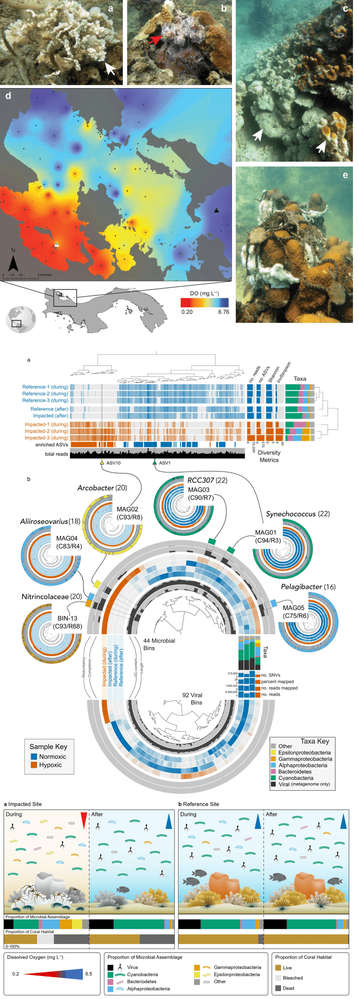
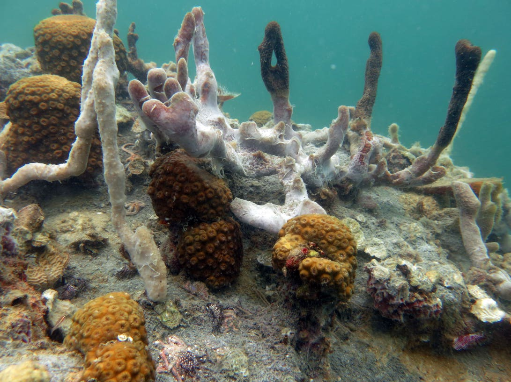
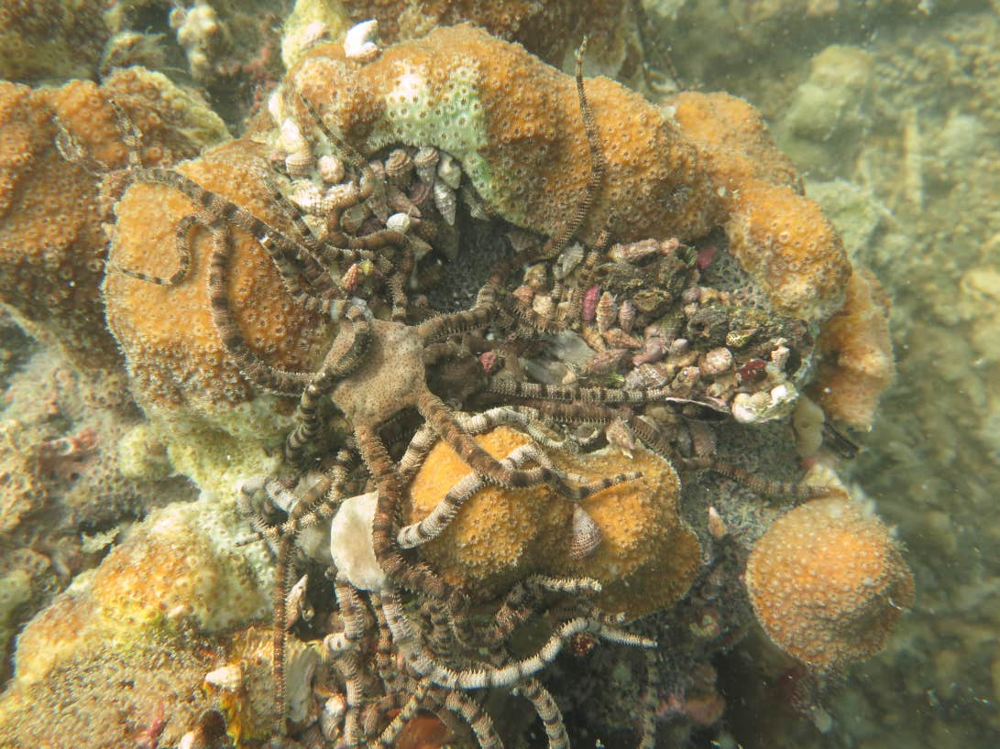

<script type="text/javascript" src="https://d1bxh8uas1mnw7.cloudfront.net/assets/embed.js"></script>
<script async src="https://badge.dimensions.ai/badge.js" charset="utf-8"></script>

<div class="pub_float">
  <div class="__dimensions_badge_embed__" data-doi="10.1038/s41467-021-24777-3" data-hide-zero-citations="false" data-legend="hover-bottom" data-style="small_circle"></div>
  <div class="altmetric-embed" data-badge-type="donut" data-doi="10.1038/s41467-021-24777-3" data-altmetric-id="110485762"></div>
  <span class="pub-title"><a href=" https://doi.org/10.1038/s41467-021-24777-3" target="_new">Rapid ecosystem-scale consequences of acute deoxygenation on a Caribbean reef</a></span>
  <span class="pub-authors">Johnson MD<sup>☯</sup>, Scott JJ<sup>☯</sup>, Leray M<sup>☯</sup>, Lucey N<sup>☯</sup>, Bravo LMR, Wied WL, Altieri AH</span>
  <span class="pub-co-first-authors"><sup>☯</sup>Co-first authors</span>
<div class="pub-info">
<div class="pub-featured-image">
  <a href="assets/main_figs.png">
    
  </a>
</div>
<div class="pub-highlights">
  <span style="display: inline-block; padding-bottom: 5px;"
  >- <b>Loss of oxygen</b> in the global ocean is <b>accelerating</b> due to climate change & eutrophication.</span><br><span style="display: inline-block; padding-bottom: 5px;"
  >- How does <b>acute deoxygenation</b> events affect tropical marine ecosystems?</span><br><span style="display: inline-block; padding-bottom: 5px;"
  >- Integrate <b>coral reef</b> benthic communities with <b>microbial community</b> analyses.</span><br><span style="display: inline-block; padding-bottom: 5px;"
  >- Deoxygenation event <b>rapidly altered</b> benthic communities & microbial assemblages.</span><br><span style="display: inline-block; padding-bottom: 5px;"
  >- Event precipitated <b>coral bleaching & mass mortality</b>, 50% loss of live coral & a shift in the benthic community that persisted a year later.</span><br><span style="display: inline-block; padding-bottom: 5px;"
  >- Hypoxia-associated <b>microbes rapidly reverted</b> to a normoxic assemblage one month after the event.</span><br><span style="display: inline-block; padding-bottom: 5px;"
  >-  Found a <b>decoupling of ecological trajectories</b> among major functional groups following an acute event.</span>
</div>
  </div>
  <span class="pub-journal">
    <b>Nature Communications 12 (2021)</b>
    <a href="https://doi.org/10.1038/s41467-021-24777-3" target="_blank">🔗</a>
  </span>
</div>

<small><em>Code for the highlight box above shamelessly stolen from the [Meren Lab website](https://merenlab.org/).</em></small>


> [Click here](https://www.nature.com/articles/s41467-021-24777-3/metrics) for article metrics on the Nature Communications website. 

<br/>

<details markdown="1">
<summary>Show setup information.</summary>

```{r setup, message = FALSE, warning = FALSE}
knitr::opts_chunk$set(echo = FALSE)
pacman::p_load(tm, SnowballC, wordcloud, RColorBrewer, 
               wordcloud2, webshot, htmlwidgets, dplyr, 
               leaflet, htmlwidgets,
               install = FALSE, update = FALSE)
```
</details>


## Synopsis

Dissolved oxygen (DO) concentrations in the ocean are declining at an unprecedented rate due to eutrophication and climate change. The corresponding increase in the occurrence of coastal hypoxic events, and resulting mass mortality of marine life, is threatening the persistence of ecologically and economically valuable ecosystems. Though hypoxic events have long been recognized to cause ecosystem collapse in temperate environments, similar consequences have only recently been identified in the tropics, where the effects on coral reef ecosystems remain poorly understood. Emerging evidence indicates that hypoxic events can decimate coral reefs, but the progress of a coral reef hypoxia event has yet to be captured in real-time.

Here we present the first account of an unfolding hypoxia event on a Caribbean coral reef, documenting the environmental parameters associated with the event that occurred in September 2017 and subsequent impacts on the ecosystem. We provide the first quantitative evidence that hypoxic events can precipitate coral bleaching and lead to dramatic shifts in reef benthic community structure that persist over time. We also describe how the microbial community overlying the reef benthos (~1 m above the seafloor) had a unique taxonomic fingerprint in hypoxic waters that dissipated with the return of oxygenated water.

Together our study demonstrates the catastrophic implications of a hypoxic event on multiple aspects of the coral reef ecosystems, from coral physiology to microbial community structure. Our results have alarming implications for coral reefs in an age where deoxygenation is accelerating rapidly. In order to truly understand how local and global environmental changes will affect the persistence of coral reefs into the future, ocean deoxygenation must be accounted for and incorporated into monitoring and managements frameworks.

```{r, echo=FALSE, warning=FALSE, layout='l-screen'}
knitr::include_graphics("figures/index/banner.png")
```

## Goals of the study

1)	Characterize the environmental conditions the occur during an in-progress, acute hypoxic event on a shallow Caribbean coral reef,  
2)	Quantify the observed effect of the hypoxic event on coral bleaching and subsequent mortality using a representative coral species, *Agaricia tenuifolia*,  
3)	Evaluate the effects of the hypoxic event on the benthic community through long-term benthic monitoring surveys before, during, and after the event,  
4)	Assess the effects of the hypoxic event on the microbial community overlying the coral reef benthos, ~1 m above the seafloor.   

## Field Sites

Conditions characteristic of a low-oxygen event were detected in Bahía Almirante (Bocas del Toro, Panama) on September 20, 2017. Sampling was conducted inside the bay at the **impacted site** (Cayo Roldan, vermilion) and outside the bay at the **control site** (Coral Caye, blue).

<br/>

```{r, layout='l-screen-inset shaded', fig.height=5.5}

#stri_icon <- makeIcon(
#  iconUrl = "assets/stri_logo.png",
#  iconWidth = 38, iconHeight = 38
#  iconAnchorX = 22, iconAnchorY = 94,
#)

leaflet() %>%
  setView(-82.235052, 9.277137, zoom = 12) %>%
  addTiles() %>%
  addScaleBar(position = "topright") %>%
#  addMiniMap(position = "topright", zoomLevelOffset = -5) %>%
  addCircleMarkers(lng = c(-82.334720, -82.131119),
             lat = c(9.219640, 9.248433), radius = 18.5,
             label = c("Cayo Roldan (impacted)", "Coral Caye (control)"),
             labelOptions = labelOptions(textOnly = TRUE,
                                         noHide = TRUE,
                                         direction = "bottom", offset = c(6, 12),
                                         style = list("font-size" = "14px" ,
                                                      "font-style" = "bold")),
             color = c("#141414", "#141414"),
             fillColor = c("#D55E00", "#0072B2"),
             stroke = TRUE, fillOpacity = 0.9, weight = 10) %>%
  addCircleMarkers(lng = -82.256463,
             lat = 9.352402,
             label = "STRI",
             labelOptions = labelOptions(textOnly = TRUE,
                                         noHide = TRUE,
                                         direction = "left", offset = c(-20, 1),
                                         style = list("font-size" = "20px" ,
                                                      "font-style" = "bold")),
             color = "#0072B2",
             fillColor = "#F0E442",
             stroke = TRUE, fillOpacity = 0.95, weight = 5,
             opacity = 0.95)
```

<br/>

## Manuscript Visualization

Here is a word cloud of the manuscript, just for the fun of it ;) The size of each word in proportional to the number of times it appeared in the manuscript.

```{r, echo=FALSE, eval=FALSE}
filePath <- "files/main.txt"
text <- readLines(filePath)
docs <- Corpus(VectorSource(text))
inspect(docs)
toSpace <- content_transformer(function (x , pattern ) gsub(pattern, " ", x))
docs <- tm_map(docs, toSpace, "/")
docs <- tm_map(docs, toSpace, "@")
docs <- tm_map(docs, toSpace, "\\|")
```

```{r, echo=FALSE, eval=FALSE}
# Convert the text to lower case
docs <- tm_map(docs, content_transformer(tolower))
# Remove numbers
docs <- tm_map(docs, removeNumbers)
# Remove english common stopwords
docs <- tm_map(docs, removeWords, stopwords("english"))
# Remove your own stop word
# specify your stopwords as a character vector
docs <- tm_map(docs, removeWords, c("used", "based", "samples",
                                    "using", "sample", "one",
                                    "two", "site", "within", "fig"))
# Remove punctuations
docs <- tm_map(docs, removePunctuation)
# Eliminate extra white spaces
docs <- tm_map(docs, stripWhitespace)
# Text stemming
# docs <- tm_map(docs, stemDocument)
```

```{r, echo=FALSE, eval=FALSE}
dtm <- TermDocumentMatrix(docs)
m <- as.matrix(dtm)
v <- sort(rowSums(m), decreasing=TRUE)
d <- data.frame(word = names(v),freq = v)
head(d, 200)
```

```{r, echo=FALSE, eval=FALSE}
set.seed(1234)
d1 <- d %>% filter(freq > 1)

#wordcloud(words = d$word, freq = d$freq, min.freq = 1, scale=c(2,.5),
#          max.words=200, random.order=FALSE, rot.per=0.35,
#          colors=brewer.pal(8, "Dark2"))
wc <- wordcloud2(data = d1, size = 1.1, color = 'random-dark', fontFamily = "serif", gridSize = 0)
saveWidget(wc, "tmp.html", selfcontained = F)
webshot("tmp.html", "wordcloud.png", delay = 10, vwidth = 1080, vheight = 480)
```

```{r, echo=FALSE, warning=FALSE, fig.height=1.5, layout='l-page'}
knitr::include_graphics("figures/index/wordcloud.png")
```

## Stories & Reactions

Here are a two press pieces about our publication. 
<br>

<div class="story_float">
  <span class="story-title"><a href=" https://stri.si.edu/story/caribbean-asphyxiation" target="_new">Caribbean Asphyxiation</a></span>
  <span class="story-authors">A story by Beth King & Jorge Aleman</span>
<div class="story-info">
<div class="story-featured-image">
  <a href="https://stri.si.edu/story/caribbean-asphyxiation">
    
  </a>
</div>
<div class="story-highlights">
  <span style="display: inline-block; padding-bottom: 5px;"
  > <b>Desperate brittlestars, suffocating corals and resilient microbes: First multidisciplinary data from an acute marine hypoxic event and its historical context.</b></span><br><span>
  In September 2017, divers observed a massive “dead zone” rising to envelop Caribbean coral reefs in Bocas del Toro, Panama. Smithsonian post-docs joined together to understand marine hypoxia now and in the past.</span><br><span>
  No one knows what triggers the sudden onset of hypoxia, a quickly-spreading drop in ocean oxygen. Like a wildfire, hypoxia kills everything that can’t walk or swim out of harm’s way... Click the link to keep reading.</a></span>
</div>
  </div>
  <span class="story-journal">
    <b>STRI News 29 July 2021</b>
    <a href="https://stri.si.edu/story/caribbean-asphyxiation" target="_blank">🔗</a>
  </span>
</div>


<div class="story_float">
  <span class="story-title"><a href="https://scitechdaily.com/what-happens-to-marine-life-when-there-isnt-enough-oxygen/" target="_new">What Happens to Marine Life When There Isn’t Enough Oxygen?</a></span>
  <span class="story-authors">A story by Kylee Denesha</span>
<div class="story-info">
<div class="story-featured-image">
  <a href="https://scitechdaily.com/what-happens-to-marine-life-when-there-isnt-enough-oxygen/">
    
  </a>
</div>
<div class="story-highlights">
  <span style="display: inline-block; padding-bottom: 5px;"
  > <b>In September of 2017, Woods Hole Oceanographic Institution postdoctoral scholar Maggie Johnson was conducting an experiment with a colleague in Bocas del Toro off the Caribbean coast of Panama.</b> </span><br>
  After sitting on a quiet, warm open ocean, they snorkeled down to find a peculiar layer of murky, foul-smelling water about 10 feet below the surface, with brittle stars and sea urchins, which are usually in hiding, perching on the tops of coral. This unique observation prompted a collaborative study explained in a new paper published today in Nature Communications... Click the link to keep reading.</span><br>
</div>
  </div>
  <span class="story-journal">
    <b>WHOI Media Relations Office 31 July 2021</b>
    <a href="https://scitechdaily.com/what-happens-to-marine-life-when-there-isnt-enough-oxygen/" target="_blank">🔗</a>
  </span>
</div>


<br/>

And tweets from [\@coraloha](https://twitter.com/coraloha?s=20), [\@MikeD_Fox](https://twitter.com/MikeD_Fox?s=20), and  [\@merenbey](https://twitter.com/merenbey?s=20) that made us smile really big. We couldn't resist including these. 


<center><blockquote class="twitter-tweet"><p lang="en" dir="ltr">My mind is blown! Now I just want <a href="https://twitter.com/hashtag/Hypocolypse?src=hash&amp;ref_src=twsrc%5Etfw">#Hypocolypse</a> merch and an instrumental album where <a href="https://twitter.com/MaggieDJohnson?ref_src=twsrc%5Etfw">@MaggieDJohnson</a> reads the abstract over wailing guitar solos. SO stoked</p>&mdash; Dr. Chris Wall (@coraloha) <a href="https://twitter.com/coraloha/status/1420774546106322949?ref_src=twsrc%5Etfw">July 29, 2021</a></blockquote> <script async src="https://platform.twitter.com/widgets.js" charset="utf-8"></script></center> 

<center><blockquote class="twitter-tweet"><p lang="en" dir="ltr">Whoaaaaaa now this is open science to the next level! And the name, come on...Metal AF 🔥 🎸 🤘 <a href="https://t.co/8sznPR5QYz">https://t.co/8sznPR5QYz</a></p>&mdash; Dr. Chris Wall (@coraloha) <a href="https://twitter.com/coraloha/status/1420774018668318721?ref_src=twsrc%5Etfw">July 29, 2021</a></blockquote> <script async src="https://platform.twitter.com/widgets.js" charset="utf-8"></script></center>

<center><blockquote class="twitter-tweet"><p lang="en" dir="ltr">Here is a great study, <a href="https://t.co/PMP0LBCdG4">https://t.co/PMP0LBCdG4</a>, in which <a href="https://twitter.com/MaggieDJohnson?ref_src=twsrc%5Etfw">@MaggieDJohnson</a>, Jarrod J. Scott, <a href="https://twitter.com/Matt_Leray?ref_src=twsrc%5Etfw">@Matt_Leray</a>, &amp; <a href="https://twitter.com/noellelucey?ref_src=twsrc%5Etfw">@noellelucey</a> et al. show how different members of coral ecosystems respond to hypoxia.<br><br>It also happens to contain one of the most beautiful <a href="https://twitter.com/hashtag/anvio?src=hash&amp;ref_src=twsrc%5Etfw">#anvio</a> figures I&#39;ve seen: <a href="https://t.co/vj3roVgVfn">pic.twitter.com/vj3roVgVfn</a></p>&mdash; A. Murat Eren (Meren) (@merenbey) <a href="https://twitter.com/merenbey/status/1449090571021307909?ref_src=twsrc%5Etfw">October 15, 2021</a></blockquote> <script async src="https://platform.twitter.com/widgets.js" charset="utf-8"></script></center>


## Acknowledgements {.appendix}

M.D.J. was funded by postdoctoral fellow awards from the Smithsonian Institution’s Marine Global Earth Observatory (MarineGEO) and the Smithsonian Tropical Research Institute (STRI); M.L. and N.L. were funded by postdoctoral support from the STRI Office of Fellowships. J.J.S. was funded by a grant from the Gordon and Betty Moore Foundation awarded to STRI and UC Davis ([doi:10.37807/GBMF5603](http://doi.org/10.37807/GBMF5603)). L.M.R.B., W.L.W., and A.H.A. were supported by MarineGEO, a private funder, and STRI funds to A.H.A. Many of the computations were conducted on the Smithsonian High-Performance Cluster (SI/HPC), Smithsonian Institution ([doi:10.25572/SIHPC](https://doi.org/10.25572/SIHPC)). We thank Rachel Collin for facilities support at the Bocas del Toro Research Station, Plinio Gondola and the research station staff for logistical support, Roman Barco for insight into the functional analyses, Sherly Castro for informative feedback, and Mike Fox for assistance with community analyses. Research permits were provided by the Autoridad Nacional del Ambiente de Panamá. This paper is the result of research funded by the National Oceanic and Atmospheric Administration’s National Centers for Coastal Ocean Science Competitive Research Program under award NA18NOS4780170 to A.H.A. and M.D.J. through the University of Florida. This is contribution 257 from the Coastal Hypoxia Research Program and 86 from the Smithsonian’s MarineGEO and Tennenbaum Marine Observatories Network.

## Author Contributions {.appendix}

M.D.J., J.J.S., M.L., N.L., and A.H.A. conceived and designed the study. M.D.J., N.L., L.M.R.B., and W.L.W. conducted surveys and collected field samples. N.L., L.M.R.B., and W.L.W. conducted laboratory analyses. J.J.S. and M.L. performed extractions and sample processing for sequencing. M.D.J., J.J.S., M.L., and N.L. conducted statistical analyses and created figures. M.D.J. and J.J.S. drafted the manuscript and supporting information, and managed revisions with input from all co-authors. Website created by J.J.S. with input and material from co-authors.

## Data Availability {.appendix}

See the [Data Availability](data-availability.html) for complete details on obtaining all data and data products for this study. Trimmed 16S rRNA (primers removed) sequence data generated in this study are deposited in the European Nucleotide Archive (ENA) under Project Accession number [PRJEB36632 (ERP119845)](https://www.ebi.ac.uk/ena/browser/view/PRJEB36632), sample accession numbers [ERS4291994-ERS4292031](https://www.ebi.ac.uk/ena/browser/view/ERS4291994-ERS4292031). Raw 16S rRNA fastq files can be accessed through the Smithsonian figshare, [doi:10.25573/data.11819745](https://doi.org/10.25573/data.11819745). The metagenomic sequence data generated in this study are deposited in the ENA under Project Accession number [PRJEB36632 (ERP119845)](https://www.ebi.ac.uk/ena/browser/view/PRJEB36632), sample accession numbers [ERS4578390-ERS4578393](https://www.ebi.ac.uk/ena/browser/view/ERS4578390-ERS4578393). Related data and data products for individual analysis workflows are available through the Smithsonian figshare under the collection [doi:10.25573/data.c.5025362.v1](https://doi.org/10.25573/data.c.5025362.v1). 

## Code availability {.appendix}

All code, reproducible workflows, and further information on data availability can be found on the project website at https://hypocolypse.github.io/. The code embedded in the website is available on the [Hypocolypse GitHub repo](https://github.com/hypocolypse/web) in R Markdown format. The version of code used in this study is archived under [Hypocolypse Workflows v1.0](https://github.com/hypocolypse/web/releases/tag/v1.0), DOI identifier, [doi:10.5281/zenodo.4940132](https://doi.org/10.5281/zenodo.4940132).

[](https://zenodo.org/badge/latestdoi/268354818)

## 

## Disclaimer {.appendix}

Unfortunately, some of the publications we cite in this project sit behind paywalls and are inaccessible unless you are either at an institution that subscribes to the journal, you pay for each article, or you obtain the article via "illegal" means. Either way, at the moment this is beyond our control, and hence apologize if you are unable to access some of the articles we cite.
