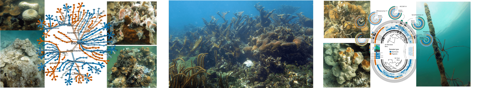
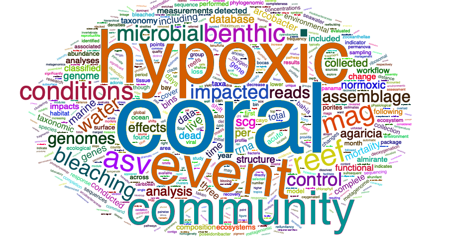

```{r setup, include=FALSE}
knitr::opts_chunk$set(echo = FALSE)
library("tm")
library("SnowballC")
library("wordcloud")
library("RColorBrewer")
library("wordcloud2")
library("webshot")
library("htmlwidgets")
library(dplyr)
library(leaflet)
library(htmlwidgets)
```

```{r, echo=FALSE, warning=FALSE, layout='l-screen'}

```

# Synopsis 

Dissolved oxygen (DO) concentrations in the ocean are declining at an unprecedented rate due eutrophication and climate change. The corresponding increase in the occurrence of coastal hypoxic events, and resulting mass mortality of marine life, is threatening the persistence of ecologically and economically valuable ecosystems. Though hypoxic events have long been recognized to cause ecosystem collapse in temperate environments, similar consequences have only recently been identified in the tropics, where the effects on coral reef ecosystems remain poorly understood. Emerging evidence indicates that hypoxic events can decimate coral reefs, but the progress of a coral reef hypoxia event has yet to be captured in real-time. 

Here we present the first account of an unfolding hypoxia event on a Caribbean coral reef, documenting the environmental parameters associated with the event that occurred in September 2017 and subsequent impacts on the ecosystem. We provide the first quantitative evidence that hypoxic events can precipitate coral bleaching and lead to dramatic shifts in reef benthic community structure that persist over time. We also describe how the microbial community overlying the reef benthos (~1 m above the seafloor) had a unique taxonomic fingerprint in hypoxic waters that dissipated with the return of oxygenated water. 

Together our study demonstrates the catastrophic implications of a hypoxic event on multiple aspects of the coral reef ecosystems, from coral physiology to microbial community structure. Our results have alarming implications for coral reefs in an age where deoxygenation is accelerating rapidly. In order to truly understand how local and global environmental changes will affect the persistence of coral reefs into the future, ocean deoxygenation must be accounted for and incorporated into monitoring and managements frameworks.

# Goals of the study

1)	Characterize the environmental conditions the occur during an in-progress, acute hypoxic event on a shallow Caribbean coral reef,  
2)	Quantify the observed effect of the hypoxic event on coral bleaching and subsequent mortality using a representative coral species, *Agaricia tenuifolia*,  
3)	Evaluate the effects of the hypoxic event on the benthic community through long-term benthic monitoring surveys before, during, and after the event,  
4)	Assess the effects of the hypoxic event on the microbial community overlying the coral reef benthos, ~1 m above the seafloor.   

# Field Sites

Conditions characteristic of a low-oxygen event were detected in Bahía Almirante (Bocas del Toro, Panama) on September 20, 2017. Sampling was conducted inside the bay at the **impacted site** (Cayo Roldan, vermilion) and outside the bay at the **control site** (Coral Caye, blue).

<br/>

```{r, layout='l-screen-inset shaded', fig.height=5.5}

#stri_icon <- makeIcon(
#  iconUrl = "assets/stri_logo.png",
#  iconWidth = 38, iconHeight = 38
#  iconAnchorX = 22, iconAnchorY = 94,
#)

leaflet() %>%
  setView(-82.235052, 9.277137, zoom = 12) %>%
  addTiles() %>% 
  addScaleBar(position = "topright") %>% 
#  addMiniMap(position = "topright", zoomLevelOffset = -5) %>%
  addCircleMarkers(lng = c(-82.334720, -82.131119), 
             lat = c(9.219640, 9.248433), radius = 22.5,
             label = c("Cayo Roldan (impacted)", "Coral Caye (control)"),
             labelOptions = labelOptions(textOnly = TRUE, 
                                         noHide = TRUE, 
                                         direction = "bottom", offset = c(6, 12), 
                                         style = list("font-size" = "14px" , 
                                                      "font-style" = "bold")),
             color = c("#141414", "#141414"), 
             fillColor = c("#D55E00", "#0072B2"), 
             stroke = TRUE, fillOpacity = 0.9, weight = 10) %>%
  addCircleMarkers(lng = -82.256463, 
             lat = 9.352402, 
             label = "STRI",
             labelOptions = labelOptions(textOnly = TRUE, 
                                         noHide = TRUE, 
                                         direction = "left", offset = c(-20, 1), 
                                         style = list("font-size" = "20px" , 
                                                      "font-style" = "bold")),
             color = "#0072B2", 
             fillColor = "#F0E442", 
             stroke = TRUE, fillOpacity = 0.95, weight = 5,
             opacity = 0.95) 
```

<br/>

# Science to Words

Curious how our study translated into the written language? Here is a word cloud of our manuscript. 

```{r, echo=FALSE, eval=FALSE}
filePath <- "files/main.txt"
text <- readLines(filePath)
docs <- Corpus(VectorSource(text))
inspect(docs)
toSpace <- content_transformer(function (x , pattern ) gsub(pattern, " ", x))
docs <- tm_map(docs, toSpace, "/")
docs <- tm_map(docs, toSpace, "@")
docs <- tm_map(docs, toSpace, "\\|")
```

```{r, echo=FALSE, eval=FALSE}
# Convert the text to lower case
docs <- tm_map(docs, content_transformer(tolower))
# Remove numbers
docs <- tm_map(docs, removeNumbers)
# Remove english common stopwords
docs <- tm_map(docs, removeWords, stopwords("english"))
# Remove your own stop word
# specify your stopwords as a character vector
docs <- tm_map(docs, removeWords, c("used", "based", "samples", 
                                    "using", "sample", "one", 
                                    "two", "site", "within", "fig")) 
# Remove punctuations
docs <- tm_map(docs, removePunctuation)
# Eliminate extra white spaces
docs <- tm_map(docs, stripWhitespace)
# Text stemming
# docs <- tm_map(docs, stemDocument)
```

```{r, echo=FALSE, eval=FALSE}
dtm <- TermDocumentMatrix(docs)
m <- as.matrix(dtm)
v <- sort(rowSums(m), decreasing=TRUE)
d <- data.frame(word = names(v),freq = v)
head(d, 200)
```

```{r, echo=FALSE, eval=FALSE}
set.seed(1234)
d1 <- d %>% filter(freq > 1)

#wordcloud(words = d$word, freq = d$freq, min.freq = 1, scale=c(2,.5),
#          max.words=200, random.order=FALSE, rot.per=0.35, 
#          colors=brewer.pal(8, "Dark2"))
wc <- wordcloud2(data = d1, size = 1.1, color = 'random-dark', fontFamily = "serif", gridSize = 0)
saveWidget(wc, "tmp.html", selfcontained = F)
webshot("tmp.html", "wordcloud.png", delay = 10, vwidth = 1080, vheight = 480)
```

```{r, echo=FALSE, warning=FALSE, fig.height=1.5, layout='l-screen'}

```

## Acknowledgements {.appendix}

MDJ was funded by postdoctoral fellow awards from the Smithsonian Institution Marine Global Earth Observatory (MarineGEO) and Smithsonian Tropical Research Institute (STRI); ML and NL were funded by postdoctoral support from the STRI Office of Fellowships. JJS was funded by a grant from the Gordon and Betty Moore Foundation to STRI and UC Davis [doi:10.37807/GBMF5603](http://doi.org/10.37807/GBMF5603). LR, WW, and AHA were supported by MarineGEO, a private funder, and STRI funds to AHA. Research permits were provided by the Autoridad Nacional del Ambiente de Panamá. We thank R Collin for facilities support at the Bocas del Toro Research Station, P Gondola and the research station staff for logistical support. This is contribution number X from MarineGEO and the Smithsonian’s Tennenbaum Marine Observatories Network. Many of the computations were conducted on the Smithsonian High-Performance Cluster (SI/HPC), Smithsonian Institution. [doi:10.25572/SIHPC](https://doi.org/10.25572/SIHPC).

## Author Contributions {.appendix}

MDJ, JJS, ML, NL, and AA contributed to conception and experimental design. MDJ, NL, LR, and WW conducted surveys and collected field samples. NL, LR, and WW conducted laboratory analyses. JJS and ML performed extractions and sample processing for sequencing. MDJ, JJS, ML, and NL conducted statistical analyses and created figures. MDJ drafted the manuscript and Supplementary Information, and managed revisions with assistance from all co-authors. Website created by JJS with input and material from co-authors.

## Data Availability {.appendix}

See the [Data Availability](data-availability.html) for complete details on obtaining all data and data products for this study.

## Source Code {.appendix}

The source code for this page can be accessed on GitHub by [clicking this link](https://github.com/hypocolypse/web/blob/master/index.Rmd).

## An Apology from JJS {.appendix}

Unfortunately, some of the publications we cite in this project sit behind paywalls. These papers are inaccessible unless you are at an institution that subscribes to the journal, you pay a crazy amount of money per article, or you obtain the article via "illegal" means. Either way, at the moment this is beyond our control, and hence I apologize if you are unable to access some of the articles we cite. 
