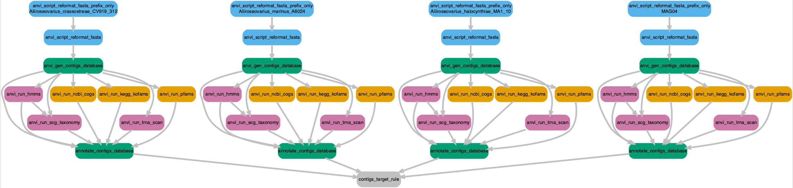
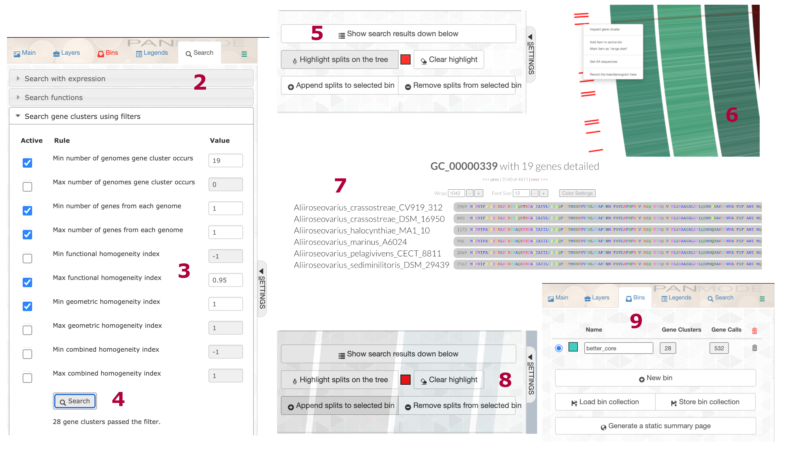

<details markdown="1">
<summary>Show setup information.</summary>

```{r setup, message = FALSE, warning = FALSE, results='hide'}
knitr::opts_chunk$set(collapse = TRUE)
pacman::p_load(kableExtra, DT, htmlwidgets, htmltools, 
               DiagrammeR, DiagrammeRsvg, rsvg, readr, 
               tidyverse, plyr, data.table,
               install = FALSE, update = FALSE)
```
</details>

# Data Availability

All files generated in this workflow can be downloaded from figshare. 

<iframe src="https://widgets.figshare.com/articles/14774802/embed?show_title=1" width="568" height="251"  frameborder="0"></iframe>

File names and descriptions:

- **01_MAG04_PAN** Pangenomic analysis of MAG04.
- **02_MAG04_PHYLOGENOMICS** Phylogenomic analysis of MAG04.
You can use the anvi'o commands described in the workflow to visualize the data.


What we want to do here is compare MAG04^[In the analysis, this MAG is named WATER_MAG_00004. For brevity we refer to it henceforth as MAG04] to publicly available genomes. We will generally follow workflow similar to the one presented for [MAG02](mag02-phylogenomics.html).

```bash
anvi-estimate-scg-taxonomy -c 18_NR-MAGs-SPLIT/WATER_MAG_00004/CONTIGS.db
```

::: l-body-outset
| MAG             | total_scgs | supporting_scgs | taxonomy                                                                                                                            |
|-----------------|------------|-----------------|-------------------------------------------------------------------------------------------------------------------------------------|
| WATER_MAG_00004 | 18          | 13               | Bacteria / Proteobacteria / Alphaproteobacteria / Rhodobacterales / Rhodobacteraceae / Aliiroseovarius / Aliiroseovarius sp004360145 |
:::

# Getting Genomes from NCBI

For this workflow we largely follow the tutorial on [Accessing and including NCBI genomes in 'omics analyses in anvi'o](http://merenlab.org/2019/03/14/ncbi-genome-download-magic/) by Alon Shaiber and Meren.

We need genomes to compare to our MAG. As the tutorial explains, we can either use the taxa name itself or the TaxID. But before that we need to get the  [`gimme_taxa.py`](https://github.com/kblin/ncbi-genome-download#contributed-scripts-gimme_taxapy) *helper script* by [by Joe R. J. Healey](http://orcid.org/0000-0002-9569-6738) that allows us to download genomes from NCBI. Slick.

```bash
wget https://raw.githubusercontent.com/kblin/ncbi-genome-download/master/contrib/gimme_taxa.py
```
We can start with the taxa names themselves.

## Getting TaxIDs to Download

```bash
python gimme_taxa.py Aliiroseovarius \
                     -o Aliiroseovarius-for-ngd.txt
```

We 24 hits for [*Aliiroseovarius*](files/mag04-phylogenomics/0-get-genomes/Aliiroseovarius-for-ngd.txt).

What about the TaxID?

We need to head to NCBI’s [Taxonomy Browser](https://www.ncbi.nlm.nih.gov/Taxonomy/Browser/wwwtax.cgi) and get the *parent TaxID* by  searching for the taxon name of interest, in this case *Aliiroseovarius*.

*Aliiroseovarius* is [TaxID 1658781](https://www.ncbi.nlm.nih.gov/Taxonomy/Browser/wwwtax.cgi?mode=Tree&id=1658781). We can also see from the file `Aliiroseovarius-for-ngd.txt` that the parent TaxID of *Aliiroseovarius* is 1658781. Nice.

```bash
python gimme_taxa.py 1658781 \
                     -o Aliiroseovarius-TaxIDs-for-ngd.txt
```

Again, we get 24 hits. The results of using TaxID and taxon name were identical, however that is not always the case, so it is good to check.

Since we only need the TaxIDs, we can rerun the command like so:

```bash
python gimme_taxa.py 1658781 \
                     -o Aliiroseovarius_Group-TaxIDs-for-ngd-just-IDs.txt \
                     --just-taxids
```

As the command implies, we only get a list of TaxIDs. Moving on,

## Downloading Genomes from  NCBI

To download genomes using the TaxIDs, we need a collection of scripts called `ncbi-genome-download`. See the [GitHub repo](https://github.com/kblin/ncbi-genome-download#contributed-scripts-gimme_taxapy) for installation instructions. We have a choice of where to look for genomes using the `-s` flag---either Genbank or Refseq


```bash
ncbi-genome-download -t Aliiroseovarius_Group-TaxIDs-for-ngd-just-IDs.txt \
                      bacteria \
                      -o 00_Aliiroseovarius_Genbank \
                      --metadata Aliiroseovarius-NCBI-METADATA.txt \
                      -s genbank
```

We tested both options and found that the `-s genbank` returned 28 genomes and `-s refseq` returned 24. We compared the two lists and found nothing unique in the Refseq database so we will continue with the GenBank set.

## Processing NCBI Genomes

A [metadata file](files/mag04-phylogenomics/1-process-genomes/Aliiroseovarius-NCBI-METADATA.txt) is also created by `ncbi-genome-download`.

```bash
column -t Aliiroseovarius-NCBI-METADATA.txt | head -n 4
```

```
assembly_accession	bioproject	biosample	wgs_master	excluded_from_refseq	refseq_category	relation_to_type_material	taxid	species_taxid	organism_name	infraspecific_name	isolate	version_status	assembly_level	release_type	genome_rep	seq_rel_date	asm_name	submitter	gbrs_paired_asm	paired_asm_comp	ftp_path	local_filename
GCA_001307765.1	PRJNA291771	SAMN03952659	LKBA00000000.1	representative	genome	assembly	from	type	material	154981	154981	Aliiroseovarius	crassostreae	strain=CV919-312	latest	Contig	Major	Full	2015/10/07	ASM130776v1	University	of	Rhode	Island	GCF_001307765.1	identical	ftp://ftp.ncbi.nlm.nih.gov/genomes/all/GCA/001/307/765/GCA_001307765.1_ASM130776v1	./00_Aliiroseovarius_Genbank/genbank/bacteria/GCA_001307765.1/GCA_001307765.1_ASM130776v1_genomic.gbff.gz
GCA_900116725.1	PRJEB17594	SAMN04488527	FPBS00000000.1	na	assembly	from	type	material	154981	154981	Aliiroseovarius	crassostreae	strain=DSM	16950	latest	Scaffold	Major	Full	2016/11/02	IMG-taxon	2619619030	annotated	assembly	DOE	-	JOINT	GENOME	INSTITUTE	GCF_900116725.1	identical	ftp://ftp.ncbi.nlm.nih.gov/genomes/all/GCA/900/116/725/GCA_900116725.1_IMG-taxon_2619619030_annotated_assembly	./00_Aliiroseovarius_Genbank/genbank/bacteria/GCA_900116725.1/GCA_900116725.1_IMG-taxon_2619619030_annotated_assembly_genomic.gbff.gz
GCA_007004645.1	PRJNA548260	SAMN12012166	VICH00000000.1	representative	genome	assembly	from	type	material	985055	985055	Aliiroseovarius	halocynthiae	strain=MA1-10	latest	Scaffold	Major	Full	2019/07/15	ASM700464v1	Xinxiang	Medical	University	GCF_007004645.1	identical	ftp://ftp.ncbi.nlm.nih.gov/genomes/all/GCA/007/004/645/GCA_007004645.1_ASM700464v1	./00_Aliiroseovarius_Genbank/genbank/bacteria/GCA_007004645.1/GCA_007004645.1_ASM700464v1_genomic.gbff.gz
```

Anvi'o has a script that takes this metadata file and generates a `fasta.txt` file in the format compatible with anvi’o workflows. We will use the `--exclude-gene-calls-from-fasta-txt` because we want to do our own gene calling.

```bash
anvi-script-process-genbank-metadata -m Aliiroseovarius-NCBI-METADATA.txt \
                                     -o 01_Aliiroseovarius-NCBI-GENOMES \
                                     --output-fasta-txt Aliiroseovarius-fasta.txt \
                                     --exclude-gene-calls-from-fasta-txt
```

This command returns a directory, `01_Aliiroseovarius-NCBI-GENOMES` full of fasta files and the file [Aliiroseovarius-fasta.txt](files/mag04-phylogenomics/1-process-genomes/Aliiroseovarius-fasta.txt), which contains the name and fasta file path for each genome.

```
name	path
Aliiroseovarius_crassostreae_GCA_001307765_1	/pool/genomics/stri_istmobiome/data/TEMP/Aliiroseovarius/ALIIROSEOVARIUS/Aliiroseovarius-NCBI-GENOMES/Aliiroseovarius_crassostreae_GCA_001307765_1-contigs.fa
Aliiroseovarius_marinus_GCA_004360145_1	/pool/genomics/stri_istmobiome/data/TEMP/Aliiroseovarius/ALIIROSEOVARIUS/Aliiroseovarius-NCBI-GENOMES/Aliiroseovarius_marinus_GCA_004360145_1-contigs.fa
Aliiroseovarius_halocynthiae_GCA_007004645_1	/pool/genomics/stri_istmobiome/data/TEMP/Aliiroseovarius/ALIIROSEOVARIUS/Aliiroseovarius-NCBI-GENOMES/Aliiroseovarius_halocynthiae_GCA_007004645_1-contigs.fa
```

We need to add our MAG to the fasta directory and its name to the `Aliiroseovarius-fasta.txt` file. We will also change the names produced by `anvi-script-process-genbank-metadata` since they are not very meaningful. We can use the `Aliiroseovarius-NCBI-METADATA.txt` file, specifically the `organism_name`, `infraspecific_name`, and/or `isolate` columns to cobble together new genome names. I wish I could say I had a clever way to do this task, but really it was just some copying and pasting. 

<aside>
[Aliiroseovarius-fasta-rename.txt](files/mag04-phylogenomics/1-process-genomes/Aliiroseovarius-fasta-rename.txt) names file with MAG04 added.
</aside>

> If you change the names they MUST be unique and contain no spaces, periods, dashes, or other weird characters. Letters, numbers, and underscores only.

# Running Snakemake Contigs Workflow

Now it is time for some comparisons. First we will run the *contigs*  workflow since this will produce annotated contig databases and properly formatted fasta files for all genomes. We will need these for phylogenomics. Ok, renamed file in hand, we use Snakemake workflow [@koster2012snakemake] to run the built-in anvi'o [contigs workflow](http://merenlab.org/2018/07/09/anvio-snakemake-workflows/#contigs-workflow). If you do not know what workflows are available you can run this command:

```bash
anvi-run-workflow --list-workflows
```

```
WARNING
===============================================
If you publish results from this workflow, please do not forget to cite
snakemake (doi:10.1093/bioinformatics/bts480)

Available workflows ..........................: contigs, metagenomics, pangenomics, phylogenomics
```

Next, we need a config file for the **contigs workflow**. This file tells anvi'o what commands to run and how to run them. We run this command to generate a default config file, which can be modified as you see fit. Some commands we chose not to run but they remain in the workflow for posterity.

<aside>
[Click here](files/mag04-phylogenomics/2-snakemake-contigs/contigs-default-config.json) to see the file or grab it from the folded code below.
</aside>

```bash
anvi-run-workflow -w contigs --get-default-config contigs-default-config.json
```

<details markdown="1"><summary>Show/hide JSON-formatted configuration file.</summary>
<pre><code>
{
    "fasta_txt": "Aliiroseovarius-fasta-rename.txt",
    "anvi_gen_contigs_database": {
        "--project-name": "{group}",
        "--description": "",
        "--skip-gene-calling": "",
        "--ignore-internal-stop-codons": "",
        "--skip-mindful-splitting": "",
        "--contigs-fasta": "",
        "--split-length": "",
        "--kmer-size": "",
        "--skip-predict-frame": "",
        "--prodigal-translation-table": "",
        "threads": ""
    },
    "centrifuge": {
        "threads": 2,
        "run": "",
        "db": ""
    },
    "anvi_run_hmms": {
        "run": true,
        "threads": 20,
        "--installed-hmm-profile": "",
        "--hmm-profile-dir": "",
        "--also-scan-trnas": ""
    },
    "anvi_run_kegg_kofams": {
        "run": true,
        "threads": 20,
        "--kegg-data-dir": "/pool/genomics/stri_istmobiome/dbs/kegg_kofam/",
        "--hmmer-program": "",
        "--keep-all-hits": "",
        "--log-bitscores": "",
        "--just-do-it": ""
    },
    "anvi_run_ncbi_cogs": {
        "run": true,
        "threads": 20,
        "--cog-data-dir": "/pool/genomics/stri_istmobiome/dbs/cog_db/",
        "--sensitive": "",
        "--temporary-dir-path": "/pool/genomics/stri_istmobiome/dbs/cog_db/tmp/",
        "--search-with": ""
    },
    "anvi_run_scg_taxonomy": {
        "run": true,
        "threads": 20,
        "--scgs-taxonomy-data-dir": ""
    },
    "anvi_run_trna_scan": {
        "run": true,
        "threads": 20,
        "--trna-cutoff-score": ""
    },
    "anvi_script_reformat_fasta": {
        "run": true,
        "--prefix": "{group}",
        "--simplify-names": true,
        "--keep-ids": "",
        "--exclude-ids": "",
        "--min-len": "",
        "--seq-type": "",
        "threads": ""
    },
    "emapper": {
        "--database": "bact",
        "--usemem": true,
        "--override": true,
        "path_to_emapper_dir": "",
        "threads": ""
    },
    "anvi_script_run_eggnog_mapper": {
        "--use-version": "0.12.6",
        "run": "",
        "--cog-data-dir": "",
        "--drop-previous-annotations": "",
        "threads": ""
    },
    "gen_external_genome_file": {
        "threads": ""
    },
    "export_gene_calls_for_centrifuge": {
        "threads": ""
    },
    "anvi_import_taxonomy_for_genes": {
        "threads": ""
    },
    "annotate_contigs_database": {
        "threads": ""
    },
    "anvi_get_sequences_for_gene_calls": {
        "threads": ""
    },
    "gunzip_fasta": {
        "threads": ""
    },
    "reformat_external_gene_calls_table": {
        "threads": ""
    },
    "reformat_external_functions": {
        "threads": ""
    },
    "import_external_functions": {
        "threads": ""
    },
    "anvi_run_pfams": {
        "run": true,
        "--pfam-data-dir": "/pool/genomics/stri_istmobiome/dbs/pfam_db/",
        "threads": 20
    },
    "output_dirs": {
        "FASTA_DIR": "02_FASTA",
        "CONTIGS_DIR": "03_CONTIGS",
        "LOGS_DIR": "00_LOGS"
    },
    "max_threads": "",
    "config_version": "2",
    "workflow_name": "contigs"
}
</code></pre>
</details>

<br/>

We can also run a couple of sanity checks to make sure everything is good before starting the job. How about a workflow graph to visually inspect the steps?

```bash
anvi-run-workflow -w contigs -c contigs-default-config.json --save-workflow-graph
```

```
WARNING
===============================================
If you publish results from this workflow, please do not forget to cite
snakemake (doi:10.1093/bioinformatics/bts480)


WARNING
===============================================
We are initiating parameters for the contigs workflow


WARNING
===============================================
You chose to define --temporary-dir-path for the rule anvi_run_ncbi_cogs in the
config file as /pool/genomics/stri_istmobiome/dbs/cog_db/tmp/. while this is
allowed, know that you are doing so at your own risk. The reason this is risky
is because this rule uses a wildcard/wildcards and hence is probably running
more than once, and this might cause a problem. In case you wanted to know,
these are the wildcards used by this rule: {group}

Workflow DOT file ............................: workflow.dot
Workflow PNG file ............................: workflow.png
```

Success. Let's have a look at the workflow. Only four genomes are shown for clarity but each step will be conducted for all genomes.

> Click on the image to zoom in or download a copy.

<details markdown="1"><summary>Show/hide DAG R Code script</summary>
<pre><code>
````
```{r workflow2, eval=FALSE}`r ''`
dag <- grViz ("
digraph boxes_and_circles {
  graph [layout = dot, align=center]

  node [shape = rectangle, style = 'rounded,filled' fontname=sans, fontsize=12, penwidth=4]
  edge[penwidth=4, color=grey];


0[label = 'contigs_target_rule', color = 'grey'];
1[label = 'annotate_contigs_database', color = '#009E73'];
2[label = 'annotate_contigs_database', color = '#009E73'];
3[label = 'annotate_contigs_database', color = '#009E73'];
4[label = 'annotate_contigs_database', color = '#009E73'];
5[label = 'anvi_gen_contigs_database', color = '#009E73'];
6[label = 'anvi_run_hmms', color = '#CC79A7'];
7[label = 'anvi_run_ncbi_cogs', color = '#E69F00'];
8[label = 'anvi_run_kegg_kofams', color = '#E69F00'];
9[label = 'anvi_run_scg_taxonomy', color = '#CC79A7'];
10[label = 'anvi_run_trna_scan', color = '#CC79A7'];
11[label = 'anvi_run_pfams', color = '#E69F00'];
12[label = 'anvi_gen_contigs_database', color = '#009E73'];
13[label = 'anvi_run_hmms', color = '#CC79A7'];
14[label = 'anvi_run_ncbi_cogs', color = '#E69F00'];
15[label = 'anvi_run_kegg_kofams', color = '#E69F00'];
16[label = 'anvi_run_scg_taxonomy', color = '#CC79A7'];
17[label = 'anvi_run_trna_scan', color = '#CC79A7'];
18[label = 'anvi_run_pfams', color = '#E69F00'];
19[label = 'anvi_gen_contigs_database', color = '#009E73'];
20[label = 'anvi_run_hmms', color = '#CC79A7'];
21[label = 'anvi_run_ncbi_cogs', color = '#E69F00'];
22[label = 'anvi_run_kegg_kofams', color = '#E69F00'];
23[label = 'anvi_run_scg_taxonomy', color = '#CC79A7'];
24[label = 'anvi_run_trna_scan', color = '#CC79A7'];
25[label = 'anvi_run_pfams', color = '#E69F00'];
26[label = 'anvi_gen_contigs_database', color = '#009E73'];
27[label = 'anvi_run_hmms', color = '#CC79A7'];
28[label = 'anvi_run_ncbi_cogs', color = '#E69F00'];
29[label = 'anvi_run_kegg_kofams', color = '#E69F00'];
30[label = 'anvi_run_scg_taxonomy', color = '#CC79A7'];
31[label = 'anvi_run_trna_scan', color = '#CC79A7'];
32[label = 'anvi_run_pfams', color = '#E69F00'];
33[label = 'anvi_script_reformat_fasta', color = '#56B4E9'];
34[label = 'anvi_script_reformat_fasta', color = '#56B4E9'];
35[label = 'anvi_script_reformat_fasta', color = '#56B4E9'];
36[label = 'anvi_script_reformat_fasta', color = '#56B4E9'];
37[label = 'anvi_script_reformat_fasta_prefix_only\n Aliiroseovarius_crassostreae_CV919_312', color = '#56B4E9'];
38[label = 'anvi_script_reformat_fasta_prefix_only\n Aliiroseovarius_marinus_A6024', color = '#56B4E9'];
39[label = 'anvi_script_reformat_fasta_prefix_only\n Aliiroseovarius_halocynthiae_MA1_10', color = '#56B4E9'];
40[label = 'anvi_script_reformat_fasta_prefix_only\n MAG04', color = '#56B4E9'];

1->0; 2->0; 3->0; 4->0; 5->1; 6->1; 7->1; 
8->1; 9->1; 10->1; 11->1; 12->2; 13->2; 
14->2; 15->2; 16->2; 17->2; 18->2; 19->3; 
20->3; 21->3; 22->3; 23->3; 24->3; 25->3; 
26->4; 27->4; 28->4; 29->4; 30->4; 31->4; 
32->4; 33->5; 5->6; 5->7; 5->8; 6->9; 5->9; 
5->10; 5->11; 34->12; 12->13; 12->14; 12->15; 
13->16; 12->16; 12->17; 12->18; 35->19; 19->20; 
19->21; 19->22; 20->23; 19->23; 19->24; 19->25; 
36->26; 26->27; 26->28; 26->29; 27->30; 26->30; 
26->31; 26->32; 37->33; 38->34; 39->35; 40->36

	graph [nodesep = 0.1]
{ rank=same; 33, 34, 35, 36 }
{ rank=same; 6, 7, 8, 11 }
{ rank=same; 13, 14, 15, 18 }
{ rank=same; 20, 21, 22, 25 }
{ rank=same; 27, 28, 29, 32 }
{ rank=same; 9, 10 }
{ rank=same; 16, 17 }
{ rank=same; 23, 24 }
{ rank=same; 30, 31 }


}
")

export_svg(dag) %>%
  charToRaw() %>%
  rsvg() %>%
  png::writePNG("figures/mag04-phylogenomics/workflow.png")
```
````
</code></pre>
</details>

:::l-body-outset
<figure>
<a href="figures/mag04-phylogenomics/workflow.png">
  
</a>
<figcaption><strong>DAG (directed acyclic graph) of the contigs workflow.</strong>Colors indicate broad divisions of workflow: sky blue, short-read prep & co-assembly; sky blue, formatting; blueish green, databases; reddish purple, SCG annotation; orange, functional classification.</figcaption>
</figure>
:::

Yup. Looks good and makes sense. And a dry run just to be certain

```bash
anvi-run-workflow -w contigs -c contigs-default-config.json --dry-run
```

No complaints. Things are looking good. We are ready to run the workflow.

For all of you HYDRA users, here is the job script to run the contigs workflow.

<details markdown="1"><summary>Show/hide HYDRA SNAKEMAKE job script</summary>
<pre><code>
# /bin/sh
# ----------------Parameters---------------------- #
#$ -S /bin/sh
#$ -pe mthread 20
#$ -q sThC.q
#$ -l mres=120G,h_data=6G,h_vmem=6G
#$ -cwd
#$ -j y
#$ -N job_01b_run_contigs_workflow
#$ -o hydra_logs/job_01b_run_contigs_workflow.log
#$ -M scottjj@si.edu
#
# ----------------Modules------------------------- #
module load gcc/4.9.2
#
# ----------------Your Commands------------------- #
#
echo + `date` job $JOB_NAME started in $QUEUE with jobID=$JOB_ID on $HOSTNAME
echo + NSLOTS = $NSLOTS
#
### CALLING ANVIO ###
export PATH=/home/scottjj/miniconda3:$PATH
export PATH=/home/scottjj/miniconda3/bin:$PATH
source activate anvio-master
#
#############################################
### Making sure everything is cool
which python
python --version
source /home/scottjj/virtual-envs/anvio-master/bin/activate
which python
python --version
which anvi-interactive
diamond --version
anvi-self-test -v
#############################################
#
## pfam tmp
rm -r /pool/genomics/stri_istmobiome/dbs/pfam_db/tmp_data/
mkdir -p /pool/genomics/stri_istmobiome/dbs/pfam_db/tmp_data/
TMPDIR="/pool/genomics/stri_istmobiome/dbs/pfam_db/tmp_data/"
#
anvi-run-workflow -w contigs -c contigs-default-config.json --additional-params --jobs 20 --resources nodes=20 --keep-going --rerun-incomplete --unlock
anvi-run-workflow -w contigs -c contigs-default-config.json --additional-params --jobs 20 --resources nodes=20 --keep-going --rerun-incomplete
#
echo = `date` job $JOB_NAME don
</code></pre>
</details>

<br/>

Finished? Sweet. What we have now are contig databases for *Aliiroseovarius* genomes---databases that contain gene calls, functional annotations, HMM profiles, etc. Remember, our goal is to better understand MAG04 by asking what it is related to and where related genomes are found in nature. Before continuing, we need to ask two questions about our genome collection and then address each of them in turn.

1) How complete are these genomes? We will rely on single copy genes for phylogenomic analysis so there is no reason to keep genomes that are missing too many genes.
2) Do we *need* all of these genomes? It is likely that some of these genomes are highly similar to each other. What we are after is a representative sampling of *Aliiroseovarius* genomic diversity.

# Curate Genome Collection

The commands we ran above retrieved 24 genomes from *Aliiroseovarius*. Here we perform a series of simple steps to eliminate unwanted or unnecessary genomes from the collection.

> We start with 25 genomes. This includes MAG04

Our goal here is to get rid of low completion genomes since they will compromise our ability to use single copy core genes for phylogenomics. 

## Estimate Taxonomy

Microbial taxonomy is a fluid system, meaning that classifications change often. One thing we can do is look at the predicted taxonomy for each genome even though they each came prepackaged with a taxonomic designation. We already know [MAG04's predicted taxonomy is *Poseidonibacter*](mg-binning.html#esimate-mag-taxonomy) but what about the rest

To do this we will again run the command `anvi-estimate-scg-taxonomy`, which uses 22 ribosomal genes [@parks2018gtgb] from the [Genome Taxonomy Database (GTDB)](https://gtdb.ecogenomic.org/) to estimate taxonomy. We added these classifications earlier when we contigs workflow. The workflow ran its own instance of `anvi-run-scg-taxonomy` for each genome. We can use a nifty `for` loop and then concatenate the output files and make a handy table. Pretty sure there is a better way :/

```bash
for genome in `cat list_genomes.txt`;
do
       anvi-estimate-scg-taxonomy -c 03_CONTIGS/$genome-contigs.db \
                                  -o 04_SCG_TAXONOMY/$genome-SCG.txt;
done
```

<br/>

```{r scg_tax, echo=FALSE, layout="l-page"}

scg_tax <- read.table("tables/mag04-phylogenomics/alii-scg-tax.txt",
                           sep = "\t", header = TRUE)
datatable(
  scg_tax, rownames = FALSE, autoHideNavigation = TRUE, filter = 'top',
  width = "100%", elementId = "3i2fjbajgi81p2jrl0re",
  caption = htmltools::tags$caption(
    style = "caption-side: bottom; text-align: left;",
    "Completion estimates of Aliiroseovarius genomes."),
  extensions = c("Buttons", "FixedColumns"),
  options = list(
    columnDefs = list(list(className = "dt-left", targets = 0)),
    dom = "Blfrtip",
    buttons = c("csv", "copy"),
    pageLength = 5, lengthMenu = list(c(5, 10, 50, -1), c("5", "10", "50", "All")),
    scrollX = TRUE, scrollCollapse = TRUE, scrollY=TRUE, paging=TRUE,
    fixedColumns = list(leftColumns = 1, rightColumns = 0)))

```

## Completeness

Let's start by checking the completeness (and redundancy) of each genome based on the presence of single copy core genes (SCG) using the HMM profiles, which were added to the contig database for each genome during the workflow. We can either run the same command 125 times and concatenate the outputs, or we can create an *external-genomes* file---a two-column TAB-delimited flat text file that lists anvi'o contigs databases. The first item in the header line reads '*name*', and the second reads '*contigs_db_path*'. Each line in the file describes a single entry, where the first column is the name of the genome (or MAG), and the second column is the anvi'o contigs database generated for this genome.

<aside>
You can access the original [external-genomes file here](files/mag04-phylogenomics/3-curate-genomes/external-genomes.txt).
</aside>

```bash
anvi-estimate-genome-completeness \
                     -e external-genomes.txt
                     -o completness.txt
```

Just like that, a table of basic  stats for every genome in the collection. First notice the completion estimate of MAG04 is around 93%, which is good, but its total length is among the smallest, meaning we have a pretty incomplete genome. Not so good but it is what it is.

<br/>

```{r arc_completness_est, echo=FALSE, layout="l-body-outset"}
arc_comp <- read_tsv("tables/mag04-phylogenomics/completness.txt")

datatable(
  arc_comp, rownames = FALSE, autoHideNavigation = TRUE, filter = 'top',
  width = "100%", elementId = "zuabqa3im4kosrjsnyyd",
  colnames = c(
    "genome", "domain", "confidence", "%_completion",
    "%_redundancy","num_contigs", "total_length"),
  caption = htmltools::tags$caption(
    style = "caption-side: bottom; text-align: left;",
    "Completion estimates of Aliiroseovarius genomes."),
  extensions = c("Buttons", "FixedColumns"),
  options = list(
    columnDefs = list(list(className = "dt-left", targets = 0)),
    dom = "Blfrtip",
    buttons = c("csv", "copy"),
    pageLength = 5, lengthMenu = list(c(5, 10, 50, -1), c("5", "10", "50", "All")),
    scrollX = TRUE, scrollCollapse = TRUE, scrollY=TRUE, paging=TRUE,
    fixedColumns = list(leftColumns = 1, rightColumns = 0)))
```

```{r less_mag, echo=FALSE}
mag04_pc <- arc_comp %>% filter(genome_name == "MAG04")  %>% pull(per_completion)
less_mag <- filter(arc_comp, per_completion < mag04_pc)
```

Next, notice that `r length(less_mag$genome_name)` genomes have completion estimates lower than MAG04 (`r mag04_pc`%), including completion estimates of `0`. These genome will be of no use to us since the phylogenomic analysis is based on SCG. These genomes are the first on our list to go. Another way to look at this is to generate a matrix of HMM hits across all genomes. For that we use the same external-genomes file but we need to also identify the HMM source we want anvi'o to return. Hum, what are the available HMM sources? Run the command with the `--list-hmm-sources` flag and anvi'o will tell you which HMM sources are common to all contig databases. You also need to give it an output file name or else the command will fail.

<aside>
Genomes with lower completion than MAG04: `r less_mag$genome_name`.
</aside>

```bash
anvi-script-gen-hmm-hits-matrix-across-genomes
                  -e external-genomes.txt \
                  -o dummy_out.txt \
                  --list-hmm-sources
```

```
HMM SOURCES COMMON TO ALL 29 GENOMES
===============================================
* Archaea_76 [type: singlecopy] [num genes: 976]
* Bacteria_71 [type: singlecopy] [num genes: 885]
* Protista_83 [type: singlecopy] [num genes: 1741]
* Ribosomal_RNA_12S [type: Ribosomal_RNA_12S] [num genes: 12]
* Ribosomal_RNA_16S [type: Ribosomal_RNA_16S] [num genes: 40]
* Ribosomal_RNA_18S [type: Ribosomal_RNA_18S] [num genes: 12]
* Ribosomal_RNA_23S [type: Ribosomal_RNA_23S] [num genes: 26]
* Ribosomal_RNA_28S [type: Ribosomal_RNA_28S] [num genes: 12]
* Ribosomal_RNA_5S [type: Ribosomal_RNA_5S] [num genes: 67]
* Transfer_RNAs [type: Transfer_RNAs] [num genes: 547]
```

The HMM source we are interested in is `Bacteria_71` [@lee2019gtotree]. Now, rerun the command and we get a table that lists the number of times each of the 71 HMM genes were found in each of the 125 genomes.

```bash
anvi-script-gen-hmm-hits-matrix-across-genomes
                  -e external-genomes.txt \
                  -o Bacteria_71-HMM_HITS.txt \
                  --hmm-source Bacteria_71
```

<br/>

```{r arc_bact_hmm_71, echo=FALSE, layout="l-body-outset"}
arc_hmm <- read_tsv("tables/mag04-phylogenomics/Bacteria_71-HMM_HITS.txt")

total_hits <- rowSums(arc_hmm[2:72] > 0)
arc_hmm$total_hits <- total_hits
arc_hmm <- arc_hmm %>% dplyr::select(genome_name, total_hits, everything())

datatable(
  arc_hmm, rownames = FALSE, autoHideNavigation = TRUE, filter = 'top',
  width = "100%", elementId = "rsj1e7ben91lkpymxvwh",
  caption = htmltools::tags$caption(
    style = "caption-side: bottom; text-align: left;",
    "HMM hits for Aliiroseovarius genomes."),
  extensions = c("Buttons", "FixedColumns"),
  options = list(
    columnDefs = list(list(className = "dt-left", targets = 0)),
    dom = "Blfrtip",
    buttons = c("csv", "copy"),
    pageLength = 5, lengthMenu = list(c(5, 10, 50, -1), c("5", "10", "50", "All")),
    scrollX = TRUE, scrollCollapse = TRUE, scrollY=TRUE, paging=TRUE,
    fixedColumns = list(leftColumns = 1, rightColumns = 0)))
```


```{r less_hmm, echo=FALSE}
mag04_hmm <- arc_hmm %>% filter(genome_name == "MAG04")  %>% pull(total_hits)
less_hmm <- filter(arc_hmm, total_hits < mag04_hmm)
```

<br/>
<br/>

We added a column (total_hits) that records the total number of unique HMM genes per genome. This time notice that `r length(less_hmm$genome_name)` genomes have fewer HMM hits than MAG04 (`r mag04_hmm`). If you look at these two lists of genomes, they should be identical. Seems obvious but it isn't always. These are two nice ways of looking at genome completeness. Now we can remove these genomes from our data set.

<aside>
Genomes with fewer HMM hits than MAG04: `r less_hmm$genome_name`.
</aside>

> Now we have 26 genomes.

## Screen for 16S rRNA

[Unlike MAG02](mag02-phylogenomics.html#screen-for-16s-rrna), we did not recover a 16S rRNA sequence from MAG04. However, it is worth seeing how we arrived at this finding. 

 Of the remaining genomes, which ones have a 16S rRNA sequence? We can go back to our old friend `anvi-script-gen-hmm-hits-matrix-across-genomes` but this time using the setting `--hmm-source Ribosomal_RNAs`. We also use a new `external-genomes` file with the `r length(less_hmm$genome_name)` low HMM hit genomes removed.

<aside>
The [external-genomes file](files/mag04-phylogenomics/3-curate-genomes/external-genomes-rrna-screen.txt) to screen for 16S rRNA.
</aside>

```bash
anvi-script-gen-hmm-hits-matrix-across-genomes \
                        -e external-genomes-rrna-screen.txt \
                        -o Ribosomal_RNAs-HMM_HITS.txt \
                        --hmm-source Ribosomal_RNA_16S
```

<br/>

```{r arc_16s, echo=FALSE, layout="l-body-outset"}
arc_rrna <- read_tsv("tables/mag04-phylogenomics/Ribosomal_RNAs-HMM_HITS.txt")
no_16s <- filter(arc_rrna, Bacterial_16S_rRNA == 0)

datatable(
  arc_rrna, rownames = FALSE, autoHideNavigation = TRUE, filter = 'top',
  width = "100%", elementId = "9uburdkfhep6hh67hinn",
  caption = htmltools::tags$caption(
    style = "caption-side: bottom; text-align: left;",
    "rRNA hits for Aliiroseovarius genomes."),
  extensions = c("Buttons", "FixedColumns"),
  options = list(
    columnDefs = list(list(className = "dt-left", targets = 0)),
    dom = "Blfrtip",
    buttons = c("csv", "copy"),
    pageLength = 5, lengthMenu = list(c(5, 10, 50, -1), c("5", "10", "50", "All")),
    scrollX = TRUE, scrollCollapse = TRUE, scrollY=TRUE, paging=TRUE,
    fixedColumns = list(leftColumns = 1, rightColumns = 0)))
```

<br/>

There were `r length(no_16s$genome_name)` genomes without 16S rRNA genes. We can now remove these from the genome collection and generate a new `external-genomes` file containing only genomes with 16S rRNA sequences, however since MAG04 is one of those missing 16S rRNA we will skip this step. I hope you are starting to see that the `external-genomes` file is an important ally.

> So we still have 26 genomes.

Up to this point we have a collection consisting of genomes that have high completion. What about redundant genomes? Surely there are some genomes that are highly similar, and we really only need a few representatives of each.

# Dereplicate Genome Collection

Finally, we can dereplicate the genome collection using the command `anvi-dereplicate-genomes` to assess the number of genome clusters. This command has a lot of options for fine-tuning but since we are interested in a quick and dirty assessment, we'll keep it simple. We can either give anvi'o an `external-genomes` file like we just did or a `fasta-text-file` similar to the one from the [Snakemake workflow](#running-snakemake-contigs-workflow) above. Remember, the `external-genomes` file provides names and paths to *contig.dbs* and the `fasta-text-file`  provides names and paths to *fasta* files. Either way, we first need to remove the `r length(less_hmm$genome_name)` genomes that we are cutting from the analysis. Let's stick with the `external-genomes` file since we will use this downstream anyway.

Since accuracy is not paramount we use `--program fastANI` [@jain2018high] because, well, it’s fast. We also need to choose a `--similarity-threshold`. We tested the number of clusters for 0.90, 0.95, 0.97, 0.98, and 0.99. Overkill? Maybe, but this will give us a good sense of replication in our genome collection. Here is the command with 0.97.


```bash
mkdir 06_DEREPLICATE
anvi-dereplicate-genomes -e external-genomes-rrna-screen.txt \
                         --program fastANI \
                         --similarity-threshold 0.99 \
                         -o 06_DEREPLICATE/DR_99 -T $NSLOTS
```

The command produces numerous output files, but let's focus on the `CLUSTER_REPORT.txt` file, which tells us the **a**) number of clusters, **b**) number of genomes in each cluster, **c**) representative genome for the cluster, and **d**) all genomes in the cluster.

How many clusters did we get for each `--similarity-threshold`?

* 0.990: 10 clusters
* 0.995: 10 clusters
* 1.000: 24 clusters

We will use the genomes from the `--similarity-threshold 0.99` to get rid of most genomes that are nearly identical. However, one cluster (`cluster_000001`) had 16 of the 26 genomes. We decided to retain 6 of the genomes for our analysis. Basically, genomes between 99.5 and 100% identical.

> Final collection contains 15 genomes. Here is the [final external-genomes file](files/mag04-phylogenomics/3-curate-genomes/external-genomes-final.txt).

# Outgroup Workflow

We decided to use [*Roseovarius*](https://www.ncbi.nlm.nih.gov/Taxonomy/Browser/wwwtax.cgi?mode=Info&id=74030), a member of the Rhodobacteraceae (Alphaproteobacteria), as an outgroup for our tree. We basically ran the same pipeline as above, with a few minor changes. The code is included here but the discussion will be kept to a minimum. I am sure by this point you are tired of hearing me drone on and on.

#### 1. Get TaxIDs

```bash

python gimme_taxa.py 74030 -o Roseovarius-for-ngd.txt
python gimme_taxa.py 74030 -o Roseovarius_Group-TaxIDs-for-ngd-just-IDs.txt \
                           --just-taxids
```

#### 2. Download genomes

```bash
ncbi-genome-download -t Roseovarius_Group-TaxIDs-for-ngd-just-IDs.txt \
                     bacteria \
                     -o 00_Roseovarius_Genbank \
                     --metadata Roseovarius-NCBI-METADATA.txt 
                     -s genbank
```

We received 6 *Roseovarius* genomes. 

#### 3. Format genomes

```bash
anvi-script-process-genbank-metadata -m Roseovarius-NCBI-METADATA.txt \
                                     -o Roseovarius-NCBI-GENOMES \
                                     --output-fasta-txt Roseovarius-fasta.txt \
                                     --exclude-gene-calls-from-fasta-txt
```

#### 4. Run Snakemake workflow

You know the routine. Same steps performed for the *Aliiroseovarius*.

#### 5. Completeness

```bash
anvi-estimate-genome-completeness -e external-genomes-outgroup.txt \
                                  -o completness-outgroup.txt
```

<aside>
Nice genomes. All had [completion estimates](files/mag04-phylogenomics/4-outgroup/completness-outgroup.txt) of 100%.
</aside>

#### 6. Dereplicate

```bash
mkdir 06_DEREPLICATE
anvi-dereplicate-genomes -e external-genomes-outgroup.txt \
                         --program fastANI \
                         --similarity-threshold 0.99 \
                         -o 06_DEREPLICATE/DR_99 -T $NSLOTS
```

At 99%, `anvi-dereplicate-genomes` found 4 clusters. Our final outgroup for this analysis consisted of *R. atlanticus*, *R. halotolerans*, *R. mucosus*, and *R. pacificus*.

# Phylogenomic Analysis of MAG04

Finally, we are ready for phylogenomic analysis. One way to do this is to select SCG, make a concatenated alignment, and construct a multi locus tree. This is *not* the way we did it for the paper but it is worth seeing how it is done so you can appreciated the different approaches.

We first need to make a new *external-genomes* file that contains the *Aliiroseovarius* representatives we want to use and the *Roseovarius* outgroup. Then we need to setup a phylogenomic Snakemake workflow.

Remember when ran the contigs workflow above? Most of those steps can actually be run in the phylogenomic workflow itself. The thing is that it does not really give us the opportunity to curate our collection *before* phylogenomic analysis. Because we ran  the cotigs workflow first, there are many steps in the phylogenomic workflow that we simply do not need. So, we chop out the chunks of the `phylogenomics-default-config.json` that are unnecessary.

It seems like a good idea to select SCG that are in all of the genomes. First we generate a sample by SCG matrix.

```bash
anvi-script-gen-hmm-hits-matrix-across-genomes \
                   -e alii-phylo-external-genomes.txt \
                   -o alii-phylo-Bacteria_71-HMM_HITS.txt \
                   --hmm-source Bacteria_71
```

```{r echo=FALSE}
hmm_hits <- read.table(t("files/mag04-phylogenomics/5-phylogenomics/alii-phylo-Bacteria_71-HMM_HITS.txt"),
                       row.names = 1, header = TRUE)
genes_list <- as.data.frame(colSums(hmm_hits != 0) == nrow(hmm_hits))
colnames(genes_list) <- "in_all_genomes"
genes_list <- subset(genes_list, in_all_genomes==TRUE)
genes_list <- tibble::rownames_to_column(genes_list, "gene")
genes_list[,2] <- NULL
write.table(genes_list, "files/mag04-phylogenomics/5-phylogenomics/gene_names.txt",
            col.names = FALSE, quote = FALSE, row.names = FALSE)
```

Of the `r ncol(hmm_hits)` genes in the HMM profile, `r nrow(genes_list)` were present in all `r nrow(hmm_hits)` genomes. We used these genes for our analysis though we could easily select a subset like all Ribosomal genes.

<aside>
Here is the [modified config](files/mag04-phylogenomics/5-phylogenomics/phylogenomics-config.json) file, the [final external genomes](files/mag04-phylogenomics/5-phylogenomics/alii-phylo-external-genomes.txt) file, & the [gene list](files/mag04-phylogenomics/5-phylogenomics/gene_names.txt).
</aside>

Like before, we start by getting a *default config* file for the workflow. Modify the file how you like but make sure to add the *genes file name* (or a list of genes) to the config file.

```bash
anvi-run-workflow -w phylogenomics
                  --get-default-config phylogenomics-default-config.json
```

And now here are the Snakemake commands.

```bash
anvi-run-workflow -w phylogenomics
                  -c phylogenomics-config.json
                  --additional-params
                  --jobs 5
                  --resources nodes=5
                  --keep-going --rerun-incomplete --unlock
anvi-run-workflow -w phylogenomics
                  -c phylogenomics-config.json
                  --additional-params
                  --jobs 5 --resources nodes=5
                  --keep-going --rerun-incomplete
```

> Phylogenomic analysis of 15 *Aliiroseovarius* and 4  *Roseovarius* genomes.

And away she goes. A straight-up phylogenomic approach using SCG (*picked somewhat at random*) as we just did may not be the best approach for scrutinizing closely related genomes. This is because we are not taking into account the degree of [homogeneity](http://merenlab.org/2016/11/08/pangenomics-v2/#concept-of-homogeneity) within gene clusters. A better approach is to calculate homogeneity indices and use the results to guide the choice of genes clusters for the phylogenomic analysis. For this, we will use the anvi'o pangenomic analysis.

## Pangenome Analysis

For a pangenomic analysis we first need to generate a [*genome storage*](http://merenlab.org/2016/11/08/pangenomics-v2/#generating-an-anvio-genomes-storage) database, which is a special anvi'o database. Whatever you choose to name this database, **it must have the extension `-GENOMES.db`**. We generally followed this [anvi'o workflow for microbial pangenomics](http://merenlab.org/2016/11/08/pangenomics-v2/) when designing our workflow.

```bash
anvi-gen-genomes-storage -e alii-phylo-external-genomes.txt \
                         -o ALIIROSEOVARIUS-GENOMES.db
```

And then we can run the pangenome analysis itself. We use the `--min-occurrence` flag set to `3` to ignore singleton and doubleton gene clusters.

```bash
anvi-pan-genome -g ALIIROSEOVARIUS-GENOMES.db \
                --min-occurrence 3 \
                --project-name ALIIROSEOVARIUS -T $NSLOTS
```

Anvi'o will create gene cluster using the MCL (Markov Cluster) algorithm [@jain2018high] and calculate homogeneity indices. Then we can visualize the results using the anvi'o interactive interface.

```bash
anvi-display-pan -g Aliiroseovarius-GENOMES.db -p Aliiroseovarius-PAN.db
```

Once inside the interactive, we performed the following steps:

1) Hit **Draw** and the pangenome will render in the browser window.
2) Go to the **Search** pane and  click on the *Search gene clusters using filters* dropdown.
3) Set the following parameters:
    * Min number of genomes gene cluster occurs = 19
    * Min number of genes from each genome = 1
    * Max number of genes from each genome = 1
    * Max functional homogeneity index = 0.95
    * Min geometric homogeneity index = 1.00
4) Click *Search*.
5) Scroll down and hit *Highlight splits on tree*. Zoom into that area on the outside of the tree. The red lines are the highlights.

:::l-body-outset
<figure>
<a href="figures/mag04-phylogenomics/better_core.png">
  
</a>
<figcaption><strong>Process of using anvi'o interactive interface to delect a better core.</strong> Follow these steps to modify gene collection for phylogenomic inference. Make certain to inspect gene clusters. </figcaption>
</figure>
:::

6) Right click on a gene cluster and hit *Inspect gene cluster*.
7) Check out the cluster, inspect others, make sure they look good.
8) Head back to the button under Highlight and hit *Append splits to the selected bin*.
9) Go to the **Bins** tab, rename the bin if you wish, and click *Store bin collection*.

We relaxed the functional homogeneity index to accommodate the outgroup. The pangenome database now has a new collection of SCG and a new phylogenomic tree. The new collection has 28 gene clusters and 532 genes. 532 divided by 19 (number of genomes) equals 28. Sweet.

#### Optional, on the fly tree generation.

If you wish, you can use the curated collection of gene clusters to generate a new tree right in the interface.

10) Head over to the **Layers** tab and click *Generate new phylogenetic tree*.
11) In the popup window make sure you like the settings and hit *Generate*.

Rather than using the tree generated *on the fly* by anvi'o, let's get the sequences from the curated bin collection and do the analysis ourselves.

```bash
anvi-get-sequences-for-gene-clusters -p Aliiroseovarius-PAN.db \
                                     -g Aliiroseovarius-GENOMES.db \
                                     -C default -b better_core \
                                     --concatenate-gene-clusters \
                                     --align-with muscle \
                                     -o Aliiroseovarius-proteins-better-core.fa
```

Under this scenario, anvi'o retrieves, aligns (in this case with MUSCLE [@edgar2004muscle]), and then concatenates the sequences.

It is important to note that everything we just in the interface can  instead be done in the command line. If you look at the help menu for `anvi-get-sequences-for-gene-clusters` you will see that you can apply the filtering steps described above directly in the command line without the pangenomic interactive. Personally, I like to use the interactive because I can *visually* inspect each gene cluster to make sure nothing fishy is going on. The parameters you choose will depend on your question and the peculiarities of your data set, so play around.

Just for the fun of it, let's have a look at what this entails without running interactive.

```bash
anvi-get-sequences-for-gene-clusters -p Aliiroseovarius-PAN.db \
                                     -g Aliiroseovarius-GENOMES.db \
                                     -o Aliiroseovarius-proteins-better-core_no_interactive.fa
                                     --concatenate-gene-clusters \
                                     --min-num-genomes-gene-cluster-occurs 19  \
                                     --min-num-genes-from-each-genome 1 \
                                     --max-num-genes-from-each-genome 1 \
                                     --max-functional-homogeneity-index 0.95 \
                                     --min-geometric-homogeneity-index 1.00
```

And the last part of the output looks like this:

```
INFO
===============================================
Your filters resulted in 28 gene clusters that contain a total of 532 genes.
for downstream analyses. Just so you know.

Sequence type ...............................................: Amino acid
Output file for phylogenomics ...............................: Aliiroseovarius-proteins-better-core_no_interactive.fa
```

As expected, 28 gene clusters encompassing a total of 532 genes. *Note, the order of genes in the concatenate file may differ but the content should be the same.*

Anyway, regardless of the approach you choose, now we can use your curated SCG fasta file to construct a new phylogenomic tree. You can either do this is anvi'o, which will use [IQ-TREE](http://www.iqtree.org/) [@minh2020iq], or you can run a program outside anvi'o.

The anvi'o way...

```bash
anvi-gen-phylogenomic-tree -f Aliiroseovarius-proteins-better-core.fa \
                           -o Aliiroseovarius-proteins-better-core.tre
```

## Generating & Visualizing Tree

Instead, we will use [IQ-TREE](http://www.iqtree.org/) [@minh2020iq] (v. 2.0.3) natively  with  *ModelFinder Plus* [@kalyaanamoorthy2017modelfinder] to perform extended model selection followed by tree inference. *ModelFinder* computes the log-likelihoods of an initial parsimony tree for many different models then computes Akaike information criterion (AIC), corrected Akaike information criterion (AICc), and the Bayesian information criterion (BIC) to choose the substitution model that minimizes the BIC score.

```bash
iqtree -s Aliiroseovarius-proteins-better-core.fa \
                    --prefix aliiroseovariusMFP  \
                    -m MFP -T $NSLOTS
```

*ModelFinder* tested 48 models (it will test up to 546 protein models) and selected LG+F+I+G4 as the best-fit model based on BIC. We subsequently ran this model with 5000 ultrafast bootstrap approximations [@hoang2017ultrafast].


```bash
iqtree -s Aliiroseovarius-proteins-better-core.fa \
       --prefix aliiroseovariusLG+F+I+G4-5000  \
       -m LG+F+I+G4 -bb 5000 -T $NSLOTS
```

Great, we have a tree but really no other information to decorate it with. So far, we have generated a lot of metric data for  each genome. Luckily, all of that is in the pangenome database. We use the command `anvi-export-misc-data` to get most what we need.

```bash
anvi-export-misc-data --pan-or-profile-db Aliiroseovarius-PAN.db \
                      --target-data-table layers \
                      --output-file genome_stats.txt
```

This table contains things like total length,	GC content,	percent completion,	percent redundancy, and so on. One piece we do not have by may want is the SCG taxonomy, specifically the genus prediction. 

We did this way back in the beginning, but let's do it again for our final collection.

```bash
for genome in `cat final_genomes.txt`
do
       anvi-estimate-scg-taxonomy \
        -c 03_CONTIGS/$genome-contigs.db \
        -o 09_SCG_TAXONOMY/$genome-SCG.txt
done
```

And add these data to our file with genome stats. Most of the lineage data is uninformative and can be eliminated. We also constructed a *metadata file*  after sifting through all of the metadata we retrieved from NCBI about natural host and isolation source. We could combine these files but I like to keep the metadata file separate so I can add info as needed. Time to visualize.

Since we do not have a database, anvi'o will create a dummy database the first time we run the command `anvi-interactive`. But we still must give a name for the as yet nonexistent database.

```bash
anvi-interactive --profile-db profile.db
                 --tree aliiroseovariusLG+F+I+G4-5000.treefile
                 --manual
```

Stop the interactive. Now we have a database to populate. Let's add the genome metric data.

```bash
anvi-import-misc-data genome_stats.txt
                 --pan-or-profile-db profile.db
                 --target-data-table items
```

Now we can restart the interactive with our metadata file of NCBI collection info.

```bash
anvi-interactive --profile-db profile.db
                 --tree aliiroseovariusLG+F+I+G4-5000.treefile
                 --additional-layers metadata.txt
                 --manual
```

If you are unfamiliar with IQ-TREE, check out the [tutorial](http://www.iqtree.org/doc/Tutorial). It's a really nice program.

## Genome Metadata

Here is the metadata for record of all genomes used in phylogenomic analysis of MAG04. Table contains information for each of the 14 Aliiroseovarius (plus 4 outgroup genomes). Description of table headers are as follows.

**genome_id**: Name of genome in phylogenomic tree.   
**isolation_category**: Broad category based on *host/isolation source* information retrieved from the BioSample record.   
**organism**: Organism name retrieved from the BioSample record.   
**strain_or_isolate**: Genome stain or isolate designation.   
**sample_information**: Host/isolation source information retrieved from the BioSample record.   
**bioproject**: [NCBI BioProject ID](https://www.ncbi.nlm.nih.gov/bioproject).   
**biosample**: [NCBI BioSample ID](https://www.ncbi.nlm.nih.gov/biosample).   
**assembly_accession**: [NCBI Assembly ID](https://www.ncbi.nlm.nih.gov/assembly).   
**taxid**: [NCBI Taxonomy ID](https://www.ncbi.nlm.nih.gov/taxonomy).   
**species_taxid**: [NCBI Species Taxonomy ID](https://www.ncbi.nlm.nih.gov/taxonomy).   
**doi_publication**: DOI link for related publication.   
**assembly_level**: Assembly level.   
**seq_rel_date**: Genome release data.   
**ftp_path**: FTP link to download genome.   
**submitter**: Submitting Institution.   

<br/>

```{r suppl_table_6, echo=FALSE, , layout="l-page"}
table_s1 <- read.table("tables/mag04-phylogenomics/metadata_links_MAG04.txt",
                      sep = "\t", header = TRUE)#,
                      #colClasses=c("X..identity" = "numeric"))

datatable(table_s1, escape = 15, rownames = FALSE, width = "100%", filter = 'top',
    caption = htmltools::tags$caption(
      style = "caption-side: bottom; text-align: left;",
            "Supplementary Table 1: ",
    htmltools::em("NCBI metadata for genomes in phylogenomic analysis.")),
    options = list(columnDefs = list(list(className = "dt-center",
                                          targets = "_all")),
                   dom = "Blfrtip", pageLength = 10,
                   lengthMenu = list(c(10, 25, -1), c("10", "25", "All")),
                   scrollX = TRUE, scrollCollapse = TRUE))
```

<br/>

> A plain text version of this table (without HTML tags) <a href="files/mag04-phylogenomics/metadata_MAG04.txt" download="metadata_MAG04.txt"> can be downloaded here.</a>

# Conclusion

Dandy. Now we have a phylogenomic tree of MAG04 with 14 other *Aliiroseovarius* genomes and 4 from *Roseovarius* as the outgroup. 

<div class="post-nav">
<div class="post-nav-item">
<div class="meta-nav">Previous</div>
<a href="mag02-phylogenomics.html" rel="next">N<sup><u>o</u></sup> 6a. MAG02 Phylogenomics</a>
</div>
</div>

<div class="post-nav">
<div class="post-nav-item">
<div class="meta-nav">Next</div>
<a href="mg-function.html" rel="prev">N<sup><u>o</u></sup> 7. KEGG/KOFam Analysis</a>
</div>
</div>

## Source Code {.appendix}

The source code for this page can be accessed on GitHub by [clicking this link](https://github.com/hypocolypse/web/blob/master/mag04-phylogenomics.Rmd).


## Data Availability {.appendix}

Files generated from the pangenomic (`01_MAG04_PAN/`) and phylogenomic (`02_MAG04_PHYLOGENOMICS`) analyses of MAG04 can be downloaded from figshare at [doi:10.25573/data.14774802](https://doi.org/10.25573/data.14774802). You can use the anvi'o commands described above to visualize the data.
