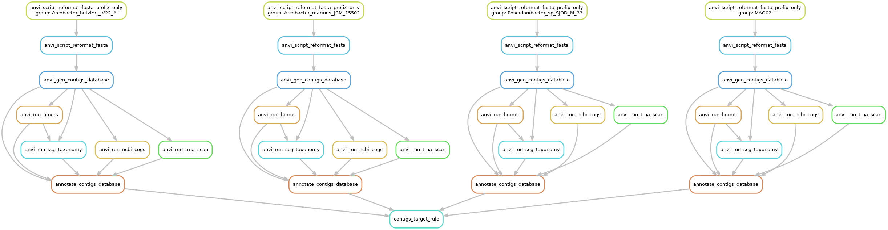

```{r setup, include=FALSE}
knitr::opts_chunk$set(collapse = TRUE)
library(kableExtra)
library(DT)
library(htmlwidgets)
library(htmltools)
```

What we want to do next is compare MAG02^[In the analysis, this MAG is named WATER_MAG_00002. For brevity we refer to it henceforth as MAG02] to publicly available genomes. We know from our binning and binning summary that MAG02 has a lot of hits to *Arcobacter*, an Epsilonproteobacteria. However, when we run

```bash
anvi-estimate-scg-taxonomy -c 18_NR-MAGs-SPLIT/WATER_MAG_00002/CONTIGS.db
```

we get 

::: l-body-outset
| MAG             | total_scgs | supporting_scgs | taxonomy                                                                                                                            |
|-----------------|------------|-----------------|-------------------------------------------------------------------------------------------------------------------------------------|
| WATER_MAG_00002 | 5          | 2               | Bacteria / Campylobacterota / Campylobacteria / Campylobacterales / Arcobacteraceae / Poseidonibacter / Poseidonibacter sp002470185 |
:::

Hum. *Poseidonibacter*. A little disagreement between the SCG classification and the short-read classification. Not too big of a deal since *Poseidonibacter* is in the Arcobacteraceae. 

# Getting Genomes from NCBI

For this workflow we largely follow the tutorial on [Accessing and including NCBI genomes in 'omics analyses in anvi'o](http://merenlab.org/2019/03/14/ncbi-genome-download-magic/) by Alon Shaiber and Meren. 

So we need genomes to compare to our MAG. As the tutorial explains, we can either use the taxa name itself or the TaxID. But before that we need to get the  [`gimme_taxa.py`](https://github.com/kblin/ncbi-genome-download#contributed-scripts-gimme_taxapy) *helper script* by [by Joe R. J. Healey](http://orcid.org/0000-0002-9569-6738) that allows us to download genomes from NCBI. Slick. 

```bash
wget https://raw.githubusercontent.com/kblin/ncbi-genome-download/master/contrib/gimme_taxa.py 
```
We can start with the taxa names themselves. 

## Getting TaxIDs to Download

```bash
python gimme_taxa.py Poseidonibacter \
                     -o Poseidonibacter-for-ngd.txt

python gimme_taxa.py Arcobacter \
                     -o Arcobacter-for-ngd.txt
```

We only got 1 hit for [*Poseidonibacter*](files/mg-phylogenomic/Poseidonibacter-TaxIDs-for-ngd.txt) but the script returned 48 for [*Arcobacter*](files/mg-phylogenomic/Arcobacter-TaxIDs-for-ngd.txt). 

What about the TaxID? 

We need to head to NCBI’s [Taxonomy Browser](https://www.ncbi.nlm.nih.gov/Taxonomy/Browser/wwwtax.cgi) and get the *parent TaxID* by  searching for the taxon name of interest, in this case *Poseidonibacter* and *Arcobacter*.

*Poseidonibacter* is [TaxID 2321187](https://www.ncbi.nlm.nih.gov/Taxonomy/Browser/wwwtax.cgi?mode=Tree&id=2321187) and *Arcobacter* is [TaxID 28196](https://www.ncbi.nlm.nih.gov/Taxonomy/Browser/wwwtax.cgi?mode=Info&id=28196). 

```bash
python gimme_taxa.py 2321187 \
                     -o Poseidonibacter-TaxIDs-for-ngd.txt

python gimme_taxa.py 28196 \
                     -o Arcobacter-TaxIDs-for-ngd.txt
```

In this case the results of using TaxID and taxon name were identical, however that is not always the case so it is good to check. 

On the taxonomy browser, both genera are part of the [*Arcobacter* group](https://www.ncbi.nlm.nih.gov/Taxonomy/Browser/wwwtax.cgi?mode=Undef&id=2321108). Since there is some ambiguity as to the identification of MAG02, we will instead use the entire group. 

```bash
python gimme_taxa.py 2321108 \
                     -o Arcobacter_Group-TaxIDs-for-ngd.txt
```

This time we get [198 hits](files/mg-phylogenomic/Arcobacter_Group-TaxIDs-for-ngd.txt). Since we only need the TaxIDs, we can rerun the command like so:

```bash
python gimme_taxa.py 2321108 \
                     -o Arcobacter_Group-TaxIDs-for-ngd-just-IDs.txt \
                     --just-taxids
```

As the command implies, we only get a list of TaxIDs. Moving on, 


## Downloading Genomes from  NCBI

To download genomes using the TaxIDs, we need a collection of scripts called `ncbi-genome-download`. See the [GitHub repo](https://github.com/kblin/ncbi-genome-download#contributed-scripts-gimme_taxapy) for installation instructions. We have a choice of where to look for genomes using the `-s` flag---either Genbank or Refseq


```bash
ncbi-genome-download -t Arcobacter_Group-TaxIDs-for-ngd-just-IDs.txt \
                     bacteria \
                     -o 00_Arcobacter_Genbank \
                     --metadata Arcobacter-NCBI-METADATA.txt \
                     -s genbank
```                     

We tested both options and found that the `-s genbank` returned 121 genomes and `-s refseq` returned 95. We compared the two lists and found nothing unique in the Refseq database so we will continue with the GenBank set. 

After all of this hullabaloo, turns out *Poseidonibacter* was not part of the download. Curious. Anyway, we ran an additional instance of the command to get these genomes. The command did not work with the TaxID so we had to use the genus name instead. At this point, can you believe anything I say? Well, you shouldn't.

```bash
ncbi-genome-download bacteria  \
                     -g Poseidonibacter \
                     -o 00_Arcobacter_Genbank \
                     --metadata Poseidonibacter-NCBI-METADATA.txt \
                     -s genbank
```

## Processing NCBI Genomes

A [metadata file](files/mg-phylogenomic/Arcobacter-NCBI-METADATA.txt) is also created by `ncbi-genome-download`. 

```grep
column -t Arcobacter-NCBI-METADATA.txt | head -n 4
```

```
assembly_accession	bioproject	biosample	wgs_master	excluded_from_refseq	refseq_category	relation_to_type_material	taxid	species_taxid	organism_name	infraspecific_name	isolate	version_status	assembly_level	release_type	genome_rep	seq_rel_date	asm_name	submitter	gbrs_paired_asm	paired_asm_comp	ftp_path	local_filename
GCA_000014025.1	PRJNA16319	SAMN02604276			representative genome	assembly from type material	367737	28197	Arcobacter butzleri RM4018	strain=RM4018		latest	Complete Genome	Major	Full	9/27/07	ASM1402v1	USDA - Agricultural Research Service, USA	GCF_000014025.1	identical	ftp://ftp.ncbi.nlm.nih.gov/genomes/all/GCA/000/014/025/GCA_000014025.1_ASM1402v1	./Arcobacter_Genbank/genbank/bacteria/GCA_000014025.1/GCA_000014025.1_ASM1402v1_genomic.gbff.gz
GCA_000185325.1	PRJNA53195	SAMN00210774	AEPT00000000.1		na		888827	28197	Arcobacter butzleri JV22	strain=JV22		latest	Scaffold	Major	Full	1/14/11	ASM18532v1	Baylor College of Medicine	GCF_000185325.1	identical	ftp://ftp.ncbi.nlm.nih.gov/genomes/all/GCA/000/185/325/GCA_000185325.1_ASM18532v1	./Arcobacter_Genbank/genbank/bacteria/GCA_000185325.1/GCA_000185325.1_ASM18532v1_genomic.gbff.gz
GCA_000215345.3	PRJNA67167	SAMN02604193			na		1036172	28197	Arcobacter butzleri 7h1h	strain=7h1h		latest	Complete Genome	Major	Full	7/24/13	ASM21534v3	University of Liverpool	GCF_000215345.2	identical	ftp://ftp.ncbi.nlm.nih.gov/genomes/all/GCA/000/215/345/GCA_000215345.3_ASM21534v3	./Arcobacter_Genbank/genbank/bacteria/GCA_000215345.3/GCA_000215345.3_ASM21534v3_genomic.gbff.gz
```

Anvi'o has a script that takes this metadata file and generates a `fasta.txt` file in the format compatible with anvi’o workflows. We will use the `--exclude-gene-calls-from-fasta-txt` because we want to do our own gene calling. 

```bash
anvi-script-process-genbank-metadata -m Arcobacter-NCBI-METADATA.txt \
                                     -o 01_Arcobacter-NCBI-GENOMES \
                                     --output-fasta-txt Arcobacter-fasta.txt
                                     --exclude-gene-calls-from-fasta-txt
```

This command returns a directory, `01_Arcobacter-NCBI-GENOMES` full of fasta files and the file [`Arcobacter-fasta.txt`](files/mg-phylogenomic/Arcobacter-fasta.txt), which contains the name and fasta file path for each genome.

```
name	path
Aliiarcobacter_faecis_GCA_000585155_1	/pool/genomics/stri_istmobiome/data/HYPOXIA_DATA/HYPOXIA/19_COMPARATIVE_GENOMICS/01_Arcobacter-NCBI-GENOMES/Aliiarcobacter_faecis_GCA_000585155_1-contigs.fa
Aliiarcobacter_faecis_GCA_013201705_1	/pool/genomics/stri_istmobiome/data/HYPOXIA_DATA/HYPOXIA/19_COMPARATIVE_GENOMICS/01_Arcobacter-NCBI-GENOMES/Aliiarcobacter_faecis_GCA_013201705_1-contigs.fa
Arcobacter_anaerophilus_GCA_000935065_1	/pool/genomics/stri_istmobiome/data/HYPOXIA_DATA/HYPOXIA/19_COMPARATIVE_GENOMICS/01_Arcobacter-NCBI-GENOMES/Arcobacter_anaerophilus_GCA_000935065_1-contigs.fa
```

# Running Snakemake Workflows

Now it is time for some comparisons. We need to add our MAG to the directory and its name to the `Arcobacter-fasta.txt` file. We will also change the names produced by `anvi-script-process-genbank-metadata` since they are not very meaningful. We use the `Arcobacter-NCBI-METADATA.txt` file, specifically the `organism_name` column to rename the genomes. I wish I could say I had a clever way to do this task, but really it was just some copying and pasting. Sadly, I am not as cool as Alon and Meren. Anyway, here is the modified [`Arcobacter-fasta-rename`](files/mg-phylogenomic/Arcobacter-fasta-rename.txt) file with MAG02 added.

> If you change the names they MUST be unique and contain no spaces, periods, dashes, or other weird characters. Letters, numbers, and underscores only. 

Ok, renamed file in hand we can prep our Snakemake workflow[@koster2012snakemake] using the built-in anvi'o [Contigs workflow](http://merenlab.org/2018/07/09/anvio-snakemake-workflows/#contigs-workflow). If you do not know what workflows are available you can run: 

```bash
anvi-run-workflow --list-workflows
```

```
WARNING
===============================================
If you publish results from this workflow, please do not forget to cite
snakemake (doi:10.1093/bioinformatics/bts480)

Available workflows ..........................: contigs, metagenomics, pangenomics, phylogenomics
```

Next, we need a config file for the contigs workflow. [Click here](files/mg-phylogenomic/contigs-default-config.json) to see the file. We made a few tweaks but this is basically the default file. 

```bash
anvi-run-workflow -w contigs --get-default-config contigs-default-config.json
```
We can also run a couple of sanity check to make sure everything is good. First, we can generate a workflow graph. 

```bash
anvi-run-workflow -w contigs -c contigs-default-config.json --save-workflow-graph
```

```
Config Error: Well, the fasta.txt entry name contains characters that anvi'o does not like :/
              Please limit the characters to ASCII letters, digits, and the underscore ('_')
              character.
```

Hum. What did I tell you, don't listen to me. Turns out I had dashes (`-`) in some names. I took those out and reran the command. 

```
WARNING
===============================================
If you publish results from this workflow, please do not forget to cite
snakemake (doi:10.1093/bioinformatics/bts480)


WARNING
===============================================
We are initiating parameters for the contigs workflow


WARNING
===============================================
You chose to define --temporary-dir-path for the rule anvi_run_ncbi_cogs in the
config file as /pool/genomics/stri_istmobiome/dbs/cog_db/tmp/. while this is
allowed, know that you are doing so at your own risk. The reason this is risky
is because this rule uses a wildcard/wildcards and hence is probably running
more than once, and this might cause a problem. In case you wanted to know,
these are the wildcards used by this rule: {group}

Workflow DOT file ............................: workflow.dot
Workflow PNG file ............................: workflow.png
```

Success. We can also do a dry run like so:

```bash
anvi-run-workflow -w contigs -c contigs-default-config.json --dry-run
```

No complaints. Things are looking good. Let's have a look at the workflow. Only four genomes are shown for clarity but each step will be conducted for all genome. 


:::l-body-outset
<figure>
<a href="figures/mg-phylogenomic/workflow.png">
  
</a>
<figcaption><strong>DAG of the contigs workflow</strong>. </figcaption>
</figure>
:::


This workflow will...


<div class="post-nav">
<div class="post-nav-item">
<div class="meta-nav">Previous</div>
<a href="mg-binning.html" rel="next">N<sup><u>o</u></sup> 5. Binning MAGs</a>
</div>
</div>

<div class="post-nav">
<div class="post-nav-item">
<div class="meta-nav">Next</div>
<a href="mg-phylogenomics.html" rel="prev">N<sup><u>o</u></sup> 7. SOMETHING</a>
</div>
</div>

## Source Code {.appendix}

The source code for this page can be accessed on GitHub by [clicking this link](https://github.com/hypocolypse/web/blob/master/mg-auto-binning.Rmd).
