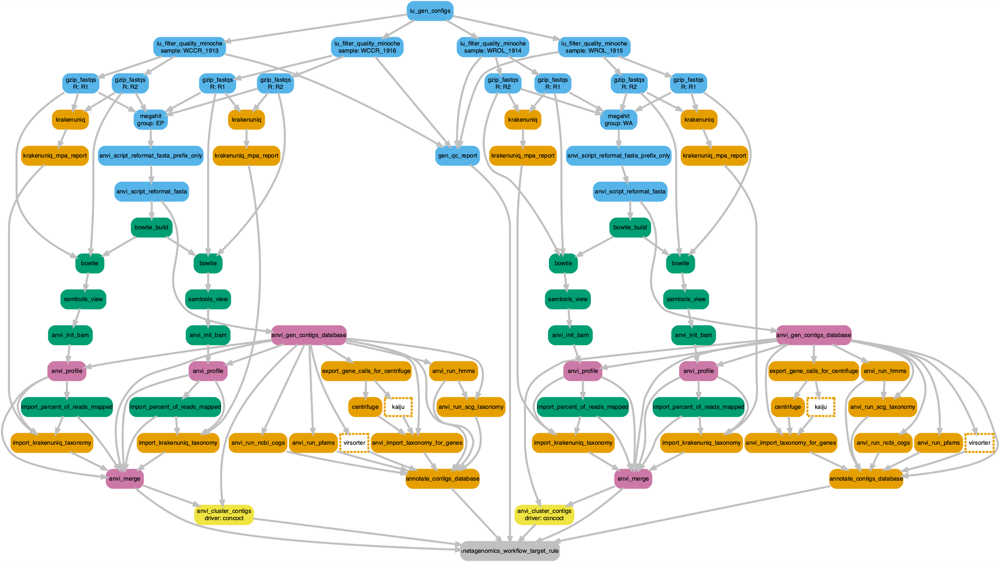

```{r setup, include=FALSE}
knitr::opts_chunk$set(echo = TRUE)
set.seed(019911)
library(DiagrammeR)
# library(htmlwidgets)
library(DiagrammeRsvg)
library(rsvg)

options(scipen=999)
knitr::opts_current$get(c(
  "cache",
  "cache.path",
  "cache.rebuild",
  "dependson",
  "autodep"
))
```

# The Workflow

In this section of the workflow we begin with raw, paired-end Illumina data. We will use a Snakemake[@koster2012snakemake] workflow in the anvi'o[@eren2015anvi] environment for most of the steps, though we will at time call on additional tools for specific steps. The overall structure of our workflow was modelled after the one described by Delmont & Eren on [Recovering Microbial Genomes from TARA Oceans Metagenomes](http://merenlab.org/data/tara-oceans-mags/)[@delmont2018nitrogen].

Specifically, we will:

  1) Perform adapter trimming.
  2) Use the anvi'o Snakemake workflow to:
      a) quality filter trimmed, raw reads;
      b) co-assemble metagenomic sets;
      c) recruit reads;
      d) profile the mapping results;
      e) merge profile dbs;
      f) classify reads and genes;
      g) annotate genes;
      h) run HMM profiles.
  3) Use  external tools for annotation and classification.

The main steps of this workflow are:

:::l-body-outset
| Task                              | Tool/Description                                        | Input                      |
|-----------------------------------|---------------------------------------------------------|----------------------------|
| TRIMMING              | TRIMMOMATIC  to remove adaptor sequences.                           |  raw reads              |
| QUALITY-FILTERING     | IU filter quality Minoche to QC trimmed reads.                      |  trimmed reads          |
| CO-ASSEMBLY           | MEGAHIT to co-assemble metagenomic samples.                         |  QC reads               |
| GENE CALLING          | PRODIGAL for gene calling. Contig db for results.                   |  assembled contigs      |
| TAXONOMIC ANNOTATION  | KrakenUniq for short read classification.                           |  QC reads               |
| RECRUITMENT           | BOWTIE2/SAMtools for mapping short reads to assembly.               |  QC reads, contigs db   |
| PROFILING             | Profile mapping results. Store in profile dbs.                      |  BAM file               |
| TAXONOMIC ANNOTATION  | KAIJU & CENTRIFUGE for classification of genes.                     |  genes (dna format)     |
| FUNCTIONAL ANNOTATION | Gene annotations against Pfams, COGS, KEGG, etc.                    |  genes (aa format)      |
| MERGING               | Create single merged profile db.                                    |  individual profile dbs |
:::

# Samples

We have a total of four samples from two sites and two time periods---so one sample per site per time. 

* *Cayo Roldan*: the site that went hypoxic.  **WROL 1914** collected during the event and **WROL 1915** collected one month after the event.
* *Cayo Coral*: the site that was always normoxic. **WCCR 1913**  collected during the event and **WCCR 1916** collected one month after the event.

# Trimming

Before we run the workflow we must trim Illumina adaptors. First we need to make some directories to put the output files.

```bash
mkdir 00_TRIMMED
mkdir 00_TRIMMED_UNPAIRED
```

Next we run TRIMMOMATIC[@bolger2014trimmomatic] assuming the raw data is in a directory called `RAW`. Here is an example for a single sample (`WCCR_1913`). Since we ran these samples on a NextSeq, there are 4 files per paired-end. So, we have 8 files total. We need to run the command 4 times, one for each pair. Here is the command for the first pair.

<aside>
[GitHub Repo for TRIMMOMATIC](https://github.com/timflutre/trimmomatic).
</aside>


```bash
runtrimmomatic PE -threads $NSLOTS RAW/WCCR_1913_S74_L001_R1_001.fastq.gz /
                                   RAW/WCCR_1913_S74_L001_R2_001.fastq.gz /
                                   00_TRIMMED/WCCR_1913_S74_L001_R1_001_trim.fastq.gz /
                                   00_TRIMMED_UNPAIRED/WCCR_1913_S74_L001_R1_001_trim_unpaired.fastq.gz /
                                   00_TRIMMED/WCCR_1913_S74_L001_R2_001_trim.fastq.gz /
                                   00_TRIMMED_UNPAIRED/WCCR_1913_S74_L001_R2_001_trim_unpaired.fastq.gz /
          ILLUMINACLIP:/share/apps/bioinformatics/trimmomatic/0.33/adapters/NexteraPE-PE.fa:2:30:10 /
          MINLEN:40
```

Now we can run the command for the other 3 pairs,

* WCCR_1913_S74_L002_R1_001 & WCCR_1913_S74_L002_R2_001
* WCCR_1913_S74_L003_R1_001 & WCCR_1913_S74_L003_R2_001
* WCCR_1913_S74_L004_R1_001 & WCCR_1913_S74_L004_R2_001

And then do the same for the rest of the samples.


<details markdown="1"><summary>Show/hide HYDRA TRIMMOMATIC job script</summary>
<pre><code>
# /bin/sh
# ----------------Parameters---------------------- #
#$ -S /bin/sh
#$ -pe mthread 16
#$ -q sThC.q
#$ -cwd
#$ -j y
#$ -N job_00_trimmomatic
#$ -o hydra_logs/job_00_trimmomatic_redo.log
#
# ----------------Modules------------------------- #
module load bioinformatics/trimmomatic
#
# ----------------Your Commands------------------- #
#
echo + `date` job $JOB_NAME started in $QUEUE with jobID=$JOB_ID on $HOSTNAME
echo + NSLOTS = $NSLOTS
#
# ----------------COMMANDS------------------- #
#
echo = `date` job $JOB_NAME don
</code></pre>
</details>

# Snakemake Workflow

Thanks to the anvi'o implementation of Snakemake we can run many commands sequentially and/or simultaneously. There is plenty of good documentation on the anvi'o website about setting up Snakemake workflows [here](http://merenlab.org/2018/07/09/anvio-snakemake-workflows/) so we will refrain from any lengthy explanations.

You can see all the settings we used and download our configs file [here](files/mg-workflow-1/default-config.txt) or grab it from  the folded code below. Some commands we chose not to run but they remain in the workflow for posterity.

<details markdown="1"><summary>Show/hide JSON-formatted configuration file.</summary>
<pre><code>
{
    "fasta_txt": "",
    "workflow_name": "metagenomics",
    "anvi_gen_contigs_database": {
        "--project-name": "{group}",
        "--description": "",
        "--skip-gene-calling": "",
        "--external-gene-calls": "",
        "--ignore-internal-stop-codons": "",
        "--skip-mindful-splitting": "",
        "--contigs-fasta": "",
        "--split-length": "",
        "--kmer-size": "",
        "--prodigal-translation-table": "",
        "threads": ""
    },
    "centrifuge": {
        "threads": 12,
        "run": true,
        "db": "/pool/genomics/stri_istmobiome/dbs/centrifuge_dbs/p+h+v"
    },
    "anvi_run_hmms": {
        "run": true,
        "threads": 5,
        "--installed-hmm-profile": "",
        "--hmm-profile-dir": ""
    },
    "anvi_run_ncbi_cogs": {
        "run": true,
        "threads": 5,
        "--cog-data-dir": "/pool/genomics/stri_istmobiome/dbs/cog_db/",
        "--sensitive": "",
        "--temporary-dir-path": "/pool/genomics/stri_istmobiome/dbs/cog_db/tmp/",
        "--search-with": ""
    },
    "anvi_run_scg_taxonomy": {
        "run": true,
        "threads": 6,
        "--scgs-taxonomy-data-dir": "/pool/genomics/stri_istmobiome/dbs/scgs-taxonomy-data/"
    },
    "anvi_script_reformat_fasta": {
        "run": true,
        "--prefix": "{group}",
        "--simplify-names": true,
        "--keep-ids": "",
        "--exclude-ids": "",
        "--min-len": "1000",
        "threads": ""
    },
    "emapper": {
        "--database": "bact",
        "--usemem": true,
        "--override": true,
        "path_to_emapper_dir": "",
        "threads": ""
    },
    "anvi_script_run_eggnog_mapper": {
        "--use-version": "0.12.6",
        "run": "",
        "--cog-data-dir": "/pool/genomics/stri_istmobiome/dbs/cog_db/",
        "--drop-previous-annotations": "",
        "threads": 20
    },
    "samples_txt": "samples.txt",
    "metaspades": {
        "additional_params": "--only-assembler",
        "threads": 7,
        "run": "",
        "use_scaffolds": ""
    },
    "megahit": {
        "--min-contig-len": 1000,
        "--memory": 0.8,
        "threads": 20,
        "run": true,
        "--min-count": "",
        "--k-min": "",
        "--k-max": "",
        "--k-step": "",
        "--k-list": "",
        "--no-mercy": "",
        "--no-bubble": "",
        "--merge-level": "",
        "--prune-level": "",
        "--prune-depth": "",
        "--low-local-ratio": "",
        "--max-tip-len": "",
        "--no-local": "",
        "--kmin-1pass": "",
        "--presets": "meta-sensitive",
        "--mem-flag": "",
        "--use-gpu": "",
        "--gpu-mem": "",
        "--keep-tmp-files": "",
        "--tmp-dir": "",
        "--continue": true,
        "--verbose": ""
    },
    "idba_ud": {
        "--min_contig": 1000,
        "threads": 7,
        "run": "",
        "--mink": "",
        "--maxk": "",
        "--step": "",
        "--inner_mink": "",
        "--inner_step": "",
        "--prefix": "",
        "--min_count": "",
        "--min_support": "",
        "--seed_kmer": "",
        "--similar": "",
        "--max_mismatch": "",
        "--min_pairs": "",
        "--no_bubble": "",
        "--no_local": "",
        "--no_coverage": "",
        "--no_correct": "",
        "--pre_correction": ""
    },
    "iu_filter_quality_minoche": {
        "run": true,
        "--ignore-deflines": true,
        "--visualize-quality-curves": "",
        "--limit-num-pairs": "",
        "--print-qual-scores": "",
        "--store-read-fate": "",
        "threads": ""
    },
    "gzip_fastqs": {
        "run": true,
        "threads": ""
    },
    "bowtie": {
        "additional_params": "--no-unal",
        "threads": 3
    },
    "samtools_view": {
        "additional_params": "-F 4",
        "threads": ""
    },
    "anvi_profile": {
        "threads": 5,
        "--sample-name": "{sample}",
        "--overwrite-output-destinations": true,
        "--report-variability-full": "",
        "--skip-SNV-profiling": "",
        "--profile-SCVs": truw,
        "--description": "",
        "--skip-hierarchical-clustering": "",
        "--distance": "",
        "--linkage": "",
        "--min-contig-length": "",
        "--min-mean-coverage": "",
        "--min-coverage-for-variability": "",
        "--cluster-contigs": "",
        "--contigs-of-interest": "",
        "--queue-size": "",
        "--write-buffer-size": 10000,
        "--max-contig-length": "",
        "--max-coverage-depth": "",
        "--ignore-orphans": ""
    },
    "anvi_merge": {
        "--sample-name": "{group}",
        "--overwrite-output-destinations": true,
        "--description": "",
        "--skip-hierarchical-clustering": "",
        "--enforce-hierarchical-clustering": "",
        "--distance": "",
        "--linkage": "",
        "threads": ""
    },
    "import_percent_of_reads_mapped": {
        "run": true,
        "threads": ""
    },
    "krakenuniq": {
        "threads": 3,
        "--gzip-compressed": true,
        "additional_params": "",
        "run": "",
        "--db": "/scratch/genomics/scottjj/kraken_dbs/DB/"
    },
    "remove_short_reads_based_on_references": {
        "delimiter-for-iu-remove-ids-from-fastq": " ",
        "dont_remove_just_map": "",
        "references_for_removal_txt": "",
        "threads": ""
    },
    "anvi_cluster_contigs": {
        "--collection-name": "{driver}",
        "run": "",
        "--driver": "concoct",
        "--just-do-it": "",
        "--additional-params-concoct": "",
        "--additional-params-metabat2": "",
        "--additional-params-maxbin2": "",
        "--additional-params-dastool": "",
        "--additional-params-binsanity": "",
        "threads": 10
    },
    "gen_external_genome_file": {
        "threads": ""
    },
    "export_gene_calls_for_centrifuge": {
        "threads": ""
    },
    "anvi_import_taxonomy_for_genes": {
        "threads": ""
    },
    "annotate_contigs_database": {
        "threads": ""
    },
    "anvi_get_sequences_for_gene_calls": {
        "threads": ""
    },
    "gunzip_fasta": {
        "threads": ""
    },
    "reformat_external_gene_calls_table": {
        "threads": ""
    },
    "reformat_external_functions": {
        "threads": ""
    },
    "import_external_functions": {
        "threads": ""
    },
    "anvi_run_pfams": {
        "run": true,
        "--pfam-data-dir": "/pool/genomics/stri_istmobiome/dbs/pfam_db",
        "threads": 5
    },
    "iu_gen_configs": {
        "--r1-prefix": "",
        "--r2-prefix": "",
        "threads": ""
    },
    "gen_qc_report": {
        "threads": ""
    },
    "merge_fastqs_for_co_assembly": {
        "threads": ""
    },
    "merge_fastas_for_co_assembly": {
        "threads": ""
    },
    "bowtie_build": {
        "threads": ""
    },
    "anvi_init_bam": {
        "threads": ""
    },
    "krakenuniq_mpa_report": {
        "threads": ""
    },
    "import_krakenuniq_taxonomy": {
        "--min-abundance": "",
        "threads": ""
    },
    "anvi_summarize": {
        "additional_params": "",
        "run": "",
        "threads": ""
    },
    "anvi_split": {
        "additional_params": "",
        "run": "",
        "threads": ""
    },
    "references_mode": "",
    "all_against_all": "",
    "kraken_txt": "",
    "collections_txt": "",
    "output_dirs": {
        "FASTA_DIR": "02_FASTA",
        "CONTIGS_DIR": "03_CONTIGS",
        "QC_DIR": "01_QC",
        "MAPPING_DIR": "04_MAPPING",
        "PROFILE_DIR": "05_ANVIO_PROFILE",
        "MERGE_DIR": "06_MERGED",
        "TAXONOMY_DIR": "07_TAXONOMY",
        "SUMMARY_DIR": "08_SUMMARY",
        "SPLIT_PROFILES_DIR": "09_SPLIT_PROFILES",
        "LOGS_DIR": "00_LOGS"
    },
    "max_threads": "",
    "config_version": "1"
}
</code></pre>
</details>

<br/>

Since we are doing a co-assembly,  we need a separate file called `samples.txt`, which can be downloaded [here](files/samples.txt). This file tells anvi'o where to find the **trimmed** fastq files for each sample and what group the sample belongs to. The file is a four-column, tab-delimited file.

::: l-body-outset
| sample   | group |               r1                        |                r2                       |
|----------|-------|-----------------------------------------|-----------------------------------------|
|WCCR_1913 | WATER | comma separated list of forward reads   | comma separated list of reverse reads   |
|WCCR_1916 | WATER | comma separated list of forward reads   | comma separated list of reverse reads   |
|WROL_1914 | WATER | comma separated list of forward reads   | comma separated list of reverse reads   |
|WROL_1915 | WATER | comma separated list of forward reads   | comma separated list of reverse reads   |
:::

Remember, there are 4 fastq files *per* direction (forward or reverse) *per* sample. So each comma separated list in the `r1` column needs four file names and the same with the `r2` column. And you must include *relative path names*.

To see what will  happen with the `config` file we can  visualize the  Snakemake workflow using a Directed acyclic graph (DAG) where edge connections represent dependencies and nodes represent commands. The workflow begins with trimmed reads and continues up to and including automatic binning of contigs. At the end of this workflow we then proceed with manual binning and MAG generation.  We  added nodes for VirSorter and Kaiju annotations since these are not part of the normal anvi'o workflow.

> Click on the image to zoom in or download a copy.

<details markdown="1"><summary>Show/hide DAG R Code script</summary>
<pre><code>
```{r workflow1, eval=FALSE}
dag <- grViz ("
digraph boxes_and_circles {
  graph [layout = dot, align=center]

  node [shape = rectangle, style = 'rounded,filled' fontname=sans, fontsize=12, penwidth=4]
  edge[penwidth=4, color=grey];

0[label = 'metagenomics_workflow_target_rule', color = 'grey'];
1[label = 'anvi_merge', color = '#CC79A7'];
2[label = 'anvi_merge', color = '#CC79A7'];
3[label = 'annotate_contigs_database', color = '#E69F00'];
4[label = 'annotate_contigs_database', color = '#E69F00'];
5[label = 'gen_qc_report', color = '#56B4E9'];
6[label = 'anvi_cluster_contigs\ndriver: concoct', color = '#F0E442'];
7[label = 'anvi_cluster_contigs\ndriver: concoct', color = '#F0E442'];
8[label = 'anvi_gen_contigs_database', color = '#CC79A7'];
9[label = 'anvi_profile', color = '#CC79A7'];
10[label = 'anvi_profile', color = '#CC79A7'];
11[label = 'import_percent_of_reads_mapped', color = '#009E73'];
12[label = 'import_percent_of_reads_mapped', color = '#009E73'];
13[label = 'import_krakenuniq_taxonomy', color = '#E69F00'];
14[label = 'import_krakenuniq_taxonomy', color = '#E69F00'];
15[label = 'anvi_gen_contigs_database', color = '#CC79A7'];
16[label = 'anvi_profile', color = '#CC79A7'];
17[label = 'anvi_profile', color = '#CC79A7'];
18[label = 'import_percent_of_reads_mapped', color = '#009E73'];
19[label = 'import_percent_of_reads_mapped', color = '#009E73'];
20[label = 'import_krakenuniq_taxonomy', color = '#E69F00'];
21[label = 'import_krakenuniq_taxonomy', color = '#E69F00'];
22[label = 'anvi_import_taxonomy_for_genes', color = '#E69F00'];
23[label = 'anvi_run_hmms', color = '#E69F00'];
24[label = 'anvi_run_ncbi_cogs', color = '#E69F00'];
25[label = 'anvi_run_scg_taxonomy', color = '#E69F00'];
26[label = 'anvi_run_pfams', color = '#E69F00'];
27[label = 'anvi_import_taxonomy_for_genes', color = '#E69F00'];
28[label = 'anvi_run_hmms', color = '#E69F00'];
29[label = 'anvi_run_ncbi_cogs', color = '#E69F00'];
30[label = 'anvi_run_scg_taxonomy', color = '#E69F00'];
31[label = 'anvi_run_pfams', color = '#E69F00'];
32[label = 'iu_filter_quality_minoche\nsample: WCCR_1913', color = '#56B4E9'];
33[label = 'iu_filter_quality_minoche\nsample: WCCR_1916', color = '#56B4E9'];
34[label = 'iu_filter_quality_minoche\nsample: WROL_1914', color = '#56B4E9'];
35[label = 'iu_filter_quality_minoche\nsample: WROL_1915', color = '#56B4E9'];
36[label = 'anvi_script_reformat_fasta', color = '#56B4E9'];
37[label = 'anvi_init_bam', color = '#009E73'];
38[label = 'anvi_init_bam', color = '#009E73'];
39[label = 'krakenuniq_mpa_report', color = '#E69F00'];
40[label = 'krakenuniq_mpa_report', color = '#E69F00'];
41[label = 'anvi_script_reformat_fasta', color = '#56B4E9'];
42[label = 'anvi_init_bam', color = '#009E73'];
43[label = 'anvi_init_bam', color = '#009E73'];
44[label = 'krakenuniq_mpa_report', color = '#E69F00'];
45[label = 'krakenuniq_mpa_report', color = '#E69F00'];
46[label = 'centrifuge', color = '#E69F00'];
47[label = 'centrifuge', color = '#E69F00'];
48[label = 'iu_gen_configs', color = '#56B4E9'];
49[label = 'anvi_script_reformat_fasta_prefix_only', color = '#56B4E9'];
50[label = 'samtools_view', color = '#009E73'];
51[label = 'samtools_view', color = '#009E73'];
52[label = 'krakenuniq', color = '#E69F00'];
53[label = 'krakenuniq', color = '#E69F00'];
54[label = 'anvi_script_reformat_fasta_prefix_only', color = '#56B4E9'];
55[label = 'samtools_view', color = '#009E73'];
56[label = 'samtools_view', color = '#009E73'];
57[label = 'krakenuniq', color = '#E69F00'];
58[label = 'krakenuniq', color = '#E69F00'];
59[label = 'export_gene_calls_for_centrifuge', color = '#E69F00'];
60[label = 'export_gene_calls_for_centrifuge', color = '#E69F00'];
61[label = 'megahit\ngroup: EP', color = '#56B4E9'];
62[label = 'bowtie', color = '#009E73'];
63[label = 'bowtie', color = '#009E73'];
64[label = 'gzip_fastqs\nR: R1', color = '#56B4E9'];
65[label = 'gzip_fastqs\nR: R2', color = '#56B4E9'];
66[label = 'gzip_fastqs\nR: R1', color = '#56B4E9'];
67[label = 'gzip_fastqs\nR: R2', color = '#56B4E9'];
68[label = 'megahit\ngroup: WA', color = '#56B4E9'];
69[label = 'bowtie', color = '#009E73'];
70[label = 'bowtie', color = '#009E73'];
71[label = 'gzip_fastqs\nR: R1', color = '#56B4E9'];
72[label = 'gzip_fastqs\nR: R2', color = '#56B4E9'];
73[label = 'gzip_fastqs\nR: R1', color = '#56B4E9'];
74[label = 'gzip_fastqs\nR: R2', color = '#56B4E9'];
75[label = 'bowtie_build', color = '#009E73'];
76[label = 'bowtie_build', color = '#009E73'];
77[label = 'virsorter', color = '#E69F00', style = 'dashed'];
78[label = 'virsorter', color = '#E69F00', style = 'dashed'];
79[label = 'kaiju', color = '#E69F00', style = 'dashed'];
80[label = 'kaiju', color = '#E69F00', style = 'dashed'];

1->0; 2->0; 3->0; 4->0; 5->0; 6->0; 7->0; 8->1; 9->1;
10->1; 11->1; 12->1; 13->1; 14->1; 15->2; 16->2; 17->2;
18->2; 19->2; 20->2; 21->2; 8->3; 22->3; 23->3; 24->3;
25->3; 26->3; 15->4; 27->4; 28->4; 29->4; 30->4; 31->4;
{32 33 34 35}->5;
48->{32 33 34 35};
32->{64 65};
33->{66 67};
{64 65 66 67}->61;
{64 65}->52;
{66 67}->53;
34->{71 72};
35->{73 74};
{71 72 73 74}->68
{71 72}->57;
{73 74}->58;

8->6; 1->6; 15->7; 2->7;
36->8; 37->9; 8->9; 38->10; 8->10; 9->11; 10->12; 39->13;
11->13; 9->13; 40->14; 12->14; 10->14; 41->15; 42->16; 15->16;
43->17; 15->17; 16->18; 17->19; 44->20; 18->20; 16->20; 45->21;
19->21; 17->21; 46->22; 8->22; 8->23; 8->24; 23->25; 8->25;
8->26; 47->27; 15->27; 15->28; 15->29; 28->30; 15->30; 15->31;
49->36; 50->37; 51->38; 52->39;
53->40; 54->41; 55->42; 56->43; 57->44; 58->45; 59->46; 60->47;
61->49; 62->50; 63->51; 68->54;
69->55; 70->56; 8->59; 15->60;
75->62; 64->62; 65->62; 75->63;
66->63; 67->63; 76->69; 71->69; 72->69; 76->70; 73->70; 74->70;
36->75; 41->76; 79->22; 80->27;
15->77; 8->78; 77->4; 78->3; 59->79; 60->80;

	graph [nodesep = 0.1]
{ rank=same; 13, 14, 20, 21 }
{ rank=same; 39, 40, 44, 45 }
{ rank=same; 32, 33, 34, 35 }
{ rank=same; 64, 65, 66, 67, 71, 72, 73, 74 }
{ rank=same; 5, 49, 54 }

}
")

export_svg(dag) %>%
  charToRaw() %>%
  rsvg() %>%
  png::writePNG("images/dag.png")
```
</code></pre>
</details>

:::l-body-outset
<figure>
<a href="figures/mg-workflow-1/dag.png">
  
</a>
<figcaption><strong>DAG of the metagenomic workflow.</strong> Colors indicate broad divisions of workflow: sky blue, short-read prep & co-assembly; blueish green, short-read mapping to assembly; orange, taxonomic or functional classification; yellow, automatic binning; reddish purple, databases construction. </figcaption>
</figure>
:::

And here are the commands we used to run the workflow.

```bash
anvi-run-workflow -w metagenomics -c default-config.txt --additional-params --jobs 63 --resources nodes=63 --keep-going --rerun-incomplete --unlock
anvi-run-workflow -w metagenomics -c default-config.txt --additional-params --jobs 63 --resources nodes=63 --keep-going --rerun-incomplete
```

If a Snakemake job fails the default behavior is to lock the workflow and because large jobs can fail for a lot of reasons, we decided to always include an identical command first with the `--unlock` flag. This will  unlock the workflow and then the second command will execute. You can find an explanation of this [here](http://merenlab.org/2018/07/09/anvio-snakemake-workflows/#how-can-i-restart-a-failed-job).

<details markdown="1"><summary>Show/hide HYDRA SNAKEMAKE job script</summary>
<pre><code>
# /bin/sh
# ----------------Parameters---------------------- #
#$ -S /bin/sh
#$ -pe mthread 20
#$ -q sThM.q
#$ -l mres=140G,h_data=7G,h_vmem=7G,himem
#$ -cwd
#$ -j y
#$ -N job_01_run_mg_workflow
#$ -o hydra_logs/job_01_run_mg_workflow.log
#
# ----------------Modules------------------------- #
module load gcc/4.9.2
#
# ----------------Your Commands------------------- #
#
echo + `date` job $JOB_NAME started in $QUEUE with jobID=$JOB_ID on $HOSTNAME
echo + NSLOTS = $NSLOTS
#
# ----------------CALLING ANVIO------------------- #
export PATH=/home/scottjj/miniconda3:$PATH
export PATH=/home/scottjj/miniconda3/bin:$PATH
source activate anvio-master
#
# ----------------COOLIO?------------------- #
which python
python --version
source /home/scottjj/virtual-envs/anvio-master/bin/activate
which python
python --version
which anvi-interactive
diamond --version
anvi-self-test -v
#
# ----------------TEMP DIRECTORIES------------------- #
rm -r /pool/genomics/stri_istmobiome/dbs/cog_db/tmp/
mkdir -p /pool/genomics/stri_istmobiome/dbs/cog_db/tmp/
#
rm -r /pool/genomics/stri_istmobiome/dbs/pfam_db/tmp_data/
mkdir -p /pool/genomics/stri_istmobiome/dbs/pfam_db/tmp_data/
TMPDIR="/pool/genomics/stri_istmobiome/dbs/pfam_db/tmp_data/"
#
# ----------------COMMANDS------------------- #
#
anvi-run-workflow -w metagenomics -c default-config.txt --additional-params --jobs 20 --resources nodes=20 --keep-going --rerun-incomplete --unlock
anvi-run-workflow -w metagenomics -c default-config.txt --additional-params --jobs 20 --resources nodes=20 --keep-going --rerun-incomplete
echo = `date` job $JOB_NAME don
</code></pre>
</details>

## Snakemake Citations

There are many tools used in the workflow that need to be cited.

First there is the workflow engine itself---Snakemake[@koster2012snakemake]. QUALITY-FILTERING of raw reads was performed using Illumina Utils[@eren2013filtering] implementation of the filter developed by Minoche and collegues[@minoche2011evaluation]. CO-ASSEMBLY of metagenomic samples performed using MEGAHIT[@li2015megahit]. GENE CALLING was performed using PRODIGAL[@hyatt2010prodigal]. RECRUITMENT (a.k.a. mapping) of reads to assembly performed using BOWTIE2[@langmead2012fast] and SAMtools[@li2009sequence]. TAXONOMIC CLASSIFICATION of genes using CENTRIFUGE[@kim2016centrifuge].

<aside>
Documentation for [Snakemake](https://snakemake.readthedocs.io/en/stable/). GitHub repo for [Illumina Utils](https://github.com/merenlab/illumina-utils). GitHub repo for [MEGAHIT](https://github.com/voutcn/megahit). GitHub repo for [PRODIGAL](https://github.com/hyattpd/Prodigal). GitHub repo for [BOWTIE2](https://github.com/BenLangmead/bowtie2). Documentation for  [SAMtools](http://samtools.sourceforge.net/) GitHub repo for [CENTRIFUGE](https://github.com/DaehwanKimLab/centrifuge).
</aside>

Also, there are a few tools that we ran outside of the Snakemake workflow. Results from these steps need to be added to the individual `PROFILE.db`'s, merged `PROFILE.db`, or `CONTIGS.db`. Therefore, before the `anvi-merge` portion of the Snakemake workflow finished, we killed the job, ran the accessory analyses described below, and then restarted the workflow to finish the missing step. Cumbersome, yes, but it got the job done.

# Taxonomic Annotations

In this section we conduct taxonomic classification of short reads, contigs, and gene calls.

## Kaken Annotation

In this section we use KrakenUniq[@breitwieser2018krakenuniq] to classify the **short reads**. Because of the memory demands of KrakenUniq, we could not get this to work in the Snakemake workflow, so we ran the analysis separately. For several of these commands we used lists of sample names and  `for` loops to run through each sample.

<aside>
GitHub repo for [KrakenUniq](https://github.com/fbreitwieser/krakenuniq).
</aside>

Ok, here we run KrakenUniq and several reporting and summary steps against the short-read data for each sample using the [list.txt](files/mg-workflow-1/list.txt) file.

```bash
for sample in `cat list.txt`
do
    krakenuniq --report-file $KRAKEN/$sample-REPORT.tsv 01_QC/$sample-QUALITY_PASSED_R1.fastq.gz 01_QC/$sample-QUALITY_PASSED_R2.fastq.gz --db $K_FILES/DB/ --threads $NSLOTS --preload  --fastq-input --gzip-compressed --paired --output $KRAKEN/$sample-kraken.out

    krakenuniq-report --db $K_FILES/DB/ $KRAKEN/$sample-kraken.out > $KRAKEN/$sample-kraken_report.txt
    krakenuniq-mpa-report --header-line --db $K_FILES/DB/ $KRAKEN/$sample-kraken.out > $KRAKEN/$sample-kraken_mpa_report.txt
    krakenuniq-translate --db $K_FILES/DB/ $KRAKEN/$sample-kraken.out > $KRAKEN/$sample-kraken.trans
done
```

Next, we format the output to make Krona plots.

```bash
for sample in `cat list.txt`
do
    $KRA_to_KRON/kraken_to_krona.py $KRAKEN/$sample-kraken.trans > $KRAKEN/$sample-kraken.krona
done
```

And finally construct Krona[@ondov2011krona] plots. We will come back to Krona plots when we explain what they are and how to use them in the [Assembly & Annotation Summary](mg-workflow-2.html#krona-plots-explained) section of the workflow.


<aside>
[GitHub Repo for Krona](https://github.com/marbl/Krona/wiki).
</aside>


```bash
for sample in `cat list.txt`
do
    ktImportText -o $KRAKEN/$sample-kraken.html $KRAKEN/$sample-kraken.krona
done
```
We can also make standalone HTML pages from each assembly containing all Krona plots.

```bash
ktImportText -o $KRAKEN/WATER-kraken.html $KRAKEN/WCCR_1913-kraken.krona $KRAKEN/WCCR_1916-kraken.krona $KRAKEN/WROL_1914-kraken.krona $KRAKEN/WROL_1915-kraken.krona
```
Or add the `-c` flag to make a single plot where samples are combined.

Now we have a Krona plot page for the water sample.

<details markdown="1"><summary>Show/hide HYDRA Kraken classification job details</summary>
<pre><code>
# /bin/sh
# ----------------Parameters---------------------- #
#$ -S /bin/sh
#$ -pe mthread 3
#$ -q mThM.q
#$ -l mres=150G,h_data=150G,h_vmem=150G,himem
#$ -cwd
#$ -j y
#$ -N job_04_taxonomic_classification_kraken_reads
#$ -o hydra_logs/job_04_taxonomic_classification_kraken_reads.job
#
# ----------------Modules------------------------- #
#
# ----------------Load Envs------------------- #
#
echo + `date` job $JOB_NAME started in $QUEUE with jobID=$JOB_ID on $HOSTNAME
echo + NSLOTS = $NSLOTS
#
# ----------------Activate Kraken -------------- #
#
export PATH=/home/scottjj/miniconda3/bin:$PATH
source activate kraken
# ----------------SETUP Kraken Directories-------------- #
#
mkdir 07_TAXONOMY/KRAKEN/
mkdir 07_TAXONOMY/KRAKEN/READS
#
KRAKEN='/pool/genomics/stri_istmobiome/data/HYPOXIA_DATA/HYPOXIA/07_TAXONOMY/KRAKEN_TAXONOMY/MICROBIAL-NT/'
K_FILES='/scratch/genomics/scottjj/kraken_dbs/microbial-nt/'
KRA_to_KRON='/home/scottjj/miniconda3/envs/metawrap/bin/metawrap-scripts/'
# ----------------Run Kraken------------------- #
#
for sample in `cat list.txt`
do
    krakenuniq --report-file $KRAKEN/$sample-REPORT.tsv 01_QC/$sample-QUALITY_PASSED_R1.fastq.gz 01_QC/$sample-QUALITY_PASSED_R2.fastq.gz --db $K_FILES/DB/ --threads $NSLOTS --preload  --fastq-input --gzip-compressed --paired --output $KRAKEN/$sample-kraken.out
    krakenuniq-report --db $K_FILES/DB/ $KRAKEN/$sample-kraken.out > $KRAKEN/$sample-kraken_report.txt
    krakenuniq-mpa-report --header-line --db $K_FILES/DB/ $KRAKEN/$sample-kraken.out > $KRAKEN/$sample-kraken_mpa_report.txt
    krakenuniq-translate --db $K_FILES/DB/ $KRAKEN/$sample-kraken.out > $KRAKEN/$sample-kraken.trans
done
source deactivate
#
source deactivate
#
# ----------------FORMAT FOR KRONA------------------- #
#
source activate metawrap
#
for sample in `cat list.txt`
do
    $KRA_to_KRON/kraken_to_krona.py $KRAKEN/$sample-kraken.trans > $KRAKEN/$sample-kraken.krona
done
source deactivate
#
# ----------------MAKE KRONA PLOTS------------------- #
#
source activate krona
#
for sample in `cat list.txt`
#
do
    ktImportText -o $KRAKEN/$sample-kraken.html $KRAKEN/$sample-kraken.krona
done
#
ktImportText -o $KRAKEN/WATER-kraken.html $KRAKEN/WCCR_1913-kraken.krona $KRAKEN/WCCR_1916-kraken.krona $KRAKEN/WROL_1914-kraken.krona $KRAKEN/WROL_1915-kraken.krona
#
source deactivate
#
echo = `date` job $JOB_NAME don
</code></pre>
</details>

###  Kraken import

At this point we now add the kraken summary annotations to each individual `PROFILE.db` created in the Snakemake workflow. Again we used lists of sample names and  `for` loops to run through each sample.

```bash
for sample in `cat list.txt`
do
    anvi-import-taxonomy-for-layers -p 05_ANVIO_PROFILE/WATER/$sample/PROFILE.db --parse krakenuniq -i 07_TAXONOMY/KRAKEN_TAXONOMY/MICROBIAL-NT/$sample-kraken_mpa_report.txt
done
```

<details markdown="1"><summary>Show/hide HYDRA Import Kraken taxonomy job details</summary>
<pre><code>
# /bin/sh
# ----------------Parameters---------------------- #
#$ -S /bin/sh
#$ -q sThC.q
#$ -l mres=5G,h_data=5G,h_vmem=5G
#$ -cwd
#$ -j y
#$ -N job_06_import_taxonomy_for_layers
#$ -o hydra_logs/job_06_import_taxonomy_for_layers.log
#
# ----------------Modules------------------------- #
module load gcc/4.9.2
#
# ----------------Your Commands------------------- #
#
echo + `date` job $JOB_NAME started in $QUEUE with jobID=$JOB_ID on $HOSTNAME
echo + NSLOTS = $NSLOTS
#
# ----------------Activate Anvio -------------- #
#
export PATH=/home/scottjj/miniconda3:$PATH
export PATH=/home/scottjj/miniconda3/bin:$PATH
source activate anvio-master
#
which python
python --version
source /home/scottjj/virtual-envs/anvio-master/bin/activate
which python
python --version
which anvi-interactive
diamond --version
anvi-self-test -v
#
# ----------------Import Kraken Annotations------------------- #
#
for sample in `cat list.txt`
#
do
    anvi-import-taxonomy-for-layers -p 05_ANVIO_PROFILE/WATER/$sample/PROFILE.db --parse krakenuniq -i 07_TAXONOMY/KRAKEN_TAXONOMY/MICROBIAL-NT/$sample-kraken_mpa_report.txt
done
#
source deactivate
#
echo = `date` job $JOB_NAME don
</code></pre>
</details>
<br/>

After this you need to rerun `anvi-merge` so that the short-read annotations make it into the merged `PROFILE.db`. But we will get to that in a minute.

## VirSorter Annotation

To classify any viral sequences, we ran VirSorter[@roux2015virsorter] on contigs from the co-assembly using our newly created `contig.db` generated after the co-assembly step. We ran VirSorter with and without the `--virome` flag. See [issue 40](https://github.com/simroux/VirSorter/issues/40) on the VirSorter GitHub site for a discussion of why we did this. We used DIAMOND[@buchfink2015fast] as the local sequence aligner.

<aside>
[GitHub Repo for VirSorter](https://github.com/simroux/VirSorter). Documentation for [DIAMOND](http://www.diamondsearch.org/index.php).
</aside>

Here is the VirSorter workflow.

```bash
wrapper_phage_contigs_sorter_iPlant.pl -f 02_FASTA/WATER/WATER-contigs.fa --ncpu $NSLOTS --db 2 --wdir 07_TAXONOMY/VIRSORTER/WATER --data-dir /pool/genomics/stri_istmobiome/dbs/virsorter/virsorter-data --diamond
wrapper_phage_contigs_sorter_iPlant.pl -f 02_FASTA/WATER/WATER-contigs.fa --ncpu $NSLOTS --db 2 --wdir 07_TAXONOMY/VIRSORTER_VIROME/WATER --data-dir /pool/genomics/stri_istmobiome/dbs/virsorter/virsorter-data --diamond --virome
```

<details markdown="1"><summary>Show/hide HYDRA VIRSORTER job script</summary>
<pre><code>
# /bin/sh
# ----------------Parameters---------------------- #
#$ -S /bin/sh
#$ -pe mthread 10
#$ -q sThC.q
#$ -l mres=50G,h_data=5G,h_vmem=5G
#$ -cwd
#$ -j y
#$ -N job_03_run_virsorter
#$ -o hydra_logs/job_03_run_virsorter.log
#
# ----------------Modules------------------------- #
module load gcc/4.9.2
#
# ----------------Your Commands------------------- #
#
echo + `date` job $JOB_NAME started in $QUEUE with jobID=$JOB_ID on $HOSTNAME
echo + NSLOTS = $NSLOTS
#
export PATH=/home/scottjj/miniconda3:$PATH
export PATH=/home/scottjj/miniconda3/bin:$PATH
# ----------------Calling Virsorter------------------- #
#
source activate virsorter
which perl
#
# ----------------Make directories------------------- #
mkdir 07_TAXONOMY/
mkdir 07_TAXONOMY/VIRSORTER/
#
# ----------------COMMANDS------------------- #
wrapper_phage_contigs_sorter_iPlant.pl -f 02_FASTA/WATER/WATER-contigs.fa --ncpu $NSLOTS --db 2 --wdir 07_TAXONOMY/VIRSORTER/WATER --data-dir /pool/genomics/stri_istmobiome/dbs/virsorter/virsorter-data --diamond
#
wrapper_phage_contigs_sorter_iPlant.pl -f 02_FASTA/WATER/WATER-contigs.fa --ncpu $NSLOTS --db 2 --wdir 07_TAXONOMY/VIRSORTER_VIROME/WATER --data-dir /pool/genomics/stri_istmobiome/dbs/virsorter/virsorter-data --diamond --virome
#
source deactivate
#
echo = `date` job $JOB_NAME don
</code></pre>
</details>

## Kaiju Annotation

In addition to the Centrifuge classification we are going to use Kaiju[@menzel2016fast] to classify gene calls. We do this against the [two databases](https://github.com/bioinformatics-centre/kaiju#creating-the-reference-database-and-index) we built on the [Annotation Databases](mg-databases.html/#kaiju) page.

<aside>
GitHub repo for [Kaiju](https://github.com/bioinformatics-centre/kaiju).
</aside>

First we need to activate anvi'o, make a directory for the output, and grab the gene calls. Note that `$KAIJU` is the path to the input/output directory, which in this case is the new directory, `07_TAXONOMY/KAIJU/`.

```bash
mkdir 07_TAXONOMY/KAIJU/
anvi-get-sequences-for-gene-calls -c 03_CONTIGS/WATER-contigs.db -o $KAIJU/WATER_gene_calls.fna
```

Next we run the Kaiju commands against the `nr_euk` database and then the `mar` database. Note that `$K_FILES` is the path to the database and `$KAIJU` is the path to the input/output directory.

```bash
# against nr_euk db
kaiju -t $K_FILES/nr_db/nodes.dmp -f $K_FILES/nr_db/nr_euk/kaiju_db_nr_euk.fmi -i $KAIJU/WATER_gene_calls.fna -o $KAIJU/WATER_kaiju_nr.out -z 16 -v
# against mar db
kaiju -t $K_FILES/marine_db/nodes.dmp -f $K_FILES/marine_db/marine_db/kaiju_db_mar.fmi -i $KAIJU/WATER_gene_calls.fna -o $KAIJU/WATER_kaiju_mar.out -z 16 -v
```

Finally, we need to add taxon names to the output in order to import the taxonomy into the `contig.db` later on. We will also compare the output of the two classifications.

```bash
# against nr_euk db
kaiju-addTaxonNames -t $K_FILES/nr_db/nodes.dmp -n $K_FILES/nr_db/names.dmp -i $KAIJU/WATER_kaiju_nr.out -o $KAIJU/WATER_kaiju_nr.names -r superkingdom,phylum,order,class,family,genus,species
# against mar db
kaiju-addTaxonNames -t $K_FILES/marine_db/nodes.dmp -n $K_FILES/marine_db/names.dmp -i $KAIJU/WATER_kaiju_mar.out -o $KAIJU/WATER_kaiju_mar.names -r superkingdom,phylum,order,class,family,genus,species
```

<details markdown="1"><summary>Show/hide HYDRA KAIJU job script</summary>
<pre><code>
# /bin/sh
# ----------------Parameters---------------------- #
#$ -S /bin/sh
#$ -pe mthread 20
#$ -q sThC.q
#$ -l mres=120G,h_data=6G,h_vmem=6G
#$ -cwd
#$ -j y
#$ -N job_04_taxonomic_classification_kaiju
#$ -o hydra_logs/job_04_taxonomic_classification_kaiju.job
#
# ----------------Modules------------------------- #
#
# ----------------Load Envs------------------- #
#
echo + `date` job $JOB_NAME started in $QUEUE with jobID=$JOB_ID on $HOSTNAME
echo + NSLOTS = $NSLOTS
#
export PATH=/home/scottjj/miniconda3:$PATH
export PATH=/home/scottjj/miniconda3/bin:$PATH
export PATH=/home/scottjj/miniconda3/envs/kaiju/bin:$PATH
export PATH=/home/scottjj/miniconda3/envs/krona/bin:$PATH
export PATH=/pool/genomics/stri_istmobiome/dbs/kaiju_db/:$PATH
#
#NOT SURE IF THE FOLLOWING TWO LINES ARE NEEDED
export PERL5LIB="/home/scottjj/miniconda3/envs/kaiju/lib/5.26.2"
export PERL5LIB="/home/scottjj/miniconda3/envs/kaiju/lib/5.26.2/x86_64-linux-thread-multi:$PERL5LIB"
# ----------------SETUP KAIJU Directories-------------- #
#
mkdir 07_TAXONOMY/KAIJU/
KAIJU='/pool/genomics/stri_istmobiome/data/HYPOXIA_DATA/HYPOXIA/07_TAXONOMY/KAIJU/'
K_FILES='/pool/genomics/stri_istmobiome/dbs/kaiju_db'
#
# ----------------Get Gene Files------------------- #
source activate anvio-6.1
#
anvi-get-sequences-for-gene-calls -c 03_CONTIGS/WATER-contigs.db -o $KAIJU/WATER_gene_calls.fna
#
source deactivate
#
# ----------------RUN KAIJU------------------- #
source activate kaiju
which kaiju
gcc --version
which perl
# ----------------AGAINST nr DB------------------- #
#
kaiju -t $K_FILES/nr_db/nodes.dmp -f $K_FILES/nr_db/nr_euk/kaiju_db_nr_euk.fmi -i $KAIJU/WATER_gene_calls.fna -o $KAIJU/WATER_kaiju_nr.out -z 16 -v
#
kaiju-addTaxonNames -t $K_FILES/nr_db/nodes.dmp -n $K_FILES/nr_db/names.dmp -i $KAIJU/WATER_kaiju_nr.out -o $KAIJU/WATER_kaiju_nr.names -r superkingdom,phylum,order,class,family,genus,species
#
# ----------------AGAINST marine DB------------------- #
#
kaiju -t $K_FILES/marine_db/nodes.dmp -f $K_FILES/marine_db/marine_db/kaiju_db_mar.fmi -i $KAIJU/WATER_gene_calls.fna -o $KAIJU/WATER_kaiju_mar.out -z 16 -v
#
kaiju-addTaxonNames -t $K_FILES/marine_db/nodes.dmp -n $K_FILES/marine_db/names.dmp -i $KAIJU/WATER_kaiju_mar.out -o $KAIJU/WATER_kaiju_mar.names -r superkingdom,phylum,order,class,family,genus,species
#
source deactivate
#
echo = `date` job $JOB_NAME don
</code></pre>
</details>

### Kaiju Import

Now it is time to add the Kaiju annotation to the `contig.db`. We will also use the opportunity to generate some [Krona plots](https://github.com/marbl/Krona/wiki). We will discuss these in more detail in the next chapter.

First we need to take the Kaiju-formatted output file and format it from Krona. We can do this for the results from both annotations.

```bash
# from nr_euk db
kaiju2krona -t $K_FILES/nr_db/nodes.dmp -n $K_FILES/nr_db/names.dmp -i $KAIJU/WATER_kaiju_nr.out -o $KAIJU/WATER_kaiju_nr.out.krona
# from mar db
kaiju2krona -t $K_FILES/marine_db/nodes.dmp -n $K_FILES/marine_db/names.dmp -i $KAIJU/WATER_kaiju_mar.out -o $KAIJU/WATER_kaiju_mar.out.krona
```

While we are at it, lets also generate some summary files of taxonomic content, again from both annotations.

```bash
# from nr_euk db
kaiju2table -t $K_FILES/nr_db/nodes.dmp -n $K_FILES/nr_db/names.dmp -r class $KAIJU/WATER_kaiju_nr.out -l phylum,class,order,family -o $KAIJU/WATER_kaiju_nr.out.summary
# from mar db
kaiju2table -t $K_FILES/marine_db/nodes.dmp -n $K_FILES/marine_db/names.dmp -r class $KAIJU/WATER_kaiju_mar.out -l phylum,class,order,family -o $KAIJU/WATER_kaiju_mar.out.summary
```

Now we will the output files from above to generate Krona plots for  each annotation and send the output to  HTML files. For this we use the krona conda package.

```bash
# from nr_euk db
ktImportText -o $KAIJU/WATER_kaiju_nr.out.html $KAIJU/WATER_kaiju_nr.out.krona
#from mar db
ktImportText -o $KAIJU/WATER_kaiju_mar.out.html $KAIJU/WATER_kaiju_mar.out.krona
```
Finally, it is time to import the Kaiju taxonomies into the `contig.db` for each assembly. As we will see later, the `mar db` annotations called very few viral sequences, even though we know from Virsorter there are a lot of viruses. Therefore, we decided to use the `nr db` annotations.

```bash
anvi-import-taxonomy-for-genes -c 03_CONTIGS/WATER-contigs.db -p kaiju -i $KAIJU/WATER_kaiju_nr.names --just-do-it
```

<details markdown="1"><summary>Show/hide HYDRA KAIJU import and summarize job script</summary>
<pre><code>
# /bin/sh
# ----------------Parameters---------------------- #
#$ -S /bin/sh
#$ -pe mthread 5
#$ -q sThC.q
#$ -l mres=25G,h_data=5G,h_vmem=5G
#$ -cwd
#$ -j y
#$ -N job_05_kaiju_summary
#$ -o hydra_logs/job_05_kaiju_summary.job
#
# ----------------Modules------------------------- #
#
# ----------------Load Envs------------------- #
#
echo + `date` job $JOB_NAME started in $QUEUE with jobID=$JOB_ID on $HOSTNAME
echo + NSLOTS = $NSLOTS
#
export PATH=/home/scottjj/miniconda3:$PATH
export PATH=/home/scottjj/miniconda3/bin:$PATH
export PATH=/home/scottjj/miniconda3/envs/kaiju/bin:$PATH
export PATH=/home/scottjj/miniconda3/envs/krona/bin:$PATH
export PATH=/pool/genomics/stri_istmobiome/dbs/kaiju_db/:$PATH
#
#NOT SURE IF THE FOLLOWING TWO LINES ARE NEEDED
export PERL5LIB="/home/scottjj/miniconda3/envs/kaiju/lib/5.26.2"
export PERL5LIB="/home/scottjj/miniconda3/envs/kaiju/lib/5.26.2/x86_64-linux-thread-multi:$PERL5LIB"
# ----------------SETUP KAIJU Directories-------------- #
#
KAIJU='/pool/genomics/stri_istmobiome/data/HYPOXIA_DATA/HYPOXIA/07_TAXONOMY/KAIJU/'
K_FILES='/pool/genomics/stri_istmobiome/dbs/kaiju_db/'
#
# ----------------Activate------------------- #
source activate kaiju
which kaiju
gcc --version
which perl
# ----------------get files for KRONA plots------------------- #
#
# ----------------nr_euk db------------------- #
kaiju2krona -t $K_FILES/nr_db/nodes.dmp -n $K_FILES/nr_db/names.dmp -i $KAIJU/WATER_kaiju_nr.out -o $KAIJU/WATER_kaiju_nr.out.krona
#
kaiju2table -t $K_FILES/nr_db/nodes.dmp -n $K_FILES/nr_db/names.dmp -r class $KAIJU/WATER_kaiju_nr.out -l phylum,class,order,family -o $KAIJU/WATER_kaiju_nr.out.summary
#
# ----------------mar db------------------- #
#
kaiju2krona -t $K_FILES/marine_db/nodes.dmp -n $K_FILES/marine_db/names.dmp -i $KAIJU/WATER_kaiju_mar.out -o $KAIJU/WATER_kaiju_mar.out.krona
#
kaiju2table -t $K_FILES/marine_db/nodes.dmp -n $K_FILES/marine_db/names.dmp -r class $KAIJU/WATER_kaiju_mar.out -l phylum,class,order,family -o $KAIJU/WATER_kaiju_mar.out.summary
#
# ----------------Build KRONA plots------------------- #
source activate krona
ktImportText -o $KAIJU/WATER_kaiju_nr.out.html $KAIJU/WATER_kaiju_nr.out.krona
#
ktImportText -o $KAIJU/WATER_kaiju_mar.out.html $KAIJU/WATER_kaiju_mar.out.krona
conda deactivate
#--------------------ANVIO PARSER--------------#
source activate anvio-master
#
which python
python --version
source /home/scottjj/virtual-envs/anvio-master/bin/activate
which python
python --version
which anvi-interactive
diamond --version
anvi-self-test -v
#
anvi-import-taxonomy-for-genes -c 03_CONTIGS/WATER-contigs.db -p kaiju -i $KAIJU/WATER_kaiju_nr.names --just-do-it
#
source deactivate
#
echo = `date` job $JOB_NAME don
</code></pre>
</details>

# Functional Annotations

## SCG Taxonomy &  Pfam

Here we run  single-copy core genes in the `contigs.db` with taxonomic names against a local SCG taxonomy database. After this we can run  `anvi-estimate-scg-taxonomy` to estimate taxonomy at genome-, collection-, or metagenome-level. We also needed to rerun the Pfam analysis because the original workflow failed at this step because of an improperly entered db path.

```bash
# Against SCG
anvi-run-scg-taxonomy -c 03_CONTIGS/WAATER-contigs.db -P 1 -T $NSLOTS
# Against Pfam
anvi-run-pfams -c 03_CONTIGS/WATER-contigs.db --pfam-data-dir $PATH/pfam_db/ -T $NSLOTS
```

<details markdown="1"><summary>Show/hide HYDRA SCG & Pfam job details</summary>
<pre><code>
# /bin/sh
# ----------------Parameters---------------------- #
#$ -S /bin/sh
#$ -pe mthread 20
#$ -q mThM.q
#$ -l mres=200G,h_data=10G,h_vmem=10G,himem
#$ -cwd
#$ -j y
#$ -N job_07_run_scg_tax_and_pfam
#$ -o hydra_logs/job_07_run_scg_tax_and_pfam.log
#
# ----------------Modules------------------------- #
module load gcc/4.9.2
#
# ----------------Your Commands------------------- #
#
echo + `date` job $JOB_NAME started in $QUEUE with jobID=$JOB_ID on $HOSTNAME
echo + NSLOTS = $NSLOTS
#
# ----------------Activate Anvio -------------- #
#
export PATH=/home/scottjj/miniconda3:$PATH
export PATH=/home/scottjj/miniconda3/bin:$PATH
source activate anvio-master
#
which python
python --version
source /home/scottjj/virtual-envs/anvio-master/bin/activate
which python
python --version
which anvi-interactive
diamond --version
anvi-self-test -v
#
# ----------------Setup tmp directories------------------- #
rm -r /pool/genomics/stri_istmobiome/dbs/scgs-taxonomy-data/tmp_data/
mkdir -p /pool/genomics/stri_istmobiome/dbs/scgs-taxonomy-data/tmp_data/
TMPDIR="/pool/genomics/stri_istmobiome/dbs/scgs-taxonomy-data/tmp_data/"
#
rm -r /pool/genomics/stri_istmobiome/dbs/pfam_db/tmp_data/
mkdir -p /pool/genomics/stri_istmobiome/dbs/pfam_db/tmp_data/
TMPDIR="/pool/genomics/stri_istmobiome/dbs/pfam_db/tmp_data/"
#
# ----------------run anvio commands------------------- #
#
anvi-run-scg-taxonomy -c 03_CONTIGS/WATER-contigs.db -P 1 -T $NSLOTS
#
anvi-run-pfams -c 03_CONTIGS/WAATER-contigs.db --pfam-data-dir /pool/genomics/stri_istmobiome/dbs/pfam_db/ -T $NSLOTS
#
echo = `date` job $JOB_NAME done
</code></pre>
</details>

## GhostKOALA Annotations

The last thing we can do is run KEGG[@kanehisa2000kegg] annotations using the [GhostKOALA server](http://www.kegg.jp/ghostkoala/)[@kanehisa2016blastkoala]. Running GhostKOALA/KEGG  was pretty easy thanks to this [handy tutorial](http://merenlab.org/2018/01/17/importing-ghostkoala-annotations/).

The steps we used to annotate genes with GhostKOALA/KEGG are reproduced from the tutorial.

A little setup first. Make a directory for the analysis and grab the parsing script.
```bash
mkdir -p GhostKOALA/
git clone https://github.com/edgraham/GhostKoalaParser.git
```

Now we need to export anvio gene calls as amino acid sequences.

```bash
anvi-get-sequences-for-gene-calls -c 03_CONTIGS/WATER-contigs.db --get-aa-sequences -o GhostKOALA/WATER-protein-sequences.fa
anvi-get-sequences-for-gene-calls -c 03_CONTIGS/MAT-contigs.db --get-aa-sequences -o GhostKOALA/MAT-protein-sequences.fa
```

Because of a peculiarity with the way the server handles fasta files we need to modify the fasta headers. Anvio gene calls begin with a digit and the server doesn't like that. So, we will the prefix `genecall` to every gene call ID.

```bash
sed -i 's/>/>genecall_/' GhostKOALA/WATER-protein-sequences.fa
sed -i 's/>/>genecall_/' GhostKOALA/MAT-protein-sequences.fa
```

At this point we can upload our modified amino acid gene call files to the [GhostKOALA](http://www.kegg.jp/ghostkoala/) server.


> You can only run one instance of GhostKOALA at a time per email address and the upload limit is 300Mb. You may need to split large fasta files into smaller chunks.


<details markdown="1"><summary>Show/hide HYDRA GhostKOALA annotation import job script</summary>
<pre><code>
# /bin/sh
# ----------------Parameters---------------------- #
#$ -S /bin/sh
#$ -pe mthread 20
#$ -q sThM.q
#$ -l mres=140G,h_data=7G,h_vmem=7G,himem
#$ -cwd
#$ -j y
#$ -N job_06_run_ghostkoala
#$ -o hydra_logs/job_01_run_ghostkoala.log
#$ -M scottjj@si.edu
#
# ----------------Modules------------------------- #
module load gcc/4.9.2
#
# ----------------Your Commands------------------- #
#
echo + `date` job $JOB_NAME started in $QUEUE with jobID=$JOB_ID on $HOSTNAME
echo + NSLOTS = $NSLOTS
#
# ----------------Activate Anvio -------------- #
#
export PATH=/home/scottjj/miniconda3:$PATH
export PATH=/home/scottjj/miniconda3/bin:$PATH
source activate anvio-master
#
which python
python --version
source /home/scottjj/virtual-envs/anvio-master/bin/activate
which python
python --version
which anvi-interactive
diamond --version
anvi-self-test -v
#
# ----------------Setup -------------- #
#
mkdir -p GhostKOALA/
git clone https://github.com/edgraham/GhostKoalaParser.git
# ----------------Export Anvio Gene Calls -------------- #
#
anvi-get-sequences-for-gene-calls -c 03_CONTIGS/WATER-contigs.db --get-aa-sequences -o GhostKOALA/WATER-protein-sequences.fa
anvi-get-sequences-for-gene-calls -c 03_CONTIGS/MAT-contigs.db --get-aa-sequences -o GhostKOALA/MAT-protein-sequences.fa
# ----------------Reformat fata headers -------------- #
#
sed -i 's/>/>genecall_/' 07_GhostKOALA/WATER-protein-sequences.fa
sed -i 's/>/>genecall_/' 07_GhostKOALA/MAT-protein-sequences.fa
# ----------------STOP!!! Run GhostKOALA-------------- #
# At this point you must upload modified gene calls to the SERVER
# http://www.kegg.jp/ghostkoala/
#
echo = `date` job $JOB_NAME don
</code></pre>
</details>

### Import GhostKOALA

Once the jobs have finished we can import the data into our contig databases. In the repository you cloned earlier there is a file called `KO_Orthology_ko00001.txt`. [See this](http://merenlab.org/2018/01/17/importing-ghostkoala-annotations/#generate-the-kegg-orthology-table) section for an explanation of the next step about converting the KEGG Orthology assignments to functions. We need this htext file to match the orthologies with function.

```bash
mkdir GhostKOALA/GhostKoalaParser
wget 'https://www.genome.jp/kegg-bin/download_htext?htext=ko00001&format=htext&filedir=' -O GhostKOALA/GhostKoalaParser/ko00001.keg
# Set the variable path
kegfile="GhostKOALA/GhostKoalaParser/ko00001.keg"
```
Now we need to parse the file using this code snippet from the tutorial.

```bash
while read -r prefix content
do
    case "$prefix" in A) col1="$content";; \
                      B) col2="$content" ;; \
                      C) col3="$content";; \
                      D) echo -e "$col1\t$col2\t$col3\t$content";;
    esac
done < <(sed '/^[#!+]/d;s/<[^>]*>//g;s/^./& /' < "$kegfile") > GhostKOALA/GhostKoalaParser/KO_Orthology_ko00001.txt
```

Time to parse the annotation file...

```bash
python GhostKOALA/GhostKoalaParser/KEGG-to-anvio --KeggDB GhostKOALA/GhostKoalaParser//KO_Orthology_ko00001.txt -i GhostKOALA/water_ko.txt -o GhostKOALA/water-KeggAnnotations-AnviImportable.txt
python GhostKOALA/GhostKoalaParser/KEGG-to-anvio --KeggDB GhostKOALA/GhostKoalaParser//KO_Orthology_ko00001.txt -i GhostKOALA/mat_ko.txt -o GhostKOALA/mat-KeggAnnotations-AnviImportable.txt
```

...and parse the KEGG taxonomy

```bash
python GhostKOALA/GhostKoalaParser/GhostKOALA-taxonomy-to-anvio GhostKOALA/water.out.top GhostKOALA/water-KeggTaxonomy.txt
python GhostKOALA/GhostKoalaParser/GhostKOALA-taxonomy-to-anvio GhostKOALA/mat.out.top GhostKOALA/mat-KeggTaxonomy.txt
```

Now we can import it all into the anvio contig databases.

```bash
anvi-import-functions -c 03_CONTIGS/WATER-contigs.db -i GhostKOALA/water-KeggAnnotations-AnviImportable.txt
anvi-import-functions -c 03_CONTIGS/MAT-contigs.db -i GhostKOALA/mat-KeggAnnotations-AnviImportable.txt
#
anvi-import-taxonomy-for-genes -c 03_CONTIGS/WATER-contigs.db -i GhostKOALA/water-KeggTaxonomy.txt -p default_matrix
anvi-import-taxonomy-for-genes -c 03_CONTIGS/MAT-contigs.db -i GhostKOALA/mat-KeggTaxonomy.txt -p default_matrix
```

And that's it!

<details markdown="1"><summary>Show/hide HYDRA GhostKOALA parsing job script</summary>
<pre><code>
# /bin/sh
# ----------------Parameters---------------------- #
#$ -S /bin/sh
#$ -pe mthread 20
#$ -q sThM.q
#$ -l mres=140G,h_data=7G,h_vmem=7G,himem
#$ -cwd
#$ -j y
#$ -N job_06_run_ghostkoala2
#$ -o hydra_logs/job_01_run_ghostkoala2.log
#$ -M scottjj@si.edu
#
# ----------------Modules------------------------- #
module load gcc/4.9.2
#
# ----------------Your Commands------------------- #
#
echo + `date` job $JOB_NAME started in $QUEUE with jobID=$JOB_ID on $HOSTNAME
echo + NSLOTS = $NSLOTS
#
# ----------------Activate Anvio -------------- #
#
export PATH=/home/scottjj/miniconda3:$PATH
export PATH=/home/scottjj/miniconda3/bin:$PATH
source activate anvio-master
#
which python
python --version
source /home/scottjj/virtual-envs/anvio-master/bin/activate
which python
python --version
which anvi-interactive
diamond --version
anvi-self-test -v
#
# ----------------Generate the KEGG orthology table-------------- #
mkdir GhostKOALA/GhostKoalaParser
wget 'https://www.genome.jp/kegg-bin/download_htext?htext=ko00001&format=htext&filedir=' -O GhostKOALA/GhostKoalaParser/ko00001.keg
#
kegfile="GhostKOALA/GhostKoalaParser/ko00001.keg"
#
while read -r prefix content
do
    case "$prefix" in A) col1="$content";; \
                      B) col2="$content" ;; \
                      C) col3="$content";; \
                      D) echo -e "$col1\t$col2\t$col3\t$content";;
    esac
done < <(sed '/^[#!+]/d;s/<[^>]*>//g;s/^./& /' < "$kegfile") > GhostKOALA/GhostKoalaParser/KO_Orthology_ko00001.txt
#
# ----------------Parsing the results from GhostKOALA-------------- #
#
python GhostKOALA/GhostKoalaParser/KEGG-to-anvio --KeggDB GhostKOALA/GhostKoalaParser//KO_Orthology_ko00001.txt -i GhostKOALA/water_ko.txt -o GhostKOALA/water-KeggAnnotations-AnviImportable.txt
python GhostKOALA/GhostKoalaParser/KEGG-to-anvio --KeggDB GhostKOALA/GhostKoalaParser//KO_Orthology_ko00001.txt -i GhostKOALA/mat_ko.txt -o GhostKOALA/mat-KeggAnnotations-AnviImportable.txt
#
python GhostKOALA/GhostKoalaParser/GhostKOALA-taxonomy-to-anvio GhostKOALA/water.out.top GhostKOALA/water-KeggTaxonomy.txt
python GhostKOALA/GhostKoalaParser/GhostKOALA-taxonomy-to-anvio GhostKOALA/mat.out.top GhostKOALA/mat-KeggTaxonomy.txt
# ----------------Importing GhostKOALA results-------------- #
#
anvi-import-functions -c 03_CONTIGS/WATER-contigs.db -i GhostKOALA/water-KeggAnnotations-AnviImportable.txt
anvi-import-functions -c 03_CONTIGS/MAT-contigs.db -i GhostKOALA/mat-KeggAnnotations-AnviImportable.txt
#
anvi-import-taxonomy-for-genes -c 03_CONTIGS/WATER-contigs.db -i GhostKOALA/water-KeggTaxonomy.txt -p default_matrix
anvi-import-taxonomy-for-genes -c 03_CONTIGS/MAT-contigs.db -i GhostKOALA/mat-KeggTaxonomy.txt -p default_matrix
#
echo = `date` job $JOB_NAME don
</code></pre>
</details>

# Merge Profiles & Import VirSorter

Now that everything is added into the `contig.db` for the EP and WA assemblies and layer taxonomy is added to the individual `PROFILE.db`, its now time to merge all `PROFILE.db` into a single database for each assembly.

```bash
anvi-merge 05_ANVIO_PROFILE/WATER/*/PROFILE.db -c 03_CONTIGS/WATER-contigs.db -o 06_MERGED/WATER
```

<details markdown="1"><summary>Show/hide HYDRA  Merge Profile databases job details</summary>
<pre><code>
# /bin/sh
# ----------------Parameters---------------------- #
#$ -S /bin/sh
#$ -pe mthread 2
#$ -q mThM.q
#$ -l mres=20G,h_data=10G,h_vmem=10G,himem
#$ -cwd
#$ -j y
#$ -N job_08_merge_profile_wa
#$ -o hydra_logs/job_08_merge_profile_wa.log
#
# ----------------Modules------------------------- #
module load gcc/4.9.2
#
# ----------------Your Commands------------------- #
#
echo + `date` job $JOB_NAME started in $QUEUE with jobID=$JOB_ID on $HOSTNAME
echo + NSLOTS = $NSLOTS
#
# ----------------Activate Anvio -------------- #
#
export PATH=/home/scottjj/miniconda3:$PATH
export PATH=/home/scottjj/miniconda3/bin:$PATH
source activate anvio-master
#
which python
python --version
source /home/scottjj/virtual-envs/anvio-master/bin/activate
which python
python --version
which anvi-interactive
diamond --version
anvi-self-test -v
#
# ----------------run anvio commands------------------- #
#
anvi-merge 05_ANVIO_PROFILE/WATER/*/PROFILE.db -c 03_CONTIGS/WATER-contigs.db -o 06_MERGED/WATER/
#
echo = `date` job $JOB_NAME done
</code></pre>
</details>

### VirSorter Import

Now that we have a merged profile database for each assembly, we can deal with the VirSorter data. We did this last for two reasons. First, we wanted to get a better idea of  the total abundance of the viral community by looking at the other taxonomic annotations. Since the viral community is > 10% we decided to use the virome decontamination data from VirSorter. Second, we need to add the VirSorter annotations to the merged `PROFILE.dbs` as a `COLLECTION`.

This is a multi-step process that is explained in great detail [here](http://merenlab.org/2018/02/08/importing-virsorter-annotations/). But please note that depending on the state of affairs with VirSorter and/or anvi'o, you may need to modify the output of `anvi-export-gene-calls` per VirSorter GitHub [issue 65](https://github.com/simroux/VirSorter/issues/65).

<details markdown="1"><summary>Show/hide  the issue and the fix</summary>
<pre><code>
The tool virsorter_to_anvio.py uses the output of anvi-export-gene-calls (among other files)
to import virsorter annotation into anvio dbs. The script relies on the output columns to be
in a particular order. That order has changed at some point in anvio's recent past.
#
VirSorter requires the following format:
gene_callers_id contig start stop direction partial source version
#
But it is now:
gene_callers_id contig direction partial source start stop version aa_sequence
#
So, the columns need to be rearranged or the script changed.
I wish I could offer I script fix :) but I just used awk.
#
awk 'BEGIN {FS="\t"; OFS="\t"} {print $1, $2, $6, $7, $3, $4, $5, $8}' all_gene_calls_TEMP.txt > all_gene_calls.txt
#
This rearranges and eliminates the aa_sequence column.
</code></pre>
</details>

First we need to grab some parsing scripts.

```bash
wget https://raw.githubusercontent.com/brymerr921/VirSorterParser/master/virsorter_to_anvio.py -P $VIRSORTER/helper_scripts
wget https://raw.githubusercontent.com/brymerr921/VirSorterParser/master/hallmark_to_function_files/db1_hallmark_functions.txt -P $VIRSORTER/helper_scripts
wget https://raw.githubusercontent.com/brymerr921/VirSorterParser/master/hallmark_to_function_files/db2_hallmark_functions.txt -P $VIRSORTER/helper_scripts
```

Next, export the files we need for the annotations from the contig databases.

```bash
anvi-export-table 03_CONTIGS/WATER-contigs.db  --table splits_basic_info -o $VIRSORTER/WATER-splits_basic_info.txt
#
anvi-export-gene-calls -c 03_CONTIGS/WATER-contigs.db -o $VIRSORTER/WATER-all_gene_calls.txt
```
Run the VirSorter parsing scripts.

```bash
python $VIRSORTER/helper_scripts/virsorter_to_anvio.py --db 2 -a $VIRSORTER/WATER/Metric_files/VIRSorter_affi-contigs.tab -g $VIRSORTER/WATER/VIRSorter_global-phage-signal.csv -s $VIRSORTER/WATER-splits_basic_info.txt -n $VIRSORTER/WATER-all_gene_calls.txt -f $VIRSORTER/helper_scripts/db2_hallmark_functions.txt -A $VIRSORTER/WATER-virsorter_additional_info.txt -F $VIRSORTER/WATER-virsorter_annotations.txt -C $VIRSORTER/WATER-virsorter_collection.txt
#
```
If you get an error you may need to reformat the gene calls files like so.

```bash
awk 'BEGIN {FS="\t"; OFS="\t"} {print $1, $2, $6, $7, $3, $4, $5, $8}' all_gene_calls_TEMP.txt > all_gene_calls.txt
```

Finally, import all of the data in to the contig and profile dbs from each assembly.

```bash
anvi-import-misc-data $VIRSORTER/WATER-virsorter_additional_info.txt -p 06_MERGED/WATER/PROFILE.db  --target-data-table items
anvi-import-collection $VIRSORTER/WATER-virsorter_collection.txt -c 03_CONTIGS/WATER-contigs.db -p 06_MERGED/WATER/PROFILE.db -C VIRSORTER
anvi-import-functions -c 03_CONTIGS/WATER-contigs.db -i $VIRSORTER/WATER-virsorter_annotations.txt
```

<details markdown="1"><summary>Show/hide HYDRA Virsorter annotation import job details</summary>
<pre><code>
# /bin/sh
# ----------------Parameters---------------------- #
#$ -S /bin/sh
#$ -pe mthread 10
#$ -q sThC.q
#$ -l mres=50G,h_data=5G,h_vmem=5G
#$ -cwd
#$ -j y
#$ -N job_09_parse_virsorter
#$ -o hydra_logs/job_09_parse_virsorter.log
#
# ----------------Modules------------------------- #
module load gcc/4.9.2
#
# ----------------Your Commands------------------- #
#
echo + `date` job $JOB_NAME started in $QUEUE with jobID=$JOB_ID on $HOSTNAME
echo + NSLOTS = $NSLOTS
#
# ----------------Activate Anvio -------------- #
#
export PATH=/home/scottjj/miniconda3:$PATH
export PATH=/home/scottjj/miniconda3/bin:$PATH
source activate anvio-master
#
which python
python --version
source /home/scottjj/virtual-envs/anvio-master/bin/activate
which python
python --version
which anvi-interactive
diamond --version
anvi-self-test -v
#
# ----------------Get VirSorter Scripts------------------- #
#
VIRSORTER='/pool/genomics/stri_istmobiome/data/HYPOXIA_DATA/HYPOXIA/07_TAXONOMY/VIRSORTER_VIROME'
#
wget https://raw.githubusercontent.com/brymerr921/VirSorterParser/master/virsorter_to_anvio.py -P $VIRSORTER/helper_scripts
wget https://raw.githubusercontent.com/brymerr921/VirSorterParser/master/hallmark_to_function_files/db1_hallmark_functions.txt -P $VIRSORTER/helper_scripts
wget https://raw.githubusercontent.com/brymerr921/VirSorterParser/master/hallmark_to_function_files/db2_hallmark_functions.txt -P $VIRSORTER/helper_scripts
#
# ----------------Export files for annotation------------------- #
#
anvi-export-table 03_CONTIGS/WATER-contigs.db  --table splits_basic_info -o $VIRSORTER/WATER-splits_basic_info.txt
anvi-export-gene-calls -c 03_CONTIGS/WATER-contigs.db -o $VIRSORTER/WATER-all_gene_calls_TEMP.txt --gene-caller prodigal
#
# ----------------REORDER columns !!!!!!!!MAY NOT NEED TO DO THIS!!!!!------------------- #
#
awk 'BEGIN {FS="\t"; OFS="\t"} {print $1, $2, $6, $7, $3, $4, $5, $8}' $VIRSORTER/WATER-all_gene_calls_TEMP.txt > $VIRSORTER/WATER-all_gene_calls.txt
awk 'BEGIN {FS="\t"; OFS="\t"} {print $1, $2, $6, $7, $3, $4, $5, $8}' $VIRSORTER/MAT-all_gene_calls_TEMP.txt > $VIRSORTER/MAT-all_gene_calls.txt
#
# ----------------run virsorter command for anvio import------------------- #
#
python $VIRSORTER/helper_scripts/virsorter_to_anvio.py --db 2 -a $VIRSORTER/WATER/Metric_files/VIRSorter_affi-contigs.tab -g $VIRSORTER/WATER/VIRSorter_global-phage-signal.csv -s $VIRSORTER/WATER-splits_basic_info.txt -n $VIRSORTER/WATER-all_gene_calls.txt -f $VIRSORTER/helper_scripts/db2_hallmark_functions.txt -A $VIRSORTER/WATER-virsorter_additional_info.txt -F $VIRSORTER/WATER-virsorter_annotations.txt -C $VIRSORTER/WATER-virsorter_collection.txt
#
# ----------------import annotation data with anvio------------------- #
#
anvi-import-misc-data $VIRSORTER/WATER-virsorter_additional_info.txt -p 06_MERGED/WATER/PROFILE.db  --target-data-table items
anvi-import-collection $VIRSORTER/WATER-virsorter_collection.txt -c 03_CONTIGS/WATER-contigs.db -p 06_MERGED/WATER/PROFILE.db -C VIRSORTER
anvi-import-functions -c 03_CONTIGS/WATER-contigs.db -i $VIRSORTER/WATER-virsorter_annotations.txt
#
deactivate
#
echo = `date` job $JOB_NAME done
</code></pre>
</details>

# Conclusion

This section of the workflow is complete. Lets take a look at the what we have so far.

| Directory           | Description                                                                           |
|---------------------|---------------------------------------------------------------------------------------|
| `00_LOGS/`          | Individual log files for each step of the snakemake workflow.                         |
| `00_TRIMMED/`       | Eight trimmed, compressed fastq files for each sample.                                |
| `01_QC/`            | Merged forward (R1) & reverse (R2) QC'ed fastq files. QC STATS file for each sample. `qc-report.txt` file, a summary table of all QC results.                                             |
| `02_FASTA/`         | A contig fasta file and reformat report for each assembly.
| `03_CONTIGS/`       | An annotated contig database for each assembly.                                       |
| `04_MAPPING/`       | Short read BAM files.                                                                 |
| `05_ANVIO_PROFILE/` | Individual profile database for each sample.                                          |
| `06_MERGED/`        | Single merged profile database.                                                       |

<br/>

<div class="post-nav">
<div class="post-nav-item">
<div class="meta-nav">Previous</div>
<a href="mg-databases.html" rel="next">N<sup><u>o</u></sup> 2. Annotation Databases</a>
</div>
</div>

<div class="post-nav">
<div class="post-nav-item">
<div class="meta-nav">Next</div>
<a href="mg-workflow-2.html" rel="prev">N<sup><u>o</u></sup> 4. Data Summary</a>
</div>
</div>

## Source Code {.appendix}

The source code for this page can be accessed on GitHub by [clicking this link](https://github.com/hypocolypse/web/blob/master/mg-workflow-1.Rmd).
