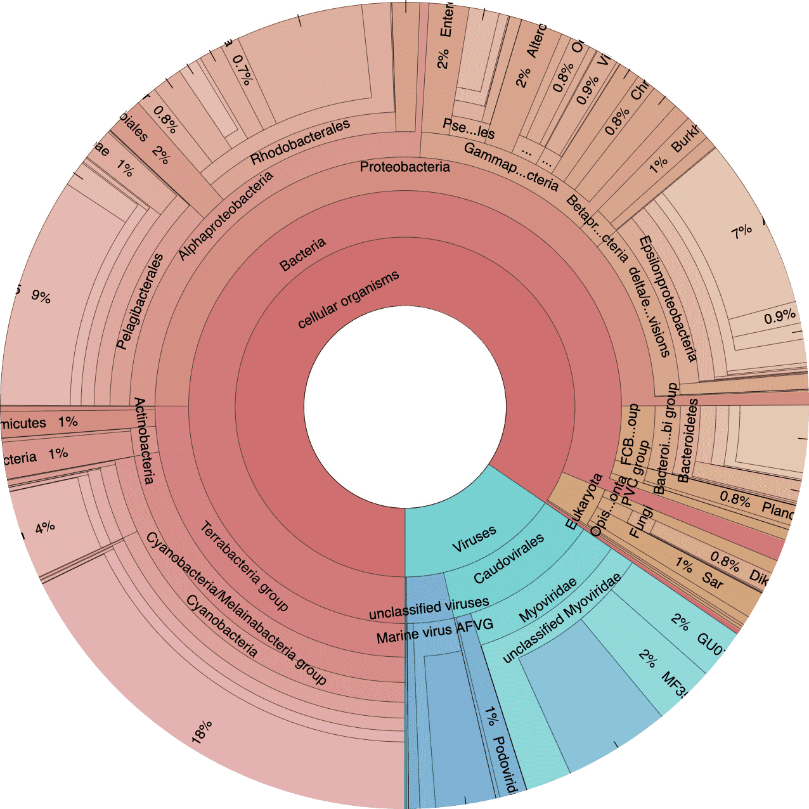
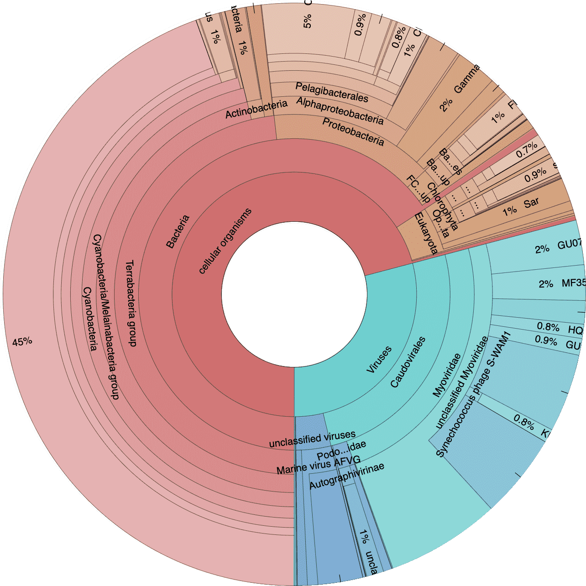
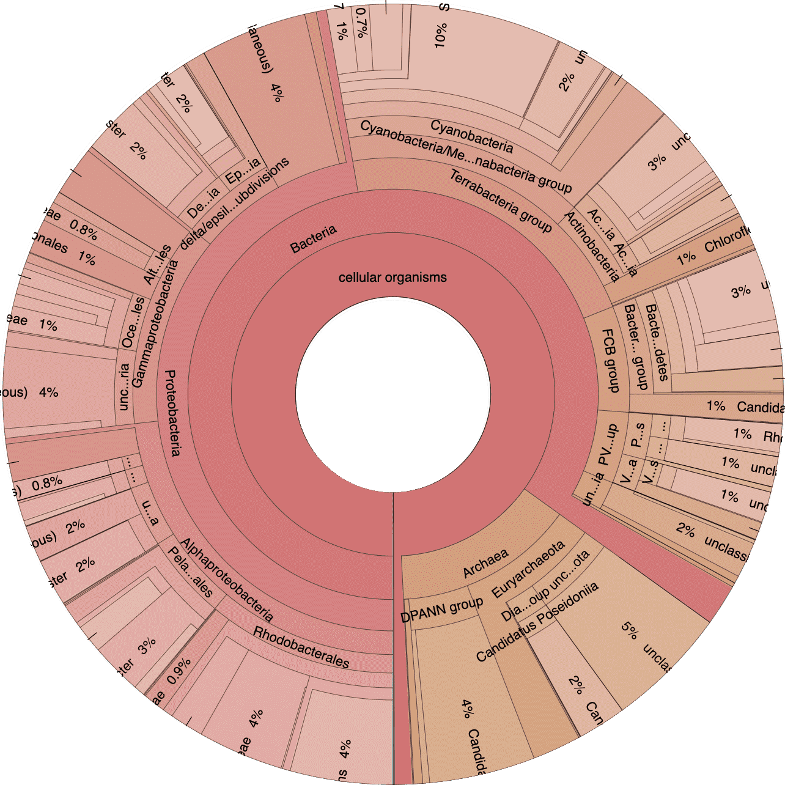
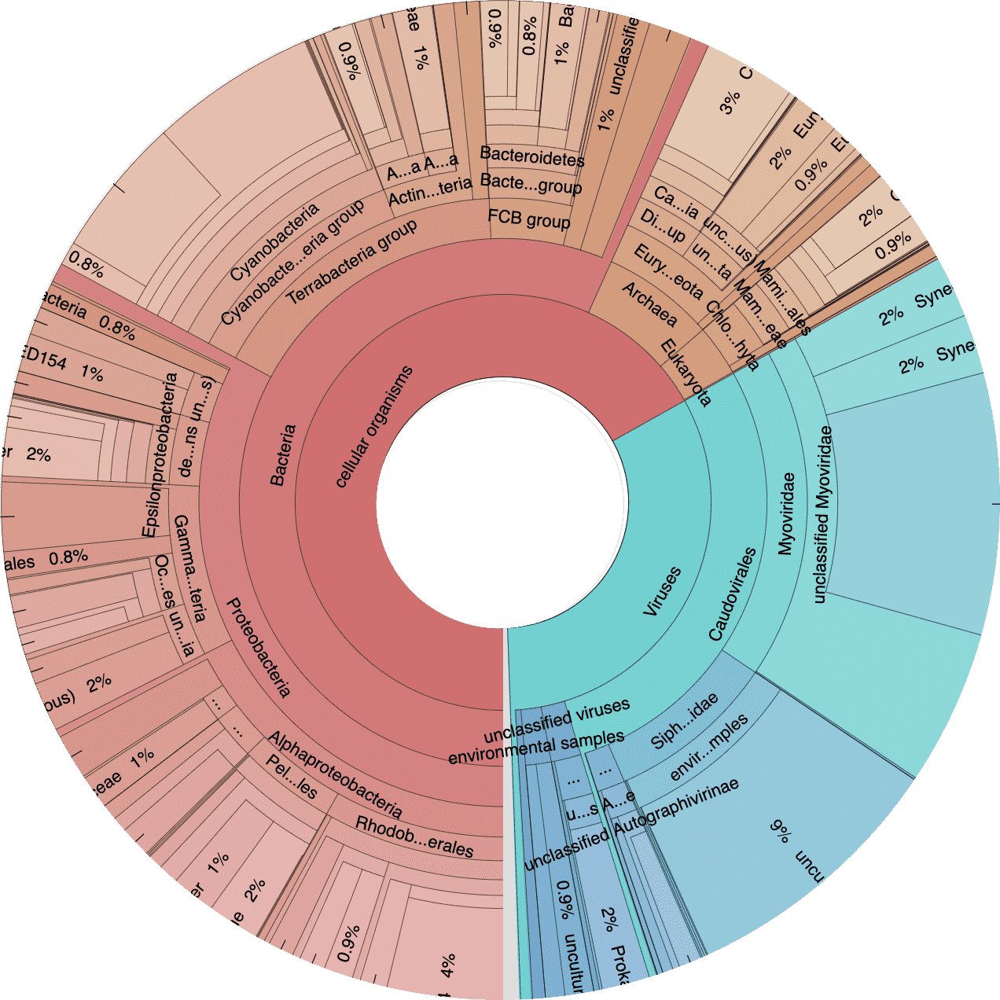

```{r setup, include=FALSE}
knitr::opts_chunk$set(collapse = TRUE)
library(kableExtra)
library(DT)
library(htmlwidgets)
library(htmltools)
library(magick)
```

## QC & Contig Stats

### QC results

The first thing we should do is look at the  the results of the initial QC step. For each sample, anvio spits out individual quality control reports. Thankfully anvio also concatonates those files into one table. This table contains information like the number of pairs analyzed, the total pairs passed, etc.


```{r qc_table, echo=FALSE, layout="l-body-outset"}
qc <- read.table("files/qc-report.txt", sep = "\t", header = TRUE)

datatable(
  qc, rownames = FALSE, autoHideNavigation=TRUE, width = "100%",
  caption = htmltools::tags$caption(
    style = "caption-side: bottom; text-align: left;",
    "Table 8.1: QC results"),
  extensions = c("Buttons", "FixedColumns"),
  options = list(
    columnDefs = list(list(className = "dt-left", targets = 0)),
    dom = "Btir", buttons = c("csv", "copy", I('colvis')),
    scrollX = TRUE, scrollCollapse = TRUE, scrollY="300px", paging=FALSE,
    fixedColumns = list(leftColumns = 1, rightColumns = 0)))

```

### Assembly results

Next we can look at the results of the co-assembly, the number  of HMM hits, and the estimated number of genomes. These data not only give us a general idea of assemby quality but will also help us decide parameters for automatic clustering down the road.

We can use anvi'o to generate a simple table of contig stats for this assembly.

```bash
anvi-display-contigs-stats 03_CONTIGS/WATER-contigs.db -o 03_CONTIGS/WATER-contig-stats -o contig-stats.txt
```
<br/>

```{r contig_table, echo=FALSE}
contig <- read.table("files/contig-stats.txt", sep = "\t", header = TRUE)

datatable(
  contig, rownames = FALSE, width = "50%", colnames = c("Stat", "value"),
  caption = htmltools::tags$caption(
    style = "caption-side: bottom; text-align: left;",
    "Table 8.2: Assembly statistics"),
  extensions = "Buttons",
  options = list(
    columnDefs = list(list(className = "dt-left", targets = 0)),
    dom = "Blrtip", buttons = c("csv", "copy"),
    scrollX = TRUE, scrollCollapse = TRUE, scrollY=TRUE,
    scroller=TRUE, lengthMenu = c(5, 25)))

```


You can  download a text version of the table using the buttons or by clicking [here](files/contig-stats.txt).

## Krona Plots Explained

Next lets take a look at the taxonomic breakdown from the KrakenUniq classification of short reads. There is a lot of data here so we decided to present these as standalone HTML pages that contain separate [Krona](https://github.com/marbl/Krona/wiki)[@ondov2011krona] plots for each sample. In brief, a Krona plot allow hierarchical data to be explored with multi-layered pie charts. So these charts are interactive. We will use these on a few occasions so it is worth explaining in a little more  detail.

Below is an example of a Kraken taxonomy plot. The plot on the left is the *top level* view and the plot on the right is the *expanded* view. Inner rings represent higher taxonomic ranks.

For example, the two most inner rings are *cellular organisms* and *viruses*. Taxonomic ranks decrease towards the outside. When a grup is expanded the inner ring becomes the highest rank. For example in the plot of the right we expanded the *Proteobacteria* (which is a phylum) so the classes form the inner rings.

```{r krona-example, fig.cap="**Example of a Krona plot**. The  **left panel** controls aspects of the plot. Search by taxon name, select a specific sample, control font size, etc. If you were to click once over a taxa on the left plot,  the group is highlighted. Double-click to expand the group as seen on the right. Upper right corner provides a summary of the expanded group.", layout="l-body-outset", echo=FALSE}
image_read("images/krona-demo.png")
```

## Short-read Taxonomy

Since the Kraken classification was performed BEFORE the assembly we can look at the Krona plots for each individual samples. Here samples are separated by site.

<div class="row">
<div class="column">
<div class="krona" style="max-width:500px;">
<a href="files/cr-kraken.html" target="_blank">

<div class="container-krona">
<p>CAYO ROLDAN<br/><small>Hypoxic & Normoxic</small> </p>
</div>
</a>
</div>
</div>

<div class="column">
<div class="krona" style="max-width:500px;">
<a href="files/cc-kraken.html" target="_blank">

<div class="container-krona">
<p>CRAWL CAYE<br/><small>Normoxic </small> </p>
</div>
</a>
</div>
</div>
</div>

> Click on an image to explore the diversity plots.


Since these plots are web hosted, I decided to keep only the first 10 ranks from the classification files to make the files smaller*. To do this we can use the following command, which pulls out only the ranks we are interested in.

```bash
cut -f 1-10 WROL_1914-kraken.krona > WROL_1914-kraken-TRIM.krona
```

If we want to create a taxonomic summary table for the samples we can easily do that in anvio by accessing the `layer_additional_data` table from the  merged profile database.

```bash
anvi-export-table 06_MERGED/WATER/PROFILE.db --table layer_additional_data -o water-layer_additional_data.txt
```

And then we simply parse out the class data and make a table.

<br/>
```{r class_table, echo=FALSE}
class <- read.table("files/kraken-class.txt", sep = "\t", header = TRUE)

datatable(
  class, rownames = FALSE, autoHideNavigation=TRUE, width = "100%",
  caption = htmltools::tags$caption(
    style = "caption-side: bottom; text-align: left;",
    "Table 8.3: Number of reads by Class"),
  extensions = "Buttons",
  options = list(
    columnDefs = list(list(className = "dt-left", targets = 0)),
    dom = "Blfrtip", lengthMenu = c(10, 25, 55),
    buttons = c("csv", "copy"),
    scrollX = TRUE, scrollCollapse = FALSE, scrollY=FALSE,
    scroller=TRUE, colReorder=TRUE))
```

You can  download a text version of the table using the buttons or by clicking [here](files/kraken-class.txt).

## Mapping Results

Lets go ahead and look at the mapping results. This took a little swindling but in the end this crude approach worked. First we needed all the `bowtie.log` files from the `00_LOGS` directory and grab the first line of each file, which has the total number of *individual reads that were paired* (after QC) in each sample.

Just like we did above, we needed to grab the `layer_additional_data` from the  merged profile databases. This table contains `total_reads_mapped`, `num_SNVs_reported`, and the taxonomic info from the short read Kraken annotations.

```bash
anvi-export-table 06_MERGED/WATER/PROFILE.db --table layer_additional_data -o water-layer_additional_data.txt
```

What we want is a table with `sample`, `total_reads`, `total_reads_mapped`, and `num_SNVs_reported`. After a little fancy grep work in [BBEdit](https://www.barebones.com/products/bbedit/) (the free mode) we have a table the looks like this...

<br/>

```{r mapping_table, echo=FALSE}
mapping <- read.table("files/mapping-results.txt", sep = "\t", header = TRUE)

datatable(
  mapping, rownames = FALSE, autoHideNavigation=TRUE, width = "100%",
  caption = htmltools::tags$caption(
    style = "caption-side: bottom; text-align: left;","Table 8.4: Mapping results "),
  extensions = "Buttons",
  options = list(
    columnDefs = list(list(className = "dt-left", targets = 0)),
    dom = "Brti", buttons = c("csv", "copy"),
    scrollX = TRUE, scrollCollapse = FALSE, scrollY=FALSE,
    scroller=TRUE, colReorder=TRUE))
```

You can  download a text version of the table using the buttons or by clicking [here](files/mapping-results.txt).

## Contig Classification

Now we move on to the classification of contigs from the assembly. This means that we cannot look at individual samples because we co-assembled all of the data. We  start with the Kaiju classification, again using the Krona plots. Remember we classified the contigs against both the `nr` and `mar`  [databases](https://github.com/bioinformatics-centre/kaiju#creating-the-reference-database-and-index). Use the panels below to access the classifications for the assemby.

<div class="row">
<div class="column">
<div class="krona" style="max-width:500px;">
<a href="files/water_kaiju_mar.html" target="_blank">

<div class="container-krona">
<p>Kaiju classification<br/><small>mar database</small> </p>
</div>
</a>
</div>
</div>

<div class="column">
<div class="krona" style="max-width:500px;">
<a href="files/water_kaiju_nr.html" target="_blank">

<div class="container-krona">
<p>Kaiju classification<br/><small>nr database</small> </p>
</div>
</a>
</div>
</div>
</div>

> Click on an image to explore the diversity plots.

We will get into much more of the annotation data later, including the various functional annotations. For now though we have a pretty good idea of the shape and nature of these datasets.


<div class="post-nav">
<div class="post-nav-item">
<div class="meta-nav">Previous</div>
<a href="mg-workflow-1.html" rel="next">N<sup><u>o</u></sup> 3. Assembly & Annotations</a>
</div>
</div>

<div class="post-nav">
<div class="post-nav-item">
<div class="meta-nav">Next</div>
<a href="mg-auto-binning.html" rel="prev">N<sup><u>o</u></sup> 6. Automated Binning</a>
</div>
</div>

## Source Code {.appendix}

The source code for this page can be accessed on GitHub by [clicking this link](https://github.com/hypocolypse/web/blob/master/mg-workflow-2.Rmd).
