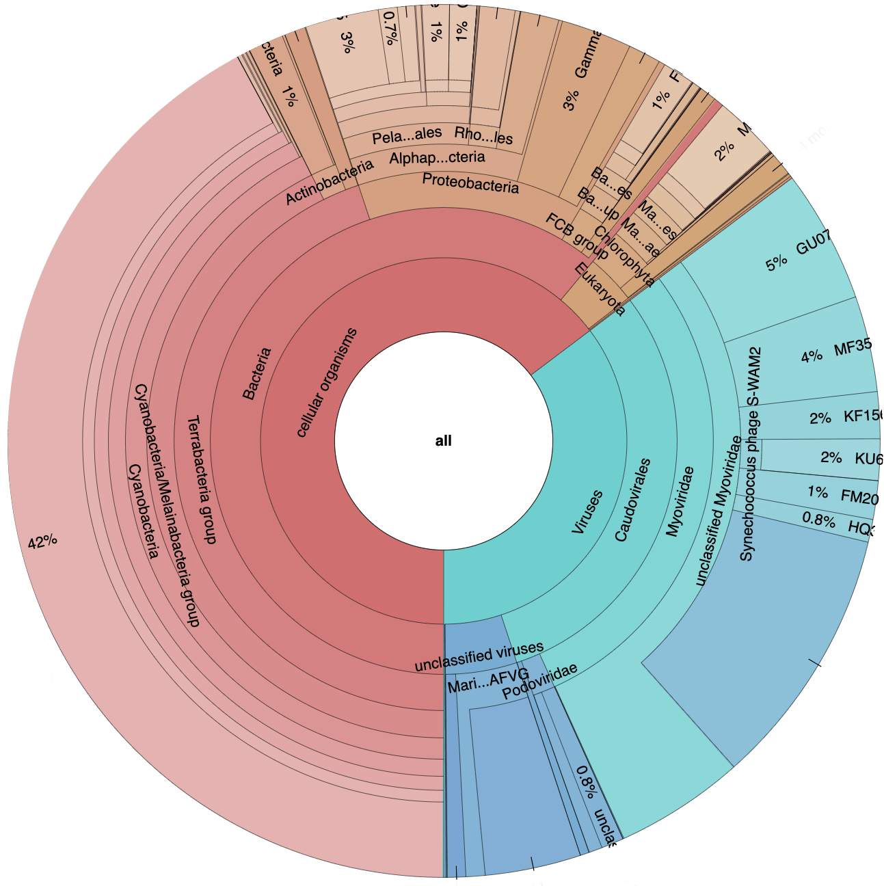
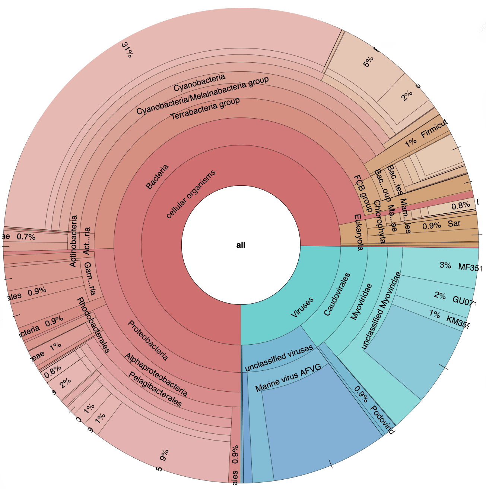
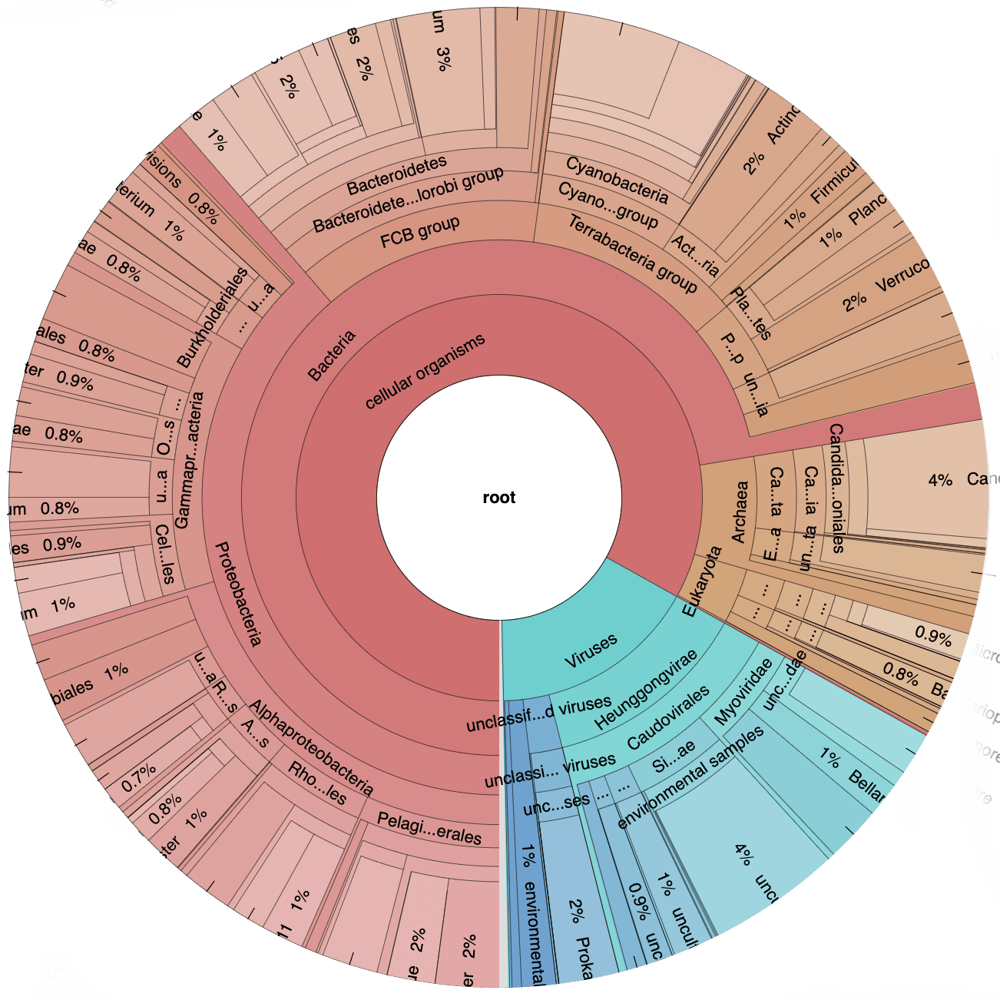
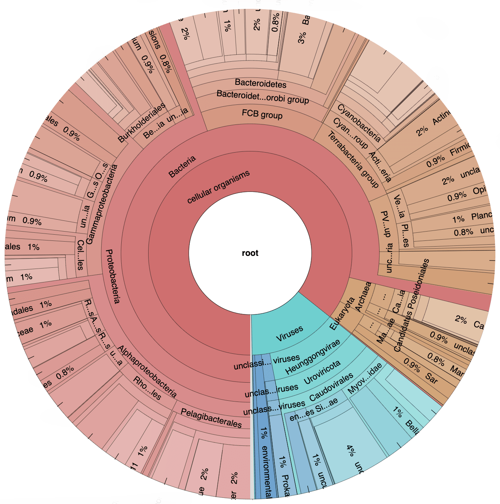
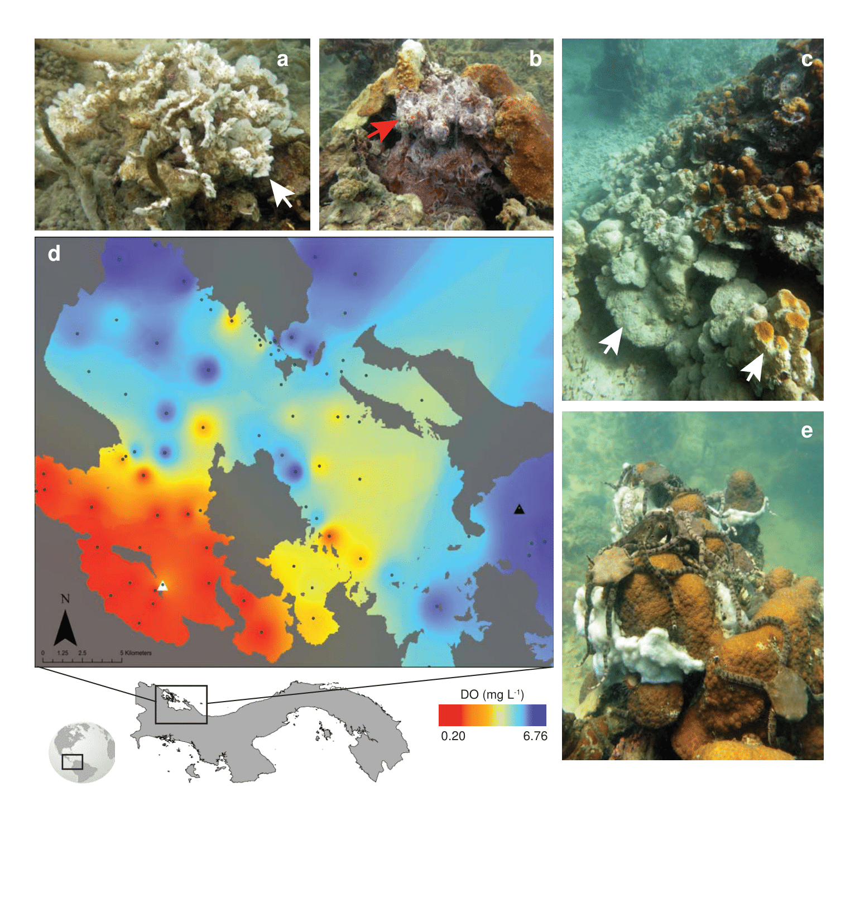
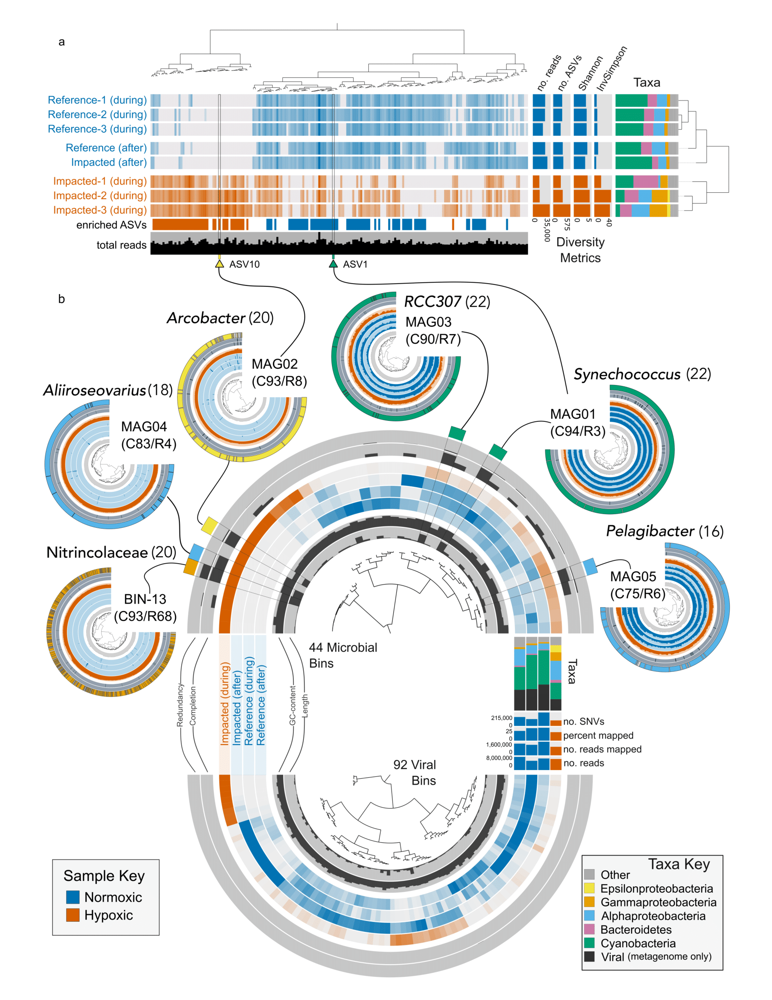

<details markdown="1">
<summary>Show setup information.</summary>

```{r setup, message = FALSE, warning = FALSE}
knitr::opts_chunk$set(echo = FALSE)
pacman::p_load(tm, SnowballC, wordcloud, RColorBrewer, 
               wordcloud2, webshot, htmlwidgets, dplyr, 
               leaflet, htmlwidgets, readr, data.table, DT,
               install = FALSE, update = FALSE)
```
</details>

# Background 

Roughly 3 million years ago, a spectacular natural experiment began when the Isthmus of Panama finally closed, a geologic process that began many million years earlier.

On land, the formation of the Isthmus connected North & South America, and ushered in one of the greatest episode of migration in earth’s history---The Great American Biotic Interchange. Many of the mammal species we see today arrived during this event.

However, what was a bridge on land became a barrier in the ocean. Where once a single tropical ocean flowed, two distinct marine environments formed when the Isthmus closed.

Strikingly different physicochemical conditions persist in these two oceans today & these differences are reflected in the communities adapted to live there.

So for marine organisms the story unfolded quite differently. The barrier separated populations, leading to speciation for some & local extinction for many others.

More information can be found on the [Istmnobiome Project site](https://istmobiome.rbind.io/).

# Contrasting Environments

|                         | Western Atlantic (WA) | Eastern Pacific (EP) |
| :---------------------- | :-------------------: | :------------------: |
| water temp              |        stable         |       variable       |
| tidal range             |         small         |        large         |
| seasonal upwelling      |          no           |         yes          |
| nutrients               |          low          |         high         |
| water quality           |         clear         |        turbid        |
| **1&#176; productivity**|      **benthic**      |     **pelagic**     |
| diversity sponges/CCA   |         high          |         low          |
| coral reef coverage     |       extensive       |       limited        |

# Study Sites

<br/>

```{r, layout='l-screen-inset shaded', fig.height=6.5}
map_data <- read_tsv("files/sandbox/ALL_DATA.txt")
samples_reef <- read_tsv("files/sandbox/samples_reef.txt")
samples_man <- read_tsv("files/sandbox/samples_man.txt")

pal <- colorFactor(c("#009E73", "#CC79A7"), domain = c("reef", "mangrove"))

leaflet() %>% 
  setView(lng = -81.622535, lat = 8.442031, zoom = 7 ) %>%
  #addTiles() %>%
  #addTiles() %>%
  addScaleBar(position = "topright") %>%
  addLegend("bottomright", pal = pal, values = map_data$type,
    title = "Ecosystem",
    #labFormat = labelFormat(prefix = "$"),
    opacity = 1)   %>%
  addCircleMarkers(data = samples_reef, 
                   lng = ~longitude, 
                   lat = ~latitude, 
                   color = ~pal(type),
                   opacity = 0.9, fillOpacity = 0.7,
#                   radius = 8 , 
#                   color = "black",
#                   fillColor = "red", 
                   stroke = TRUE,
                   group = "reef") %>%
  addCircleMarkers(data = samples_man, 
                   lng = ~longitude, 
                   lat = ~latitude, 
                   color = ~pal(type),
                   opacity = 0.9, fillOpacity = 0.7,
#                   radius=8 , 
#                   color = "black",
#                   fillColor = "blue", 
                   stroke = TRUE, 
                   group = "mangrove") %>%
  addCircleMarkers(lng = -82.256463,
             lat = 9.352402,
             #label = "STRI",
             labelOptions = labelOptions(textOnly = TRUE,
                                         noHide = TRUE,
                                         direction = "left", offset = c(-20, 1),
                                         style = list("font-size" = "20px" ,
                                                      "font-style" = "bold")),
             color = "#0072B2",
             fillColor = "#F0E442",
             stroke = TRUE, fillOpacity = 0.5, weight = 5,
             opacity = 0.95) %>%
  addCircleMarkers(lng = -81.704385,
             lat = 7.642378,
             #label = "STRI",
             labelOptions = labelOptions(textOnly = TRUE,
                                         noHide = TRUE,
                                         direction = "left", offset = c(-20, 1),
                                         style = list("font-size" = "20px" ,
                                                      "font-style" = "bold")),
             color = "#0072B2",
             fillColor = "#F0E442",
             stroke = TRUE, fillOpacity = 0.95, weight = 5,
             opacity = 0.95) %>%
  addProviderTiles(providers$Esri.WorldImagery, group = "bg1") %>%
  addTiles(options = providerTileOptions(noWrap = TRUE), group = "bg2") %>%
  addLayersControl(overlayGroups = c("mangrove","reef"), baseGroups = c("bg1","bg2"), 
                   options = layersControlOptions(collapsed = FALSE))  %>%
  addMiniMap(tiles = providers$Esri.WorldImagery, zoomLevelOffset = -5, 
    toggleDisplay = TRUE)
```

# QC Results

The first thing we can do is look at the results of the initial QC step. For each sample, anvi’o spits out individual quality control reports. Thankfully anvi’o also concatenates those files into one table. This table contains information like the number of pairs analyzed, the total pairs passed, etc.

```{r qc_table, echo=FALSE, layout="l-body-outset"}
qc <- read.table("tables/sandbox/qc-report.txt", sep = "\t", header = TRUE)

datatable(
  qc, rownames = FALSE, autoHideNavigation=TRUE, width = "100%",
  caption = htmltools::tags$caption(
    style = "caption-side: bottom; text-align: left;",
    "QC results"),
  extensions = c("Buttons", "FixedColumns"),
  options = list(
    columnDefs = list(list(className = "dt-left", targets = 0)),
    dom = "Btir", buttons = c("csv", "copy", I('colvis')),
    scrollX = TRUE, scrollCollapse = TRUE, scrollY="300px", paging=FALSE,
    fixedColumns = list(leftColumns = 1, rightColumns = 0)))

```


# Short-read Taxonomy

Since the Kraken classification was performed BEFORE the assembly, we can look at Krona plots for each individual sample. Here samples are separated by ocean.

<div class="row">
<div class="column">
<div class="krona" style="max-width:500px;">
<a href="figures/sandbox/WA-kraken.html" target="_blank">

<div class="container-krona">
<p>Western Atlantic<br/><small>Reef & Mangrove</small> </p>
</div>
</a>
</div>
</div>

<div class="column">
<div class="krona" style="max-width:500px;">
<a href="figures/sandbox/EP-kraken.html" target="_blank">

<div class="container-krona">
<p>Eastern Pacific<br/><small>Reef & Mangrove</small> </p>
</div>
</a>
</div>
</div>
</div>

> Click on an image to explore the diversity plots.

# Assembly Results

Next we can look at the results of the co-assembly, the number  of HMM hits, the estimated number of genomes, and other important metrics. These data not only give us a general idea of assembly quality but will also help us decide parameters for automatic clustering down the road.

We can use anvi'o to generate a simple table of contig stats for this assembly.

```bash
anvi-display-contigs-stats 03_CONTIGS/WATER-contigs.db -o 03_CONTIGS/WATER-contig-stats -o contig-stats.txt
```
<br/>


```{r, echo=FALSE, eval=TRUE}
contig <- read.table("tables/sandbox/contig-stats.txt", sep = "\t", header = TRUE)
datatable(
  contig, rownames = FALSE, width = "80%", colnames = c("Western Atlantic (WA)",	
                                                        "Eastern Pacific (EP)"),
  caption = htmltools::tags$caption(
            style = 'caption-side: bottom; text-align: left;',
            'Table: ', htmltools::em('Assembly statistics.')),
          elementId = "vch1lvbqx1msf7hwcy6n",
          extensions = 'Buttons', options = list(
            scrollX = TRUE,
            dom = 'Blftip',
            buttons = c('copy', 'csv', 'excel'),
            pageLength = 10,
            lengthMenu = list(c(5, 10, -1), c("5", "10", "All"))
            )
          ) %>%
    DT::formatStyle(columns = colnames(contig),
                    fontSize = '80%')
```

## Assembler Comparison

-- [MEGAHIT](https://github.com/voutcn/megahit)  
-- [METASPADES](https://github.com/ablab/spades)  
-- [IDBA](https://github.com/loneknightpy/idba)  

::: l-body-outset

<details markdown="1">
<summary>Show Assembler comparison.</summary>
|                        |               |       WA       |             |               |       EP       |             |
| :--------------------- | :-----------: | :------------: | :---------: | :-----------: | :------------: | :---------: |
| Assembler              |  **MEGAHIT**  | **METASPADES** |  **IDBA**   |  **MEGAHIT**  | **METASPADES** |  **IDBA**   |
| Total Length (Gb)      |     1.297     |     0.954      |    0.677    |     1.585     |     1.131      |    0.823    |
| Total Length (bp)      | 1,296,862,353 |  953,565,302   | 676,808,599 | 1,585,187,512 | 1,130,860,008  | 822,450,037 |
| No. Contigs            |    574,304    |    377,804     |   253,709   |    753,612    |    478,800     |   323,235   |
| No. Contigs > 100 kb   |      54       |       61       |     17      |      60       |       55       |     35      |
| No. Contigs > 50 kb    |      400      |      407       |     140     |      406      |      393       |     218     |
| No. Contigs > 20 kb    |     3090      |      3263      |    1698     |     2753      |      3028      |    2009     |
| No. Contigs > 10 kb    |    10,839     |     10,499     |    6816     |     9995      |     10,078     |    7324     |
| No. Contigs > 5 kb     |    34,383     |     29,326     |   23,118    |    36,218     |     31,315     |   24,955    |
| No. Contigs > 2.5 kb   |    111,369    |     84,449     |   70,046    |    132,627    |    101,402     |   81,639    |
| Longest Contig         |    779,833    |    567,423     |   388,350   |    459,828    |    390,799     |   459,940   |
| Shortest Contig        |     1000      |      1000      |    1000     |     1000      |      1000      |    1000     |
| No. Genes (prodigal)   |   1,756,476   |   1,214,491    |   870,855   |   2,168,906   |   1,445,585    |  1,053,336  |
| L50                    |    118,539    |     65,641     |   50,137    |    174,734    |     95,106     |   67,040    |
| L75                    |    298,617    |    182,008     |   125,905   |    410,833    |    243,266     |   165,454   |
| L90                    |    452,327    |    289,329     |   195,213   |    603,589    |    373,397     |   251,879   |
| N50                    |     2413      |      2937      |    3092     |     2157      |      2595      |    2808     |
| N75                    |     1427      |      1547      |    1707     |     1371      |      1489      |    1638     |
| N90                    |     1136      |      1168      |    1275     |     1121      |      1157      |    1259     |
| Archaea_76             |    14,236     |     10,282     |    7522     |    18,414     |     12,367     |    9149     |
| Bacteria_71            |    22,916     |     16,557     |   11,665    |    32,181     |     21,595     |   16,107    |
| Protista_83            |     2359      |      1704      |    1224     |     3037      |      2013      |    1465     |
| Ribosomal_RNA_12S      |       0       |       0        |      0      |       0       |       0        |      0      |
| Ribosomal_RNA_16S      |      156      |       24       |     43      |      153      |       29       |     52      |
| Ribosomal_RNA_18S      |      43       |       9        |      9      |      45       |       7        |      8      |
| Ribosomal_RNA_23S      |      227      |       97       |     96      |      253      |       98       |     128     |
| Ribosomal_RNA_28S      |      89       |       18       |     31      |      67       |       17       |     22      |
| Ribosomal_RNA_5S       |       0       |       0        |      0      |       0       |       0        |      0      |
| Transfer_RNAs          |    18,910     |      9152      |    9622     |    22,099     |      9991      |   11,324    |
| archaea (Archaea_76)   |      40       |       33       |     26      |      29       |       21       |     15      |
| bacteria (Bacteria_71) |      308      |      241       |     162     |      367      |      266       |     224     |
| eukarya (Protista_83)  |       2       |       2        |      1      |       2       |       2        |      1      |
</details>
:::

# Mapping Results

```{r, echo=FALSE, eval=TRUE}
mapping <- read.table("tables/sandbox/mapping-results.txt", sep = "\t", header = TRUE)
mapping <- mapping %>% tidyr::pivot_wider(id_cols = item_name, 
                                          names_from = data_key, 
                                          values_from = data_value)
mapping <- mapping %>% dplyr::rename("sample_ID" = 1)
mapping <- mapping[, c(1, 7,8,2,3,6,5)]
  datatable(
  mapping, rownames = FALSE, width = "100%",
  caption = htmltools::tags$caption(
            style = 'caption-side: bottom; text-align: left;',
            'Table: ', htmltools::em('Mapping results.')),
          elementId = "zik8c3x3x4pjgx1o56so",
          extensions = 'Buttons', options = list(
            scrollX = TRUE,
            dom = 'Blftip',
            buttons = c('copy', 'csv', 'excel'),
            pageLength = 5,
            lengthMenu = list(c(5, 10, -1), c("5", "10", "All"))
            )
          ) %>%
    DT::formatStyle(columns = colnames(mapping),
                    fontSize = '80%')
```

# Contig Taxonomy

Now we move on to the classification of contigs from the assembly. This means that we cannot look at individual samples because we co-assembled all of the data. We  start with the Kaiju classification, again using the Krona plots. Remember we classified the contigs against both the `nr` and `mar`  [databases](https://github.com/bioinformatics-centre/kaiju#creating-the-reference-database-and-index). Use the panels below to access the classifications for the assembly.

<div class="row">
<div class="column">
<div class="krona" style="max-width:500px;">
<a href="figures/sandbox/WA_kaiju_nr.out.html" target="_blank">

<div class="container-krona">
<p>Western Atlantic<br/><small>Kaiju contig classification</small> </p>
</div>
</a>
</div>
</div>

<div class="column">
<div class="krona" style="max-width:500px;">
<a href="figures/sandbox/EP_kaiju_nr.out.html" target="_blank">

<div class="container-krona">
<p>Eastern Pacific<br/><small>Kaiju contig classification</small> </p>
</div>
</a>
</div>
</div>
</div>

> Click on an image to explore the diversity plots.

# Hypoxia Study

## Hypoxia Map

```{r layout="l-body-outset"}

```

<a href="figures/sandbox/hypoxia_map.png" download="hypoxia_map.png"> Download a **PNG** file.</a> Click on the link then right click and hit *Save image as...*  or it may just download when you click the link. 

## Hypoxia Binning

```{r layout="l-body-outset"}

```

<a href="figures/sandbox/hypoxia_binning.png" download="hypoxia_binning.png"> Download a **PNG** file.</a> Click on the link then right click and hit *Save image as...*  or it may just download when you click the link. 

# Dropbox Data

Here is a description for the metagenome data on Dropbox. 

### Contigs vs. Splits

One thing to note before beginning is that anvi'o breaks up long contigs into ~20,000 bp parts called [splits](https://merenlab.org/vocabulary/#split) for the purposes of visualization. This should not matter now but is worth a brief explanation because this may be important downstream . For example, from our WA co-assembly there is a contig called `WA_000000485486`. This contig is 307,431 bp long so anvi'o split it into 15 parts. 

So, if we are looking at `contig` data, the contig is called `WA_000000485486`. However, if we are looking at the split data, this contig is broken into 15 separate, ~20 kbp sequences named `WA_000000485486_split_00001`, `WA_000000485486_split_00002`, ...`WA_000000485486_split_00015`. If a contig is less than 20 kbp it will still have the suffix `_split_00001`.

The WA assembly has 574,304 contigs and 575,505 splits. The EP assembly has 753,613 contigs and 754,813 splits. 

### **00_TRIMMED/** 

> Total size: 91G  
> File types: `.fastq.gz` and a lookup table (`samples.txt`)

This directory contains eight trimmed, compressed fastq files for each sample. These are essentially the *raw data*. Here, [TRIMMOMATIC](http://www.usadellab.org/cms/?page=trimmomatic) was used to remove Illumina adapter sequences from the raw data. For all samples, TRIMMOMATIC was run on each R1/R2 pair. Since we ran the samples on a NextSeq, there are 4 paired-end fastq pairs per sample, so we need to run the command 4 times. Here is the command for the first pair for sample `ML1717`.

```bash
runtrimmomatic PE -threads 16 RAW/ML1717_S53_L001_R1_001.fastq.gz \
                              RAW/ML1717_S53_L001_R2_001.fastq.gz \
                              00_TRIMMED/ML1717_S53_L001_R1_trim.fastq.gz \
                              00_TRIMMED_UNPAIRED/ML1717_S53_L001_R1_trim_unpaired.fastq.gz \
                              00_TRIMMED/ML1717_S53_L001_R2_trim.fastq.gz \
                              00_TRIMMED_UNPAIRED/ML1717_S53_L001_R2_trim_unpaired.fastq.gz \
                              ILLUMINACLIP:/trimmomatic/0.33/adapters/NexteraPE-PE.fa:2:30:10 \
                              MINLEN:40
```

Then we run the same command for the other 3 pairs

ML1717_S53_L002_R1_001 & ML1717_S53_L002_R2_001  
ML1717_S53_L003_R1_001 & ML1717_S53_L003_R2_001  
ML1717_S53_L004_R1_001 & ML1717_S53_L004_R2_001  

There are 464 total fastq files in this directory. The eight files with the prefix `BN999` are from a spike-in control. I do not use these in my workflows but are here just in case. 

There is also a `samples.txt` in this directory, which is a lookup table that maps the raw fastq files to a sample name AND to an assembly. Here are a few lines from that file for the purpose of explanation. So, the fastq files with the prefix `ML1717` are from sample `EPR_15A`, which is from the Eastern Pacific, and thus part of the `EP` assembly. Fastq files with the prefix `ML1872` are from sample `WAM_MYS`, which is from the Western Atlantic, and thus part of the `WA` assembly.

<aside>
Anvi'o has very specific requirements for naming samples. No spaces or other weird characters are allowed. **Only** alphanumeric characters and underscores (`_`) are permitted. 
</aside>

::: l-body-outset
| sample  | group |                       r1                       |                       r2                       |
| :------ | :---: | :--------------------------------------------: | :--------------------------------------------: |
| EPR_15A |  EP   | `ML1717` comma separated list of forward reads | `ML1717` comma separated list of reverse reads |
| EPR_14C |  EP   | `ML1667` comma separated list of forward reads | `ML1667` comma separated list of reverse reads |
| WAM_MYS |  WA   | `ML1872` comma separated list of forward reads | `ML1872` comma separated list of reverse reads |
| WAR_SGL |  WA   | `ML1880` comma separated list of forward reads | `ML1880` comma separated list of reverse reads |
:::

### **01_QC/** 

> Total size: 82G  
> File types: `.fastq.gz`, `-STATS.txt`, `.ini`

Here, [illumina-utils](https://github.com/merenlab/illumina-utils) is used with the `samples.txt` file and the trimmed fastq files (described above) to first perform quality filtering and then merge the R1 files and the R2 files. For each of the 57 samples, there are the following files:

-- `*-STATS.txt`: Contains results of the quality filtering.   
-- `*.ini`: This file can be ignored.  
-- `*QUALITY_PASSED_R1.fastq.gz`: Quality filtered and merged R1 data.  
-- `*QUALITY_PASSED_R2.fastq.gz`: Quality filtered and merged R2 data.

### 02_FASTA_MEGAHIT.zip

> Total size: 2.8G  
> File types: `-contigs-prefix-formatted-only.fa`, `-reformat-report.txt`

This zip file contains the results of the [MEGAHIT](https://github.com/voutcn/megahit) co-assemblies, one for the Western Atlantic (WA) and another for the Eastern Pacific (EP). MEGAHIT was run using the following options:

`--min-contig-len 1000`  
`--presets meta-sensitive` which is equivalent to setting `--min-count 1` and `--k-list 21,29,39,49,...,129,141`.

<aside>
Anvi'o has very specific requirements for naming contigs. Contigs are named in sequential numerical order, where the name of the assembly is added as a prefix.  
</aside>

Each co-assembly directory contains two files:

-- `*-contigs-prefix-formatted-only.fa`: MEGAHIT co-assembly, reformatted by anvi'o.   
-- `*-reformat-report.txt` This file can be ignored. It is just a lookup table that maps the anvi'o contig name to the name assigned by MEGAHIT. 

### COVERAGE

> Total size: 1.16G  
> File types: `-COVs.txt`

This zip file contains the results of the calculating coverage for each sample against all contigs/splits from both co-assemblies. There are four (4) directories:

> Directory descriptions:

-- **WA_vs_WA** Coverage of Western Atlantic (WA) samples against the Western Atlantic (WA) co-assembly.  
-- **EP_vs_EP** Coverage of Eastern Pacific (EP) samples against the Eastern Pacific (EP) co-assembly.  
-- **WA_vs_EP** Coverage of Western Atlantic (WA) samples against the Eastern Pacific (EP) co-assembly.  
-- **EP_vs_WA** Coverage of Eastern Pacific (EP) samples against the Western Atlantic (WA) co-assembly.  

> Each coverage directory contains four (4) files:

#### CONTIGS 

-- `*_contigs-COVs.txt`: mean coverage of **contigs** for each sample.    
-- `*_contigs_Q2Q3-COVs.txt`: mean Q2Q3 coverage of **contigs** for each sample. Here, 25% of the nucleotide positions with the smallest coverage values and 25% of the nucleotide positions with the largest coverage values are ***excluded***.  

#### SPLITS

-- `*_splits-COVs.txt`: mean coverage of **splits** for each sample.    
-- `*_splits_Q2Q3-COVs.txt`: mean Q2Q3 coverage of **splits** for each sample. Here, 25% of the nucleotide positions with the smallest coverage values and 25% of the nucleotide positions with the largest coverage values are ***excluded***. 

## Source Code {.appendix}

The source code for this page can be accessed on GitHub by [clicking this link](https://github.com/hypocolypse/web/blob/master/sandbox.Rmd).

