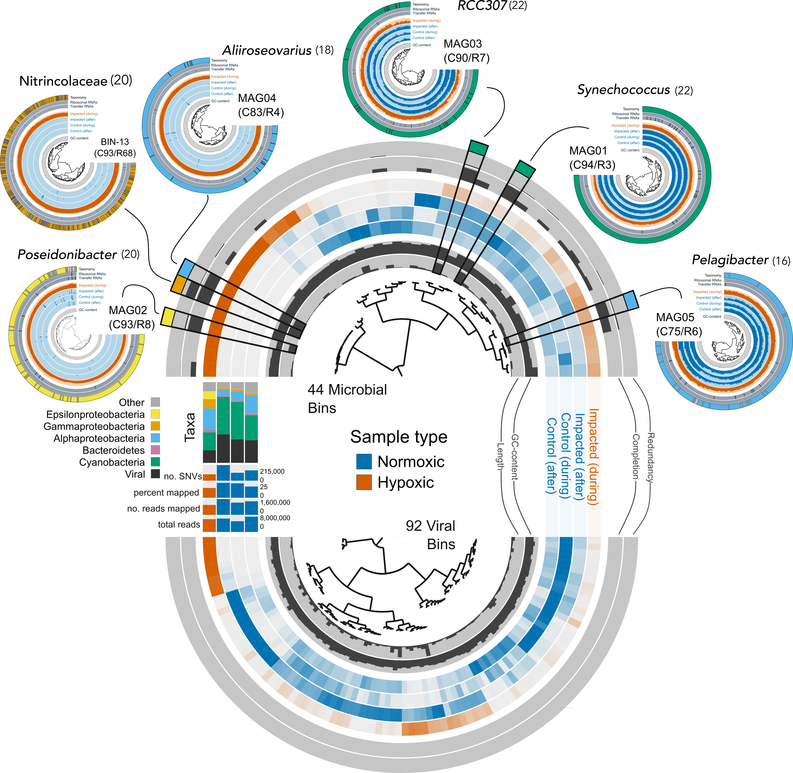

```{r setup, include=FALSE}
remove(list = ls())
knitr::opts_chunk$set(echo = FALSE)
```

I will be putting new figures here for your inspection. You should be able to download a PNG for each figure for closer inspection and commenting. I also include figure legends. Once you are happy, I can send you a final version in whatever format you like the best. This page is hidden and cannot be accessed from the site unless you know the URL. 

# ISA 16S rRNA clustering figure

Here are two versions of the ISA analysis. Version 2 has no Class names or ASV names and the legend is moved. I can any combination of elements. 

```{r layout="l-body-outset"}
knitr::include_graphics("figures/sandbox/16s-anvio.png")
```

<a href="figures/sandbox/16s-anvio.png" download="16s-anvio.png"> Download a **PNG** file for Commenting.</a> Click on the link then right click and hit *Save image as...*  or it may just download when you click the link. 

<a href="figures/sandbox/16s-anvio.eps" download="16s-anvio.eps"> Download a **EPS** file for Editing</a> Click on the link then right click and hit *Save image as...*  or it may just download when you click the link. 


## Figure Legend

**Figure X. Microbial assemblages of hypoxic and normoxic conditions.**  Community composition determined through 16S rRNA sequencing of water samples from the  hypoxic (vermillion) and normoxic (blue) samples during the hypoxic event (N = 3 per site) and one month after the event (N = 1 per site). Hierarchical clustering of samples (right dendrogram) and ASVs (top dendrogram) based on Euclidean distance and Ward linkage against the ASV abundance matrix. Only ASVs represented by more than 100 reads were included in the analysis (189 ASVs). Each vertical line in the plot area represents a unique ASV, and color intensity indicates log normalized ASV abundance for a given sample. No color indicates an ASV was not detected. The colored bar below the plot area indicates which ASVs were enriched in the hypoxic (vermillion) vs. normoxic (blue) states as determined by Indicator Species Analysis (ISA). No color indicates ASVs that were not differentially abundant. For each sample, total reads and total ASVs, as well as estimates of inverse Simpson and Shannon diversity are presented. Taxonomic profiles for each sample are also provided, showing the proportion of major bacterial classes. Arrow points to ASV10, an Arcobacteraceae (Campylobacteria) abundant in hypoxic samples and absent from normoxic samples. ASV10 has a 100% match across its length to the 16S rRNA gene sequence retrieved from the metagenome assembled genome, MAG02. Clustering and visualization were conducted in the anvi'o[@eren2015anvi] environment and finishing touches performed in Inkscape (https://inkscape.org/). 

# MAG02 Phylogenomic Analysis

The taxonomy estimate is new and important. Not sure I like the colors, but they need to be different from the isolation sources I think. Comments welcome.

```{r layout="l-body-outset"}
knitr::include_graphics("figures/sandbox/mag02-phylogenomic-tree.png")
```

<a href="figures/sandbox/mag02-phylogenomic-tree.png" download="mag02-phylogenomic-tree.png"> Download a **PNG** file for Commenting.</a> Click on the link then right click and hit *Save image as...*  or it may just download when you click the link. 

<a href="figures/sandbox/mag02-phylogenomic-tree.eps" download="mag02-phylogenomic-tree.eps"> Download a **EPS** file for Editing</a> Click on the link then right click and hit *Save image as...*  or it may just download when you click the link. 

## Figure Legend

**Figure X. Phylogenomic analysis of MAG02.** Phylogenomic placement of MAG02 against a manually curated collection of 72 *Arcobacter* group genomes. The tree was rooted with three *Sulfurimonas* genomes. Tree based on concatenated protein alignment of 36 single copy genes (SCG) present in all 76 genomes. SCG were selected using a maximum functional homogeneity index of 0.95 and a minimum 
 geometric homogeneity index of 0.99. Tree constructed using IQ-Tree[@minh2020iq] and 5000 ultrafast bootstrap approximations[@hoang2017ultrafast]. *ModelFinder Plus*[@kalyaanamoorthy2017modelfinder] was used to determine the best fit substitution model (LG+F+R6). Colored bar on the left indicates broad habitat category (*vertebrate host*, *invertebrate host*, *marine surface*, *marine subsurface*, *fuel cell*, and *sewage*) assigned based on the host and isolation source retrieved from NCBI’s BioSample database for each genome (one genome had no information). Vertebrate hosts almost entirely encompassed terrestrial animals such as cow, duck, human, and pig, and isolation sources like aborted fetus (not human), blood, eye, skin, and slaughterhouse. One genome came from a cloacal swab of an elephant seal. Invertebrate hosts were exclusively marine and included mussel, oyster, abalone, scallop, and clam. Marine surface sources included seawater and surface seawater, while marine subsurface sources included sediment and marine subsurface aquifer. Fuel cells were isolates obtained from fuel cell enrichment. Genomes in the sewage category came from terrestrial origin and also included wastewater and reclaimed water. Values in parentheses indicate the number of genomes per category. See Supplementary TABLE ZZZ for a metadata record of all genomes used. To the right of the isolation source are different genome metrics followed by the NCBI genome name. On the right are the results of taxonomy estimates for each genome based on a collection of 22 ribosomal genes[@parks2018gtgb] from the [Genome Taxonomy Database (GTDB)](https://gtdb.ecogenomic.org/). MAG02 was classified as a *Poseidonibacter* based on the presence of 20 genes and fell within the  *Poseidonibacter* clade. Unless otherwise note, all analyses and visualizations were conducted within the anvi'o[@eren2015anvi] environment.
 
# Distribution of Metagenomic Bins

This is to replace the "death star" supplemental figure. Basically, I separated viral and microbial bins and overlaid the bins that were identified as MAGs. These are the tiny death stars on the outside. 

```{r layout="l-body-outset"}

```

<a href="figures/sandbox/binning.png" download="binning.png"> Download a **PNG** file for Commenting.</a> Click on the link then right click and hit *Save image as...*  or it may just download when you click the link. 

<a href="figures/sandbox/binning.eps" download="binning.eps"> Download a **EPS** file for Editing</a> Click on the link then right click and hit *Save image as...*  or it may just download when you click the link. 

## Figure Legend

**Figure X. Distribution of microbial and viral bins across samples.** Results of binning four co-assembled metagenomic samples from Cayo Roldan and Cayo Coral during and after the hypoxic event. Each layer represents a sample colored by oxygen state (vermillion, hypoxic; blue, normoxic) and each spoke a distinct bin. Color intensity is the  relative abundance of a bin across all samples and no color indicates a bin was not detected. Inner and outer layers provide information on the length and GC content, as well as the completion and redundancy estimates, for each bin. Metrics for each sample---total reads, number of reds mapped to the co-assembly, percent of reads mapped, and the number of single nucleotide variants (SNVs)---as well as  taxonomic content (based on short-read assignment), are provided in the bar charts on the left.

The bottom semicircle is all 92 viral bins and the top semicircle are all 44 microbial bins. Overlaid on the microbial portion of the graph are the 5 MAGs recovered from the assembly. For each MAG we include the completion (C) and redundancy (R) estimates based on an HMM profile of 71 bacterial single copy genes (SCG). For each MAG, we added are the genus-level taxonomy estimates  based on a collection of 22 ribosomal genes[@parks2018gtgb] from the [Genome Taxonomy Database (GTDB)](https://gtdb.ecogenomic.org/). Numbers in parentheses indicate the number of these ribosomal genes found in each MAG. We also include BIN-13---an unresolved bin with a high completion estimate but also high redundancy. This abundant bin was only found in the hypoxic sample. All analyses and visualizations were conducted within the anvi'o[@eren2015anvi] environment.


